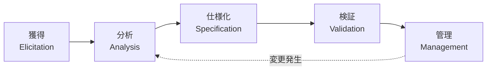

# ソフトウェア要求工学（Requirement Engineering）

## 1. 概要

### A. 定義
> ステークホルダーの要求を **獲得・分析・仕様化・検証・管理** する体系的な手順を通じて、開発対象システムが備えるべき要求事項を **正確・完全・一貫して定義し、変更まで統制する** ソフトウェア工学の活動。

### B. 登場背景および必要性
ソフトウェアプロジェクト失敗の最大の原因はコーディングミスではなく、「**間違ったものを正しく作ること**」、すなわち要求の誤りである。要求の欠陥は、発見が遅れるほど修正コストが指数関数的に大きくなる。要求段階で1のコストで直せる欠陥が、設計では10、運用では100のコストを要するという **1:10:100の法則** がこれを示している。また、要求が曖昧であると開発途中で範囲が変わり続け（**スコープクリープ**）、手戻りが急増する。要求工学はこうした損失を防ぐため、要求を場当たり的な会話ではなく **工学的な手順** として扱い、ステークホルダー間の合意と追跡可能性を確保する。

## 2. 要求工学の手順

要求工学は、獲得から管理までの五つの段階が順次的でありながら、変更が生じれば再び分析へと戻る **反復的** な活動である。各段階は前段階の成果物を洗練し、最終的に信頼できる要求仕様へと収束させる。

- **獲得（Elicitation）**: ステークホルダーを識別し、彼らの要求・期待を引き出す。ユーザーは自分が何を望んでいるのかを自身でも明確にわかっていないことが多いため、インタビュー・ワークショップだけでなく、観察・プロトタイピングによって潜在的な要求まで発掘することが鍵である。
- **分析（Analysis）**: 収集した要求の **矛盾・重複・曖昧さを解消** し、実現可能性と優先順位を検討する。ユースケース・DFD・UMLでモデル化し、MoSCoWで優先順位を付ける。
- **仕様化（Specification）**: 合意された要求を **SRS（要求仕様書）** として文書化する。自然言語の曖昧さを減らすため、ユースケース記述・形式仕様を併用する。
- **検証（Validation）**: 仕様がステークホルダーの実際の要求を正確・完全・一貫して反映しているかを、レビュー・インスペクション・プロトタイプで確認する。
- **管理（Management）**: 確定した要求を **ベースライン** として固定し、以後の変更を構成管理・RTM・変更管理委員会（CCB）で統制する。

| 段階 | 活動 | 代表的手法 |
|---|---|---|
| 獲得 | ステークホルダーの識別・要求の収集 | インタビュー、ワークショップ、観察、プロトタイピング |
| 分析 | 矛盾・重複の解消、優先順位付け | ユースケース、DFD/UML、MoSCoW |
| 仕様化 | SRSの文書化 | 自然言語・形式仕様、ユースケース記述 |
| 検証 | 正確性・完全性・一貫性の確認 | レビュー・インスペクション、プロトタイプ |
| 管理 | 変更・履歴・追跡の管理 | 構成管理、RTM、CCB |

## 3. 要求事項の類型

要求を類型に分ける理由は、類型ごとに検証方法と設計への影響が異なるためである。特に非機能要求は見落としやすい一方で、アーキテクチャを根本的に左右する。例えば「同時ユーザー1万人、応答2秒以内」という性能要求は、初期のアーキテクチャ選択を一変させる。

| 区分 | 内容 | 例 |
|---|---|---|
| 機能要求 | システムが遂行する機能・サービス | ログイン、注文処理 |
| 非機能要求 | 性能・セキュリティ・可用性などの品質特性 | 応答2秒、99.9%の可用性 |
| 制約事項 | 法・標準・プラットフォーム・予算の制約 | 個人情報保護法の遵守 |

## 4. 要求仕様書（SRS）と品質特性

SRSは目的・範囲、機能/非機能要求、インターフェース、制約条件で構成され、「**良い要求とは何か**」に関する品質特性を満たさなければならない。これらの特性が重要な理由は、一つでも違反すると開発段階で解釈の相違・手戻りにつながるためである。例えば「画面が速くなければならない」という要求は検証不可能であるため、「**メイン画面は2秒以内にロード**」のように検証可能な形で記述しなければならない。

| 特性 | 意味 |
|---|---|
| 完全性 | 必要な要求を漏れなく含む |
| 一貫性 | 要求間に矛盾がない |
| 明確性 | 曖昧でなく、一義的に解釈できる |
| 検証可能性 | テストで確認可能（定量的基準） |
| 追跡可能性 | 上位要求〜設計〜テストの連結 |

## 5. 考慮事項および示唆
- **追跡可能性（Traceability）の確保**: RTMで要求-設計-コード-テストを連結しておけば、要求変更時に **影響分析** が即座に行え、漏れのないテストが保証される。これが品質保証の中核ツールである。
- **アジャイルにおける要求管理**: アジャイルはSRSを一度に確定せず、**User Story・Product Backlog** によって反復スプリントごとに段階的に洗練する。要求の変動を欠陥ではなく自然なものとして受け入れつつ、バックログの優先順位管理によって統制する。
- **成功の基盤**: 結局のところ、ステークホルダーの積極的な参加・合意（サインオフ）と **要求ベースライン管理** が、プロジェクト成功の土台である。

---

> **一言まとめ**: 要求工学は、*獲得→分析→仕様化→検証→管理* の手順でステークホルダーの要求を工学的に体系化し、完全・一貫・明確・検証可能・追跡可能なSRSとベースライン・RTMによって、要求の欠陥とプロジェクトの失敗（1:10:100）を予防する活動である。
