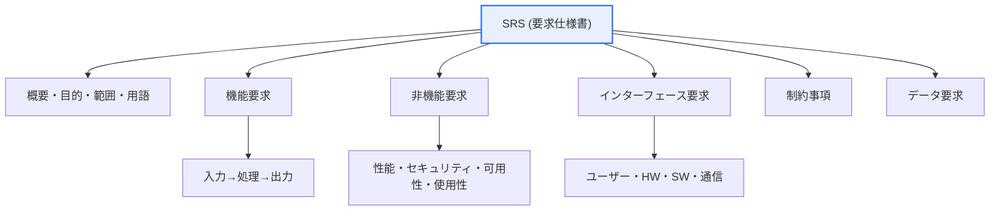
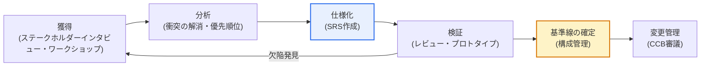

# 要求仕様書（SRS）の記述項目

## 1. 概要

### A. 定義
> **要求仕様書（SRS, Software Requirements Specification）** とは、システムが **何をしなければならないか（機能）と、どのような制約・品質を満たさなければならないか（非機能）を、明確・完全かつ検証可能な形で文書化** した成果物である。発注者・開発者・テスターなどのステークホルダー間における合意の根拠であり、設計・実装・検証の基準線（baseline）となるもので、代表的な標準としてはIEEE Std 830-1998と、これを置き換えたISO/IEC/IEEE 29148（2011年、2018年改訂）がある。

SRSがソフトウェア工学で重視される根本的な理由は、「**要求事項の不明確さ・不完全さ・頻繁な変更がプロジェクト失敗の最大の原因の一つである**」という長年の経験的観察にある。システムが何をすべきかが文書で明確に確定されていなければ、発注者・企画者・開発者・テスターが同じ文章を互いに異なって解釈し、その解釈のずれは開発が進むにつれて雪だるま式に大きくなり、結合・受入試験の段階で大規模な手戻り（rework）として噴出する。SRSはまさにこの解釈のずれを初期に封じ込める装置である。

特にSRSの力は、**曖昧な自然言語を測定可能な記述へと変える点** にある。「画面が速くなければならない」「使いやすくなければならない」のような文章は人それぞれに異なるイメージを思い起こさせるが、「照会の応答時間は、通常負荷において95パーセンタイル値で2秒以内」のように定量化すれば誰も異なって解釈することはできず、完成後に充足の有無を試験で判定できる。すなわちSRSは単なる文書ではなく、以後の設計・開発・検収・精算の拠り所となる **検証可能な契約書** の性格を持つ。

### B. 登場背景と必要性
SRSが一つの定型的な成果物として定着した背景には、「欠陥の発見時点が遅いほど修正コストが指数関数的に大きくなる」という欠陥の経済学がある。Boehmが示した古典的な観察以来、要求段階で捉えられたはずの欠陥を運用段階で直すと、そのコストが数十倍から数百倍にまで膨らむことは、ソフトウェア工学の常識として通用している。要求を初期に明確に確定することが、結局は最も安価な品質確保の手段なのである。

もう一つの必要性は、**責任と範囲の境界設定** である。SI・公共SW事業において、発注者と受注者の間の紛争の大半は「これも元々の要求に含まれていたのではないか」という範囲（scope）をめぐる争いに起因する。SRSが機能・非機能・制約を漏れなく確定しておけば、以後の要求変更は「範囲外の新たな要求」として識別され、変更管理（Change Control）手順と対価算定の対象となる。仕様が不十分であればこの境界が曖昧になり、際限のない要求の増殖（scope creep）がプロジェクトを蝕む。

## 2. SRSの構成と記述項目

SRSは、システムのさまざまな側面を特定の観点に偏らず漏れなく盛り込まなければならない。以下の構造図は、IEEE 830/29148系が推奨する代表的な項目を、概要・機能・非機能・インターフェース・制約・データの六つの軸に整理したものである。

**概要・目的・範囲** の項目はSRSの導入部であり、システムがなぜ必要なのか、どのような問題を解決しようとしているのか、どこまでを対象とし何を対象外とするのか（範囲と非範囲）を定義し、以後の文書全体で用いる用語・略語を明確に規定する。この部分が不十分であれば、後続の詳細要求がいかに精緻であっても「何のためのシステムか」についての共通理解がないため、方向性がずれてしまう。例えば銀行の与信審査システムであれば、対象商品群、連携する信用格付機関、自動承認の限度範囲といった境界を概要で明確に定めておかなければならない。

**機能要求（Functional Requirements）** は、システムが提供すべき具体的な動作を「入力→処理→出力」の形で記述する。「ユーザーが口座振替を要求すると（入力）、残高・限度額・不正取引の有無を検証したうえで（処理）、成功/失敗の結果と取引明細を返す（出力）」のように、観測可能な振る舞いの単位で記述しなければならない。機能要求は通常、ユースケース、機能一覧、またはアジャイルのユーザーストーリーの形で表現され、各機能には固有の識別子（FR-001など）を付与して追跡可能性を確保する。

**非機能要求（Non-Functional Requirements、品質特性）** は、システムが「どれだけうまく」動作すべきかを規定する。性能（応答時間・スループット・TPS）、可用性（例: 年間99.9%、すなわち年間ダウンタイム約8.76時間以内）、セキュリティ、使用性、拡張性、保守性などがこれに該当する。非機能要求は特定の画面ではなくシステム全体に影響を与え、アーキテクチャを事実上決定づけるため、初期に定量的に確定することが特に重要である。「速くなければならない」ではなく、「同時ユーザー1万人で照会応答2秒以内、スループット500 TPS以上」のように数値で明確に定めなければならない。

**インターフェース・制約・データ要求** は、システムが置かれる環境を規定する。インターフェース要求は、ユーザーインターフェース（UI）、ハードウェア、他のソフトウェア（外部システムのAPI）、通信プロトコルとの接点を定義する。制約事項は、遵守すべき法規（例: 個人情報保護法、電子金融監督規定）・業界標準・技術スタック・予算・スケジュールといった外部条件である。データ要求は、扱うデータの構造・項目・整合性ルール・保存期間を規定する。これら三つの項目はしばしばおろそかにされるが、実務において結合の遅延と規制違反のリスクはまさにこの地点で発生する。

| 項目 | 内容 | 代表的な識別子・例 |
|---|---|---|
| **概要・目的・範囲** | システムの目的、対象、範囲/非範囲、用語の定義 | 事業背景、対象業務の範囲 |
| **機能要求** | 提供する機能・動作（入力・処理・出力） | FR-001 口座振替処理 |
| **非機能要求** | 性能・セキュリティ・可用性・使用性などの品質 | NFR-P-01 応答2秒以内 |
| **インターフェース要求** | ユーザー・HW・SW・通信インターフェース | 信用格付機関のREST API連携 |
| **制約事項** | 法規・標準・技術・予算・スケジュールの制約 | 個人情報保護法の遵守 |
| **データ要求** | データ構造・項目・整合性・保存ルール | 取引ログの5年間保存 |

## 3. 良い要求事項の品質特性

SRS文書全体だけでなく、そこに盛り込まれる要求事項の一つひとつが備えるべき品質基準がある。ISO/IEC/IEEE 29148は、個々の要求と要求の集合（set）の両方についての特性を示しているが、ここでは実務でよく強調される五つを文章で説明する。

第一に、**完全性（Completeness）** とは、必要な要求が漏れなく含まれ、各要求の内部にも例外・境界条件が明示されていなければならないことを意味する。正常系のフローだけを記述してエラー処理を漏らすと、開発者はその部分を恣意的に解釈するか、まったく実装しない。第二に、**明確性/非曖昧性（Unambiguity）** とは、一つの文章がただ一つの意味にのみ解釈されなければならないことをいう。「および/または」「適切に」「必要に応じて」といった表現は解釈の余地を残すため排除する。

第三に、**一貫性（Consistency）** とは、要求の間に相互の矛盾がないことである。ある箇所では「すべての取引をリアルタイムで処理」とし、別の箇所では「夜間バッチで精算」とすれば衝突であり、こうした矛盾はたいていステークホルダーが複数いる場合に発生する。第四に、**検証可能性（Verifiability）** とは、要求の充足の有無を試験・検査・分析・デモンストレーションによって客観的に判定できなければならないことを意味する。第五に、**追跡可能性（Traceability）** とは、各要求がその出所（ステークホルダー要求・上位要求）と下位の成果物（設計・コード・テストケース）に双方向で結び付けられ、変更の波及を追跡できなければならないことである。

このうち、実務上の紛争を減らす鍵は **検証可能性** である。「使いやすくなければならない」のように測定できない要求は、完成後に「これが使いやすいと言えるのか」をめぐって発注者と受注者を果てしなく争わせる。一方、「新規ユーザーが教育なしに5分以内に振替を完了でき、ユーザビリティテストで対象者の90%以上が成功すること」のように書けば、判定が客観化される。

| 特性 | 内容 | 違反例 → 改善例 |
|---|---|---|
| **完全性** | 必要な要求・例外条件を漏れなく含む | エラー処理の欠落 → 失敗時のリトライ3回を明示 |
| **明確性** | 一つの意味にのみ解釈される（非曖昧性） | 「速くなければ」 → 「応答2秒以内」 |
| **一貫性** | 要求間に相互の矛盾がない | リアルタイム vs バッチの衝突を除去 |
| **検証可能性** | 試験・検査で充足を確認可能 | 「使いやすく」 → 「5分以内に完了、成功率90%」 |
| **追跡可能性** | 出所・設計・コード・テストへ双方向に連結 | RTMで要求–テストをマッピング |

## 4. 要求工学プロセスとSRSの位置付け

SRSはある瞬間に一度に作成される文書ではなく、**要求工学（Requirements Engineering）** という反復的なプロセスの成果物である。以下の図は、獲得（Elicitation）→分析（Analysis）→仕様化（Specification）→検証（Validation）と続き、承認されたSRSが構成管理の下に置かれ、以後変更管理を受ける流れを示している。

**獲得** 段階では、インタビュー、ワークショップ、観察、既存文書の分析などによって、ステークホルダーの真の要求を掘り起こす。このとき、ステークホルダーが語る「解決策」と、その背後に隠れた「真の問題」を区別することが核心である。**分析** 段階では、獲得した要求同士の衝突を解消し、実現可能性を検討し、ビジネス価値とリスクに応じて優先順位（例: MoSCoW — Must/Should/Could/Won't）を付ける。

**仕様化** 段階で初めてSRSが定型文書として作成され、**検証** 段階ではステークホルダーレビュー・インスペクション・プロトタイプによって、「我々は正しいものを仕様化したか（Validation）」と「仕様を規則どおりに正しく書いたか（Verification）」を併せて確認する。検証を通過して承認されたSRSは **基準線（baseline）** として構成管理に登録され、以後のすべての変更は変更管理委員会（CCB）の審議を経なければならない。このフィードバック構造がなければ、SRSは作成された瞬間から陳腐化し始める。

## 5. 事例 — 曖昧な要求が招いた失敗と定量化の効果

SRSの価値は、失敗事例と対比したときに最も鮮明になる。大規模な公共・金融SIで繰り返し観察される典型的な失敗は、「国民が便利に利用できなければならない」「安定的に運用されなければならない」といった定性的な文章を要求事項として確定した場合である。こうした要求は、事業終了時点で発注者と受注者を「十分に便利か」「この程度なら安定的か」をめぐって際限なく争わせ、監理・検収の遅延と追加コストにつながる。問題の根源は開発能力ではなく、**判定基準が仕様に存在しない** ことにある。

これを定量化すると状況は変わる。「便利でなければならない」を「中核業務3種は新規ユーザーが別途の教育なしに3分以内に完了し、ユーザビリティテスト対象者の90%以上が成功」に、「安定的でなければならない」を「可用性年99.9%（年間ダウンタイム約8.76時間以内）、障害の目標復旧時間（RTO）30分・目標復旧時点（RPO）5分」に置き換えれば、完成後に試験で充足の有無を客観的に判定できる。同じ文章を定量指標に置き換えるだけで、紛争の余地がなくなるのである。

実務で繰り返されるもう一つの事例は、**非機能要求を遅れて発見すること** である。開発がかなり進んだ後に「同時接続1万人に耐えなければならない」という性能要求が遅れて明らかになると、すでに単一サーバー・密結合で組まれたアーキテクチャを拡張可能な構造に再設計しなければならないため、手戻りのコストが急増する。性能・可用性・セキュリティのような非機能要求がアーキテクチャを事実上決定するため、これらをSRS段階で定量目標として確定することが決定的に重要であるという点を、この事例は示している。

## 6. 深化 — 標準の変化とアジャイル環境における軽量な仕様

伝統的にSRSの骨格はIEEE Std 830-1998が提供してきたが、この標準は2011年に **ISO/IEC/IEEE 29148**（"Requirements engineering"）へと統合・置換され、2018年に改訂版が出た。29148はSRSだけでなく、ステークホルダー要求仕様（StRS）、システム要求仕様（SyRS）までを包含し、個々の要求と要求の集合が備えるべき特性（必要性・明確性・完全性・一貫性・検証可能性・追跡可能性など）を精緻に規定している点で、830よりも包括的である。技術士の答案では「830が代表的な標準」とだけ書くよりも、「830を継承・置換した29148体系」まで言及すれば、最新性を示すことができる。

一方、アジャイル・DevOpsの普及により、**重厚な文書中心のSRSが軽量な仕様に置き換えられる** 流れが顕著である。詳細なSRSの代わりに、プロダクトバックログの **ユーザーストーリー（「〜として、〜のために、〜したい」）** と **受入条件（Acceptance Criteria）**、さらには実行可能な仕様である **BDD（Given-When-Then）** で要求を表現する。代表的なCucumber・Gherkinの文法は、「Given 残高が10万ウォン、When 5万ウォンを振替、Then 残高は5万ウォン」のように、要求がそのまま自動化テストとなるようにする。

注目すべき点は、形式が文書からストーリー・シナリオへと変わっただけで、**検証可能性・追跡可能性という要求事項の本質はそのまま** だということである。受入条件がすなわち検証可能性であり、バックログ項目とテスト・コミットの連結がすなわち追跡可能性である。大規模な規制産業（金融・医療・航空）では、依然として監査・認証のために定型のSRSを維持しつつ、内部の開発フローはアジャイルの成果物とツール（Jira、Confluence、ALM）でリアルタイムに同期するハイブリッドが実務の主流である。例えば医療機器SWは、IEC 62304を満たすために、要求–設計–検証の追跡マトリクスを規制上のエビデンスとして必ず残す。

## 7. 考慮事項および示唆

技術士の観点から、SRSは単なる文書作成手法ではなく、**プロジェクトリスクを初期に統制する管理戦略** としてアプローチしなければならない。次の四点が核心である。

1. **検証可能性と追跡可能性を最優先の設計原則とする。** 測定不可能な要求は紛争の種であるため、すべての非機能要求を定量化し、**要求事項追跡マトリクス（RTM）** で要求–設計–コード–テストを双方向に連結する。RTMは変更時に影響範囲を即座に特定させ、回帰欠陥を予防する管理ツールである。

2. **アジャイルでは軽量化しつつ本質は維持する。** 詳細なSRSをユーザーストーリー・受入条件・BDDに置き換えるとしても、検証可能性と追跡可能性はツール（Jira、Xray、Cucumber）で自動的に確保する。文書をなくすことが目的ではなく、陳腐化せず実行される仕様を作ることが目的である。

3. **要求は必ず変わるという前提で変更管理体制を整える。** 完璧な初期仕様は不可能であるため、基準線を構成管理に置き、CCBの審議・影響分析・再承認の手順を通じて、統制された方法でのみ変更を反映する。統制されない変更（scope creep）こそが、スケジュール・コスト超過の主犯である。

4. **非機能要求がアーキテクチャを決定することを認識し、早期に確定する。** 性能・可用性・セキュリティの目標は設計後に差し込むことができないため、SRS段階で定量目標（TPS・応答時間・可用性・RTO/RPO）を明確に定め、アーキテクチャの意思決定とトレードオフ（例: 強い一貫性 vs 高可用性）の基準線を用意しなければならない。

## 参考資料
- ISO/IEC/IEEE 29148:2018, Systems and software engineering — Life cycle processes — Requirements engineering. https://www.iso.org/standard/72089.html
- IEEE Std 830-1998, Recommended Practice for Software Requirements Specifications. https://standards.ieee.org/ieee/830/1222/
- ISO/IEC/IEEE 29148 概要（Wikipedia）. https://en.wikipedia.org/wiki/ISO/IEC/IEEE_29148

---

> **一言まとめ**: SRSは*概要・機能・非機能・インターフェース・制約・データ*の要求を文書化するものであり、完全性・明確性・一貫性・検証可能性・追跡可能性を備えなければならず、IEEE 830を継承したISO/IEC/IEEE 29148体系の下で曖昧な要求を定量化し、RTMで追跡することで、プロジェクト失敗の最大の原因である要求の誤りを初期に統制する。
