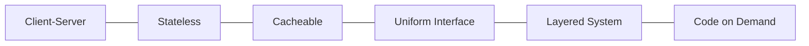

# REST API（Representational State Transfer API）

## 1. 概要

### A. 定義
> HTTPを基盤として **リソース（Resource）をURIで識別** し、**HTTPメソッドで操作を表現** し、リソースの状態をJSON・XMLのような表現（Representation）でやり取りする **アーキテクチャスタイル** のAPI。Roy Fieldingが2000年の博士論文で提示した。

RESTで強調すべき点は、それが特定の技術・規格ではなく **アーキテクチャスタイル（制約条件の集合）** であるということである。すなわち「このプロトコルを使え」ではなく、「こうした制約を守れば、Webのように拡張性があり疎結合なシステムになる」という原則の集まりである。Web自体が大規模に成功した構造をAPI設計に一般化したものであるため、RESTを理解するには、それらの制約がそれぞれどのような拡張性・独立性を得るためのものかを見なければならない。

### B. 登場背景および必要性
初期のWebサービス標準であったSOAPは、XMLエンベロープ・WS-*仕様が重厚かつ厳格であり、ブラウザ・モバイルのような軽量クライアントや迅速なオープンな連携には負担であった。Web・モバイル・MSAが普及するにつれて必要とされたのは、「**HTTPさえあれば誰でも簡単に接続できる、軽量で標準的なインターフェース**」であった。RESTはすでに実証済みのHTTPのメソッド・ステータスコード・キャッシュをそのまま活用するため、別途の規格を学習する負担が少なく、クライアント・サーバーが独立して進化できることから、オープンAPI・プラットフォーム経済の事実上の標準となった。

## 2. RESTの6大アーキテクチャ制約

各制約にはそれぞれ得ようとする品質があり、それを理解してこそ「なぜそのように設計するのか」が見えてくる。

**A. Client-Server** — UI（クライアント）とデータ保存（サーバー）の関心事を分離し、双方が互いの内部を知らなくてもインターフェースさえ合っていれば、それぞれ独立して発展できるようにする。

**B. Stateless（ステートレス）** — サーバーは以前のリクエストのセッション状態を記憶せず、**各リクエストが処理に必要なすべての情報を自ら含む**。サーバーが状態を持たないため、どのサーバーにリクエストが送られても処理でき、**水平スケーリング（ロードバランシング）** が容易になる。これが大規模トラフィックに耐えられる核心的な理由である。

**C. Cacheable** — 応答にキャッシュ可能かどうかを明示し、同一リクエストを繰り返すときに中間・クライアントのキャッシュが応答するようにする。サーバーの負荷と遅延を減らす、Webのスケーラビリティの根幹である。

**D. Uniform Interface（統一インターフェース）** — RESTをRESTたらしめる中核的な制約であり、リソースをURIで識別し、表現を通じてリソースを操作し、メッセージが自己記述的であり、ハイパーリンクによって状態を遷移させる（HATEOAS）。インターフェースが一貫しているため、クライアントが特定のサーバー実装に依存しない。

**E. Layered System** — クライアントは、最終的なサーバーと直接通信しているのか、途中のプロキシ・ゲートウェイ・ロードバランサーを経由しているのかを知る必要がない。階層を自由に挿入でき、セキュリティ・キャッシュ・拡張機能を透過的に追加できる。

**F. Code on Demand（任意）** — サーバーが実行コード（例: スクリプト）を送り、クライアントの機能を拡張できる唯一の任意の制約である。

| 原則 | 内容 | 得られる品質 |
|---|---|---|
| Client-Server | UI/データの関心事の分離 | 独立した進化 |
| Stateless | リクエストの自己完結、状態を保持しない | 水平スケーラビリティ |
| Cacheable | キャッシュ可否の明示 | 性能向上・負荷削減 |
| Uniform Interface | 一貫したインターフェース・HATEOAS | 結合度の低減 |
| Layered System | 階層構造の許容 | 透過的な拡張・セキュリティ |
| Code on Demand（任意） | 実行コードの送信 | クライアントの拡張 |

## 3. 構成要素とメソッド

RESTの3要素は **リソース・操作・表現** である。リソースは「何を」（URIで識別）、操作は「どのように」（HTTPメソッド）、表現は「どのような形式で」（JSONなど）に該当する。ここで重要な原理が **冪等性（idempotency）** である。同じリクエストを何度送っても結果の状態が同一であるメソッドを冪等といい、ネットワーク障害で再送が起きても安全かどうかを左右する。GET・PUT・DELETEは冪等であるためリトライしても副作用がないが、POSTは呼び出すたびに新しいリソースが作られ冪等ではないため、リトライの設計に注意しなければならない。例えば決済の作成をPOSTとすると二重決済のリスクがあるため、冪等キーを別途設けるといった補完が必要である。

| 要素 | 説明 |
|---|---|
| リソース（Resource） | URIで識別（例: `/users/1`） |
| 操作（Verb） | GET・POST・PUT/PATCH・DELETE |
| 表現（Representation） | JSON・XMLなどのリソース状態 |

| メソッド | 意味 | 冪等性 | リトライの安全性 |
|---|---|---|---|
| GET | 取得 | O | 安全 |
| POST | 作成 | X | 重複のリスク（冪等キーで補完） |
| PUT | 全体更新 | O | 安全 |
| PATCH | 部分更新 | X | 注意 |
| DELETE | 削除 | O | 安全 |

## 4. 成熟度モデル（Richardson Maturity Model）

RESTを「守るか守らないか」の二分法ではなく、**段階的にどれだけRESTらしいか** として捉えるモデルである。Level 0はHTTPを単なる転送トンネルとしてのみ使うリモート呼び出し（RPCに類似）であり、Level 1はリソースをURIで分離した段階、Level 2はメソッド・ステータスコードを本来の意味どおりに活用する段階で、実務の大半がここに該当する。Level 3は応答に次に行える操作のリンクを含める **HATEOAS** であり、クライアントがURIをハードコーディングせず、サーバーが与えたリンクをたどって遷移することで結合度をさらに下げる。Fieldingが言う「真のREST」はこの段階であるが、実装・利用のコストが大きいため、現実にはLevel 2が主流である。

| レベル | 内容 |
|---|---|
| Level 0 | HTTPトンネリング（単一URI、RPCに類似） |
| Level 1 | リソースの分離（URI） |
| Level 2 | HTTPメソッド・ステータスコードの活用（実務の主流） |
| Level 3 | HATEOAS（ハイパーメディア） — 真のREST |

## 5. 設計時の考慮事項および示唆
- **URIは名詞、操作はメソッド**: `/getUser` のように動詞をURIに入れず、`GET /users/1` のようにリソースと操作を分離してこそ、統一インターフェースが維持される。
- **ステータスコード・バージョン・セキュリティ**: 2xx/4xx/5xxで結果を正確に伝え、URI・ヘッダでバージョンを管理し、OAuth2・JWT・HTTPSで認証・転送を保護する。ページング・フィルター・OpenAPIによるドキュメント化で使いやすさを高める。
- **相互補完的な技術**: クライアントが必要なフィールドだけを柔軟に要求する必要があればGraphQL、超低遅延の内部通信にはgRPCが有利である。RESTはオープン・汎用的な連携の標準として、これらと役割を分担しながら併用される。

---

> **一言まとめ**: REST APIは*リソースをURIで識別し、HTTPメソッドで操作を表現する*ステートレス・統一インターフェースのアーキテクチャスタイルであり、6大制約がそれぞれ水平スケーリング・独立した進化・性能を狙い、冪等性と成熟度モデル（HATEOAS）によってその設計原理を説明する。
