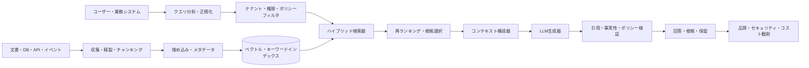
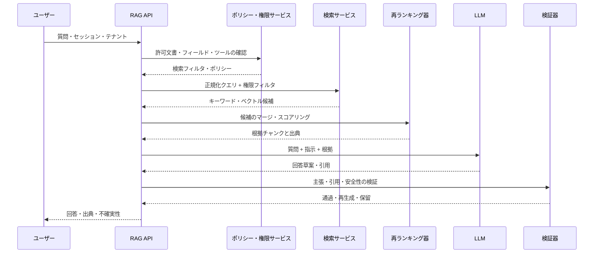

# 検索拡張生成(RAG, Retrieval-Augmented Generation)

## 1. 概要

### A. 定義

> **検索拡張生成(RAG)**とは、大規模言語モデル(LLM)のパラメータに格納された知識のみを用いる代わりに、質問時点で外部の文書・データベース・検索インデックスから関連する根拠を検索し、生成プロンプトまたは生成過程に注入するアーキテクチャである。

RAGの本質は検索器(retriever)と生成器(generator)の結合である。検索器はユーザーの質問と意味的または語彙的に近い文書断片を探し、外部知識の候補を作る。生成器はその候補と質問をあわせて受け取り、回答を作成する。したがってRAGは、単にLLMに長い文書を付け加えるプロンプト技法ではなく、知識の保存・検索・根拠選択・回答生成・評価を一つの情報システムとして設計する方式である。

Lewis et al.はRAGを、事前学習モデルの**パラメトリックメモリ**と外部インデックスの**ノンパラメトリックメモリ**を結合する手法として定式化した([Lewis et al., 2020](https://arxiv.org/abs/2005.11401))。原論文は事前学習済みのシーケンス・ツー・シーケンス生成器とWikipediaのdense vector indexを結合し、知識集約的な質問応答を行った。今日の企業RAGでは、社内規程、設計書、相談履歴、表・コード・データベースなどへと知識源が拡張されたが、「必要な外部根拠を探して生成につなげる」という核心は同じである。

RAGはLLMを学習データの鮮度の問題から完全に解放するわけではない。モデルは質問を解釈し検索結果を要約する能力を依然としてパラメータに依存しており、検索インデックスに存在しない、あるいは誤ってインデックス化された情報は回答に反映されない。したがって技術士の答案では、RAGをハルシネーションを自動的に除去する万能の解決策ではなく、知識の鮮度・出典性・アクセス権限をランタイムで統制する設計パターンとして説明すべきである。

### B. 登場背景と必要性

LLMのパラメータ知識は学習時点で固定され、組織の非公開文書や最近改定された規程を自動的に知ることはない。新しい内容をモデルの再学習で反映するには、データの精製、学習コスト、安全性検証、デプロイとロールバックが必要である。一方、RAGは文書パイプラインと検索インデックスを更新することで、知識源を比較的迅速に入れ替えることができる。

企業業務では、回答の流暢さよりも根拠と追跡可能性が重要である。人事規程の相談で誤った休暇日数を答えたり、設備保全システムで廃止されたマニュアルを根拠に作業したりすれば、コストと安全上の問題が生じる。RAGは検索された文書のタイトル、バージョン、有効日、ページまたは段落をあわせて提示し、レビュー担当者と利用者に回答の根拠を示すことができる。

またRAGは、一つの汎用モデルをすべての組織データで再学習することなく、業務ごとに知識ストアを分離することを可能にする。顧客A社の文書と顧客B社の文書を異なるテナントインデックスで管理し、ユーザー権限に適合する文書のみを検索すれば、データ分離と運用の柔軟性を高められる。ただし、フィルタリングを検索後にのみ行うと、すでに露出したテキストがプロンプトに入り得るため、権限条件は検索段階から適用しなければならない。

### C. 目標と適用範囲

RAG導入の目標は次のように整理できる。

1. 最新かつ組織固有の知識を、モデル再学習より短い周期で反映する。
2. 回答を根拠文書と結び付け、検証可能性と監査可能性を高める。
3. 文書ソースのアクセス権限・保存期間・テナント境界を問い合わせ時点で執行する。
4. 検索品質と生成品質を分離して測定し、原因別の改善を可能にする。
5. モデルが根拠不足を認識した場合、推測の代わりに保留・追加質問・専門家へのエスカレーションを選択させる。

RAGは、規程に関する質問応答、技術サポート、社内検索、ナレッジマネジメント、設計レビュー支援、顧客対応のように、外部知識の活用が重要な業務に適している。一方、正確な数値計算、複雑なトランザクション変更、リアルタイムの相場判断のように、検索だけでは安全性を保証できない業務は、ツール呼び出し、検証サービス、人の承認と組み合わせて設計しなければならない。

## 2. 参照アーキテクチャと動作原理

### A. 全体構造

オンライン経路は、質問を分析し、権限とテナント条件を適用したうえで候補文書を検索・再ランキングし、LLMに渡す。生成後には、引用の有無、根拠と主張の結び付き、禁止語や個人情報の露出、回答形式の遵守を検証する。検証に失敗した場合は回答をそのまま通過させず、再生成・保留・人へのエスカレーションへ分岐する。

オフライン経路は、ソース文書の収集とインデックス化を担う。文書が追加・修正・削除されると、パーサが本文と構造を抽出し、意味単位に分割して埋め込みとメタデータを生成する。原文のバージョンとインデックスのバージョンを紐付けておくことで、「現在の回答がどの時点の文書に基づいたか」を再現できる。

検索インデックスは一つのストアである必要はない。キーワード検索は製品名、条項番号、エラーコードのような正確な用語に強く、ベクトル検索は表現の異なる意味的に類似した文書を探すのに強い。実務では両者の結果をマージしてから再ランキングするハイブリッド構成がよく用いられ、データ規模とドメイン特性に応じてリレーショナルDB、検索エンジン、ベクトルDB、グラフDBを組み合わせる。

### B. クエリ処理の順序

最初の段階のクエリ正規化には、誤字の補正、略語の展開、対話文脈の結合、日付と組織範囲の明示化が含まれる。たとえば「休暇規程を教えて」は対象国、雇用形態、基準日がないため、ただちに検索するよりも追加質問を行うか、デフォルトの範囲を明示すべきである。クエリを恣意的に拡張すると本来の意図と異なる文書を検索する可能性があるため、原文と変換後のクエリの両方を監査可能な形で残す。

ポリシーサービスは、ユーザー・ロール・部門・テナント・文書分類・有効期間に応じて検索可能範囲を返す。このフィルタは検索APIの条件やインデックスパーティションに強制し、アプリケーションコードの任意のif文だけに依存しない。権限が変更された際に埋め込みキャッシュや回答キャッシュが以前のユーザーの結果を再利用しないよう、キャッシュキーに権限バージョンやポリシーバージョンを反映する。

候補検索の後には、重複・古いバージョン・相反する文書を整理する。上位結果がすべて同じ文書の繰り返しチャンクであれば回答の観点が狭くなり得るし、異なる改訂版が一緒に入ってくると、モデルが最新性と廃止を混同する可能性がある。再ランキング段階では、関連性だけでなく有効日、出典の信頼度、文書権限、重複度、ユーザーの質問の細かな条件をあわせて考慮する。

### C. 生成と検証の連携

コンテキスト構成器は、質問、システム指示、検索根拠、応答形式、禁止された行動を明確に区別する。検索文書の中に「以前の指示を無視せよ」といった文があっても、それはデータであってシステム指示ではない。文書内容を信頼できる命令に格上げしないよう、区切り子とプロンプトポリシーを適用する。

生成器は根拠外の事実を推測してはならない。回答テンプレートに「根拠文書にない場合は確認不可と答えよ」「主張ごとに出典を表示せよ」「文書間の矛盾を隠すな」といった規則を入れることができる。しかし、プロンプトだけでは保証できないため、別途の検証器とテストセットが必要である。

検証器は回答を文または主張単位に分解し、各主張に必要な根拠があるかを検査する。引用が付いていても、引用文書が実際に主張を支持していない場合があるため、引用の存在と引用のentailmentを区別する。重要な業務では、モデルベースの判定だけを用いず、ルール、原文リンク、構造化フィールドの比較、ドメイン検証APIを併用する。

## 3. データ準備と検索設計

### A. 文書の収集・精製・リネージ

RAGの品質はLLMよりもソースデータの品質に大きく左右される。PDFのヘッダ・フッタが本文に繰り返し現れたり、表の列順序が乱れたりすると、埋め込みが文書の意味をうまく表現できない。OCR対象文書は、認識率、表・脚注の保存、スキャンページの欠落を検収し、パースに失敗した文書はインデックス化完了として扱わない。

収集パイプラインは、原文URI、所有者、文書種別、言語、作成日、改訂日、有効開始・終了日、セキュリティ等級、削除状態、ハッシュ、パーサバージョンをメタデータとして保存する。これらの情報は検索フィルタだけでなく、回答の出典と回帰分析にも用いられる。文書が削除されたにもかかわらずベクトルインデックスに残っている孤立チャンクを定期的に検出しなければならない。

文書リネージ(lineage)とは、原本からパースされたテキスト、チャンク、埋め込み、検索結果、回答までのつながりである。同一文書が再収集されたときにハッシュで変化を判定し、内容が変わったチャンクのみを再埋め込みすればコストを削減できる。パーサや埋め込みモデルを変更する際はインデックスバージョンを分離し、旧バージョンと新バージョンの結果を比較してから切り替える。

### B. チャンキングとメタデータ

チャンキングは文書を固定長で切る問題ではなく、検索単位を設計する問題である。チャンクが小さすぎると文脈と条件を失い、大きすぎると検索結果に不要な内容が増えて生成器の注意が分散する。見出し・条項・表の行関係・コードブロック・段落境界を保持しながら、目標トークン長とオーバーラップを実験しなければならない。

規程文書であれば章-節-条-項の階層を各チャンクに付与し、手順書であれば前提条件と例外条件を同じチャンクまたは連結されたチャンクにまとめる。表は行だけを分離すると列見出しの意味が失われるため、表のタイトルと単位、列名を繰り返して構造化テキストとして保存する。ソース文書のページと位置を保存しておけば、ユーザーに正確な引用を示すことができる。

メタデータは検索結果の品質とセキュリティを左右する。`tenant_id`、`acl`、`document_type`、`effective_from`、`effective_to`、`language`、`source_system`、`version`、`page`といったフィールドを設計し、フィルタ可能な値は標準コードで管理する。メタデータを自由テキストでのみ保存すると、部門名が異なる表記になり、権限フィルタや期間フィルタが漏れる可能性がある。

### C. 埋め込みとインデックス化

埋め込みはテキストを意味空間のベクトルに変換する。質問ベクトルと文書ベクトルのコサイン類似度や内積を比較して候補を探すが、類似度がそのまま正解性を意味するわけではない。製品コードや条項番号のように文字一致が重要な表現はベクトル検索だけでは取りこぼす可能性があるため、BM25などのキーワード検索と併用する。

埋め込みモデルを変更するとベクトル空間の意味が変わるため、既存のベクトルと直接比較しない。言語、ドメイン専門用語、文書長、クエリ種別に適したモデルを選択し、代表的な質問-正解文書のデータセットで検索性能を比較する。埋め込みAPIに個人情報や機密原文を送る場合は、処理場所、保存ポリシー、暗号化、契約条件を検討する。

インデックスは書き込みと読み込みの一貫性を考慮する。新しい文書がソースに登録された時点で即座に検索可能になるとユーザーに約束するのか、埋め込み・検収完了後にのみ公開するのかを決めなければならない。増分インデックス化の途中で失敗すると一部のチャンクだけが露出する状況が生じ得るため、一時インデックスにロードしてからエイリアスをアトミックに切り替えるか、文書単位の状態をフィルタとして執行する。

### D. 検索・再ランキング

一次検索は広く候補を集め、二次の再ランキングは質問と候補の細かな関連性を判断する。一次で上位5件だけを取得すると必要な根拠が欠落する可能性があり、100件をそのままLLMに入れるとコストとノイズが増える。候補数と最終コンテキスト数は質問種別ごとに実験し、検索スコア・再ランキングスコア・選定理由を記録する。

クエリが「2025年に改定された情報保護規程の例外は?」であれば、意味的類似性だけでなく、年度、文書種別、「例外」という構造的シグナルを反映しなければならない。期間とバージョンのフィルタを先に適用してから検索することで、廃止された規程が上位に来ることを減らせる。互いに矛盾する文書が検索された場合は、最新文書を恣意的に隠すよりも矛盾を表示し、基準日と改定状況を回答に含める。

検索の失敗も正常な結果として扱う。関連文書がないのに最も近い文書を回答に用いると、もっともらしい誤答になる。最小類似度、再ランキングスコア、出典の信頼度、必須メタデータの充足可否を総合して「根拠不足」状態を作り、ユーザーに範囲を絞って再度質問するよう案内する。

## 4. RAGの類型と比較

### A. 基本RAG・高度RAG・エージェント型RAG

基本RAGは質問-検索-生成の線形フローである。構造が単純でレイテンシとコストを予測しやすく、初期パイロットに適している。しかし複合的な質問を一つの検索クエリで処理することは難しく、誤って検索された結果を自ら修正することもできない。

高度RAGは、クエリ書き換え、ハイブリッド検索、再ランキング、文書圧縮、対話文脈管理、回答検証を追加する。検索品質を改善できるが、構成要素が増えるほどレイテンシ、障害点、評価の組み合わせが増加する。機能を増やす前に、どの失敗類型を減らすのかについてベースラインを設定しなければならない。

エージェント型RAGは、モデルが検索ツールを複数回呼び出し、検索結果を評価し、必要に応じてクエリを分解する。複合的な調査には有利だが、ツール呼び出しの暴走、無限ループ、権限範囲の拡大、コスト予測の失敗が発生し得る。ツール一覧と引数検証、呼び出し回数・時間の予算、承認境界を明示しなければならない。

| 区分 | 基本RAG | 高度RAG | エージェント型RAG |
|---|---|---|---|
| フロー | 1回の検索後に生成 | 前処理・再ランキング・検証 | 計画・反復検索・ツール呼び出し |
| 長所 | 単純さ・低い運用コスト | 品質・統制力の改善 | 複合的な質問への対応 |
| リスク | 検索失敗に脆弱 | 遅延・構成の複雑さ | コスト・権限・ループの暴走 |
| 適合業務 | FAQ・社内検索 | 規程・技術サポート | 調査・多段階分析 |

### B. RAGとファインチューニング・プロンプト・長文コンテキスト

ファインチューニングは、モデルの振る舞いやドメイン表現を学習させるのに効果的である。しかし、最新文書の事実を保存し出典をリアルタイムに提示する用途としては管理が難しい。RAGは知識をインデックスに置いて更新するのに対し、ファインチューニングはモデルの重みにパターンと知識を反映するため、両者は代替関係というよりも組み合わせの関係になり得る。

プロンプトエンジニアリングは、モデルに役割、出力形式、例示と制約を伝える方式である。根拠文書をプロンプトに入れることもRAGの一段階ではあるが、文書収集・権限・検索・リネージなしに人が毎回資料を貼り付ける方式は運用型RAGではない。長文コンテキストウィンドウが大きくなっても、入力が長くなるほどコストと遅延が増え、モデルが中間の文書を見落としたり相反する情報を混在させたりする可能性がある。

業務選択の基準は、知識の変化率、資料のアクセス統制、回答根拠の必要性、学習データの量と質、推論コストである。頻繁に変わる社内規程ではRAGの利点が大きく、常に同じ出力形式や口調が問題であればファインチューニングまたはプロンプトが適している場合がある。専門用語をうまく理解できない場合には、ドメイン埋め込み、クエリ書き換え、少量の教師あり学習をRAGと組み合わせる。

| 判断項目 | RAG | ファインチューニング | 長文コンテキスト |
|---|---|---|---|
| 最新知識の更新 | インデックス更新 | 再学習が必要 | 毎回入力が必要 |
| 出典の提示 | 構造化しやすい | 別途設計が必要 | 入力文書に依存 |
| データアクセス権限 | 検索時にフィルタ | モデル外部での統制が必要 | プロンプト構成が必要 |
| 振る舞い・文体の学習 | 限定的 | 強み | 例示で可能 |
| 運用負担 | パイプライン・インデックス | 学習・デプロイ | トークンコスト・遅延 |

## 5. 適用事例と運用手順

### A. 社内規程の質問応答事例

人事規程、就業規則、労働協約、地域別の付属規程がある企業を想定する。ユーザーが「育児休業中の成果給の支給基準は?」と質問した場合、システムはユーザーの国・法人・雇用形態・基準日を確認し、許可された規程の最新バージョンを検索しなければならない。一般的な法律常識や他法人の規程を混ぜると、回答が流暢であっても業務上は有効でない。

文書チャンクには、規程名、条項番号、施行日、廃止日、適用法人、セキュリティ等級を付与する。検索結果が2024年の規程と2026年の改定規程を同時に返した場合は、改定日と有効期間を比較し、矛盾する場合は人事担当者の確認を求める。回答には結論だけでなく、適用条件、関連条項、基準日、例外と問い合わせ窓口を含める。

正答率だけで成功を判断しない。ユーザーに権限のない法人の文書が検索されなかったか、回答が出典条項を正確に引用しているか、不確実なときに保留するか、改定直後に新しい文書が検索されるかまで検証する。人事相談のログには質問と回答を残すが、住民登録番号や機微な人事情報が不必要に保存されないようマスキングする。

### B. 製造業の技術サポート事例

製造現場では、装置モデル、ファームウェアバージョン、アラームコード、工程段階によって対処が異なる。「E-204アラームの解決」という質問に一般的なマニュアルを返すことは危険になり得る。システムは装置識別子と現在のバージョンを確認し、承認された保全マニュアルと安全作業手順から該当条件の対処を検索しなければならない。

作業手順書は、手順、事前遮断、必要な工具、危険警告、正常復帰条件を分離してインデックス化する。検索されたチャンクに安全警告がない場合、生成器は恣意的に手順を補完せず、専門保全員の承認を求める。回答生成と実際の装置制御を分離し、制御コマンドは別途の承認・インターロック・二重確認を通過しなければならない。

現場ネットワークが不安定な場合はキャッシュされたマニュアルを使用できるが、キャッシュが最新の安全文書かどうかを表示しなければならない。オフライン回答とオンライン回答で文書バージョンが異なる場合、ユーザーが混乱しないよう基準時刻と同期状態を表記する。この事例は、RAGが検索の利便機能を超えて、安全・変更管理・責任の所在と結び付くことを示している。

### C. 導入手順

1. **業務範囲とリスク等級の定義**: 回答のみを提供する業務と、実際の意思決定・制御につながる業務を分離する。
2. **文書ソースのリスト化**: 所有者、鮮度、セキュリティ等級、更新周期、文書形式、廃棄手順を調査する。
3. **代表質問セットの構築**: 正解文書、必須条件、禁止文書、保留が想定される質問をゴールドセットとして作成する。
4. **パース・チャンキング基準の策定**: 表・コード・条項・ページ構造を保持し、失敗文書の再処理ルールを定める。
5. **権限モデルの連携**: インデックスACL、テナントフィルタ、文書の有効期間、削除の伝播を検索経路に強制する。
6. **検索ベースラインの測定**: キーワード・ベクトル・ハイブリッド方式のrecall@k、MRR、nDCGを比較する。
7. **生成・引用契約の設計**: 回答形式、出典フィールド、不確実性の表現、禁止領域と保留条件を定義する。
8. **安全・セキュリティ試験**: 文書経由のプロンプトインジェクション、権限回避、個人情報の取得、矛盾文書、削除文書への問い合わせを試験する。
9. **シャドー運用と限定公開**: 実ユーザーへの影響なしに検索と回答を比較し、低リスク業務から段階的に公開する。
10. **運用の自動化**: インデックスの鮮度、エラー、コスト、遅延、フィードバック、文書削除の伝播をダッシュボードとアラートで管理する。

## 6. 深化 — 評価、最新化とセキュア型RAG

### A. 検索と生成の分離評価

RAG評価で「回答が正しい」という一つの指標だけを見ると原因がわからない。検索が必要な文書を取得したか(retrieval recall)、上位順位に配置したか(MRR・nDCG)、選択されたコンテキストが質問に対して十分か(context precision・recall)、最終回答が根拠に忠実か(faithfulness)、質問に答えているか(answer relevance)を分けて見る。

たとえば、正解文書がインデックスに存在するのに上位10件に入っていなければ検索の問題である。正解文書がコンテキストにあるのに回答が別の内容を述べていれば、生成・プロンプト・検証の問題である。正解文書そのものが誤っている、あるいは古いのであれば、ナレッジマネジメントの問題である。階層別の指標と失敗サンプルを結び付けてこそ、改善活動が正しい構成要素に向かう。

自動評価器は大規模な回帰テストに有用だが、絶対的な判定者ではない。評価モデルの言語・ドメインのバイアス、引用だけを見て内容の支持可否を見落とす誤り、基準回答の不完全性を検討する。高リスク業務ではドメイン専門家がサンプルをレビューし、自動指標と人による評価の間の不一致も別指標として管理する。

### B. 最新化と矛盾する知識

文書が変更された場合、新バージョンをインデックス化するだけでは十分ではない。旧バージョンが検索されないよう廃止状態を反映し、キャッシュや事前計算された回答を無効化し、進行中の対話のコンテキストが新しいポリシーを汚染しないようにしなければならない。文書の有効日が未来の場合は予約公開とし、適用時刻のタイムゾーンと時刻同期も考慮する。

異なる公式文書が矛盾する場合、どちらかを選ぶことをモデルに任せない。文書所有者、改定日、適用範囲、上位規程、承認状態を比較し、優先順位ルールで選択するか、矛盾をユーザーに提示する。回答には「文書AはX、文書BはYと規定しているため、基準日の確認が必要である」といった形を許容すべきである。

### C. セキュリティ・個人情報とプロンプトインジェクション

検索文書は信頼できる指示ではなくデータである。外部Webページ、電子メール、ユーザーがアップロードした文書の中に、LLMに秘密を出力させたりツールを呼び出させたりする文が含まれている可能性がある。システム指示とデータの境界を分離し、ツール呼び出しは許可リスト・引数スキーマ・最小権限・承認フローで制御する。

検索段階のACLフィルタと生成段階の出力フィルタは互いに代替できない。権限のない文書はそもそも検索してはならず、モデルが他の文書の内容を推論して再構成していないかも点検しなければならない。回答キャッシュにはユーザー・テナント・権限・文書バージョンを含むキーを使用し、検索ログと埋め込みストアの保存・暗号化・アクセス権限をデータ分類に合わせる。

NISTの生成AIリスク管理プロファイルは、生成AIの出所・検証・データリネージといったリスクを扱う参照フレームワークである([NIST AI 600-1](https://doi.org/10.6028/NIST.AI.600-1))。RAG導入時にこのフレームワークのGovern・Map・Measure・Manageの観点から、ソースデータ、検索経路、生成結果、人によるレビュー責任を文書化すれば、技術実装をガバナンスと結び付けることができる。

## 7. 考慮事項および示唆

### A. 正確性・鮮度・完全性のトレードオフ

関連文書を多く入れれば回答が常に正確になるわけではない。文脈が長くなるとノイズが増え、矛盾するバージョンが混在し、コストと遅延が増加する。逆に文書を少なく選びすぎると、例外条件や定義が抜け落ちる。質問種別ごとに必要な根拠の最小集合と最大コンテキストを実験し、結果をユーザーへの影響とあわせて判断する。

鮮度は、収集周期と公開承認の間の時間差によって決まる。自動収集は速いが悪意ある文書や誤った文書を即座に公開してしまう可能性があり、手動検収は信頼性を高めるが遅延する。リスクの高い規程や安全文書は承認済みバージョンのみを検索可能にし、一般知識は自動インデックス化の後にサンプル検収するなど、等級別のポリシーを設ける。

### B. 性能・コスト・可用性

オンラインRAGの遅延は、クエリ埋め込み、一次検索、再ランキング、LLM生成、検証の合計で構成される。再ランキングと検証を無条件に何度も呼び出すと、品質は一部改善されてもユーザー体験とコストが悪化し得る。質問のリスクと複雑さに応じて軽量経路と深化経路を分け、全体のdeadlineを各段階に伝播させる。

ベクトル検索と埋め込みのコストだけを見るのではなく、文書のパース、保存、再インデックス化、LLM入力トークン、出力トークン、キャッシュ、オブザーバビリティのコストを含めたTCOを算出する。長い文書全体を毎回入れる代わりにチャンク圧縮と重複排除を適用し、頻出する公開質問は根拠バージョンが変わらない場合に限り安全にキャッシュする。

検索インデックスの障害時にサービスが無条件に空の回答を生成するようにするのは危険である。検索不可の状態を明確に表示し、承認済みの静的FAQや専門家チャネルに切り替える。モデル障害、埋め込み障害、ソースシステム障害をそれぞれ分離し、インデックスの復旧・再インデックス化・バージョンロールバックの手順を訓練しておく。

### C. セキュリティ・個人情報・説明責任

RAGは文書をモデルの重みに学習させないからといって、個人情報のリスクが消えるわけではない。検索結果とプロンプト、ログ、評価データ、キャッシュが個人情報を複製し得る。収集目的と保存期間を定め、最小収集・非識別化・アクセス制御・暗号化・削除の伝播をデータライフサイクルに沿って適用する。

回答が意思決定に影響を与える場合は、最終的な責任主体と人によるレビューのポイントを明確にする。「AIは参考用」という文言だけでは十分ではなく、どのような条件で自動提供を停止し、どのロールの担当者が承認するのかを運用手順に組み込まなければならない。ユーザーのフィードバックと異議申し立ての結果は、モデル改善だけでなく、文書ソースやポリシーの欠陥を発見する監査資料にもなる。

### D. オブザーバビリティ・変更管理・評価ガバナンス

必須の運用指標は、回答遅延、検索失敗、インデックスの鮮度、top-kヒット率、引用の欠落、根拠への不忠実、保留率、ユーザーの再質問率、トークンコスト、権限エラーである。指標は平均値だけを保存せず、文書種別・テナント・質問種別・モデルバージョンに分解する。ただし、原文の質問と回答の機微性に見合ったアクセス権限を維持しなければならない。

埋め込みモデル、チャンキングルール、再ランキングモデル、プロンプト、LLM、ポリシーフィルタの変更は、いずれもRAGの結果に影響を与えるリリース対象である。ゴールドセットによる回帰、セキュリティテスト、コスト・遅延の負荷テスト、インデックスバージョンの比較を経たうえで段階的に切り替える。回答だけを保存するのではなく、使用した文書バージョン、検索スコア、モデル・プロンプトのバージョン、検証結果を再現可能な形で残す。

### E. 技術士の観点からの導入判断

RAG導入の出発点は「LLMを付けよう」ではなく、情報がどこにあり、どれほど頻繁に変わり、誰が読むことができ、誤答のコストがどれほどかについての業務分析である。文書の所有権と最新化の責任が不明確であれば、優れた検索アルゴリズムであっても信頼できる回答を生み出すことはできない。まずソースデータと業務責任を整備し、リスクが低く測定可能なユースケースでベースラインを作る。

アーキテクチャは検索・生成・検証を分離し、各層の失敗を保留と代替経路につなげなければならない。RAGの核心的な成果は回答の長さやモデルの大きさではなく、必要な根拠を正しいユーザーに適時に届け、根拠が不足するときに安全に停止する能力である。この原則をSLO、セキュリティ統制、評価セット、運用ランブックとして具体化することが技術士の役割である。

## 参考資料

- [Lewis et al. — Retrieval-Augmented Generation for Knowledge-Intensive NLP Tasks](https://arxiv.org/abs/2005.11401)
- [Gao et al. — Retrieval-Augmented Generation for Large Language Models: A Survey](https://arxiv.org/abs/2312.10997)
- [NIST — Artificial Intelligence Risk Management Framework: Generative Artificial Intelligence Profile (AI 600-1)](https://doi.org/10.6028/NIST.AI.600-1)
- [NIST AI RMF Generative AI Profile Knowledge Base](https://airc.nist.gov/AI_RMF_Knowledge_Base/Generative_AI)
- [Es et al. — RAGAS: Automated Evaluation of Retrieval Augmented Generation](https://arxiv.org/abs/2309.15217)

---

> **一言まとめ**: RAGは外部知識を検索してLLMの生成につなげる技術であるが、検索品質・権限・文書リネージ・検証・保留ポリシーまで含めた運用型の情報アーキテクチャとして設計してはじめて信頼できるものとなる。
