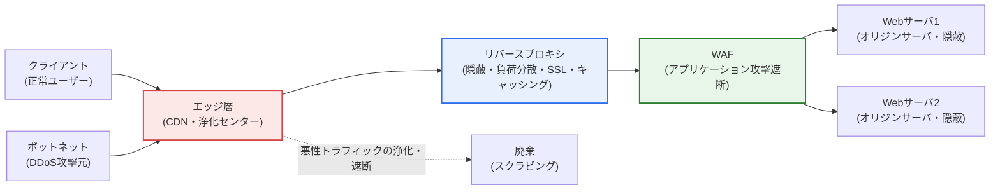
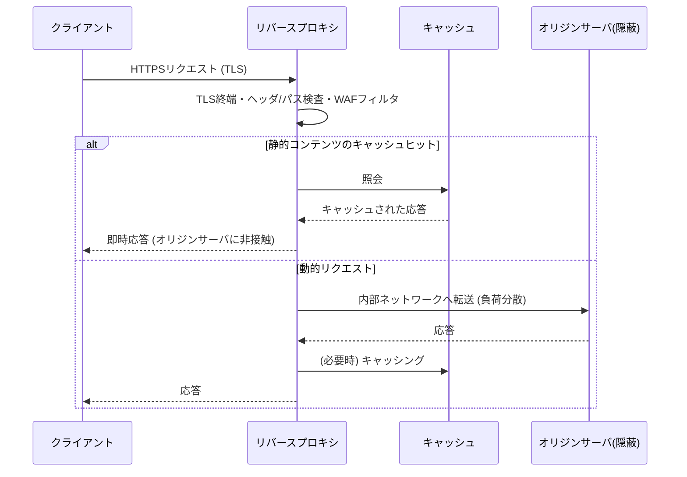
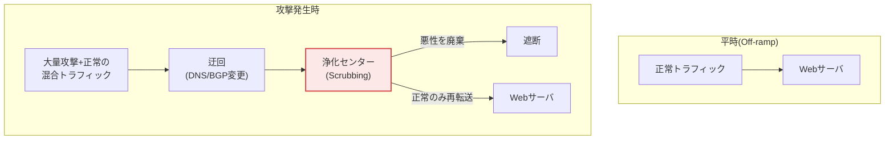

# Webサーバセキュリティ — リバースプロキシとDDoSサイバー待避所

## 1. 概要

### A. 定義
> **リバースプロキシ(Reverse Proxy)** とは、クライアントと実際のWebサーバ(オリジンサーバ、Origin)の間に位置し、すべてのリクエストを代わりに受信・検査・中継して応答を返すサーバ側の代理(server-side proxy)であり、**DDoSサイバー待避所(Cyber Shelter / Scrubbing Center)** とは、大規模な分散型サービス妨害攻撃の発生時に被害組織のトラフィックを浄化センターへ迂回させ、悪性トラフィックを除去したうえで正常なトラフィックのみをオリジンサーバへ転送するトラフィック浄化サービスである。

Webサーバセキュリティの根本的な発想は「**サーバを直接露出させず、前段に緩衝・浄化層を立てよ**」というものである。Webサーバがグローバル IPでインターネットに直結されると、ポート・バナー・パス構造・脆弱性がそのまま攻撃対象領域(attack surface)となり、トラフィックが少し集中しただけでもリソースが枯渇してサービスが停止する。リバースプロキシはこの問題を構造的に解消する。クライアントはプロキシのアドレスしか知らず、実際のサーバの位置・台数・内部構造を知ることができない(隠蔽)。プロキシがリクエストを受けて認証・フィルタリング・キャッシング・負荷分散を行った後に後段へ転送するため、オリジンサーバは信頼された内部ネットワークで保護される。

DDoSは性質の異なる脅威である。リバースプロキシがアプリケーション層の「質」を扱うとすれば、DDoSはトラフィックの「量」でサービスを麻痺させる。数万〜数十万台のゾンビPC・IoTボットネットが毎秒数百GbpsからTbps級のトラフィックを浴びせれば、いかなるリバースプロキシやファイアウォールも帯域そのものが飽和して無力化される。この場合は個々の組織の前段防御だけでは対処できないため、通信事業者・政府(例: 韓国インターネット振興院KISAの「DDoSサイバー待避所」)・クラウド事業者が運営する大規模な浄化センターへトラフィックを迂回させ、代わりに吸収・浄化する。すなわち、リバースプロキシとサイバー待避所は相互排他的な技術ではなく、**攻撃対象領域の縮小(平時)** と **大容量の吸収・浄化(有事)** を担う相補的な層である。

### B. 登場背景と必要性
Webは組織の顔であり、最も露出した資産である。OWASP・SQLi・XSSのようなアプリケーション攻撃はもちろん、ボリュメトリック(帯域枯渇)・プロトコル(TCP SYN Flood)・アプリケーション(HTTP GET/POST Flood)などの階層別DDoSが常時の脅威となる。特にMiraiボットネットの事例(2016年、最大約1.2TbpsでDNS事業者Dynを麻痺させた)とその後のIoTベース攻撃の大型化、HTTP/2 Rapid Reset(CVE-2023-44487、2023年、毎秒数億件のリクエスト)のような新種のアプリケーションDDoSは、「前段単一防御」の限界を露呈させた。これにより、① サーバを隠蔽・中継するリバースプロキシ、② Web攻撃を除去するWAF、③ 大容量を吸収するサイバー待避所/CDNを階層的に組み合わせる **多層防御(Defense in Depth)** が標準的な運用方式として定着した。

## 2. 全体防御構造の概観

まずWebサーバセキュリティの層全体がどのように噛み合うかを構造図で俯瞰し、その後、詳細な要素をプロセスの観点から見ていく。

この構造の核心は **関門の多段化** である。トラフィックは外側から内側へ入るほど、狭く精製された通路を通過する。エッジ層(CDN・浄化センター)が大容量のボリュメトリック攻撃を一次的に吸収・廃棄し、リバースプロキシがサーバを隠蔽しつつ負荷を分散し、WAFがアプリケーション層の悪性リクエストを遮断した後で、ようやくオリジンサーバに到達する。各層は自らが最もよく防げる脅威に特化しており、一つが突破されても次の層が防御を引き継ぐ。

## 3. リバースプロキシ

### A. 動作原理
リバースプロキシは「サーバを代理する」という点で、クライアントを代理するフォワードプロキシとは正反対である。外部から見るとプロキシがWebサーバそのもののように見え、実際のオリジンサーバはプロキシの背後に隠れる。代表的な実装はNginx・HAProxy・Envoy・Apache(mod_proxy)であり、クラウドではAWS ALB、GCP Cloud Load Balancingなどが同じ役割を果たす。リクエストが到着すると、プロキシはTLSを終端(復号)し、ヘッダ・パス・メソッドを検査したうえで、静的コンテンツはキャッシュから即答し、動的リクエストのみを後段サーバへルーティングする。

### B. サーバ隠蔽と攻撃対象領域の縮小
リバースプロキシが提供する最も本質的なセキュリティ効果は **オリジンサーバの隠蔽** である。クライアントはプロキシのIPしか知らず、オリジンサーバの実際のアドレス・台数・OS・ミドルウェアのバージョンを知ることができない。攻撃者は標的を特定しにくくなり、スキャンや直接的な脆弱性攻撃の難度が大きく上がる。実務ではオリジンサーバをプライベートIP帯域に置き、ファイアウォールでプロキシからのリクエストのみを許可(ホワイトリスト)して、迂回接続そのものを根本的に遮断する。サーババナー・エラーページ・応答ヘッダ(Server, X-Powered-By)をプロキシで除去すれば、情報露出も減らせる。

### C. 負荷分散・性能・SSL終端
リバースプロキシは多数のオリジンサーバへリクエストを分配(ラウンドロビン・最小接続・IPハッシュ)して単一サーバの過負荷を防ぎ、あるサーバがダウンすればヘルスチェックで検知して自動的に隔離する。これにより可用性と防御能力が同時に高まる。また、TLS終端(SSLオフロード)をプロキシが専任すれば、オリジンサーバは暗号化・復号演算の負担を軽減でき、証明書管理も一か所に集約される。静的コンテンツのキャッシング・gzip/Brotli圧縮を前段で処理すれば、オリジンサーバのトラフィックを数十パーセントまで削減でき、それ自体が緩やかな負荷型攻撃に対する緩衝の役割を果たす。

### D. セキュリティフィルタリング(WAF連携)
リバースプロキシはWAF(Web Application Firewall)と組み合わさって、SQLインジェクション・XSS・パストラバーサルのようなアプリケーション攻撃をシグネチャ・ルール(例: OWASP ModSecurity Core Rule Set)で除去する。Rate Limiting(リクエスト速度制限)・地域遮断(GeoIP)・ボット検知もプロキシ層で実行し、アプリケーション層DDoS(HTTP Flood)の一次緩和を担う。

| 機能 | 内容 | セキュリティ効果 |
|---|---|---|
| **サーバ隠蔽** | 実サーバのIP・構造・バージョンの隠蔽 | 攻撃対象領域・偵察難度↑ |
| **負荷分散** | 複数サーバへの分配・ヘルスチェックによる隔離 | 可用性・緩衝力↑ |
| **SSL終端** | 前段での暗号化・復号・証明書の集約 | 演算負担↓・管理一元化 |
| **キャッシング・圧縮** | 静的コンテンツのキャッシュ・gzip/Brotli | オリジンサーバ負荷を数十%↓ |
| **セキュリティフィルタリング** | WAFルール・Rate Limit・GeoIP・ボット検知 | アプリケーション攻撃・L7 DDoSの緩和 |

## 4. DDoSサイバー待避所

### A. DDoSの階層別類型
DDoSは攻撃の階層によって性質と防御法が異なる。**ボリュメトリック攻撃**(UDP/ICMP Flood、DNS・NTP増幅)は帯域そのものを枯渇させ、毎秒数百Gbps〜Tbpsに達する。**プロトコル攻撃**(SYN Flood、ACK Flood)はサーバ・ファイアウォールの接続状態テーブルを枯渇させる。**アプリケーション攻撃**(HTTP GET/POST Flood、Slowloris、HTTP/2 Rapid Reset)は少ない帯域でも正常なリクエストを装ってサーバリソースを枯渇させるため、検知が最も難しい。サイバー待避所は、特に個々の組織では対処不可能な **ボリュメトリック・プロトコル攻撃の大容量吸収** に強みがある。

### B. トラフィック迂回・浄化の原理
サイバー待避所の動作は3段階である。① **迂回(Diversion)**: 攻撃が検知されると、DNS変更(ドメインのAレコードを待避所のIPへ)またはBGPルーティング変更(攻撃対象IP帯域の経路を待避所へ広告)によってトラフィックを浄化センターへ流入させる。② **浄化(Scrubbing)**: 浄化センターがシグネチャ・振る舞い分析・レピュテーション(Reputation)・チャレンジ(例: JS/CAPTCHA)でボットネットのトラフィックを識別して廃棄し、正常なトラフィックのみを残す。③ **再転送(Re-injection)**: 精製された正常トラフィックのみをGREトンネル・専用線などでオリジンサーバへ戻す。

### C. 韓国のサイバー待避所と運用体制
韓国ではKISAが中小企業などを対象に「DDoSサイバー待避所」を無償で提供しており、平時にドメインを事前連携しておき、攻撃発生時にトラフィックを待避所へ迂回させて浄化する。通信事業者(KT・SK Broadbandなど)とクラウド・CDN事業者(Cloudflare、AWS Shield、Akamai Prolexicなど)も商用のスクラビングサービスを運営している。核心は **事前の備え** である。攻撃が始まってから慌てて連携しても、すでにサービスは麻痺した状態であるため、平時にDNS・BGP連携、ホワイトリスト、正常トラフィックのしきい値(baseline)をあらかじめ設定し、模擬訓練を行っておいてこそ迅速な切り替えが可能となる。

| 構成 | 内容 | 要点 |
|---|---|---|
| **トラフィック迂回** | DNS/BGPで浄化センターへ流入 | 迅速な切り替え(RTO最小化) |
| **トラフィック浄化** | シグネチャ・振る舞い・レピュテーション・チャレンジによるフィルタ | 誤検知(正常の遮断)の最小化 |
| **正常トラフィックの再転送** | GREトンネル・専用線による再注入 | 正常ユーザーの遅延最小化 |
| **事前連携** | 平時のbaseline・ホワイトリスト設定 | 訓練・連携の常時維持 |

## 5. 深化 — クラウド・CDN統合防御と最新動向

近年、防御の重心はオンプレミス機器から **クラウド・CDNエッジ** へ移りつつある。Cloudflare・Akamai・AWS(CloudFront+Shield Advanced)・Fastlyのような事業者は、世界中に分散した大規模なエッジPOP(Point of Presence)で、リバースプロキシ・WAF・DDoS浄化・CDNキャッシングを **一つの統合サービス** として提供する。トラフィックはユーザーに近いエッジで吸収・浄化されるため、大容量のボリュメトリック攻撃はオリジンサーバの近くに到達する前に分散処理される。事業者各社は数十Tbps規模の浄化容量を公表しており、実際に2023〜2024年のHTTP/2 Rapid Reset(CVE-2023-44487)系の攻撃では、毎秒数億件のリクエストをエッジで遮断した事例が報告されている(具体的な数値は事業者の公開資料に基づくものであり、時点によって異なり得る)。

同時に、アプリケーション層の防御も精緻化している。AI・機械学習ベースの異常トラフィック検知、ボット管理(Bot Management)による正常ボット(検索エンジン)と悪性ボットの区別、そして **Zero Trust・SASE** との結合により、「信頼されたエッジからのみオリジンサーバへのアクセスを許可」する方式が強化されている。また、オリジンサーバのIPが過去のDNS履歴や設定ミスによって露出し、エッジを迂回される事故を防ぐため、オリジンサーバのファイアウォールがCDN/プロキシの帯域のみを許可するよう強制する「オリジンクローキング(Origin Cloaking)」がベストプラクティスとして定着した。

## 6. 考慮事項および示唆 (技術士の観点)

1. **多層防御の組み合わせと階層別の役割分担**: 単一地点の防御は必ず突破される。エッジ(ボリュメトリックの吸収)・リバースプロキシ(隠蔽・負荷分散)・WAF(アプリケーション攻撃)・サイバー待避所(大容量浄化)を階層的に組み合わせつつ、各層が重複なく特化した脅威を担うよう設計しなければならない。これは防御の深層化であると同時に、ボトルネック・コスト最適化の問題でもある。

2. **平時の備えと迅速な切り替え(RTO最小化)**: サイバー待避所・スクラビングでは、攻撃発生後の迂回切り替えの速度がそのまま被害規模を左右する。平時にDNS TTLの短縮、BGP連携、正常トラフィックのbaseline・しきい値、ホワイトリストを準備し、定期的な模擬訓練を行わなければならない。検知-迂回-浄化の自動化(オーケストレーション)によって人の介入による遅延を減らすことが要点である。

3. **誤検知(False Positive)とユーザー体験のトレードオフ**: 浄化の強度を上げると、正常ユーザーまでチャレンジや遮断に引っかかり離脱する。逆に緩くすると攻撃が漏れ込む。アプリケーションの特性(ログイン・決済トラフィックのパターン)に合わせてルールをチューニングし、CAPTCHA・JSチャレンジによるユーザーの摩擦を最小化するバランスの取れた設計が必要である。

4. **エッジ迂回(Origin Exposure)リスクの管理**: いくらCDN・プロキシで包んでも、オリジンサーバのIPが露出すれば攻撃者はエッジを飛び越えて直接攻撃する。オリジンサーバのファイアウォールをCDN/プロキシの帯域のみ許可するよう強制し、過去のDNS履歴・サブドメイン・メールサーバを通じたIP流出経路を定期的に点検しなければならない。

5. **コスト・性能・主権(Sovereignty)のバランス**: クラウド統合防御は強力であるが、トラフィックコスト・ロックイン(Lock-in)・データ主権の問題を伴う。公共・金融のようにデータの国外移転に敏感な領域では国内の浄化センターとリバースプロキシの組み合わせを、グローバルサービスではCDNエッジ防御を選択するなど、サービスの性格に適したアーキテクチャ戦略が求められる。

## 参考資料
- KISA 보호나라, DDoSサイバー待避所サービス案内: https://www.boho.or.kr/
- Cloudflare Learning Center, "What is a reverse proxy?": https://www.cloudflare.com/learning/cdn/glossary/reverse-proxy/
- Cloudflare, HTTP/2 Rapid Reset (CVE-2023-44487) の分析: https://blog.cloudflare.com/technical-breakdown-http2-rapid-reset-ddos-attack/
- OWASP ModSecurity Core Rule Set(CRS): https://coreruleset.org/
- AWS, "AWS Best Practices for DDoS Resiliency": https://docs.aws.amazon.com/whitepapers/latest/aws-best-practices-ddos-resiliency/

---

> **一言まとめ**: Webサーバセキュリティは、*リバースプロキシでオリジンサーバを隠蔽・保護(負荷分散・SSL終端・キャッシング・WAFフィルタリング)* し、大容量DDoSは *サイバー待避所・スクラビングセンターでトラフィックを迂回・浄化(DNS/BGP切り替え→ボットネットの廃棄→正常トラフィックの再転送)* し、エッジ・CDN・Zero Trustと結合した多層防御によって、平時には攻撃対象領域を縮小し、有事には大容量を吸収して安定したサービスを実現するものである。
