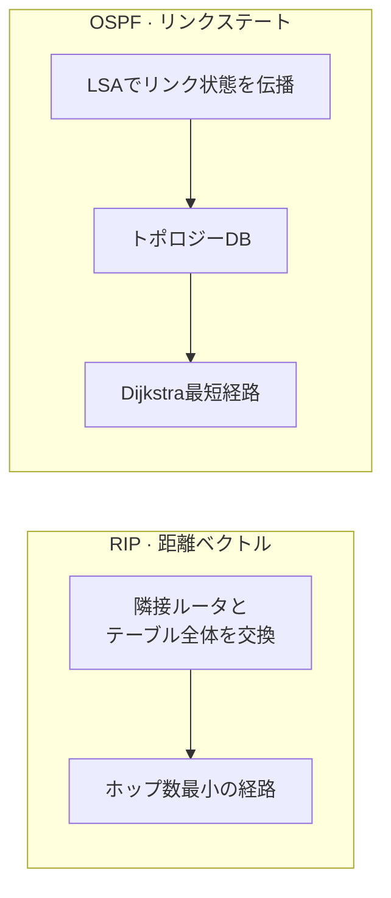

# RIP vs OSPF (ルーティングプロトコルの比較)

## 1. 概要

### A. 定義
> **RIP**(Routing Information Protocol)は宛先までのホップ数を基準に経路を決定する **距離ベクトル(Distance Vector)** 方式、**OSPF**(Open Shortest Path First)は全体のトポロジーを把握して最短経路を計算する **リンクステート(Link State)** 方式の代表的なIGP(内部ゲートウェイプロトコル)である。

両プロトコルは同じ目的(自律システム内部の経路決定)を、正反対の情報モデルで解決する。RIPはルータが自分の隣接ルータから知らされた距離情報だけを信じて経路を決める「**噂ベース**」であり、OSPFはすべてのルータが全体の地図を共有したうえでそれぞれ計算する「**地図ベース**」である。この根本的な違いが、収束速度・拡張性・リソース使用におけるあらゆる格差を生み出す。

### B. 登場背景および必要性
初期の小規模ネットワークでは、設定が単純なRIPで十分であった。しかしRIPは、最大15ホップまでしか到達できない(16=無限大)という **規模の限界** と、30秒周期でテーブル全体をやり取りするため障害の伝播が遅い **収束遅延** のために、大規模ネットワークではルーティングループと遅延が深刻になった。特にリンクが一つ切断された際に「隣接ルータを経由して迂回できる」という誤った情報が相互にフィードバックされ、ホップ数が徐々に増加していく **カウント・トゥ・インフィニティ(Count-to-Infinity)** 問題が慢性的であった。これを克服し、大規模で拡張性のあるルーティングを提供するために、リンクステート方式のOSPFが登場した。

## 2. 動作方式

RIPは周期的に隣接ルータとルーティングテーブル全体を交換し、各宛先についてホップ数が最も少ない経路を選択する(ベルマン-フォード)。この方式ではルータが全体構造を知らないまま隣接ルータの情報のみに依存するため、誤った情報が広がりやすい。一方OSPFでは、各ルータが自身のリンク状態を **LSA(Link State Advertisement)** として全体に伝播させ、すべてのルータが同一の **トポロジーDB(地図)** を構成したうえで、**ダイクストラ(SPF)アルゴリズム** によってそれぞれ最短経路を計算する。

メトリックの違いも本質的である。RIPは **ホップ数** のみを見るため、1Gbpsの3ホップより10Mbpsの2ホップを優先するという不合理な選択をし得るのに対し、OSPFは **帯域幅ベースのCost** を用いるため、実際の性能が良い経路を選ぶ。

## 3. 比較表

下表のすべての違いは、結局「隣接ルータだけを知っているのか、全体を知っているのか」から派生する。全体トポロジーを知るOSPFは、障害時に変更分(LSA)のみを即座に配布して迅速に収束し、実際の帯域幅で経路を最適化するが、その分だけ計算・メモリの負担が大きい。

| 区分 | RIP | OSPF | 違いの原因 |
|---|---|---|---|
| **アルゴリズム** | 距離ベクトル(Bellman-Ford) | リンクステート(Dijkstra/SPF) | 情報モデルの違い |
| **メトリック** | ホップ数 | 帯域幅ベースのCost | 経路の最適性 |
| **最大規模** | 15ホップ(16=無限) | 事実上無制限(Area) | ループ抑制方式 |
| **収束速度** | 遅い(周期交換) | 速い(変更時に即時LSA) | 更新方式 |
| **アップデート** | 30秒周期でテーブル全体 | 変更時のイベント駆動型差分 | 帯域効率 |
| **適用規模** | 小規模 | 中・大規模 | 拡張性 |
| **ループ防止** | Split Horizon・Hold-down | Area階層構造 | 構造的アプローチ |

## 4. ループ防止・安定化手法

RIPは全体構造を知らないという生来の弱点のため、ループ防止を **複数の補助手法** で補っている。学習した経路をその方向へ広告し返さない **Split Horizon**、切断された経路を無限大として広告して迅速に無効化する **Route Poisoning**、変更直後の一定時間は更新を保留する **Hold-down**、変更を即座に通知する **Triggered Update** がそれである。一方OSPFは、そもそも全体の地図を共有するためループが生じにくく、大規模環境では **Area階層** によってLSAの伝播範囲を分割し、マルチアクセス区間では **DR/BDR** を選出してLSA交換の急増を抑制する。

| プロトコル | 手法 |
|---|---|
| **RIP** | Split Horizon, Route Poisoning, Hold-down, Triggered Update |
| **OSPF** | Area階層(Backbone Area 0)、DR/BDRによるLSA最小化 |

## 5. 考慮事項および示唆
技術士の観点から見ると、選択基準は明確である。ルータ数が少なく単純なネットワークでは、設定・保守が容易なRIPが依然として有効であるが、拡張性・迅速な収束・経路最適化が必要であればOSPFが正解である。たとえばキャンパス網や中堅企業網では、OSPFの **Area分割** によって拡張性と安定性を確保しつつ、すべてのAreaが **Backbone Area 0** を中心に接続されるよう設計するのが定石である。ただし、一つの自律システム内部を超えた **異なる組織(AS)間** のルーティングはIGPではなく、パスベクトル方式の **BGP(EGP)** が担うため、実際の大規模ISPバックボーンは内部のOSPFとAS間のBGPを組み合わせて運用している。すなわち、RIP・OSPF・BGPは代替財ではなく、**適用階層の異なる相互補完関係** として理解すべきである。

---

> **一言まとめ**: RIPは *隣接ルータの情報に依存するホップ数ベースの距離ベクトル方式で単純だが、15ホップ制限・遅い収束* という弱点を持ち、OSPFは *全体トポロジーの共有 + Dijkstraによる迅速な収束・帯域幅最適化・拡張性(Area)* を提供して大規模ネットワークに適しており、AS間はBGPと組み合わせて運用する。
