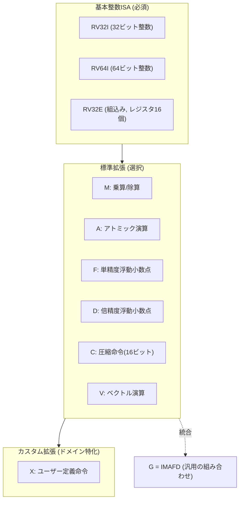
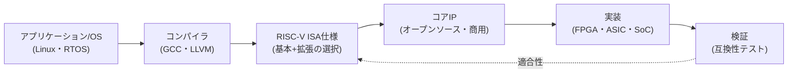

# RISC-V(オープン命令セットアーキテクチャ)

## 1. 概要

### A. 定義
> **RISC-V**(リスクファイブ)とは、UCバークレーで始まりRISC-V Internationalが管理する **オープン(Royalty-free)な命令セットアーキテクチャ(ISA, Instruction Set Architecture)** であり、誰でもライセンス費用なしにプロセッサを設計・製造・販売できるよう標準化された、縮小命令セット(RISC)ベースのISAである。

ISAはソフトウェアとハードウェアが出会う契約(Contract)である。コンパイラが生成する機械語命令の種類・レジスタ・アドレッシング方式・例外処理の規約を規定し、この契約が安定していてこそ、その上にコンパイラ・オペレーティングシステム・アプリケーションが積み上がる。問題は、これまでこの「契約書」がx86(Intel・AMD)やArmのように **特定企業の私有資産** であったことである。他社が互換チップを作るには莫大なライセンス料を支払うか、そもそもアクセスできなかった。RISC-Vはこの契約書そのものを **公開標準(オープンソースにたとえれば「仕様」がオープン)** とし、ISAを特定ベンダーではなくコミュニティの共有資産へと転換した。

### B. 登場背景および必要性
RISC-Vが注目される背景には、三つの流れがある。第一に、**ライセンス費用とロックイン(Lock-in)の負担** である。Armコアを使うにはアーキテクチャ・コアのライセンスとロイヤルティが必要であり、設計の自由度も制約される。スタートアップ・学界・特定ドメインのチップ開発者にとって、この参入障壁は非常に高かった。第二に、**ドメイン特化アーキテクチャ(DSA, Domain-Specific Architecture)の台頭** である。ムーアの法則の鈍化により汎用CPUの性能向上が限界に達すると、AI・ネットワーキング・ストレージのようにワークロードに合わせたカスタム・アクセラレータが必要になったが、RISC-Vは基本命令に **カスタム命令を自由に追加** できるため、この要求に的確に合致する。第三に、**技術主権(Sovereignty)とサプライチェーンの安定性** である。米中の技術対立と半導体サプライチェーンの再編の中で、特定国・特定企業に依存しないオープンISAは、国家・企業レベルの戦略的代替案として浮上した。これらの必要性が噛み合い、RISC-Vは組込みからデータセンター・自動車に至るまで急速に採用されている。

## 2. 設計思想とアーキテクチャ構造

RISC-Vの中核的な設計思想は、**小さく安定した基本命令セット(Base)** の上に **選択的な拡張(Extension)** をモジュールのように載せることである。これは「必要なものだけを選んで搭載する」という発想であり、超小型IoTコントローラからサーバ級プロセッサまでを一つのISA系列でカバーすることを可能にする。

基本ISAは、整数演算のみを含む **RV32I / RV64I**(それぞれ32・64ビット)と、レジスタ数を減らした超小型向けの **RV32E** に分かれる。この基本セットは40余りの命令で非常に小さく、**一度確定すると永久に固定(Frozen)** され、後方互換性を保証する。ここに **標準拡張** をアルファベットで付加する。乗算・除算(M)、アトミック演算(A)、浮動小数点(F/D)、16ビット圧縮命令(C)などであり、よく使われる組み合わせであるIMAFDをまとめて **G(General)** と表記する。たとえば`RV64GC`は「64ビット + 汎用 + 圧縮」をサポートするプロセッサを意味する。

特に重要なのが **カスタム拡張(X拡張)** である。標準が予約した命令エンコーディング空間を活用し、設計者が独自の命令を追加できる。たとえばAI推論チップは行列積命令を、暗号アクセラレータはAESラウンド命令を直接定義し、性能・電力効率を大きく高める。この拡張性こそが、RISC-Vを単なる「無料のArm代替品」ではなく、**ドメイン特化コンピューティングのプラットフォーム** とする中核的な差別化要素である。

### A. 特権アーキテクチャ(Privileged Architecture)と実行モード
オペレーティングシステム・ハイパーバイザが動作するには、ISAが権限階層を規定しなければならない。RISC-Vはこれを別途の **特権アーキテクチャ仕様** として分離して定義している。

| モード | 略称 | 用途 |
|---|---|---|
| **Machine** | M | 最高権限、ファームウェア・ブートローダ、すべての実装で必須 |
| **Supervisor** | S | OSカーネル(Linuxなど)、仮想メモリ管理 |
| **User** | U | アプリケーションプログラム |
| **Hypervisor** | HS | 仮想化拡張(H)、ゲストOSの運用 |

最も単純なマイクロコントローラは **Mモードのみ** を備えればよく、Linuxを動かすアプリケーションプロセッサはM・S・Uの3モードを、仮想化が必要なサーバはこれにH拡張を加える。このように必要な特権階層のみを選択的に実装する構造により、RISC-Vの拡張性の思想は特権領域においても貫かれている。起動時には、Mモードのファームウェア(OpenSBIなど)がハードウェアを初期化し、上位のブートローダ(U-Boot)・カーネルへ制御を渡す **SBI(Supervisor Binary Interface)** 規約を通じて、OSの移植性を確保する。

## 3. エコシステムと開発フロー

ISAだけでは製品にはならない。コンパイラ・オペレーティングシステム・検証ツール・IPコアが揃ってはじめて、実質的なエコシステムが形成される。RISC-VはGCC・LLVMコンパイラ、Linuxカーネル、FreeRTOS/ZephyrのようなRTOSをすでにサポートしており、商用・オープンソースのコアIPが幅広く流通している。

開発者は目標とするワークロードに合わせて **基本 + 必要な拡張の組み合わせ** を選び、それに合ったコアIPを選択するか自ら設計したうえで、FPGAで検証し、ASIC/SoCとして量産する。このとき異なる拡張の組み合わせが乱立するとソフトウェアの断片化が生じるため、RISC-V Internationalはよく使われる拡張をまとめた **プロファイル(Profile、例: RVA23)** と **プラットフォーム規格** を標準化し、「どのLinuxディストリビューションもどのRISC-Vチップでも動作する」よう相互運用性を保証している。代表的なオープンソースコアとしてはバークレーのRocket・BOOM、低消費電力向けのIbexなどがあり、商用ではSiFive・AndesなどがIPを供給している。

## 4. 他ISAとの比較および適用事例

RISC-Vの位置付けを理解するには、x86・Armとの違いを **技術的特性ではなくビジネスモデルの違い** として捉えるのが正確である。x86はIntel・AMDが事実上独占するCISC系列で、PC・サーバ市場において強力なソフトウェア資産を持つが閉鎖的である。ArmはRISC系列でモバイルを席巻し、ライセンス事業によって広範なエコシステムを構築したが、依然としてロイヤルティと設計上の制約が伴う。RISC-Vは **ISAそのものが無料・オープン** であるという点で根本的に異なり、これこそが成熟度(ソフトウェア・ツールチェーン)の劣勢を甘受してでも採用される理由である。

| 区分 | x86 | Arm | RISC-V |
|---|---|---|---|
| 系列 | CISC | RISC | RISC |
| ライセンス | 閉鎖(事実上の独占) | 有料ライセンス・ロイヤルティ | **オープン・無料** |
| 拡張/カスタム | 不可 | 限定的 | **自由(X拡張)** |
| 主な市場 | PC・サーバ | モバイル・組込み | 組込み→全領域へ拡散 |
| エコシステムの成熟度 | 非常に高い | 高い | 成長中 |

実際の適用は、低消費電力の組込み分野から先に広がった。たとえば大手半導体企業は、SoC内部の **管理用マイクロコントローラ・ストレージコントローラ** をRISC-Vに置き換えてロイヤルティを削減し、Western Digitalは自社のストレージ製品に独自のRISC-Vコアを大量に適用すると表明したことがある。AIアクセラレータ分野では、カスタムのベクトル・行列命令を載せたRISC-V制御コアが活用されており、自動車・宇宙など信頼性が重要な領域や国家主導のプロセッサ開発プロジェクトでも採用が増えている。ただし、デスクトップ・汎用サーバのように **膨大な既存ソフトウェアとの互換性** が決定的な市場では、依然としてx86・Armの壁が高く、参入は段階的に進んでいる。

## 5. 深化: 最新動向と標準化の課題

RISC-Vの最近の焦点は、「組込み向けのニッチ」から「アプリケーションプロセッサ・データセンター級」へと上り詰めるための **標準プロファイルの整備** にある。アプリケーションプロセッサ向けのRVA22・RVA23プロファイルが確定し、Linux・Androidなどの上位ソフトウェアが要求する拡張(ベクトルV、仮想化H、ビット操作Bなど)を必須としてまとめることで、断片化を抑制している。また **ベクトル拡張(V)** は、データ並列ワークロード(AI推論・メディア)において性能を左右する中核であり、長さ可変型(Vector-length agnostic)の設計を採用して、同一バイナリが様々なベクトル幅のハードウェアで動作するようにした。

同時に、オープン性に起因する課題も浮き彫りになっている。**断片化(Fragmentation)** のリスクは、拡張を自由に組み合わせられるという長所の裏面であり、プロファイル・プラットフォーム標準で制御できなければ「同じRISC-Vなのにソフトウェアが動かない」という問題が生じる。地政学的には、オープンISAが輸出規制を回避する経路になり得るという懸念と、逆に特定陣営に依存しない中立的な基盤であるという期待が共存している。セキュリティ面では、カスタム拡張が未検証のハードウェア脆弱性を持ち込む可能性があるため、**信頼実行環境(TEE)・物理攻撃対策** の標準化が進められている。

## 6. 考慮事項および示唆

技術士の観点から、RISC-Vの導入・戦略策定にあたっては次の点を総合的に判断しなければならない。

- **適用戦略(段階的採用)**: 全面的な移行よりも、SoC内部の補助コア・コントローラなど **ソフトウェア互換性の負担が少ない領域** から導入してロイヤルティを削減し、能力を蓄積したうえで、アプリケーションプロセッサ・アクセラレータへと拡大する段階的ロードマップが現実的である。
- **トレードオフ(自由度 vs 成熟度)**: 拡張・カスタムの自由は強力であるが、ツールチェーン・検証・ソフトウェアエコシステムの成熟度はx86・Armにまだ及ばない。開発・検証コストと、削減されるロイヤルティ・確保される差別化価値とを定量的に比較して意思決定すべきである。
- **断片化の管理**: 独自のカスタム拡張を乱発すると、ソフトウェアの保守コストが急増する。**標準プロファイルの準拠** を原則とし、カスタムは性能が決定的なホットスポットに限定するガバナンスが必要である。
- **技術主権・サプライチェーンの観点**: オープンISAは特定ベンダーへの依存を減らす戦略的手段であるが、実際のチップ製造は依然としてファウンドリ・EDA・IPに依存しているため、ISAのオープン化だけで完全な自立が実現するわけではないことを冷静に認識しなければならない。
- **展望**: ムーアの法則の鈍化とドメイン特化コンピューティングの拡散という大きな流れの上で、RISC-Vは組込み・AIアクセラレーション・自動車を中心に採用が加速する見通しであり、プロファイルの標準化が進むほど、アプリケーションプロセッサ・サーバ領域への拡大も本格化すると予想される。

## 参考資料
- RISC-V International, "RISC-V Specifications", https://riscv.org/technical/specifications/
- RISC-V International, "RVA23 Profile", https://riscv.org/announcements/2024/10/risc-v-rva23-profile-is-now-ratified/

---
> **一言まとめ**: RISC-Vは、小さく固定された基本整数ISAの上に標準・カスタム拡張をモジュールのように載せるオープンかつ無料の命令セットであり、ライセンス依存からの脱却とドメイン特化コンピューティングを可能にし、組込みからAI・サーバにまで広がりつつある戦略的アーキテクチャである。
