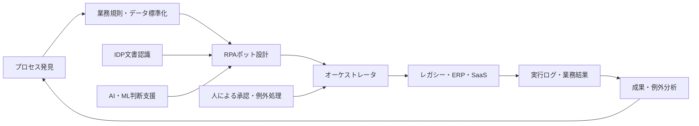
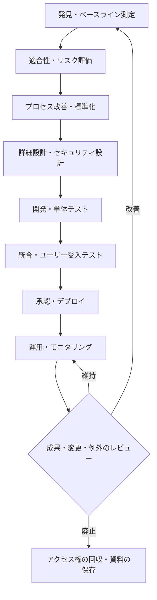

# RPA(ロボティック・プロセス・オートメーション)とインテリジェント業務自動化(IPA)

## 1. 概要

### A. 定義

> RPA(Robotic Process Automation)とは、人が複数の業務システムの画面・ファイル・APIを行き来しながら行っていた反復作業を、ソフトウェアロボット(bot)が定められた規則に従って実行するようにする自動化方式である。

> IPA(Intelligent Process Automation)とは、RPAを中心に、プロセスマイニング、IDP(Intelligent Document Processing)、人工知能・機械学習、自然言語処理とオーケストレーションを組み合わせ、認識・判断・実行・学習を連結する業務自動化体系である。

RPAの核心は、人を模倣する技術そのものではなく、業務規則を実行可能な手順として明示し、その実行を反復可能かつ監査可能な形にすることにある。
したがって、画面の座標をクリックする単純なマクロとしてのみ理解すると、対象業務が変わったときに保守が急激に難しくなる。
業務の入力、規則、例外、承認、結果、責任主体をまず定義したうえで、ロボットを配置しなければならない。

RPAボットは一般に、アプリケーションのユーザーインタフェース、ファイル、メール、データベースまたはAPIを通じて作業する。
APIが安定して提供されていれば直接連携のほうが画面自動化より堅牢であるが、古いレガシーシステムのようにAPIがない、あるいは変更が難しい場合には、画面自動化が現実的な補完手段となる。
ただし画面自動化はレイアウトや識別子の変更に脆弱であるため、長期的な目標は標準APIとイベント駆動型連携へ移行することでなければならない。

### B. 登場背景と必要性

企業や公共機関の業務は、ERP、グループウェア、電子決裁、顧客管理、税務・調達システムのように、互いに異なるシステムに分散している。
業務担当者は同じ顧客番号や金額を複数の画面に繰り返し入力し、添付ファイルをダウンロードして名前を変え、規則に合わない案件を再び人に回付する。
このような作業は、付加価値の高い判断よりも待機・コピー・検証に時間を費やさせ、入力ミスや漏れを蓄積させる。

RPAは既存システムを即座に置き換えることなく業務フローの一部を自動化するという点で、レガシー近代化の中間戦略となり得る。
しかし自動化には、悪いプロセスを高速に繰り返すというリスクもある。
手作業時代の不要な承認、重複入力、曖昧な責任がそのまま残れば、ボットの数だけが増え、全体の処理品質は改善されない。
したがって、プロセス改善、データ標準化、システム連携という先行課題とRPAをあわせて設計しなければならない。

### C. 目標と期待効果

第一に、反復入力を減らして処理時間と運用コストを下げる。
第二に、同一の規則を一貫して適用し、漏れや単純な入力ミスを減らす。
第三に、すべての実行・例外・承認をログに残し、監査性と追跡性を高める。
第四に、職員がコピー・照合業務から解放され、顧客対応や例外判断に集中できるようにする。
第五に、自動化候補をデータで発掘し、成果を継続的に測定する運用体制を作る。

効果は単にボットの処理件数で評価してはならない。
実際のベースラインとしては、人がかかる時間、待機時間、手戻り率、エラー率、例外率、顧客への影響、統制コストをあわせて測定しなければならない。
たとえば月10,000件を処理する業務で1件あたり4分短縮されても、例外レビューが新たに1分発生するのであれば、純削減時間は4分ではない。
自動化前後のバリューチェーン全体を比較してはじめて、投資判断が歪まない。

## 2. 中核概念と範囲

### A. RPAの構成要素

RPAは開発ツールだけでは完成しない。
業務を発見し設計する分析領域、ボットパッケージを作る開発領域、実行を配分する制御領域、秘密情報と権限を管理する統制領域がともに必要である。

| 構成要素 | 主な役割 | 技術士の観点での管理ポイント |
|---|---|---|
| ボット開発ツール | 作業順序・条件・例外をワークフローとして実装 | 再利用コンポーネント、構成管理、コードレビュー |
| 実行ロボット | attendedまたはunattended方式で業務を遂行 | 分離、容量、同時実行性、障害復旧 |
| オーケストレータ | デプロイ・スケジュール・キュー・状態・権限を集中管理 | 単一障害点、監査ログ、職務分離 |
| 資格情報保管庫 | アカウント・トークン・証明書の安全な保存と注入 | ハードコーディング禁止、ローテーション、最小権限 |
| プロセス・業務キュー | 案件ごとの入力、優先度、リトライ、手動移管の管理 | 重複処理の防止、冪等性、SLA |
| モニタリング | 成功・失敗・遅延・例外とリソースの観測 | アラート基準、原因分析、KPIとの連携 |

ボット開発ツールは業務規則を読みやすいフローとして表現するが、視覚的であるというだけで品質が保証されるわけではない。
条件の優先順位、データ形式、タイムアウト、リトライ回数、例外の責任者を明示してはじめて、運用者が意図を再現できる。
実行ロボットはユーザーの権限を代わりに行使するため、一般のサーバと同様にパッチ・バックアップ・アクセス制御を適用しなければならない。

オーケストレータは中央制御室に相当する。
ここでロボットの予約実行とバージョンのデプロイ、作業キューの分配、実行結果と監査記録を管理する。
集中化は統制性と可視性を高めるが、オーケストレータの障害が多数のボットの実行を止め得るため、冗長化と復旧手順を設計しなければならない。

### B. RPAとIPAの概念図

上記の構造において、プロセス発見は自動化する作業を決める段階であり、ボット設計は発見された業務を統制可能な実行単位に変える段階である。
実行結果が再び発見・分析へ戻ってはじめて、自動化は一回限りの開発ではなく改善サイクルとなる。
IDPはPDF・画像・メールから構造化された値を抽出し、AI・MLは分類や予測を支援する。
しかし、モデルの確率的な結果をそのまま確定処理に用いるとエラーが伝播するため、信頼度のしきい値と人によるレビュー経路が必要である。

### C. RPA、IPA、BPM、API連携の区別

RPAは、既存アプリケーションの上で人の操作をソフトウェアで代替する戦術的自動化に近い。
BPMは業務規則・組織・承認・状態をプロセスモデルとして管理する運用フレームであり、RPAはその一部の作業を遂行する実行手段となり得る。
API連携はシステムが提供する契約を通じてデータを交換するため、画面の変化に影響されにくく、長期的な保守性が高い。
IPAは、これらの自動化手段に文書理解とAIによる判断支援を組み合わせた上位概念として説明できる。

| 区分 | RPA | BPM/ワークフロー | API・サービス連携 | IPA |
|---|---|---|---|---|
| 主な対象 | 反復的なタスク | プロセス全体と承認 | システム間のデータ・機能 | 認識・判断・実行が混在する業務 |
| 判断方式 | 明示的な規則 | モデル化された規則・状態 | サービス契約 | 規則 + AI支援 + 人の判断 |
| 強み | 迅速な導入、レガシー対応 | 責任とフローの標準化 | 堅牢性・性能・再利用性 | 非定型入力と複合業務への対応 |
| 主な限界 | 画面変更・例外の増加 | 構築範囲と変更コスト | API開発が先行して必要 | 説明可能性・バイアス・検証負担 |

違いは優劣ではなく、問題の境界から生じる。
画面ベースで複数のシステムを連結する必要があり、業務規則が安定していればRPAが迅速な解決策である。
反対に、大量・高頻度の取引を長期間運用し、システムを統制できるのであれば、API連携のほうが適している。
業務全体の承認と責任を変えるには、BPMを中心に置き、RPAを周辺のアダプタとして配置するほうが安全である。

## 3. 自動化対象の選定とライフサイクル

### A. 候補の発掘と優先順位付け

自動化候補は現場へのインタビューだけで決めず、プロセスログ、処理量、業務時間、エラー・差し戻しの記録をあわせて分析する。
プロセスマイニングは実際のイベントの順序とバリエーション経路を示し、文書上の標準手順と実際の手順との差異を明らかにする。
タスクマイニングは個人の画面操作を観察できるが、個人情報や監視に対する誤解を減らすための目的・保管・アクセスのポリシーを先に整備しなければならない。

良い初期候補は、処理量が多く、規則が明確で、入力形式が安定しており、例外が少ない。
反対に、人による交渉、創造的判断、組織ポリシーの解釈が核心となる業務は、完全自動化よりも意思決定支援を優先して検討する。
業務が月末にのみ集中し、ソースデータが不正確であれば、ボット開発よりもデータ品質とスケジュールの平準化が先である。

優先順位は、期待便益、実装難易度、変化リスク、規制上の機微性、再利用性をスコア化して決定する。
たとえば便益40%、技術的容易性25%、統制可能性20%、戦略適合性15%で重み付けし、5段階で評価することができる。
重みは組織の目標によって変わるため、絶対的な公式ではなく、合意可能な意思決定の記録として活用すべきである。

### B. 自動化のライフサイクル

発見段階では、現行の処理量と成功・失敗・例外のベースラインを記録する。
設計段階では、正常フローよりも例外フローを先に描かなければならない。
入力ファイルがない、あるいは重複している場合にどうするか、システムが遅い、あるいは認証が期限切れの場合にどこまでリトライするか、人がいつ介入するかを設計する。

開発とテストでは正常データだけを使わず、境界値、エンコーディングエラー、権限不足、重複イベント、部分的成功を再現する。
本番デプロイ前には、業務オーナーとセキュリティ・監査担当者が結果と統制の証跡を確認しなければならない。
運用中は単純な成功率だけでなく、例外キューの滞留時間と手動切り替え率を管理し、ソースシステムの変更が検知されれば影響分析を実施する。

### C. 運用モデルと責任

企業レベルの運用では、中央のCoE(Center of Excellence)と現場・ITによる連邦型モデルが一般的である。
CoEはプラットフォーム標準、再利用資産、セキュリティ基準、開発方法論と教育を管理する。
現場はプロセスの目的と例外規則を所有し、ITはインフラ・連携・デプロイ・障害対応を担当する。
監査・セキュリティ組織は、リスク等級に応じた承認とログ保存の基準を提示する。

RACIを明確にしなければ、ボットが失敗したときに業務担当者とプラットフォーム運用者が互いに責任を押し付け合う。
プロセスオーナーは結果の業務上の正確性に責任を負い、ボットオーナーは自動化ロジックと変更履歴に責任を負う。
プラットフォーム運用者は実行環境と容量に責任を負い、セキュリティ担当者はアカウント・権限・秘密情報・監査統制を検証する。

## 4. 技術アーキテクチャと実装原理

### A. 実行方式

Attended RPAは、ユーザーが作業を開始または承認する時点で補助的に実行される。
オペレーターが顧客情報を複数の画面に入力する際に、照会・コピー・検証を任せる方式が代表的であり、人がリアルタイムで例外を判断する。
この方式は統制が容易である反面、ユーザーのセッションや端末の状態に影響を受け、処理量の拡張に限界がある。

Unattended RPAでは、中央のスケジューラが仮想マシンやコンテナ型の実行環境にボットを割り当てる。
大量バッチ、夜間の照合、定期レポートの生成のように、業務規則が安定しており人の即時介入が少ない対象に適している。
一方で、権限の大きいボットアカウントが複数のシステムを自動的に操作するため、秘密情報・ネットワーク・実行イメージの分離が必須である。

### B. データと例外処理

業務キューの各項目には、一意の業務キー、入力時刻、優先度、現在の状態、リトライ回数、結果コードがなければならない。
一意キーがなければ、ネットワークの再送やスケジューラの再実行時に同一取引を二度処理する可能性がある。
したがって処理ステップは可能な限り冪等にし、外部システムへ記録する前後の状態を保存しなければならない。

例外はシステム例外と業務例外に分ける。
接続切断・タイムアウト・ファイルロックは一定回数の指数バックオフによるリトライで回復できるが、金額の不一致・資格要件の未充足は繰り返しても解決しないため、人によるレビューキューへ送る。
すべての例外をリトライすると障害を増幅させ業務キューを詰まらせるため、エラーの分類と隔離の基準が必要である。

ログには入力・決定・出力の流れを残すが、住民登録番号、口座番号、健康情報のような機微情報をそのまま残してはならない。
ログの相関IDによって1件の処理フローを追跡し、原文の代わりにマスキング・ハッシュ・トークン化した値を使用する。
保存期間と閲覧権限も、業務目的と法的要件に合わせて制限する。

### C. セキュリティ統制

ボットは人ではなくても、組織の資産にアクセスする非人間の主体である。
ボットごとに固有のアカウントを付与し、共有アカウントの使用を避け、必要なアプリケーションと機能のみを最小権限で許可する。
資格情報はコード・設定ファイル・ログに保存せず、専用の保管庫から実行時に注入し、退職・業務変更・インシデント時には即座に回収できなければならない。

開発・テスト・本番環境を分離し、本番データの無断複製を禁止する。
ボットパッケージには承認済みのバージョンとハッシュを付与し、デプロイ担当者を開発者と分離して変更の二重統制を適用する。
実行イメージと依存ライブラリはパッチ適用状況を点検し、外部ファイルを処理するボットには、悪性ファイル・マクロ・圧縮爆弾に対する制限を設ける。

AIを含むIPAでは、別のリスクが発生する。
文書分類や抽出の結果が誤っている可能性があり、プロンプト・モデル・学習データの変更が結果を変え得る。
モデルのバージョン、入力の出所、信頼度、人による承認の有無を記録し、信頼度の低い結果は自動確定しない、人間によるレビューを組み込む(HITL)ポリシーを設ける。

## 5. 比較と適用事例

### A. 画面自動化とAPI自動化の比較

画面自動化には、レガシーを迅速に連結できるという長所がある。
たとえば外部サプライヤーの古いクライアントにAPIがない場合、ボットが画面を操作すれば、システムの入れ替えを待たずに業務を改善できる。
しかし、ボタンの位置やポップアップの文言が変わると失敗し得るため、変更管理と回帰テストのコストが発生する。

API自動化は契約されたフィールドとエラーコードを使用するため、大量処理とリトライ、可観測性に優れる。
その代わり、API開発・承認・バージョン管理という先行投資が必要であり、内部システムを変更する権限がなければ短期間での適用は難しい。
したがって、短期的にはRPAでボトルネックを緩和し、長期的には利用量と障害のデータを根拠にAPI連携へ移行する段階的戦略が合理的である。

### B. 事例1: 購買請求書の照合

仮想の製造企業A社が毎月12,000件の請求書を受け付け、担当者がPDFから金額を読み取ってERPと購買契約を照合していると仮定する。
従来は1件あたり平均5分かかり、合計1,000時間が必要であり、金額の不一致や漏れのある案件は約8%であった。
この数値は実際の企業統計ではなく、自動化の妥当性評価を説明するための仮定である。

IPAは、メールの添付ファイルを収集し、IDPでサプライヤー・契約番号・金額を抽出した後、RPAがERPと契約データを照会するように設計する。
信頼度が98%以上で金額が契約の許容範囲内であれば自動照合し、それ以外の案件は原文と根拠フィールドを含めて担当者キューへ送る。
処理前にファイルのハッシュと業務キーを保存すれば、同一文書の重複処理を防ぐことができる。

仮定上、自動確定の80%が1件あたり1分、残りの20%が人によるレビューで1件あたり6分であれば、総所要時間は12,000×0.8×1分 + 12,000×0.2×6分で2,400分である。
ベースラインの60,000分と比較すると純粋な処理時間は57,600分減少するが、IDPのライセンス・運用・例外レビューのコストをあわせて差し引いてはじめて純便益となる。
成果指標は時間の削減だけでなく、照合の正確度、例外キューの平均滞留時間、重複防止率、監査証跡の完全性で構成する。

### C. 事例2: 公共の苦情受付の支援

仮想の公共機関Bが、1日2,000件の苦情メールをテーマ別の部署に振り分けていると仮定する。
分類モデルは件名・本文・添付の種類を用いて候補部署を提示し、RPAが苦情管理システムに受付番号とメタデータを登録する。
機微情報が含まれている場合や分類の信頼度がしきい値未満の場合は自動振り分けを停止し、担当者の確認を求める。

この事例の核心は、自動処理率を最大化することではない。
誤った部署へ振り分けると法定の処理期限や市民の権利行使に影響を与え得るため、説明可能な分類根拠と異議・修正の経路を保証しなければならない。
モデルの更新後には過去のサンプルで再現テストを行い、部署別の誤分類率が特定の類型に偏っていないかを点検する。

RPAは受付画面への入力と通知の送信を担当し、AIは分類候補を生成し、人は権利・責任に影響する例外を承認する。
このように役割を分離すれば、自動化のスピードと行政上の責任を同時に管理できる。

## 6. 深化: エンタープライズ自動化のガバナンスと発展方向

米国GSAのRPAセキュリティ手順は、ボットをネットワークや対象アプリケーションにアクセスする一般ユーザーと同様に扱い、attendedとunattendedの実行環境を区別している。
また、AI・MLを使用するボットには別途の承認とセキュリティ統制のレビューが必要であるという方向性を示している。
これは、ボットを単なるマクロではなく権限を持つ運用主体と捉え、ライフサイクル統制を適用すべきであるという実務的な示唆を与える。

GSA・Digital.govのRPA資料は、プログラム導入において明確な計画、協働、プロセス改善、バランスの取れたガバナンスと目的に適した技術選択を強調している。
したがって自動化CoEはツールの教育を提供するだけでなく、候補の発掘、リスク等級、例外設計、成果検証を標準化しなければならない。

RPAの発展は、単純な画面操作の拡張ではなく、プロセスのインテリジェント化へと移行している。
プロセスマイニングが実際のフローを発見し、IDPが非定型文書を構造化し、AIが分類・予測を支援し、RPAまたはAPIが結果を実行する。
この過程でモデルと規則の境界を明確にしなければ、責任の所在と検証方法が曖昧になる。

今後は、イベント駆動型連携とAPIが主要な実行経路となり、RPAはレガシーとの接点と人の支援に集中するハイブリッド構造が望ましい。
自動化候補を作る段階から、API移行の可能性、データ標準化の水準、システム変更の影響度をあわせて記録すれば、一時的な自動化が構造的な技術的負債として固定化することを防げる。

## 7. 考慮事項および示唆

### A. プロセス再設計の優先

現在の手順をそのままボットに複製する前に、不要な承認と重複入力を除去する。
改善された標準プロセスと例外定義があってはじめて、自動化ロジックが安定する。

### B. セキュリティ・個人情報保護

ボットアカウントは、最小権限・固有の識別・定期的な回収の原則で管理する。
機微情報は処理目的と保存期間を制限し、ログ・スクリーンショット・学習データにおいてマスキングする。

### C. 信頼性と復旧

タイムアウト・重複・部分的成功を前提として、冪等性、リトライ、補償処理、手動切り替えを設計する。
オーケストレータと実行環境の障害時におけるRTO・RPO、キューの保全、再処理の順序をテストしなければならない。

### D. AI結合の統制

モデルの信頼度とエラーの類型を測定し、法的・財務的な影響を持つ決定には人による承認を置く。
モデル・プロンプト・データセット・規則のバージョンを記録し、結果がなぜ変わったのかを説明できなければならない。

### E. 運用成果と経済性

自動化率だけを目標とせず、純処理時間、例外率、手戻り率、品質、ユーザー満足度、統制コストをあわせて見る。
パイロットの終了基準と廃止基準をあらかじめ定め、成果のないボットが維持され続けないようにする。

### F. 標準化と技術的負債

再利用可能なコネクタ、命名規則、エラーコード、ログスキーマ、テストデータとデプロイパイプラインを標準化する。
画面依存のボットについてはAPI・イベント・業務サービスへ移行する候補と期限を管理し、自動化ポートフォリオの長期的な健全性を確保する。

### G. 変革管理と人間中心の設計

ボットの導入は人員削減だけでなく、役割の再設計と統制責任の変化でもある。
現場を設計・検証・例外処理に参画させ、自動化の失敗を隠さない運用文化を作ってはじめて、持続可能な成果が生まれる。

## 参考資料

- U.S. General Services Administration, *IT Security Procedural Guide: Robotic Process Automation (RPA)*: https://www.gsa.gov/system/files/Robotic-Process-Automation-%28RPA%29-Security-%5BCIO-IT-Security-19-97-Rev-3%5D-02-14-2023.pdf
- Digital.gov / GSA, *Guide to robotic process automation*: https://digitalgovernmenthub.org/library/guide-to-robotic-process-automation/
- IEEE, *IEEE Std 2755-2017 Guide for Terms and Concepts in Intelligent Process Automation*: https://standards.ieee.org/standard/2755-2017.html
- ACT-IAC, *RPA Product Survey Report*: https://www.actiac.org/system/files/RPA%20Product%20Survey%20Report_1.pdf

---

> **一言まとめ**: RPAは反復業務を実行するロボットであり、IPAはプロセス発見・文書理解・AIによる判断・人による承認・自動実行をガバナンスとともに連結する業務革新の体系である。
