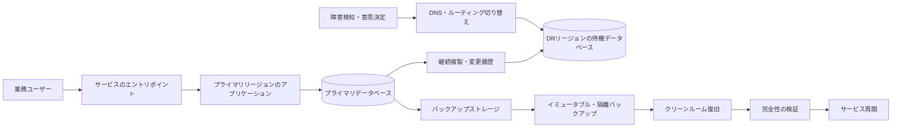
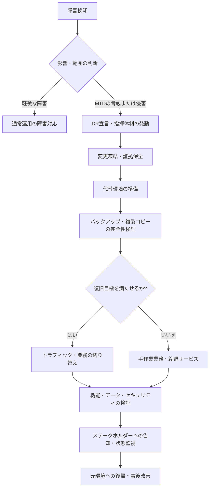

# RPO・RTO・MTTRに基づく災害復旧(Disaster Recovery)戦略

## 1. 概要

> 災害復旧(Disaster Recovery, DR)とは、自然災害・障害・サイバー攻撃・人的ミスなどによって情報システムが停止したりデータが毀損したりした際に、事前に定めた時間とデータ損失の限度内で中核業務とサービスを復元する管理的・技術的な体系である。

現代企業の業務は、アプリケーション、データベース、ネットワーク、認証、外部API、クラウドのコントロールプレーンが連結された状態で遂行されている。
したがって、一台のサーバを再起動するだけでは、受注・決済・在庫・顧客サポートのような業務は正常化しない。
復旧対象には、データの最新性、依存サービス、運用人員、手順と意思決定権限までが含まれる。

災害とは、地震や火災のような物理的な事象のみを意味するものではない。
ストレージの誤動作、誤ったデプロイ、管理者のミス、ランサムウェア、リージョン障害、証明書の期限切れ、大規模なトラフィックの急増も、業務の観点からは災害となり得る。
特にランサムウェアは本番データとオンラインバックアップを同時に暗号化し得るため、単純な複製だけでは安全な復旧を保証できない。

災害復旧の目的は「障害を絶対に発生させないこと」ではない。
障害を前提として予防・検知・対応・復旧・学習を繰り返し、許容可能なサービス停止とデータ損失の範囲内で業務を継続することが目的である。
高可用性(HA)は障害の最中にもサービスを提供し続ける能力に近く、DRは深刻な障害の後に代替環境で業務を再開する能力に近い。
両体系は相互に補完し合うが、同一の概念として扱ってはならない。

技術士の答案では、バックアップの種類を列挙するよりも、業務要件を復旧目標へと変換する論理をまず提示すべきである。
業務影響分析(Business Impact Analysis, BIA)によって中核業務と依存関係を識別し、MTD・RTO・RPOを定めたうえで、コストと複雑さに見合った復旧方式を選択するという順序に説得力がある。
最後に、復旧訓練と指標の検証を通じて、計画が実際に機能するかを確認しなければならない。

### A. 登場背景と必要性

第一に、デジタルサービスの停止による事業損失が大きくなった。
オンライン注文が1時間止まれば、売上機会が減るだけでなく、決済の再処理、顧客への補償、在庫の不整合、評判の低下が連鎖的に発生する。
金融・医療・公共業務では、サービス停止が安全や法的義務の問題にまで拡大し得る。

第二に、データはシステムよりも復旧が難しい。
新しいサーバを準備する時間よりも、直近の取引の整合性を確認し、重複取引を除去し、外部機関と状態を合わせる時間のほうが長くかかる場合がある。
したがって復旧目標は、サーバの稼働時間だけでなく、どの時点のデータを復元するのかまで明示しなければならない。

第三に、クラウドが自動的にDRを完成させてくれるわけではない。
複数のアベイラビリティゾーンに配置しても、誤った権限・アプリケーションのバグ・論理的な削除は同時に伝播し得る。
別のリージョンに複製しても、複製遅延、DNS切り替え、鍵管理、外部依存性、運用者権限を別途設計しなければならない。

## 2. 業務目標と中核指標

災害復旧の設計を、技術チームが恣意的に数値を決める方式で始めてはならない。
業務オーナーとともに、障害が継続した場合の影響と許容限界について合意し、その結果をサービスレベルと復旧手順へと翻訳しなければならない。
同じ組織の中でも決済承認と社内掲示板では停止許容時間が異なるため、業務ごとの目標を一つの値にまとめてしまうと、過剰投資または過小投資が発生する。

### A. BIAと業務の優先順位

BIAは、業務プロセスが停止した際に財務・法規・顧客・運用に及ぼす影響を、時間の経過に沿って分析する活動である。
分析者は、業務機能、担当部署、入出力データ、相互依存システム、最低運用水準、手作業による代替可能性、最大許容停止時間を調査する。
ここで重要なのは、システムの一覧ではなく業務フローを基準に優先順位を決めることである。

たとえばショッピングモールの商品推薦は一時的になくても注文自体は可能であるが、決済承認と注文台帳がなければ売上処理と配送は進まない。
したがって推薦サービスと注文台帳は、異なる復旧等級を持ち得る。
BIAの結果は業務をTier 0・1・2のように分類し、各等級に必要な復旧手順・人員・予算と結び付ける。

BIAには定量的影響と定性的影響をあわせて記録する。
定量項目は、分あたりの売上、未処理取引件数、SLA違約金、復旧コストなどとなり得る。
定性項目は、安全上のリスク、個人情報の露出、規制違反、信頼の低下のように、金額だけでは表現しにくい影響である。
定量化が難しいという理由で定性的影響を除外すると、中核的な公共・金融業務の優先順位が歪む。

### B. MTD・RTO・RPO・MTTRの関係

MTD(Maximum Tolerable Downtime)は、業務が耐えられる最大の停止時間である。
MTDを超えると、存続可能な代替運用も不可能になるか、損失が不可逆的に大きくなると判断する。
RTO(Recovery Time Objective)は、障害発生からサービスが合意された水準を回復するまでの目標時間であり、一般にRTOはMTDより短くなければならない。

RPO(Recovery Point Objective)は、復旧時点が障害発生時点からどれだけ過去に戻ってもよいかを示す、データ損失の許容量である。
RPOが15分であれば、最悪の場合、直近15分間に確定したデータが失われ得るという意味である。
RPOは単純なバックアップ周期と同じではなく、バックアップの完了・転送・検証・復元可能な状態までを含めて測定しなければならない。

MTTR(Mean Time To Repair/Recover)は、実際の障害を復旧する平均時間を示す運用指標である。
RTOが目標であるとすれば、MTTRは繰り返し発生する障害で観測される実績であり、MTTRがRTOより継続的に長ければ、設計・自動化・訓練が目標を満たしていないことを意味する。
MTBF(Mean Time Between Failures)は障害間の平均時間であり、復旧だけでなく、予防投資と信頼性のトレンドを解釈するのに用いる。

| 指標 | 問い | 設計・運用における意味 |
|---|---|---|
| MTD | 業務は最大でどれだけの間止まってよいか? | 業務存続の限界と最上位の制約 |
| RTO | どれだけの時間内に、どの水準までサービスを回復するか? | 代替環境・人員・手順・自動化の容量 |
| RPO | データはどの時点まで保全しなければならないか? | バックアップ・複製周期と整合性の設計 |
| MTTR | 実際の復旧には平均どれだけかかるか? | 運用成熟度と改善トレンド |
| MTBF | 障害間の平均間隔はどれだけか? | 予防・品質・信頼性への投資判断 |

RTOとRPOは互いに独立した軸である。
迅速にサーバを起動してもデータが1日前の状態であればRPOを満たせない可能性があり、最新のバックアップがあっても復元手順に数時間かかればRTOを満たせない。
たとえば決済台帳はRPOを数分以内に要求しつつRTOも数十分以内に要求し得るが、分析用のデータマートは数時間のRPOと1日のRTOを許容し得る。

### C. 復旧目標の等級化

すべてのシステムに無停止と無損失を適用するのは現実的ではない。
目標が厳格になるほど、冗長化設備、専用ネットワーク、同期複製、常時待機の人員、定期訓練のコストが増加する。
したがって、業務の重要度・データ変更量・法的要求・復旧コストをあわせて評価し、サービス等級を作る。

| 等級の例 | 業務特性 | RTOの例 | RPOの例 | 適した方式 |
|---|---|---:|---:|---|
| Tier 0 | 生命・決済・中核制御 | 数分以内 | 数秒〜数分 | 常時待機、多重化、自動切り替え |
| Tier 1 | 顧客向け中核業務 | 数十分〜数時間 | 数分〜数十分 | ウォーム待機、継続複製、自動化 |
| Tier 2 | 内部・分析業務 | 数時間〜1日 | 数時間〜1日 | 定期バックアップ、手動復旧 |
| Tier 3 | 記録・参照業務 | 数日 | 1日以上 | 長期保管バックアップ、手順中心 |

等級表の数値は組織ごとに異なるため、絶対的な基準として提示しない。
重要なのは、各目標の根拠と検証方法をあわせて記録することである。
「RTO 1時間」と定めたのであれば、代替リソースが実際に1時間以内に準備できるか、DNSと認証がその時間を許容するか、担当者が交代勤務中にも実行できるかをテストしなければならない。

## 3. 災害復旧アーキテクチャとデータ保護

DRアーキテクチャは、障害の範囲と復旧目標に応じて選択する。
単一サーバの障害、アベイラビリティゾーンの障害、リージョンの障害、アカウントの乗っ取り、論理的なデータ毀損は、それぞれ異なる対応を要求する。
一つの複製技術ですべてのシナリオを解決しようとせず、障害ドメインごとに保護層を組み合わせなければならない。

プライマリリージョンとDRリージョンの間の複製はデータ損失を減らすが、論理的なエラーまで一緒に複製し得る。
たとえば運用者が誤ったDELETEを実行すると、非同期複製はその削除を正常な変更として伝達し得る。
したがって複製とは別に、ポイントインタイムリカバリが可能なバックアップ、削除の遅延、変更履歴、イミュータブルな保管を用意しなければならない。

イミュータブルバックアップ(immutable backup)とは、一定の保存期間中はバックアップデータを修正・削除できないようにロックする方式である。
ランサムウェア対策では、運用アカウントとバックアップ削除権限を分離し、バックアップストレージを別のアカウント・ネットワーク・資格情報で隔離することが重要である。
バックアップが存在するという事実よりも、攻撃者が運用権限だけでバックアップを削除または暗号化できないかどうかが核心である。

### A. バックアップと複製の違い

バックアップは、特定時点のデータを別の媒体に保存し、過去の状態に戻れるようにする。
複製は、変更内容を別のシステムに伝達し、最新状態に近い待機コピーを維持する。
複製はRPOを縮め切り替えを迅速にするが、汚染された変更も伝播させ得るため、バックアップの代わりにはならない。

フルバックアップは復旧が単純であるが、ストレージ容量と時間を多く必要とする。
増分バックアップは直前のバックアップ以降の変更のみを保存するため効率的であるが、復旧時には基準となるフルバックアップと複数の増分セットを順番に読み込まなければならない。
差分バックアップは直前のフルバックアップ以降の変更を累積するため、増分よりもストレージ容量は大きいが、復旧チェーンを短くできる。

| 方式 | 長所 | 弱点 | 適した統制 |
|---|---|---|---|
| フルバックアップ | 復旧手順が単純で独立的 | 時間・ストレージ容量の負担 | 定期的な基準点、長期保管 |
| 増分バックアップ | 変更量が小さく転送効率が高い | 復旧チェーンと失敗ポイントの増加 | 頻繁なバックアップ、大規模データ |
| 差分バックアップ | 復旧時に必要なセットが比較的少ない | 時間の経過とともにバックアップサイズが増加 | バランス型の運用 |
| スナップショット | 迅速なポイントインタイム復旧と運用の容易さ | 同一ストレージの障害・論理エラーに脆弱 | 短期復旧、補助手段 |
| 継続複製 | 低いRPOと迅速な切り替え | 汚染の伝播と複雑さ | 中核サービス、待機環境 |

実務では、フルバックアップ・増分バックアップ・複製・オフラインまたは論理的に隔離された保管を併用する。
保存期間は、運用復旧用の短期コピー、インシデント調査用の中期コピー、法規・監査用の長期コピーに分けなければならない。
個人情報や暗号鍵を含むバックアップには、原本と同等以上に強力なアクセス制御・暗号化・廃棄ポリシーを適用する。

### B. DRサイトの類型

コールドサイトは、電力・スペース・基本ネットワークのような最低限の基盤のみを準備し、障害時に機器とデータを構成する。
コストは低いが、調達・設置・検証の時間が長いため、長いRTOを許容できる業務に適している。
ウォームサイトは一部のサーバ・ネットワーク・データをあらかじめ準備して復旧時間を短縮し、ホットサイトは本番とほぼ同じ環境を常時維持して迅速な切り替えを目指す。

ホットサイトが常に最善とは限らない。
常時待機環境はコストが高く、プライマリ環境と同じ設定ミスや脆弱性を共有する可能性がある。
また、双方の環境のデータ整合性、バージョンの差異、ライセンス、鍵管理、パッチ水準を継続的に管理しなければならない。
業務ごとのRTOとRPOが実際に要求する水準を超えない範囲で、サイトの類型を決めなければならない。

## 4. 復旧プロセスと運用体制

復旧は技術的なコマンドの集まりではなく、意思決定を含む標準手順である。
検知から通常運用への復帰まで、段階ごとの開始・終了条件と承認者を定めなければ、複数のチームが異なる判断を下し、復旧が遅延する。
復旧計画書には、担当者の連絡網とともに、システムの依存関係、資格情報の手続き、データ検証の基準、顧客告知の様式を含めなければならない。

### A. 検知と宣言

モニタリングはサーバの死活だけを見るのではなく、ユーザー視点のエラー率・レイテンシ・取引成功率・データ遅延を観測しなければならない。
サーバが正常であっても決済承認やメッセージ発行が失敗していれば、業務はすでに停止しているのである。
検知シグナルはオンコール担当者に伝達され、定められた時間内に影響度と障害範囲を分類しなければならない。

DR宣言は、遅すぎても問題であり、早すぎても問題である。
宣言が遅れるとMTDを使い果たし、誤った宣言は不要なデータ切り替えと顧客の混乱を引き起こす。
したがって「中核取引の成功率が一定時間基準以下」「プライマリリージョンの復旧予想時間がRTOを超過」「ランサムウェアの兆候を確認」といった宣言条件を事前に合意しておく。

### B. 切り替えと復旧の検証

代替環境を起動することと、業務を復旧することは異なる。
データベースが起動しても、スキーマバージョン・権限・シーケンス・外部連携・バッチの基準日が合っていなければ、誤った取引が発生する。
切り替え前には、復旧コピーのチェックサム、レコード件数、最後の正常時点、中核業務のサンプル取引を検証しなければならない。

トラフィックの切り替えでは、DNS、グローバルロードバランサ、サービスディスカバリ、APIゲートウェイのポリシーをあわせて考慮する。
DNS TTLを下げただけでは、すでに接続されたセッションは即座に移動せず、キャッシュやモバイルネットワークの残存時間も存在する。
切り替え後には、新規リクエストだけでなく、二重決済・メッセージの再処理・順序の入れ替わり・外部システムのコールバックを点検しなければならない。

復旧後の通常運用への復帰(failback)も、別の計画として扱う。
DR環境で発生した新規取引を元環境へ逆複製し、データの差異を調整し、再び切り替えるウィンドウを決めなければ、DR状態が長期化する。
failoverとfailbackの両方をリハーサルし、各段階の所要時間を測定してRTOの計算を更新する。

## 5. 復旧戦略の比較と適用事例

復旧方式の選択は、コストと復旧目標の関数である。
手動のバックアップ復元は低コストであるが人の判断と作業時間に依存し、常時二重化は迅速であるが運用コストと構成の複雑さが高い。
アーキテクチャを比較する際は、インフラコストだけでなく、データ切り替えのエラー、訓練、ライセンス、ネットワーク、専門人材のコストまで含めなければならない。

| 戦略 | 概念 | 強み | 主なリスク・コスト |
|---|---|---|---|
| バックアップ復元 | 障害後にバックアップから新しい環境を構成 | コスト効率、過去時点への復旧 | 長いRTO、復旧手順への依存 |
| パイロットライト | 中核構成のみを最小限で待機 | 低コストと迅速な拡張の折衷 | 起動・拡張の自動化が必要 |
| ウォームスタンバイ | 縮小された代替環境を運用 | 数十分〜数時間での復旧 | 容量・バージョンの同期 |
| ホットスタンバイ | ほぼ同一の環境を常時維持 | 短いRTO・低いRPO | 高コスト、複製・切り替えの複雑さ |
| アクティブ-アクティブ | 複数の環境が同時にサービス提供 | 停止の最小化、容量の活用 | 分散整合性・ルーティングの難度 |

### A. EC(電子商取引)の事例

EC企業は、注文・決済・在庫・配送・推薦を同じ等級で復旧する必要はない。
注文台帳には短いRPOとRTOが必要であるため、マルチアベイラビリティゾーンと継続複製、冪等性キー、決済事業者への再照会手順を優先する。
推薦モデルや分析ダッシュボードは、過去のバックアップから復旧しても注文処理に影響を与えないよう分離する。

リージョン障害が発生した場合は、まず新規注文を制限するか待機列に入れ、決済承認の結果を重複処理しないようリクエスト識別子を検証する。
復旧コピーの在庫が最新でなければ在庫を保守的に引き当て、顧客に遅延や部分キャンセルを案内する業務ルールが必要である。
この事例は、技術的な切り替えと業務ポリシーをあわせて設計しなければならないことを示している。

### B. 金融・公共業務の事例

金融業務ではデータの完全性・監査証跡・規制報告が重要であるため、単に「サービスが開いた」という基準で復旧完了を宣言することはできない。
取引台帳、認証、電文の送受信、鍵管理、外部機関との連携について、順序と検証責任を明確にしなければならない。
公共サービスは住民・苦情・福祉のように業務ごとに優先順位が異なるため、緊急の苦情対応と代替チャネルを含む段階的なサービス再開を設計する。

このような環境では、復旧計画書に復旧データの承認者と監査ログの保存場所を含める。
侵害インシデントが疑われる場合は、便宜的に最新の複製コピーをただちに使用するよりも、クリーンな時点と悪性行為の範囲を確認しなければならない。
法的報告と個人情報保護のために、インシデント対応チーム・法務・広報・業務部門がともに意思決定する体制が必要である。

## 6. 深化: クラウド・サイバー復旧と自動化

クラウドDRの核心は、リソースを複製することから「復旧可能なコードと検証可能な手順」へと移行することである。
IaCでネットワーク・コンピュート・権限・モニタリングを宣言すれば代替環境を繰り返し作成できるが、IaCリポジトリ自体が侵害されれば悪性の設定も再生成される。
したがって、コードリポジトリの保護、承認された変更、シークレットの分離、イメージの完全性、実行前のポリシー検証をあわせて運用しなければならない。

マルチリージョンは障害範囲を広く隔離できるが、データ主権・レイテンシ・コスト・サービス機能の差異を検討しなければならない。
同期複製はRPOを縮められるが距離とネットワーク遅延の制約を受け、非同期複製はコストと遅延を減らす代わりにデータ損失の可能性を残す。
リージョン間の複製だけでは論理的な削除やランサムウェアを解決できないため、別アカウントのイミュータブルバックアップとクリーンルーム復旧を設ける。

クリーンルーム復旧とは、侵害されていない隔離環境でオペレーティングシステム・ツール・データを検証しながらサービスを再構成するアプローチである。
復旧イメージを定期的に検査し、復旧用アカウントの権限を平時はロックし、承認された時間にのみ一時的に使用するよう設計することができる。
この方式は従来の可用性DRより遅くなる可能性があるが、攻撃者が残存している可能性を減らし、信頼できるベースラインを再確立する。

自動化はRTOの短縮に寄与するが、無条件に自動切り替えを行うと誤検知やデータ汚染を拡大させ得る。
影響範囲の大きい切り替えには人の承認ポイントを残し、低リスクの段階である代替リソースの準備・バックアップ一覧の収集・検証レポートの生成から自動化するのが安全である。
自動化タスクは冪等に設計し、失敗時の再開・中断・手動引き継ぎの方法を提供しなければならない。

## 7. 復旧訓練・監査・指標の運用

復旧計画は文書ではなく、実行能力で評価しなければならない。
テーブルトップ演習は意思決定と連絡体制を点検し、シミュレーションは限定された範囲での実際の切り替えを検証し、全体復旧訓練は業務への影響と原状復帰まで確認する。
訓練の難易度は業務の重要度とリスクに合わせ、顧客への影響が懸念される場合は隔離環境や部分的なトラフィックから始める。

訓練時には、計画されたRTO・RPOと実際の測定値を比較する。
たとえばバックアップは15分周期であったが、最後のバックアップの検証失敗によって2時間前のデータしか復旧できなかった場合は、文書上のRPOではなく実際のRPOを記録しなければならない。
復旧段階ごとの待機時間、手作業の数、エラーによるリトライ、担当者の交代可能性も測定する。

事後レビューでは、担当者を責めるよりもシステム的な原因を探す。
連絡網が古くなっていないか、復旧権限が失効していないか、バックアップは成功したが復元検証がなかったのではないか、外部事業者との契約のサポート時間がRTOと整合しているかを確認する。
改善項目にはオーナー・期限・完了の証拠を割り当て、次回の訓練で再検証する。

| 運用指標 | 測定方法 | 改善のシグナル |
|---|---|---|
| 実際のRTO | 宣言から合意されたサービス復旧までを測定 | 目標超過の原因を除去 |
| 実際のRPO | 復旧コピーの最後の正常データ時点を確認 | 複製遅延・バックアップの空白を縮小 |
| 復元成功率 | バックアップセットごとの定期的な復元検証 | 失敗したバックアップの原因を改善 |
| 訓練完了率 | 計画されたシナリオと段階の実行率 | 未実施段階の補強 |
| 切り替えエラー率 | 切り替え後のエラー・重複・再処理の件数 | 冪等性・検証の補完 |
| 計画の最新性 | システム・担当者・依存関係の変更の反映状況 | 変更管理とDRの連携 |

## 8. 考慮事項および示唆

### A. 業務中心の目標設定

RPOとRTOをインフラチームの標準値として一律に適用せず、業務オーナーが損失を承認する構造を作る。
目標が厳格になるときに増えるコストと減るリスクをあわせて提示してはじめて、経営陣の投資判断が可能になる。
技術士は、サービスカタログ・BIA・SLA・予算を連結し、目標の根拠を残さなければならない。

### B. 複製とバックアップの分離

複製は迅速な切り替えのための手段であり、バックアップは過去の状態と論理的なエラーに対応するための手段である。
どちらか一方だけでDRを完成させたと説明してはならず、少なくとも一組のバックアップは運用上の障害ドメインから分離し、復元可能性を独立して検証する。
ランサムウェアを考慮すれば、削除防止・鍵の分離・管理者の分離・オフラインまたは論理的な隔離が必須の統制となる。

### C. 依存関係とサプライチェーンの管理

アプリケーションを復旧しても、DNS・認証・証明書・外部決済・メッセージブローカー・可観測性・サポート事業者が準備できていなければ、業務は再開されない。
サービスの依存関係一覧と復旧順序を維持し、外部事業者のRTO・RPO・サポート連絡網を契約と訓練に反映する。
クラウド事業者の障害範囲と顧客の責任範囲を、サービスごとに確認しなければならない。

### D. セキュリティと個人情報保護

バックアップは機微情報のもう一つのコピーであるため、暗号化・アクセス制御・鍵のライフサイクル・アクセス監査を適用する。
復旧過程で一時ファイルやテスト用アカウントが残らないよう、廃棄と権限回収を手順に組み込む。
侵害インシデントの最中には証拠保全とサービス再開が衝突し得るため、セキュリティ責任者の承認と監査ログを保証する。

### E. 自動化の統制可能性

自動化された切り替えと復元は時間を短縮するが、誤った条件で実行されると障害を拡散させ得る。
実行前の承認、段階ごとの検証、停止スイッチ、ロールバック、手動引き継ぎ、実行ログを設計し、権限は最小化する。
IaCとパイプラインを使用する場合でも、復旧結果を業務サンプルとデータの完全性で確認しなければならない。

### F. 継続的な変更管理

システム・データ・組織・規制・契約が変われば、DR計画も変わらなければならない。
新規サービスのリリース承認に復旧等級と復旧テスト計画を含め、重大なアーキテクチャ変更の後にはRTO・RPOを再測定する。
定期訓練を行事で終わらせず、エラーバジェット・信頼性への投資・監査改善のバックログと結び付けることが、技術士の観点から見た持続可能な運用である。

## 参考資料

- NIST, “Contingency Planning Guide for Federal Information Systems (SP 800-34 Rev. 1)”: https://nvlpubs.nist.gov/nistpubs/Legacy/SP/nistspecialpublication800-34r1.pdf
- AWS Well-Architected Framework, “Disaster recovery”: https://docs.aws.amazon.com/wellarchitected/latest/reliability-pillar/disaster-recovery-dr.html
- Microsoft Azure Well-Architected Framework, “Disaster recovery”: https://learn.microsoft.com/en-us/azure/well-architected/reliability/disaster-recovery
- Google Cloud Architecture Framework, “Disaster recovery planning guide”: https://cloud.google.com/architecture/dr-scenarios-planning-guide

---

> **一言まとめ**: 災害復旧とはバックアップ製品を導入することではなく、BIAで定めた業務上の限界に合わせてRPO・RTOを設計し、複製・イミュータブルバックアップ・代替環境・復旧訓練を検証可能な運用体系として束ね、実際の業務を復元する戦略である。
