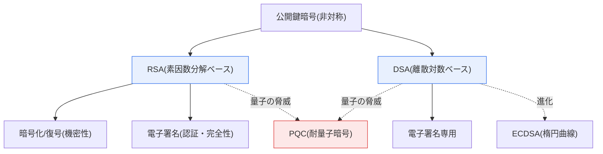
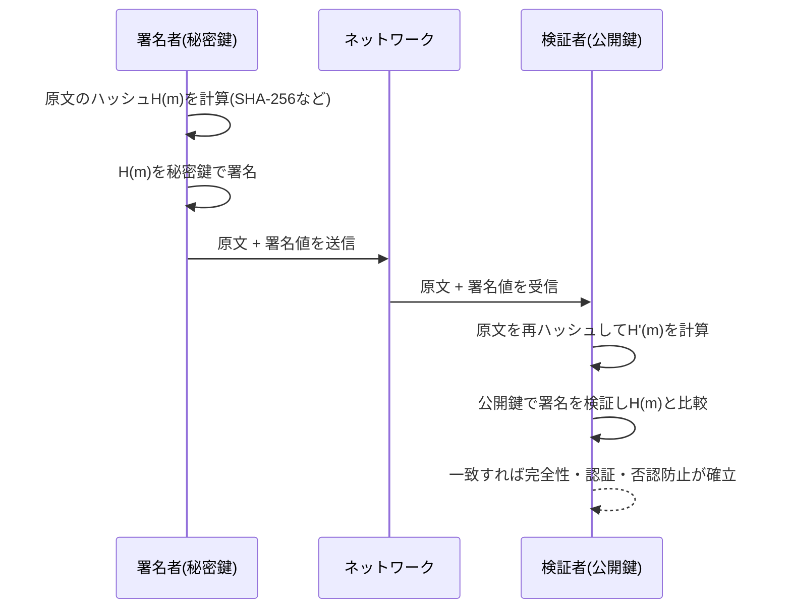

# RSAとDSAの比較

## 1. 概要

### A. 定義
> **RSA**(Rivest–Shamir–Adleman)とは、**大きな数の素因数分解が計算量的に困難であること** に基づく公開鍵暗号アルゴリズムであり、**暗号化(機密性)と電子署名(認証・完全性・否認防止)の両方** を実行できる汎用アルゴリズムである。
>
> **DSA**(Digital Signature Algorithm)とは、有限体上の **離散対数問題(Discrete Logarithm Problem)** の困難性に基づき、米国連邦標準(DSS, Digital Signature Standard)として採用された **電子署名専用** のアルゴリズムである。

二つのアルゴリズムをあわせて比較する根本的な理由は、両者とも「公開鍵/秘密鍵のペアを使用する非対称暗号」という同じ範疇に属しながらも、**依拠する数学的難問と設計目的が互いに異なる** からである。公開鍵暗号は、公開鍵と秘密鍵が数学的に対をなし、一方で変換したものはもう一方でしか元に戻せないという性質を利用する。この性質をどのような「一方向関数(one-way function)」の上に構築するかによって、アルゴリズムの性格が分かれる。RSAはこの原理を **素因数分解の困難性** の上に構築し、DSAは **離散対数の困難性** の上に構築した。

### B. 登場背景と必要性
RSAは1977年に発表された、事実上最初に実用化された公開鍵暗号であり、「暗号化もでき署名もできる」という汎用性のおかげで、SSL/TLS、S/MIME、コード署名、公認認証書など、インターネットの信頼基盤の標準となった。しかしRSAには、特許・性能をめぐる論争とともに「署名標準を政府が統制しにくい」という問題意識があり、これを受けて米国NISTは1991年に署名専用の標準として **DSA** を提案し、1994年にFIPS 186(DSS)として確定させた。すなわちDSAは当初から **国家標準として電子署名という単一の目的** のために設計されており、暗号化機能は意図的に排除された。

この背景の違いは、実務上の選択に直接影響を与える。RSAは「一つのアルゴリズムで機密性と完全性の両方を解決」しようとする汎用システムに適しており、DSAは「署名のみが必要で、標準準拠・署名生成速度が重要な」領域に適していた。ただし後述するように、今日のDSAは楕円曲線ベースの **ECDSA** と **EdDSA** に事実上置き換えられており、最新の米国標準(FIPS 186-5、2023)ではDSAによる新規署名の生成が廃止(deprecated)された。

### C. 二つのアルゴリズムの数学的基盤
| アルゴリズム | 基盤となる難問 | 安全性の根拠 |
|---|---|---|
| **RSA** | 大きな合成数nの素因数分解(Integer Factorization) | n=p·qがわかっても、p,qに分解するのが困難 |
| **DSA** | 有限体の乗法群における離散対数(DLP) | y=gˣ mod pからxを求めるのが困難 |

両難問とも、「順方向の計算は容易だが、逆方向は指数的に困難である」という一方向性を提供する。素因数分解は、乗算は容易でも因数分解は困難であるという性質に、離散対数は、べき乗は容易でもその指数を取り戻すことは困難であるという性質に依拠している。

## 2. RSA・DSAの全体構造の比較

下の概念図は、二つのアルゴリズムが同じ「非対称暗号」という根から出発しつつ、異なる難問の上でそれぞれ異なる機能範囲を持つに至る全体構図を示している。

RSAは一つのアルゴリズムから二つの枝(暗号化・署名)へと伸びるのに対し、DSAは署名という単一機能へと収束し、両アルゴリズムとも最終的には量子コンピュータの脅威の下に置かれ、PQCへの移行圧力を受けている。

### A. RSAの動作原理
RSAの核心は **鍵生成** にある。二つの大きな素数p, qを選んでモジュラスn=p·qを作り、オイラー関数φ(n)=(p−1)(q−1)を計算する。φ(n)と互いに素な公開指数eを選んだ後、e·d≡1 (mod φ(n))を満たす秘密指数dを求める。こうして作られた公開鍵は(n, e)、秘密鍵は(n, d)である。ここで安全性の本質は、攻撃者がnを知っていてもp·qに分解できなければφ(n)を計算できず、したがってdを導出できないという点にある。

暗号化は平文mに対してc=mᵉ mod nで行い、復号はm=cᵈ mod nで元に戻す。電子署名はこの関係を逆に用い、メッセージのハッシュH(m)を秘密鍵でS=H(m)ᵈ mod nとして署名し、受信者は公開鍵でSᵉ mod nを計算してH(m)と一致するかを検証する。すなわち「秘密鍵で施錠したものは公開鍵でのみ開く」という対称的な構造のおかげで、一つのアルゴリズムが機密性と認証の両方を担う。実務では安全性のために生のRSAをそのまま使わず、**パディング(暗号化にはOAEP、署名にはPSS)** を必ず適用する。

### B. DSAの動作原理
DSAは署名生成の手順がRSAと根本的に異なる。まずシステムパラメータとして、大きな素数p、p−1を割り切る素数q、位数(order)qを持つ生成元gを定める。秘密鍵xはランダムに、公開鍵はy=gˣ mod pとして定義される。署名時には **署名のたびに新しい一時乱数k** を選び、r=(gᵏ mod p) mod q、s=k⁻¹(H(m)+x·r) mod qを計算し、署名値(r, s)を送信する。検証者はw=s⁻¹ mod q、u₁=H(m)·w mod q、u₂=r·w mod qを求め、v=((g^{u₁}·y^{u₂}) mod p) mod qがrと等しいかを確認する。

ここで必ず強調すべき実務上の落とし穴は、**一時乱数kの管理** である。kを再利用したり予測可能な形で生成したりすると、二つの署名の連立方程式から秘密鍵xがそのまま復元される。実際に2010年、ソニーのPlayStation 3のコード署名鍵がこの脆弱性によって流出した事件が代表的な事例であり、同じリスクは楕円曲線署名(ECDSA)にもそのまま当てはまる。このため今日では、メッセージと秘密鍵からkを決定論的に導出する **RFC 6979(Deterministic DSA/ECDSA)** が推奨されている。

### C. 電子署名の共通処理手順
RSAであれDSAであれ、電子署名は「原文全体ではなく、原文のハッシュ値に署名する」という共通の手順に従う。下のシーケンスは、署名の生成から検証までの流れを示している。

このようにハッシュに署名することで、(1) 任意長の文書を固定長に圧縮して署名の演算量を減らし、(2) 原文が1ビットでも変われば ハッシュが変わるため改ざんを即座に検知でき、(3) 秘密鍵の保有者のみが署名できるため、署名者を認証し否認防止を提供する。

## 3. 詳細比較と実務的含意

二つのアルゴリズムの違いは、単なる機能の列挙ではなく **「なぜそのような速度・用途のプロファイルが生じるのか」** として理解しなければならない。RSAは検証時に小さな公開指数(例: e=65537)でべき乗を行うため検証が非常に速い一方、秘密指数dが大きいため署名生成は遅い。DSAは逆に署名生成が速いが、検証に2回の指数演算が必要なため相対的に遅い。電子署名は通常「一度署名され、何度も検証される」ため(例: 1枚の証明書を無数のクライアントが検証する)、検証の速いRSAがTLSサーバ証明書に広く使われるようになったのは、この速度プロファイルの自然な帰結である。

| 区分 | RSA | DSA |
|---|---|---|
| **基盤問題** | 素因数分解 | 離散対数(DLP) |
| **機能範囲** | 暗号化 + 電子署名 | 電子署名専用 |
| **鍵生成** | 遅い(大きな素数2個の探索) | 速い |
| **署名生成** | 相対的に遅い | 速い |
| **署名検証** | 速い(小さなe) | 相対的に遅い |
| **署名長** | 鍵長と同一(2048ビットなど) | 短い(2·q、例: 512ビット) |
| **乱数依存性** | 署名に乱数不要(RSA-PSSはソルト) | 署名のたびに安全なkが必須 |
| **標準化** | 事実上の業界標準(PKCS#1) | 米国政府標準(FIPS 186) |

鍵長と安全性の関係も、実務判断の核心である。NIST SP 800-57によれば、**112ビットのセキュリティ強度** はRSA 2048ビットに、**128ビットのセキュリティ強度** はRSA 3072ビットに対応する。一方、同じ128ビットのセキュリティを楕円曲線(ECDSA)は **256ビットの鍵** だけで達成する。すなわちRSAは安全性を高めるほど鍵・署名・演算のコストが急激に増加する(3072→7680→15360ビット)のに対し、楕円曲線では鍵が緩やかに大きくなるだけである。この拡張性の格差こそが、モバイル・IoTのようにリソースが限られた環境においてECDSA・EdDSAへの移行を加速させた決定的な理由である。

**三つの具体的事例** で違いを整理すると、次のとおりである。第一に、WebサーバのTLS証明書は検証頻度が圧倒的に高いため、検証の速いRSA-2048/3072またはECDSA-P256が標準として用いられる。第二に、ビットコイン・イーサリアムなどのブロックチェーンは署名サイズと検証性能が重要であるため、DSAではなくECDSA(secp256k1)を使用する。第三に、政府・公共文書の長期電子署名では標準準拠が重要であるため、かつてはDSAが使われていたが、現在はRSA-PSSやECDSAへ移行しつつある。

## 4. 深化 — 最新の標準動向と耐量子暗号への移行

電子署名アルゴリズムの選択は、最近の二つの標準の変化によって大きく再編されつつあり、技術士の観点から必ず押さえておく必要がある。

第一に、**FIPS 186-5(2023年改訂)** において米国NISTは、純粋なDSAを **新規署名生成について廃止(deprecated)** し、承認署名アルゴリズムをRSA・ECDSA・EdDSA(Ed25519/Ed448)に整理した。すなわちDSAは今や「レガシー署名の検証」にのみ限定的に許容されており、新規システムでは使用しないことが標準の勧告である。これは、DSAを学習テーマとしては扱いつつも、実務における新規採用の対象からは除外すべきであることを意味する。

第二に、**量子コンピュータの脅威とPQCへの移行** である。ショア(Shor)のアルゴリズムは、十分に大きな量子コンピュータがあれば素因数分解と離散対数の両方を多項式時間で解くことができるため、**RSA・DSA・ECDSAは原理的にすべて無力化** される。これを受けてNISTは2024年8月に最初の標準耐量子暗号を確定させ、署名分野では格子ベースの **ML-DSA(FIPS 204, CRYSTALS-Dilithium)** とハッシュベースの **SLH-DSA(FIPS 205, SPHINCS+)** が、鍵交換には **ML-KEM(FIPS 203, Kyber)** が選定された。特に「今収集して後で復号する(Harvest Now, Decrypt Later)」という攻撃モデルがあるため、長期保存が必要な署名・機密データについては **ハイブリッド方式(既存+PQCの併用)** による先行的な移行を開始することが推奨されている。

## 5. 考慮事項および示唆 (技術士の観点)

1. **用途に基づく選択戦略**: 機密性と署名の両方が必要であればRSA(ただしOAEP・PSSパディングが必須)、署名のみが必要で性能・署名サイズが重要であればECDSA/EdDSAを選択する。純粋なDSAは新規採用を避け、レガシー互換の目的に限定する。

2. **実装安全性のトレードオフ**: DSA・ECDSAは一時乱数kの品質に安全性が決定的に依存するため、必ず検証済みのCSPRNGまたはRFC 6979の決定論的署名を使用しなければならない。RSAは乱数への依存が低い代わりに、パディングオラクル攻撃に脆弱となり得るため、実装の検証(FIPS 140-3モジュール)が重要である。

3. **鍵長・寿命の管理(Crypto-agility)**: NISTの勧告に従い2030年以降を見据えるなら、RSAは3072ビット以上を確保しつつ、拡張コストを考慮して新規システムは楕円曲線ベースで設計し、アルゴリズムを容易に交換できる **暗号アジリティ(crypto-agility)** アーキテクチャを備えなければならない。

4. **耐量子移行ロードマップの策定**: RSA・DSA・ECDSAはいずれもショアのアルゴリズムに脆弱であるため、資産インベントリ(どこでどの暗号が使われているかの識別)→優先順位の算定(長期保存データを優先)→ハイブリッドの導入→全面移行という段階的なPQCマイグレーション計画を、今から準備しなければならない。

5. **関連技術の統合**: 電子署名はPKI(証明書の信頼チェーン)、タイムスタンプ(TSA)、長期検証(LTV)などと組み合わさってはじめて実効性を持つため、アルゴリズムそのものだけでなく、信頼基盤全般の運用・更新ポリシーをあわせて設計しなければならない。

## 参考資料
- NIST, FIPS 186-5 Digital Signature Standard (2023): https://csrc.nist.gov/pubs/fips/186-5/final
- NIST, SP 800-57 Part 1 Rev.5 Key Management: https://csrc.nist.gov/pubs/sp/800/57/pt1/r5/final
- NIST, Post-Quantum Cryptography Standards (FIPS 203/204/205, 2024): https://csrc.nist.gov/news/2024/postquantum-cryptography-fips-approved
- IETF, RFC 6979 Deterministic DSA/ECDSA: https://datatracker.ietf.org/doc/html/rfc6979

---

> **一言まとめ**: RSAは *素因数分解に基づき暗号化・署名の両方が可能な汎用アルゴリズム*、DSAは *離散対数に基づく署名専用のアルゴリズム* であり、署名の生成・検証速度と活用範囲が異なる。DSAはFIPS 186-5で新規署名の生成が廃止されてECDSA・EdDSAに置き換えられ、両アルゴリズムともショアのアルゴリズムに脆弱であるため、ML-DSAなどの耐量子暗号(PQC)への移行が求められている。
