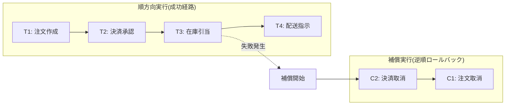
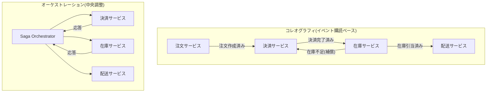

# Sagaパターン(Saga Pattern)と分散トランザクション

## 1. 概要

### A. 定義

> **Sagaパターン(Saga Pattern)**とは、複数のサービスにまたがる一つのビジネストランザクションを、各サービスのローカルトランザクションの連鎖に分割して実行し、途中で失敗が発生した場合には既に成功したステップを**補償トランザクション(Compensating Transaction)**によって逆順に取り消すことで、システム全体の一貫性を維持する分散トランザクション処理方式である。

Sagaは1987年にヘクター・ガルシア=モリーナ(Hector Garcia-Molina)が長時間実行トランザクション(long-lived transaction)のロック占有問題を緩和するために提案した概念であり、今日ではマイクロサービスアーキテクチャ(MSA)においてサービス境界を越えるデータ一貫性を確保する代表的なパターンとして再評価されている。Sagaは、従来のトランザクションが保証していた**原子性(All-or-Nothing)**を、データベースのロックではなく**アプリケーションレベルの補償ロジック**で代替する点が核心である。

### B. 登場背景と必要性

モノリシックシステムでは一つのデータベースがすべてのテーブルを所有するため、注文・決済・在庫更新を単一トランザクションにまとめ、一度の`COMMIT`で原子的に処理し、失敗時には`ROLLBACK`で元に戻すことができた。しかしMSAではサービスごとにデータベースを独立して所有する**DB per Service**原則に従うため、単一トランザクションの境界が複数のサービスと複数の物理DBに分割される。このとき一つの業務(例:旅行予約=航空+ホテル+レンタカー)を成功または失敗として**原子的**に処理するには、サービス間の協調が必要となる。

従来の標準的な解決策である**2フェーズコミット(2PC, Two-Phase Commit)**は、コーディネータ(Coordinator)がすべての参加者に準備(prepare)とコミット(commit)を指示する強い一貫性の手法であるが、コミットが完了するまでリソースのロックを保持するため、可用性と拡張性を大きく低下させる。特に参加者が多い場合や応答の遅いサービスが混在する場合には全体が待機状態となり、コーディネータ障害時には**ブロッキング(blocking)**状態に陥る。これはCAP定理において可用性(A)を犠牲にする選択であり、大規模インターネットサービスの要求とは合致しない。

Sagaはこの問題を異なる視点から解決する。全体を一つのロック区間にまとめる代わりに、各ステップを**即時にコミットされる短いローカルトランザクション**として処理し、失敗は事後的に補償によって訂正する。その結果、ロック占有時間が短くなり処理量と可用性が高まるが、その代わり**結果整合性(Eventual Consistency)**を受け入れる必要があり、中間状態が外部に露出しうるという新たな設計課題を生む。すなわちSagaは「強い一貫性の代わりに可用性と自律性を得る」トレードオフの産物である。

## 2. Sagaの基本原理と全体構造

Sagaは、正常フローを構成する**順方向トランザクション(T1, T2, … Tn)**と、各順方向トランザクションを元に戻す**補償トランザクション(C1, C2, … Cn-1)**の組で構成される。すべてのステップが正常に成功すればT1→Tnが順次実行され、k番目のステップで失敗すれば既に成功したT1…Tk-1をCk-1…C1の順に逆補償する。

上図において在庫引当(T3)が失敗すると、システムは先に成功した決済承認と注文作成をそれぞれ**決済取消(C2)**、**注文取消(C1)**の順に補償する。ここで重要なのは、補償が物理的な`ROLLBACK`ではなく**意味的取消(semantic undo)**であるという点である。例えば既に承認された決済は元に戻せないため、「返金」という新たな順方向取引で相殺する。したがって補償トランザクションは、元取引の痕跡を残しつつ効果のみを無効化する業務ロジックとして設計されなければならない。

補償設計で頻繁に登場する概念が**取り消し不能なステップ(pivot transaction)**である。例えば航空券の発券のようにキャンセル手数料が大きい、あるいは物理的に元に戻すことが難しいステップは、Sagaの後半、すなわち先行ステップがすべて成功した後に配置して補償コストを最小化する。このようにSaga設計では、ステップの順序そのものがリスク管理の手段となる。

## 3. 実行方式 — コレオグラフィ vs オーケストレーション

Sagaのステップ遷移を誰が調整するかによって、二つの実装方式に分かれる。この選択は結合度・可視性・複雑度に直接影響するため、Saga設計において最も重要な意思決定である。

**コレオグラフィ(Choreography)**方式は、中央のコーディネータなしに各サービスがイベントを発行し、他のサービスがそのイベントを購読して自らの次のステップを自律的に実行する。注文サービスが`注文作成済み`イベントを発行すると、決済サービスがこれを受け取って決済を行い`決済完了済み`を発行し、在庫サービスがさらにこれを購読するという形でフローが続く。サービス間の直接的な依存がないため結合度が低く自律性が高いが、全体フローがイベントの連鎖に分散するため**一目で把握しにくく、循環依存やイベント暴走のリスク**がある。

**オーケストレーション(Orchestration)**方式は、**Sagaオーケストレータ**という中央コーディネータが状態機械(state machine)を保持し、各サービスにコマンドを送り応答を受け取って次のステップを決定する。フローが一箇所に集約されるため可視性やデバッグ・監視が容易であり、複雑な分岐・補償ロジックの管理に適しているが、オーケストレータが単一障害点かつロジック集中点となりうるため、それ自体の高可用性設計が必要である。実務では、単純なフローはコレオグラフィで、参加サービスが多く補償ルールが複雑なフローはオーケストレーションで実装する混合戦略が一般的である。

| 区分 | コレオグラフィ | オーケストレーション |
|------|-------------|----------------|
| 調整主体 | なし(イベント発行/購読) | 中央オーケストレータ |
| 結合度 | 低い(疎結合) | オーケストレータに集中 |
| フローの可視性 | 低い(分散) | 高い(一箇所に集中) |
| 適合する状況 | 参加サービス2~4個、単純なフロー | 多数のサービス、複雑な補償/分岐 |
| リスク | 循環依存・追跡困難 | 単一障害点、ロジック肥大化 |

## 4. 実装時の中核技術要素

Sagaを実際に信頼性高く動作させるには、いくつかの補助メカニズムが必ず裏付けとして必要である。第一に、**冪等性(Idempotency)**である。ネットワークの再試行により同一メッセージが重複して到着しうるため、各ステップと補償は複数回実行されても結果が同一でなければならない。通常はトランザクションIDやメッセージIDを保存して重複処理を除外する。

第二に、**原子的なイベント発行**である。ローカルDBの更新とイベント発行が別々のシステム(DBとメッセージブローカー)にまたがっていると、DBはコミットされたがイベント発行が失敗するという二重書き込み(dual write)問題が生じる。これを防ぐため、同一トランザクション内でイベントをDBのアウトボックステーブルに記録し、別途リレーがこれを読み取って発行する**トランザクショナルアウトボックス(Transactional Outbox)**パターンを併用する。こうすることで「状態変更とイベント発行」が同一のローカルトランザクションとして原子的に結び付けられる。

第三に、**状態追跡とタイムアウト**である。オーケストレータ型では、各Sagaインスタンスの進行状態を永続化し、障害後の再起動時に処理を継続するか補償できるようにしなければならない。応答が返ってこないステップについては、タイムアウトと再試行、そして最終的に補償または手動介入(例:デッドレター・運用者通知)に切り替えるルールが必要である。

## 5. 他方式との比較 — なぜSagaなのか

Sagaを2PCおよび単純なイベント方式と比較すると、選択の文脈が明確になる。2PCは強い一貫性を即座に保証するが、ロックとブロッキングにより拡張性が低く、参加者が多く遅延の大きいMSA環境ではボトルネックとなる。一方Sagaは各ステップを即時コミットしてロックを長く保持しないため処理量と可用性が高いが、訂正が事後に行われる分、**途中で不整合が観測される時間窓**が存在する。

| 項目 | 2PC | Saga |
|------|-----|------|
| 一貫性 | 強い一貫性(即時) | 結果整合性 |
| ロック占有 | コミットまで長時間 | ローカルステップの間のみ |
| 可用性/拡張性 | 低い(ブロッキング) | 高い |
| ロールバック方式 | DB ROLLBACK | 補償トランザクション(意味的取消) |
| 分離性 | 保証 | 非保証(別途対策が必要) |

ここで実務上最も厄介な問題が**分離性の欠如**である。Saga進行中には、他のトランザクションがまだ確定していない中間状態を読み取ることができ(dirty readに類似)、まもなく取り消される予約座席を別のユーザーが参照するといった異常現象が生じうる。これを緩和するため、状態フィールドに「処理中/確定」のような**意味的ロック(semantic lock)**を設けたり、再確認(reread)後のコミット、交換可能な更新(commutative update)などの対応策を併せて設計する。

具体例として、大規模ECの注文処理では注文・決済・在庫・ポイント・配送がそれぞれ異なるチームとDBに分かれているが、毎秒数千件の注文を2PCでまとめると、決済ゲートウェイの応答遅延が全体を麻痺させる。実際こうしたプラットフォームでは、Saga+アウトボックス+メッセージブローカー(Kafkaなど)の組み合わせで各ステップを非同期処理し、決済失敗時には自動返金・注文取消の補償で整合性を取っている。その結果、平常時の処理量は大きく向上するが、ユーザーには「決済確認中」のような中間状態をUXとして明示し、結果整合性を自然に吸収させている。

## 6. 考慮事項および示唆点

技術士の観点では、Saga導入は単なるパターン選択ではなく、**一貫性モデルに関するアーキテクチャ上の意思決定**として扱うべきである。

- **適用判断基準**: 強い一貫性が法的・金銭的に必須となる中核的な精算処理は単一サービス内のローカルトランザクションに凝集させ、サービス境界を越える長期フローにのみSagaを選択的に適用する。すべてをSagaにするとかえって複雑度が爆発的に増大するため、**サービス境界設計(DDDのBounded Context)と併せて決定**しなければならない。
- **補償可能性優先の設計**: 取り消し不能なステップ(発券・出荷・外部精算)はSagaの後半に配置し、キャンセル手数料・返金ポリシーのような業務ルールを補償ロジックに反映する。補償自体も失敗しうるため、再試行・デッドレター・運用者介入の経路を用意する。
- **可観測性と運用**: フローが複数のサービスに分散するため、分散トレーシング(Distributed Tracing)、Saga状態ダッシュボード、未完了Sagaの検知・通知がなければ障害原因の把握は非常に困難である。この点ではオーケストレーション方式が有利であり、相関ID(correlation ID)で全区間を連結する。
- **トレードオフの受容とUX設計**: Sagaは分離性と即時一貫性を犠牲にする代わりに、可用性・自律性・拡張性を得る。したがって「処理中」状態の表示、重複防止(冪等性)、最終結果の通知など、ユーザー体験面での補正設計が技術設計と対になる必要がある。
- **展望**: 状態ベースのオーケストレーションをコードで管理するワークフローエンジン(例:Temporal、Camunda系)とイベントストリーミングプラットフォームの成熟により、Sagaは自前で実装するよりも**ワークフロー/オーケストレーションフレームワークとして標準化**される方向へ発展している。CQRS・イベントソーシングと組み合わせれば、Sagaの進行履歴そのものを監査資産として活用できる。

---

> **一言まとめ**: Sagaパターンは、サービスごとのローカルトランザクションの連鎖と失敗時の補償トランザクションによって分散トランザクションの原子性をアプリケーションレベルで実現する手法であり、2PCの強い一貫性の代わりに可用性と拡張性を得る結果整合性戦略であって、コレオグラフィ・オーケストレーションの選択と冪等性・アウトボックス・補償設計が成否を左右する。
