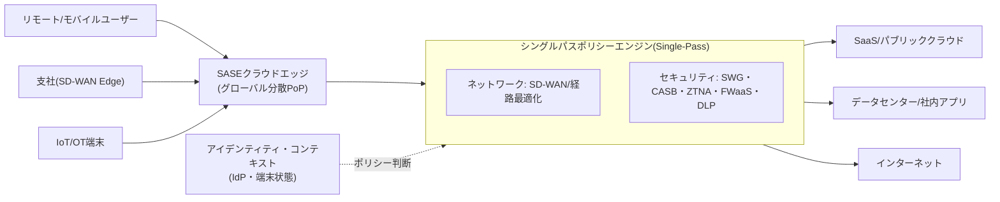
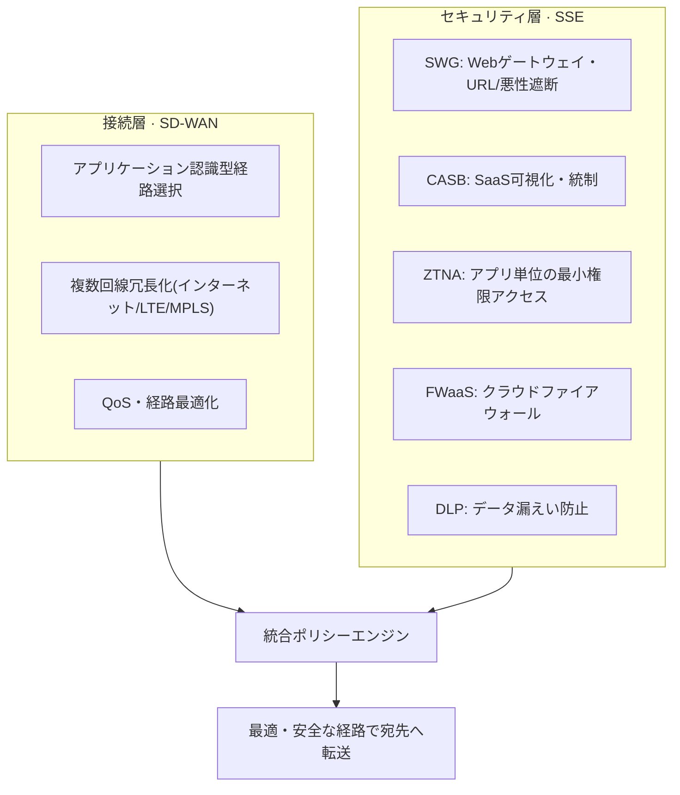

# SASE(Secure Access Service Edge、セキュアアクセスサービスエッジ)

## 1. 概要

> **SASE**とは、広域ネットワーク(WAN)接続機能であるSD-WANと、SWG・CASB・ZTNA・FWaaSなどのネットワークセキュリティ機能を一つのクラウドネイティブサービスに統合し、世界中に分散したエッジ(PoP, Point of Presence)からアイデンティティ(Identity)ベースで提供するアーキテクチャである。2019年にGartnerが「The Future of Network Security Is in the Cloud」レポートで初めて提示した概念として通用している。

SASEが登場した根本的な背景は、**企業IT資源の重心がデータセンターからクラウドへ移動**したことにある。かつてはユーザー・業務・データの大半が本社データセンター内にあったため、支社やリモートユーザーのトラフィックをMPLS専用線で本社に集約し(バックホール、backhaul)、境界ファイアウォールを一度通過させる「ハブアンドスポーク(hub-and-spoke)」モデルが合理的であった。しかし業務用アプリケーションがSaaS(Microsoft 365・Salesforceなど)やパブリッククラウドへ移行するにつれ、インターネットへ直接出ればよいトラフィックをわざわざ本社へ迂回させ、再びクラウドへ送る「トロンボーン(trombone)現象」が生じた。これは遅延(latency)を増大させ、回線コストを押し上げ、ユーザー体験を悪化させる。

これに**在宅・リモートワークの常態化、モバイル・IoT端末の急増、クラウドワークロードの分散**が加わり、「保護すべき境界(perimeter)」そのものが消失した。ユーザーはどこからでも接続し、データはあらゆる場所に存在する。このような環境において、従来の境界セキュリティ(機器中心・本社集中)は拡張性・俊敏性・安全性のすべてにおいて限界を露呈している。SASEは「**ネットワークとセキュリティを分離された機器スタックとしてではなく、ユーザー・端末に近いクラウドエッジで一つに融合されたサービスとして提供する**」という発想でこの問題を解決しようとするものである。すなわちセキュリティ検査ポイントを「本社境界」ではなく「ユーザーが接続する最寄りのPoP」へ移し、アクセス許可の可否をIP・位置ではなく**検証済みのアイデンティティとコンテキスト(端末状態・時間・行動)**で判断する。

## 2. SASEの概念構造と中核特性

SASEは大きく、**ネットワーク(接続)層とセキュリティ(SSE)層**がクラウドエッジで融合した形態として理解できる。以下の概念図は、ユーザー・支社・クラウドが分散PoPを介してどのように接続・保護されるかを示している。

SASEアーキテクチャの特性は四つの軸に整理される。第一に、**アイデンティティ中心(Identity-driven)**である。アクセス判断の基準はネットワーク上の位置ではなく、「誰が、どの端末で、どのような状態で」アクセスするかというアイデンティティ・コンテキストである。これはゼロトラスト原則(「決して信頼せず、常に検証せよ」)を実現する中核メカニズムであり、ZTNAを通じてアプリケーション単位の最小権限アクセスを強制する。

第二に、**クラウドネイティブ(Cloud-native)**である。セキュリティ・ネットワーク機能が物理機器(アプライアンス)ではなくマルチテナントのクラウドサービスとして実装されるため、弾力的な拡張・自動更新・従量課金が可能である。新たな脅威シグネチャやポリシーがすべてのPoPへ即座に伝播するため、パッチ適用の遅れによるセキュリティの空白が減少する。

第三に、**グローバル分散エッジ(Distributed edge)**である。世界中に数十~数百のPoPを配置し、ユーザーに物理的に近い場所でトラフィックを検査・転送する。これによりバックホールを排除し、遅延を削減する。例えばソウルのリモートユーザーが米国リージョンのSaaSに接続する場合、本社データセンターを経由せず近傍のPoPでセキュリティ検査を終えてから最適経路で送出されるため、往復遅延が大きく改善される。

第四に、**シングルパス検査(Single-pass inspection)**である。複数のセキュリティ機能(復号・SWG・DLP・アンチマルウェアなど)をそれぞれの機器で繰り返し実行するのではなく、トラフィックを一度復号・解析した状態ですべてのポリシーを並列適用する。機器を直列に増やす際に累積していた遅延と管理の複雑さを削減することが、中核的な設計目標である。

## 3. 構成要素 — ネットワーク(SD-WAN)とセキュリティ(SSE)

SASEの半分は接続を担う**SD-WAN**であり、残りの半分はGartnerが2021年に別途命名した**SSE(Security Service Edge)**、すなわちセキュリティ機能群である。以下の詳細アーキテクチャ図は、SSEを構成する主要なセキュリティ機能とネットワーク機能の関係を示している。

**SD-WAN(Software-Defined WAN)**は、アプリケーションの種類・重要度を認識して複数回線(専用線・インターネット・LTE/5G)の中から最適経路を動的に選択し、障害時には自動的に切り替え、リアルタイムトラフィック(Web会議など)にQoSを保証する。SASEにおいてSD-WANは、支社・端末を最寄りのPoPへ安全に接続する「オンランプ(on-ramp)」の役割を果たす。

**SWG(Secure Web Gateway)**はユーザーのWebトラフィックを中継し、悪性URL・フィッシング・マルウェアを遮断してWeb利用ポリシーを強制する。**CASB(Cloud Access Security Broker)**は組織が利用するSaaSに対する可視性を提供し、シャドーIT(未承認クラウド利用)を検知してデータ共有・権限を統制する。**ZTNA(Zero Trust Network Access)**はVPNと異なり、ネットワーク全体ではなく「特定のアプリケーション」に対してのみ、アイデンティティ・端末状態の検証を通過したセッションに最小権限でアクセスを許可し、攻撃対象領域(横展開、lateral movement)を縮小する。**FWaaS(Firewall as a Service)**はファイアウォール機能をクラウドからサービスとして提供し、**DLP(Data Loss Prevention)**は機微情報(個人情報・機密文書)の外部流出をコンテンツ検査によって遮断する。

これらの構成要素は個別にも存在していたセキュリティ機能であるが、SASEの価値はそれらを**一つのポリシーフレーム・単一コンソール・単一データ経路へ融合**した点にある。例えば「財務チームの社員が管理されていない個人端末から外部SaaSへ会計ファイルをアップロードする」行為を、CASBがSaaSを識別し、ZTNAが端末状態を確認し、DLPがコンテンツを検査することで、一つのポリシー判断として遮断できる。機能が分離された従来スタックでは、各機器のポリシーを個別に整合させる必要があった。

## 4. 従来の境界セキュリティ・VPNとの比較

SASEの差別性は、既存方式と比較すると明確になる。以下の表は中核的な軸を整理したものであり、各差異が「なぜ」生じるのかは続けて記述する。

| 区分 | 従来の境界セキュリティ(ハブアンドスポーク+VPN) | SASE |
|------|------------------------------|------|
| 検査ポイント | 本社データセンター境界 | ユーザーに近いクラウドPoP |
| アクセスの信頼 | ネットワーク上の位置(内部=信頼) | アイデンティティ・コンテキストベース(ゼロトラスト) |
| アクセス範囲 | ネットワーク全体(VPN) | アプリケーション単位(ZTNA) |
| 実装形態 | 物理機器スタック | クラウドサービス |
| 拡張性 | 機器増設・容量の限界 | 弾力的な拡張 |
| 管理 | 機器ごとの個別コンソール | 単一ポリシー・統合コンソール |

最も根本的な違いは**信頼モデル**である。VPNベースのリモートアクセスは、認証さえ通過すれば社内ネットワークのセグメントへ広範に接続されるため、アカウントが窃取されたり感染端末が接続したりすると、攻撃者は内部で自由に横展開できる。一方SASEのZTNAはセッションごとにアイデンティティ・端末状態を検証し、必要なアプリにのみ接続するため、一つが突破されても被害はそのアプリに限定される。「内部は信頼する」という暗黙の前提を排除したことが、セキュリティ効果の核心である。

二つ目の違いは**性能・コスト構造**である。バックホールを排除して遅延を減らすことは単なる利便性ではなく、クラウド・SaaS中心の業務の生産性に直結する。あるグローバル製造企業が多数の海外支社をMPLSで本社へバックホールしていた構造をSASEへ転換し、回線コストと遅延を削減した事例などが報告されており、MPLSと比べてインターネット・SD-WANの組み合わせは帯域当たりのコストが低いため、総所有コスト(TCO)削減の余地が大きい。ただし具体的な削減率は企業の回線構成・トラフィック特性によって大きく異なるため、一般化には注意が必要である。

三つ目の違いは**運用の複雑性**である。ファイアウォール・プロキシ・VPN・DLPを異なるベンダーの機器で運用すると、ポリシーの不整合・可視性の断絶・管理負担が大きくなる。SASEはこれを単一のポリシーモデルに統合し、一貫性と運用効率を高める。反面、これは**単一ベンダーへのロックイン(lock-in)**リスクにつながりうるため、導入時にはトレードオフとして考慮しなければならない。

## 5. 深掘り — SSEの台頭、導入アプローチ、最新動向

Gartnerは2021年、SASEのセキュリティ部分のみを切り出して**SSE(Security Service Edge)**と別途命名した。これは多くの企業がネットワーク(SD-WAN)とセキュリティを既に異なるベンダーで運用しており、SASEを一度に単一ベンダーへ統合することが難しいためである。現実的には、**セキュリティ機能(SWG・CASB・ZTNA)をまずSSEとしてクラウド移行**し、その後SD-WANと段階的に収束させるアプローチが広く用いられている。このためSASE導入は「ビッグバン移行」よりも、**リモートアクセスの近代化(VPN→ZTNA)→Web・SaaSセキュリティ(SWG・CASB)→ネットワーク統合(SD-WAN)**の順の段階的ロードマップとして設計するのが安全である。

ベンダー構成の面では、ネットワークとセキュリティを一社がすべて提供する**シングルベンダーSASE**と、最高水準のSD-WANベンダーとSSEベンダーを組み合わせる**デュアル/マルチベンダーSASE**が共存している。前者は統合性・シンプルさが、後者は各領域の最適製品の選択とロックイン緩和が強みである。最近では、AIベースの脅威検知・ポリシー自動化、生成AI利用の統制(社内データの外部LLMへの流出防止)機能がSSEに組み込まれる流れが見られる。ただし詳細機能・成熟度はベンダーごとの差が大きいため、導入時にはPoPのカバレッジ(国内リージョンの有無)・復号性能・SLAを実測検証することが重要である。

## 6. 考慮事項および示唆点

技術士の観点では、SASE導入は単なる製品の置き換えではなく、**ネットワーク・セキュリティ・組織が共に変わるアーキテクチャ転換**としてアプローチすべきである。次の点を総合的に考慮する。

- **段階的移行戦略**: 全面的な置き換えはリスクが大きい。VPNをZTNAに置き換えるリモートアクセスの近代化のように、効果が明確でリスクの低い領域から着手し、既存の境界セキュリティと並行運用しながら段階的に収束させる。移行中にポリシーの空白が生じないよう、移行設計を明確にする。
- **性能とセキュリティのトレードオフ**: SASEの中核であるSSL/TLS復号検査はセキュリティ上の可視性を高めるが、遅延・負荷を誘発する。PoPの復号処理性能と国内外のPoP位置が実使用時の遅延を左右するため、POC(概念実証)で必ず実測する。国内の接続品質のために、国内PoP・リージョンの有無を確認しなければならない。
- **データ主権・規制遵守**: トラフィックとログが海外PoPを経由・保存される可能性があり、個人情報保護法・電子金融監督規定など国内規制と衝突しうる。データの処理場所、ログ保管、責任共有モデル(clouding responsibility)をSLA・契約で明確にし、金融・公共分野ではCSAPなど国内認証要件も併せて検討する。
- **ベンダーロックインとレジリエンス**: シングルベンダーSASEは運用がシンプルな反面、ロックイン・単一障害点(SPOF)のリスクがある。PoP障害時の迂回経路、マルチベンダー/冗長化戦略、出口戦略(exit plan)を事前に用意する。
- **ガバナンス・組織の整合**: これまで分離していたネットワークチームとセキュリティチームのポリシー・責任を統合して初めて、SASEの「単一ポリシー」の利点が実現する。統合ポリシーのオーナーシップと運用プロセスを再設計する組織変革は、技術導入と同じくらい重要である。
- **関連技術との整合**: SASEはゼロトラスト(ZTNA)・SDN・クラウドセキュリティ(SECaaS)・SD-WANと密接に関連する。既に導入しているSIEM・SOAR・EDRとログ・対応を連携させ、検知・対応体制全体の一貫性を確保することが最終目標である。

展望として、ハイブリッドワークとマルチクラウドが標準となった環境において、SASE/SSEは「選択肢」ではなく**境界のない時代の基本的なセキュリティ・ネットワーク運用モデル**として定着する可能性が高い。技術士はこれを個別セキュリティ製品の総和としてではなく、アイデンティティ中心・クラウドネイティブという原則の上で、企業の業務・規制・コストの文脈に合わせて設計・検証・ガバナンスする統合アーキテクチャとして扱えなければならない。

## 参考資料

- Gartner, "The Future of Network Security Is in the Cloud" (2019) — SASE概念の提示
- Gartner, "Security Service Edge (SSE)" 関連の定義 (2021)

---

> **一言まとめ**: SASEはSD-WAN(接続)とSWG・CASB・ZTNA・FWaaS(セキュリティ=SSE)をクラウドエッジで*アイデンティティ中心・シングルパス*に融合したアーキテクチャであり、バックホール排除によって性能を高め、ゼロトラストで境界のない環境を保護する一方、復号性能・データ主権・ベンダーロックインを段階的移行戦略で管理しなければならない。
