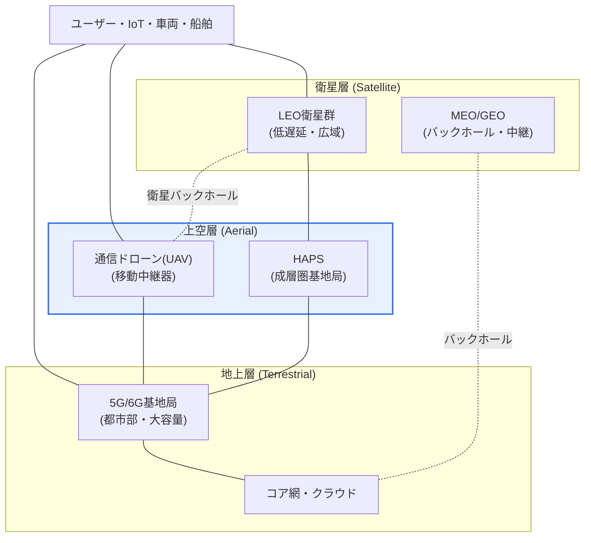
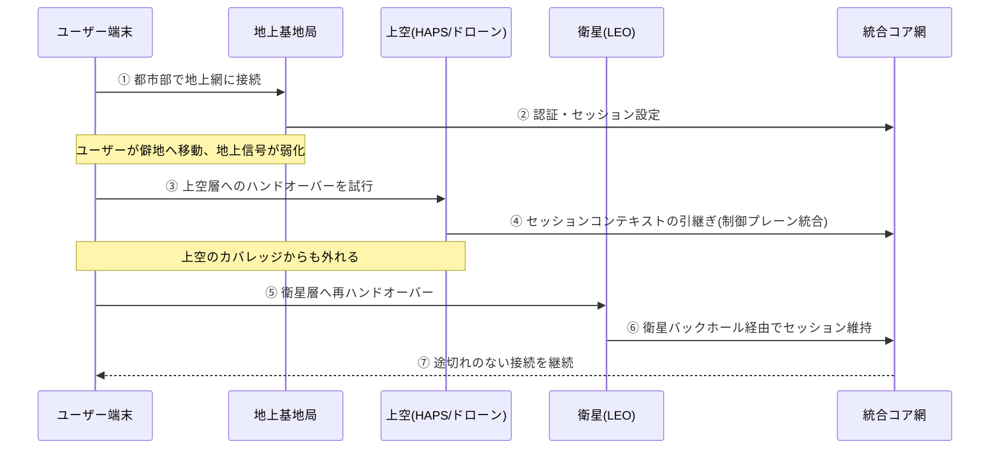

# SATIN(衛星・上空・地上統合型無線ネットワーク)

## 1. 概要

### A. 定義
> **SATIN(Satellite-Aerial-Terrestrial Integrated Network)** とは、**衛星(Satellite)・上空(Aerial、ドローン・成層圏基地局)・地上(Terrestrial)**の各階層を一つの制御・データプレーンに統合し、地球上のどこでも途切れのない通信を提供する、6Gを志向した3次元(3D)統合無線ネットワークである。

SATINの中核的な発想は、「**地上網だけでは地球全体をカバーできないのだから、空と宇宙までを通信インフラとして取り込もう**」というものである。現在の移動通信は地上基地局(gNB)を密に設置してサービスする構造であるため、基地局を設置できない、あるいは採算の合わない海洋・山岳・砂漠・僻地・災害地域は、構造的に通信の不感地帯となる。地表の相当部分と海洋・空域が依然として接続されていない根本原因はここにある。SATINはこの限界を、水平(面積)方向ではなく垂直(高度)方向に拡張することで解決する。

具体的には、低軌道(LEO)衛星群が全地球を常時カバーしてカバレッジの底辺を敷き、ドローン・成層圏基地局(HAPS)が上空から特定地域を柔軟に補強し、地上網が都市部の超大容量トラフィックを担う。三つの階層は互いの代替財ではなく補完財として動作する。すなわちユーザーは自らの位置・移動性・要求品質に応じて最適な階層に接続され、階層間を移動する際にも途切れなくハンドオーバーされる。この構造は、3GPPが標準化を進めている**非地上系ネットワーク(NTN, Non-Terrestrial Network)**の概念を地上網と有機的に融合したものと理解でき、6Gが志向する「全地球完全接続(Global Seamless Coverage)」の中核的な青写真として議論されている。

### B. 登場背景および必要性
SATINが台頭した背景には、三つの流れが重なっている。第一に、**需要面での超接続・完全カバレッジの要求**である。自律航行する船舶・航空機、遠隔からの災害対応、IoT(モノのインターネット)の全地球的な拡大は、「人が住む場所」を超えて「地球表面全体」での接続を要求する。地上網だけでこれを満たそうとすれば経済性が破綻する。

第二に、**供給面での技術成熟**である。再使用型ロケットによって衛星打ち上げコストが急減し、数千機規模の低軌道衛星群(例:Starlink・OneWebなど)が実際に配備されたことで、かつての静止軌道(GEO)衛星の高遅延という限界を低軌道の低遅延によって相当程度克服した。成層圏に長時間滞空するHAPS(高高度プラットフォーム)や通信中継ドローンの技術も成熟段階に入った。

第三に、**標準化の進展**である。3GPPはRelease 17でNTNを正式な規格に組み込み、その後のリリースで地上・非地上の統合を深化させている。このように需要・技術・標準が同時に成熟したことで、地上・上空・衛星を別々の網ではなく「一つの網」として設計しようとするSATINの概念が、6G研究の中心テーマに浮上した。

## 2. ネットワーク構造と階層別の役割

SATINは高度に応じて三つの階層に積み重なり、各階層は異なる物理的特性(遅延・移動性・容量・カバレッジ半径)を持つ。全体構造を俯瞰すると次のとおりである。

### A. 衛星層(Satellite) — カバレッジの底辺
衛星層の存在理由は、全地球を例外なくカバーすることにある。特に高度約300~1,500kmの**低軌道(LEO)**衛星群は電波の往復距離が短いため、静止軌道と比べて遅延が画期的に低く、多数の衛星が密に周回しながら地上の一地点をリレーのように引き継いでサービスする。ただし個々の衛星が地平線を高速に横切るため、衛星間の途切れのないハンドオーバーと精密な軌道・ビーム管理が不可欠である。

衛星層の実務的な含意は、「**最後の接続手段(connectivity of last resort)**」を保証する点にある。地上インフラが皆無である、あるいは破壊された状況でも空から信号が届くため、災害・軍事・海洋・航空通信の安全弁となる。反面、広域を少数のビームでカバーする構造上、単位面積当たりの容量は地上網に大きく及ばず、端末のアンテナ・電力要求も高いため、衛星層だけで都市部のトラフィックを賄おうとする設計は非現実的である。このため、衛星は「広く浅く」、地上は「狭く深く」という役割分担が自然に導かれる。

### B. 上空層(Aerial) — 柔軟な地域補強
上空層は、成層圏(約18~25km)に長期滞空する**HAPS**と、必要なときに飛ばす**通信ドローン(UAV)**で構成される。衛星よりはるかに地表に近いため遅延がより短く地上端末とのリンク品質が良好であり、地上基地局よりはるかに広い半径を一機でカバーする。何よりも「移動・一時配備」が可能である点が決定的な差別化要素である。

この柔軟性により、トラフィックが急増する特定の地域や時点を狙った「**オンデマンドカバレッジ**」が可能となる。例えば大規模集会・競技場、観光繁忙期の島しょ地域、災害現場のように需要が一時的に急増する場所にドローン基地局を飛ばし、容量を即座に補強できる。衛星が常時・広域であるのに対し、上空層は局所・弾力的な性格を持つわけである。ただしHAPS・ドローンは滞空時間・電力・気象の影響という制約を受けるため、恒久的なインフラではなく、地上・衛星層を補完する「機動予備隊」として設計するのが合理的である。

### C. 地上層(Terrestrial) — 大容量の心臓部
地上層は既存の5G/6G基地局とコア網・クラウドで構成され、人口密集地域の超大容量・超低遅延サービスを担う。光ファイバーバックホールと高密度な基地局配置により単位面積当たりのスループットが圧倒的に高く、MEC(Mobile Edge Computing)など低遅延アプリケーションの本拠地となる。

SATINにおける地上層の役割は、単なる「一つの階層」を超える。通常、コア網・認証・ポリシー制御の中枢は地上にあるため、衛星・上空層で発生したトラフィックも最終的には地上コアを経由して認証・ルーティング・課金される。すなわち地上層は容量の心臓部であると同時に、**統合制御の頭脳**の役割も兼ねる。したがってSATIN設計の難題は「衛星・上空のトラフィックをいかに地上コアとシームレスに統合するか」に帰着し、これは3.項の中核技術の議論へとつながる。

階層別の特性を一目で比較すると次のとおりである。この表は、各階層がなぜ相互補完的であるのかを「遅延・容量・移動性」のトレードオフとして要約したものである。

| 階層 | 代表的な高度/構成 | カバレッジ | 遅延 | 単位面積容量 | 性格 |
|---|---|---|---|---|---|
| **衛星(LEO)** | 300~1,500km、衛星群 | 全地球 | 低い(低軌道) | 低い | 常時・広域 |
| **上空(HAPS/ドローン)** | 成層圏~数km | 広域・局所 | 非常に低い | 中程度 | 弾力・機動 |
| **地上(gNB)** | 地表基地局 | 局所・都市部 | 非常に低い | 高い | 常時・大容量 |

## 3. 中核動作原理と統合技術

SATINが「三つの網」ではなく「一つの網」となるためには、ユーザーが階層をまたいで移動する際にそれを意識しないほどシームレスな連携が必要である。その過程を手順として表すと次のとおりである。

### A. 異種階層間のシームレスなハンドオーバー
最も根本的な技術課題は、特性が大きく異なる階層間を行き来する際にセッションを維持することである。地上↔上空↔衛星は、遅延・ドップラーシフト・信号強度・移動パターンがすべて異なる。特にLEO衛星は自ら秒速数kmで移動するため、端末が静止していても接続衛星が次々と変わる「移動するインフラ」の問題が生じる。

これを解決するには、階層・衛星の位置とチャネル状態を事前に予測し、先回りしてハンドオーバーを準備するインテリジェントなモビリティ管理が必要である。統合コアがセッションコンテキスト(認証・ベアラ・ポリシー)を階層から独立して保持・引継ぎすることで、物理層が変わっても論理セッションが途切れないようにする。この「制御プレーン統合」こそが、SATINの成否を分ける核心である。

### B. 統合的なリソース・周波数管理
三つの階層は限られた無線リソースと周波数を共有しなければならないため、干渉回避と動的なリソース割当てが重要である。衛星・地上が隣接帯域を使用または共有する場合は相互干渉を調整しなければならず、トラフィック需要に応じてどの階層がどの地域を担当するかをリアルタイムに配分する必要がある。ここではAIベースの予測・最適化が有力な手段として議論されている。例えば、災害が予想される地域に事前に上空・衛星リソースを編成しておくといった方法である。

### C. インテリジェントな階層選択とSDN/NFV
ユーザーごとに最適な階層は異なり、時間とともに変化するため、どの階層に接続させるかを決定するポリシーエンジンが必要である。低遅延が重要なアプリケーションは近くの地上・上空層へ、カバレッジのない地域は衛星層へ送るといったルーティングが、状況認識型で行われなければならない。網全体をソフトウェアで柔軟に再構成する**SDN/NFV**と、階層ごとに要求の異なるサービスを論理的に分離する**ネットワークスライシング**が、こうした統合制御を実現する基盤技術として併せて議論されている。

## 4. 活用方策および事例

SATINの価値は、「地上網が届かない、あるいは無力化された状況」において最も明確に現れる。各活用例は、前述の階層別特性が実際の課題にどのように噛み合うかを示している。

| 分野 | 中核階層 | 活用内容 |
|---|---|---|
| **災害対応** | 衛星・上空 | 地上網破壊時に衛星・ドローンで緊急通信を即時復旧 |
| **UAV/無人移動体** | 上空・衛星 | ドローンを移動基地局・中継器として活用、UAV・自動運転の制御リンク |
| **僻地・海洋・航空** | 衛星 | 島しょ・砂漠・遠洋・航空機への常時通信提供(デジタルデバイド解消) |
| **IoT・センサー網** | 衛星 | 全地球規模の低消費電力センサーのデータ収集(環境・物流追跡) |

第一に、**災害対応**においてSATINは特に真価を発揮する。地震・洪水で地上基地局が倒壊すると通常は通信が麻痺するが、この際に通信ドローンを被災地上空に飛ばし、衛星バックホールで外部と接続すれば、数時間以内に臨時の通信網を構築できる。実際に大規模自然災害の後、衛星インターネット端末や通信ドローンが緊急通信の復旧に投入された事例が報告されており、これはSATINが志向する多階層レジリエンスの縮図である。

第二に、**無人移動体の制御**である。自律走行するドローン・船舶・車両は、通信の不感地帯でも制御リンクが途切れてはならないため、衛星・上空層が地上カバレッジの隙間を埋めて連続的な制御を保証する。同時に、ドローン自体を移動中継器として再活用し、カバレッジを拡張するという二重の役割も可能である。

第三に、**デジタルデバイドの解消とIoT**である。人口密度が低く地上基地局の採算が合わない島しょ・山間部・遠洋にも衛星でブロードバンドと低消費電力IoT接続を提供することで、通信から取り残された地域を減らし、環境モニタリング・物流追跡のような全地球規模のセンシングを可能にする。

## 5. 深掘り — 6G・NTN標準化動向と国内の対応

SATINは単一の完成された規格というよりも、6Gに向けた複数の標準・研究の流れが収束する「方向性」に近い。事実関係が急速に更新される領域であるため、詳細な数値・日程は一般化して理解するのが安全である。

標準化の面では、3GPPはRelease 17でNTNを正式に組み込んで以降、後続のリリースで地上・非地上の統合、低軌道衛星のモビリティ、IoT-NTNなどを継続的に拡張している。国際電気通信連合(ITU)は6G(IMT-2030)ビジョンにおいて「ユビキタス接続(ubiquitous connectivity)」を中核的な利用シナリオの一つとして提示しているが、これは事実上、衛星・上空・地上の統合を前提としている。すなわちSATIN的な発想は、6G標準の下絵に既に反映されている。

産業面では、衛星事業者と移動通信事業者の境界が崩れつつある流れが顕著である。低軌道衛星群の運用会社と通信事業者が提携し、一般のスマートフォンが衛星と直接通信する「direct-to-cell(端末の衛星直接接続)」サービスが商用化の初期段階に入っており、これはSATINが実験室の概念を超えて市場へ降りてきていることを示している。韓国国内でも6Gおよび低軌道衛星通信関連の研究開発と周波数・標準への対応が国家レベルで推進されており、技術士の観点からは、標準・周波数・産業政策が絡み合う融合課題としてアプローチする必要がある。

## 6. 考慮事項および示唆点 (技術士の観点)

1. **異種階層の連携が最大の技術的な鍵である。** 衛星・上空・地上は遅延・移動性・容量が根本的に異なるため、これを一つの制御プレーンにまとめ、階層間のハンドオーバー・セッション引継ぎをシームレスに処理する統合管理技術がSATINの成否を左右する。ここにAIベースのモビリティ・リソース予測が組み合わされて初めて実効性が生まれる。

2. **周波数・標準・規制の調整が商用化の前提条件である。** 衛星・地上周波数の共用・干渉調整、国家間の軌道・周波数割当て、3GPP NTN標準の成熟が並行して進まなければ、技術があってもサービスは不可能である。特に国境を越える衛星の特性上、国際協力・規制の整合性は地上網よりはるかに重要である。

3. **セキュリティ・レジリエンスの観点からの再設計が必要である。** 階層が増え、無線リンクが空・宇宙へ拡張されると攻撃対象領域が広がる。信号のジャミング・スプーフィング、衛星リンクの盗聴、階層間認証の回避といった新たな脅威に備えたエンドツーエンド暗号化・相互認証・異常検知が求められる。逆に多階層の冗長化はレジリエンスを高める利点であるため、セキュリティとレジリエンスを共に設計するバランスが重要である。

4. **経済性・電力・持続可能性のトレードオフを考慮しなければならない。** 衛星の打ち上げ・運用、HAPS・ドローンの滞空、地上網の増設は、それぞれコスト・電力・環境負荷が異なる。どの階層をどれだけ投入するかは、カバレッジ目標とトラフィック需要に対する費用便益分析に基づいて決定すべきであり、低軌道衛星群によるスペースデブリ・周波数の混雑といった持続可能性の課題も政策的に併せて扱わなければならない。

## 参考資料
- 3GPP, "Non-Terrestrial Networks (NTN)" — https://www.3gpp.org/technologies/ntn-overview
- ITU-R, IMT-2030 (6G) Framework — https://www.itu.int/en/ITU-R/study-groups/rsg5/rwp5d/imt-2030/Pages/default.aspx

---

> **一言まとめ**: SATINは*衛星(広域)・上空(ドローン・HAPS、弾力)・地上(大容量)*を一つの制御プレーンに統合した3次元無線網であり、災害時の通信復旧・UAV制御・僻地サービスを実現して6Gの全地球完全カバレッジ(NTN)の基盤となる一方、異種階層連携・周波数・セキュリティ・経済性が中核課題である。
