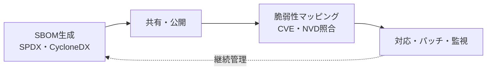

# SBOM(Software Bill of Materials)

## 1. 概要

### A. 定義
> ソフトウェアを構成する**すべてのコンポーネント・ライブラリ・依存関係とそのバージョン・ライセンス情報を一覧化**した明細書。製造業の部品表(BOM)から概念を借用したものであり、ソフトウェアサプライチェーンセキュリティ(SSC)の中核的な成果物である。

SBOMの根本的な趣旨は「**見えなければ管理できない**」という点にある。現代のアプリケーションはコードの半分以上が自ら記述したものではなく外部のオープンソースで占められているが、その中に何が含まれているのか一覧すら存在しないケースが多い。SBOMはこの「ソフトウェアの成分表」を明示化し、脆弱性・ライセンスリスクを管理対象へと引き上げる。

### B. 登場背景および必要性
オープンソース依存関係が爆発的に増加したことで、一つのアプリが直接・間接に数百〜数千のコンポーネントに依存するようになり、その中の欠陥一つがサプライチェーン全体に波及する事故が相次いだ。ビルドシステムを汚染した**SolarWinds**、広く使われるロギングライブラリの致命的欠陥である**Log4Shell(Log4j)** が代表例である。Log4Shellの際、多くの組織が「自社システムがLog4jを使っているかどうかすら把握できず」対応が遅れたが、SBOMがあれば即座に影響範囲を特定できたはずである。こうした背景から、米国大統領令(**EO 14028**)以降、公共調達ソフトウェアへのSBOM提出が義務化され、普及が進んだ。

## 2. SBOMの構成要素・標準フォーマット

SBOMが実効性を持つには、人ではなくツールが自動で解釈できなければならないため、機械可読な**標準フォーマット**で作成することが重要である。フォーマットが標準化されて初めて、異なる組織・ツール間でSBOMをやり取りし、自動照合できるようになる。

| 区分 | 内容 |
|---|---|
| **構成要素** | コンポーネント名・バージョン、供給者、依存関係、ライセンス、ハッシュ(完全性検証) |
| **標準フォーマット** | **SPDX**(Linux Foundation、ISO標準)、**CycloneDX**(OWASP、セキュリティ特化)、SWID |

SPDXはライセンス・コンプライアンスに強みがあり国際標準(ISO/IEC 5962)として採択されており、CycloneDXは脆弱性・サプライチェーンセキュリティへの活用に焦点を当てている。ハッシュを含める理由は、明記されたコンポーネントが実際の配布物と同一であるか(改ざんの有無)を検証するためである。

## 3. 管理対象:オープンソースの脆弱性

SBOMで可視化しようとするリスクは大きく4つであり、その中で**推移的(transitive)依存関係**が最も厄介である。自分が直接取り込んだライブラリがさらに別のライブラリを呼び出す多段構造であるため、実際に問題となるコンポーネントは目に見えない深い場所に潜んでいるからである。

| 脆弱性 | 内容 |
|---|---|
| **既知の脆弱性(CVE)** | Log4jなど公開された欠陥が推移的依存関係に潜伏 |
| **依存関係リスク** | 多段の推移的依存関係により何を使っているか把握が困難 |
| **ライセンス違反** | GPLなどコピーレフトライセンス不遵守時の法的リスク |
| **保守終了・悪性** | EOL(サポート終了)パッケージ、悪性コードの混入(Typosquatting) |

ライセンス違反がセキュリティに劣らず重要である理由は、GPLのようなコピーレフトライセンスを知らずに含めると自社ソースコードの公開義務が発生するなど、**法的・事業的リスク**に直結するからである。

## 4. SBOMに基づく管理方策

SBOMは一度作って終わりの文書ではなく、**生成→マッピング→対応→再生成が循環する継続的プロセス**でなければならない。新たなCVEは毎日公開されるため、昨日まで安全だったコンポーネントが今日脆弱になり得るからである。

| 段階 | 方策 |
|---|---|
| **生成** | CI/CDビルド時点でSBOMを自動生成(正確性・最新性の確保) |
| **分析(SCA)** | SCAツールで構成要素・脆弱性・ライセンスをスキャン |
| **マッピング** | CVE/NVDデータベースと照合し脆弱なコンポーネントを特定 |
| **対応・監視** | パッチ・アップグレード、新規CVE公開を継続監視 |

核心は、SBOM生成を人手ではなく**ビルドパイプラインに自動統合**することである。手作業の明細はすぐに実際のコードと食い違い信頼できなくなるため、ビルドのたびに実際の成果物からSBOMを抽出しなければならない。

## 5. 考慮事項および示唆点
SBOMはサプライチェーン透明性の基盤であるが、脆弱性リストだけでは実際のリスクを過大評価しやすい。あるコンポーネントにCVEがあっても、**該当コードパスが実際に実行されなければ危険ではない**場合がある。そのため、「この脆弱性が自社製品で実際に悪用可能か」を示す**VEX(Vulnerability Exploitability eXchange)** と組み合わせて対応の優先順位を決めることが、技術士の観点での核心である。運用面では、SBOM・SCA・VEXを**DevSecOpsパイプラインに自動統合**して生成・分析・対応を常時化すべきであり、国内でもSWサプライチェーンセキュリティガイドと義務化が広がる流れに合わせ、組織レベルのSBOM管理体制を先制的に構築する必要がある。

---

> **一言まとめ**: SBOMはソフトウェア構成要素をSPDX・CycloneDXで一覧化して*オープンソースの脆弱性・ライセンスリスクを可視化*し、*ビルド時の自動生成→SCAスキャン→CVEマッピング→VEXによる優先順位付け→監視*という継続的プロセスでサプライチェーンセキュリティを管理する基盤である。
