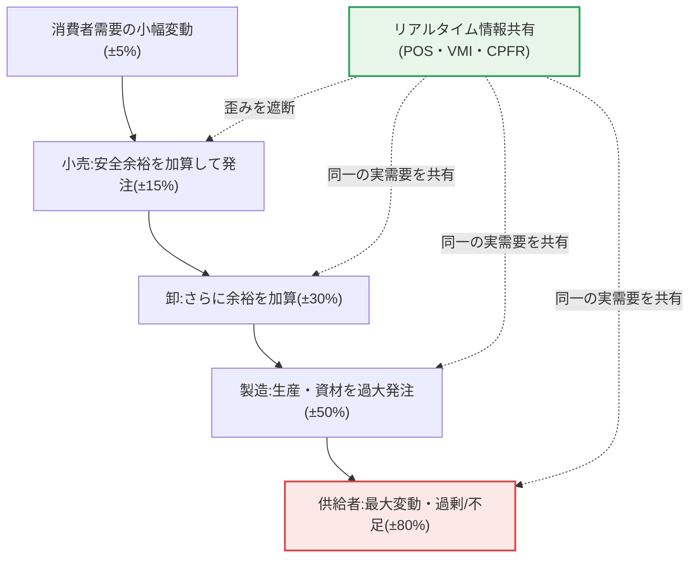

# サプライチェーンマネジメント(SCM, Supply Chain Management)

## 1. 概要

### A. 概念と重要性が高まった背景
> **SCM**は、原材料の調達から生産・流通・最終消費者に至る**サプライチェーン全体の流れ(物・情報・資金)を統合的に管理・最適化**し、コストを下げ顧客価値を高める経営手法である。

SCMが重要になった背景には、「**サプライチェーンリスクがそのまま企業の存亡に直結する**」という現実がある。かつてSCMは在庫を減らしてコストを節約する効率化ツールと理解されていたが、近年は危機状況において供給を途切れさせない生存能力へとその位置付けが変わった。新型コロナによるグローバル物流の混乱、2021年以降の車載半導体不足のように、サプライチェーンの一地点が途切れると完成車・電子など全産業が減産・停止に追い込まれるのを目の当たりにし、在庫とサプライチェーン管理は単なるコスト削減を超えて国家・企業の危機対応能力となった。

サプライチェーンは複数の企業が鎖のようにつながっているため、一地点の遅延・不足が全体に増幅されて伝播する**ブルウィップ効果(Bullwhip Effect)** が発生するという構造的脆弱性を持つ。最終消費者の需要はわずかしか変化していないのに、小売→卸→製造→供給者と上流に行くほど各段階が安全のために発注を膨らませるため、変動幅が雪だるま式に大きくなる。鞭の持ち手を少し振るだけで先端が大きく揺れることから名付けられた。その結果、上流企業は過剰在庫・欠品を繰り返し、莫大なコストを抱え込むことになる。

SCMはサプライチェーン全体の情報を共有・統合してこのブルウィップ効果を抑え、需要を正確に予測して適正在庫を維持することで、コストと危機対応を同時に最適化する。核心的な洞察は、「**個別企業の局所最適化ではなく、サプライチェーン全体の全体最適化**」を追求する点にある。各企業が自社の在庫だけを最小化しようとすると、かえって全体のブルウィップ効果が大きくなるため、参加者が需要・在庫情報を共有し協業して初めて全体コストが下がる。

### B. 登場背景と必要性
SCMの概念が浮上した根本的な原因は、グローバル分業の深化である。一台のスマートフォンが数十か国・数百社の協力会社の部品で作られる時代において、サプライチェーンは長く複雑で脆弱になった。自然災害・戦争・感染症・貿易摩擦といった不確実性がサプライチェーンのどの地点でも発生し得るうえ、その衝撃は世界中へ即座に伝播する。このような環境では、サプライチェーン全体をリアルタイムに可視化(visibility)し最適化する統合管理なしに、単一企業の効率だけで競争力を維持することはできなくなった。すなわちSCMは、「企業間の競争ではなくサプライチェーン間の競争」という認識転換の産物である。

また、顧客の期待水準が高まったこともSCMの必要性を高めた。電子商取引の普及により「当日・翌日配送」が標準となり、企業は在庫を最小化しながらも迅速に対応しなければならないという相反する要求を同時に満たす必要に迫られている。このジレンマは個別の物流部門の努力だけでは解けず、調達・生産・流通・販売を一つにつなぐサプライチェーンレベルの統合最適化によってのみ解消される。

## 2. SCMの構成と物・情報・資金の流れ

SCMが管理する対象は大きく3つの流れ、すなわち下流へ流れる物(製品)、上流へ流れる需要・情報、そして逆方向に流れる資金である。以下の全体構造図は、これらの流れがサプライチェーンに沿ってどのように循環するかを示している。

**物の下流の流れ**は、原材料が部品・半製品・完成品へと加工されながら消費者に向かって移動する物理的な流れである。この流れの目標は、必要な物を必要な時・場所に最小コストで届けること(JIT, Just-In-Timeの理想)であり、リードタイム短縮と物流最適化が中心課題となる。在庫はこの流れの緩衝装置であると同時にコストの源泉でもあるため、在庫をどれだけ持つかがSCMの中心的な意思決定となる。

**情報の上流の流れ**は、消費者の実際の需要・販売データが小売から製造・供給者へとさかのぼる流れである。この流れが断絶し、各段階が直下の段階の「注文」だけを見て判断すると、実際の消費者需要ではなく歪んだ注文シグナルに反応することになり、ブルウィップ効果が急増する。したがってSCMの勝負どころは、この情報の流れをいかにリアルタイムかつ歪みなく共有できるかにある。POS(販売時点)データを供給者と直接共有することが代表的な解決策である。

**資金の流れ**は、消費者の支払いが小売→製造→供給者へと逆流する流れであり、近年はサプライチェーンファイナンス(SCF)へと拡張され、協力会社の資金負担を緩和しサプライチェーン全体の安定性を高める手段となった。3つの流れを統合して捉える視点こそが、SCMを個別の物流・購買管理と区別する本質である。

## 3. ブルウィップ効果の発生原因と緩和手法

ブルウィップ効果はSCMが解決しようとする中核的な問題であるため、その原因と対策を別途深く見る必要がある。ブルウィップ効果はおおむね4つの原因から生じる。第一は**需要予測の更新**であり、各段階が注文を受けるたびに将来需要を上方修正し安全余裕を上乗せするためである。第二は**一括発注(batching)** であり、発注・輸送コストを節約するためにまとめて大量に発注すると、需要シグナルが塊となって歪む。第三は**価格変動(販促)** であり、値引き時の大量購入とその後の購入停止が繰り返され、需要が乱高下する。第四は**不足時の過大発注(rationing)** であり、供給が不足しそうになると実際の必要量より膨らませて発注する心理である。

以下のプロセス詳細図は、最終需要の小さな変動が上流に行くほど増幅されるブルウィップ効果のメカニズムと、情報共有がこの連鎖をどのように断ち切るかを示している。

ここでの各段階の変動幅(±5→±80%)は概念的な例示であり、実際の値は産業・品目によって異なるが、「上流に行くほど増幅される」という方向性は多くの実証研究で共通して観察されている。これらの原因の共通点は、「各段階が実際の消費者需要ではなく、直下の段階の歪んだ注文に反応する」という点である。したがって緩和の核心は、情報共有によってすべての段階が同一の実需要を見られるようにすることである。代表的な手法として、**VMI(ベンダー主導型在庫管理)** は供給者が小売の在庫・販売データを直接見て補充量を決定し、中間の歪みを除去する。**CPFR(協働的計画・予測・補充)** は参加企業が一つの需要予測を共同で策定・共有し、予測を一致させる。実際にP&Gとウォルマートが紙おむつのサプライチェーンでPOSデータをリアルタイム共有しブルウィップ効果を低減した事例は、VMI/CPFRの効果を示す古典的な例である。

## 4. 需要予測と在庫算定

需要予測はSCMの出発点であり、予測が正確でなければ適正在庫を維持できない。予測は通常、①目標設定 → ②対象・期間の決定 → ③データ収集 → ④予測手法の選定 → ⑤予測の実行 → ⑥検証 → ⑦適用の段階で進められる。各段階で予測誤差を測定(MAPEなど)し継続的に補正することが実務の核心であり、一回きりの予測ではなく実績と比較しながら反復改善する循環プロセスである。

予測手法はデータの有無・性格によって次のように分けられる。新製品のように過去データがなければ定性的手法を、安定した過去のトレンドがあれば時系列を、明確な影響要因があれば因果型を、大量・多変数データがあればAIベースを選択する。一つだけ使うより複数の手法を組み合わせる(アンサンブル)ほうが、実務では精度が高まる。

| 予測手法 | 代表的な方法 | 適用状況 |
|---|---|---|
| **定性的** | デルファイ法・専門家意見 | 新製品・データ不足時 |
| **時系列** | 移動平均・指数平滑・ARIMA | 過去のトレンド・季節性が明確なとき |
| **因果型** | 回帰分析 | 価格・プロモーションなど影響要因が明確なとき |
| **AIベース** | 機械学習・ディープラーニング需要予測 | 大量・非構造・多変数データ |

在庫は需要・供給の不確実性に備える緩衝装置である。**安全在庫(Safety Stock)** は需要・リードタイムの変動に備えた余裕在庫であり、おおむね`安全係数(Z) × 需要の標準偏差 × √リードタイム`で算定する。ここで安全係数は目標サービス水準に対応し、例えば欠品を5%まで許容する95%サービス水準ならZは約1.65である。サービス水準を99%に上げるとZが約2.33へと大きくなり安全在庫とコストが急増するため、欠品損失と在庫維持費を天秤にかけて目標水準を決めなければならない。

**適正在庫**は、在庫を多く持つことで得られる欠品防止の利益(不足費の減少)と、それによって増える在庫維持費(資本コスト・保管費・陳腐化)との均衡点で決まる。経済的発注量(EOQ)モデルはこの均衡を数式化した古典的な例である。在庫をむやみに減らすことが最善なのではなく、欠品が売上・信頼に及ぼす損失まで併せて計算すべきだというのが核心である。

すべての品目を同じように管理することはできないため、実務では**ABC在庫分類**で重要度に差を付ける。パレートの法則により、通常は全品目の上位約20%(Aランク)が売上・在庫価値の約80%を占めるが、Aランクには厳格なリアルタイム管理と頻繁な点検・精密な予測を適用し、Cランク(多数・低価値)には管理コストを抑えるために余裕のある安全在庫と単純な補充ルールを用いる。このように「重要な少数に管理能力を集中」する差別化戦略こそが、限られた資源でサプライチェーン全体を効率化する実務の定石である。

## 5. Push・Pull戦略とSCOR参照モデル

SCMを実際に設計する際には、「何を基準に生産・補充をトリガーするか」という運用戦略を決める必要があり、これは大きくPushとPullに分かれる。**Push(押し出し)** 方式は需要予測に基づいてあらかじめ生産・在庫を積み上げて下流へ押し出す方式であり、規模の経済と安定した稼働率が得られるが、予測が外れると過剰・不足在庫とブルウィップ効果が大きくなる。季節性が明確でリードタイムの長い製造業(家電・アパレル)でよく見られる。

**Pull(引き込み)** 方式は実際の需要が発生した後、そのシグナルで生産・補充をトリガーする方式であり、トヨタのJIT・かんばん(Kanban)が代表例である。在庫を最小化しブルウィップ効果を抑制するが、需要急変に対する緩衝が薄いため供給ショックに弱い。現実の企業は両者を組み合わせた**Push-Pull混合**を用いる。例えばデル(Dell)は標準部品は予測に基づいてあらかじめ確保(Push)しつつ、最終組立は顧客注文後に行う(Pull)方式で、在庫と対応力を同時に実現した。どの地点でPushをPullへ切り替えるか(デカップリングポイント)を決めることが、SCM設計の核心的な判断である。

| 区分 | Push(予測ベース) | Pull(需要ベース) |
|---|---|---|
| トリガー基準 | 需要予測 | 実際の注文・消費 |
| 在庫水準 | 高い(先行備蓄) | 低い(適時補充) |
| 強み | 規模の経済・稼働率 | ブルウィップ効果の抑制・在庫削減 |
| 弱み | 過剰・陳腐化のリスク | 需要急変に脆弱 |

デカップリングポイントを下流(消費者)に近づけるほど在庫は増えるが対応速度は速くなり、上流へ移すほど在庫は減るがリードタイムが長くなる。したがってこの地点は、製品の需要変動性と顧客が許容する待ち時間を併せて考慮して決定すべきであり、唯一の正解ではなく品目ごとの戦略的選択の問題である。

一方、SCMの成熟度を診断・改善するには共通の参照モデルが必要であり、代表的なものが**SCOR(Supply Chain Operations Reference)** モデルである。SCORはサプライチェーンのプロセスを計画(Plan)・調達(Source)・生産(Make)・配送(Deliver)・返品(Return)、そしてこれらを貫く管理(Enable)の標準カテゴリに分け、各プロセスの成果指標(コスト・対応時間・柔軟性・資産効率など)を定義する。これにより企業は自社サプライチェーンを標準的な言語で診断し、業界ベンチマークと比較しながら改善の優先順位を決めることができる。近年は循環経済・サステナビリティ要素を反映した拡張版が議論されており、参照モデル自体も時代の要請に合わせて進化している。

## 6. 深化 — デジタルSCMとサプライチェーンのレジリエンス

近年のSCMは「効率中心」から「レジリエンス(Resilience)中心」へ、そして「手作業・経験」から「デジタル・データ駆動」へと二重の転換を遂げている。第一に、**デジタルサプライチェーン(Digital SCM)** は、IoTセンサーで物流・在庫をリアルタイムに追跡し、ビッグデータ・AIで需要を精密に予測し、**デジタルツイン(Digital Twin)** でサプライチェーンを仮想的に複製して「特定の港湾が封鎖されたらどうなるか」を事前にシミュレーションする。これにより、危機が実際に訪れる前に代替ルート・代替調達先をあらかじめ用意する先制的対応が可能となった。

第二に、**サプライチェーンのレジリエンス**は、コロナ・戦争以降の最大の論点である。かつての極端な効率性(単一の最安調達先、無在庫JIT)は平時には低コストだが、危機時にはただちに供給停止につながった。そこで企業は、調達先の多様化(マルチソーシング)、地理的分散(ニアショアリング・フレンドショアリング)、戦略部品の安全在庫拡大、リショアリングなどによって「**効率とレジリエンスの均衡**」を再設計している。半導体・バッテリーのような戦略物資では、国家レベルのサプライチェーン安全保障(例:米国CHIPS法、重要鉱物サプライチェーン協力)が企業のSCM戦略を左右する変数となった。

こうした転換の必要性は、大規模なサプライチェーンショックの事例で繰り返し確認されている。2021年3月に超大型コンテナ船がスエズ運河を約6日間塞ぎ、世界貿易の相当部分が遅延した事件は、物理的なボトルネック一か所が世界のサプライチェーンを麻痺させ得ることを示した。この事件以降、企業は単一ルート・単一調達先への依存を再点検し、デジタルツインで「ボトルネック発生シナリオ」を事前に検証して代替ルートを確保する方向へ動いた。レジリエンスはもはや選択ではなく、必須の能力となったのである。

第三に、**持続可能なサプライチェーン(ESG)** も新たな要求である。炭素国境調整メカニズム(CBAM)などにより、サプライチェーン全段階の炭素排出・人権・労働を追跡・管理しなければならず、これはSCMの管理対象をコスト・時間から環境・社会的責任へと拡張させる。技術士の観点から見ると、今日のSCMは物流最適化を超え、データ・AI・地政学・ESGが絡み合う戦略的経営課題へと進化しており、今後は生成AIベースの需要シミュレーションと自律型サプライチェーン(Autonomous Supply Chain)によって、意思決定の自動化がさらに進展する見通しである。

## 7. 考慮事項および示唆点(技術士の観点)

1. **情報共有によってブルウィップ効果を緩和することが最優先である。** サプライチェーン参加者間でリアルタイムの需要・在庫情報をPOS連携・VMI・CPFRで共有すれば、予測精度が上がり過剰・不足在庫が同時に減る。個別企業の局所最適化ではなく、サプライチェーン全体の全体最適化の観点で協業体制を設計すべきである。
2. **効率とレジリエンスの均衡を再設計すべきである。** コスト最小化だけを追求した極端に効率的なサプライチェーンは危機に脆弱であるため、調達先の多様化・戦略在庫・地理的分散によって途切れないサプライチェーンを構築しつつ、過度なバッファがコストを侵食しないよう、リスクベースで差をつけて適用すべきである。
3. **デジタル変革によって可視性と予測力を高めるべきである。** IoT・ビッグデータ・AI・デジタルツインでサプライチェーンをリアルタイムに可視化し、需要を精密に予測し、危機をシミュレーションして先制的に対応する。ただし、データ標準・連携とパートナー間のシステム統合が前提となって初めて実効性を得られる。
4. **サプライチェーン安全保障とESGを戦略変数として統合すべきである。** 半導体・バッテリーなどの戦略物資は地政学的リスクと国家政策(サプライチェーン安全保障)に左右され、炭素・人権規制(CBAMなど)が調達先選定の基準を変える。SCMをコスト・納期の問題を超えて、サステナビリティ・安全保障の観点へと拡張すべきである。
5. **予測誤差と不確実性を前提に運用すべきである。** 需要予測は本質的に外れ得るため、サービス水準・安全在庫を品目の重要度・リードタイムに応じて差をつけて設定し、予測誤差(MAPE)を常時モニタリングして継続的に補正する循環体制を整えるべきである。

---

> **一言まとめ**: SCMは*調達-生産-流通-消費に至るサプライチェーン全体の物・情報・資金の流れを統合最適化*する手法であり、情報共有(VMI・CPFR)によってブルウィップ効果を緩和し、需要予測・安全在庫で適正在庫を維持するとともに、今日ではデジタルSCMとレジリエンス・サプライチェーン安全保障・ESGを包含する戦略課題へと進化している。
