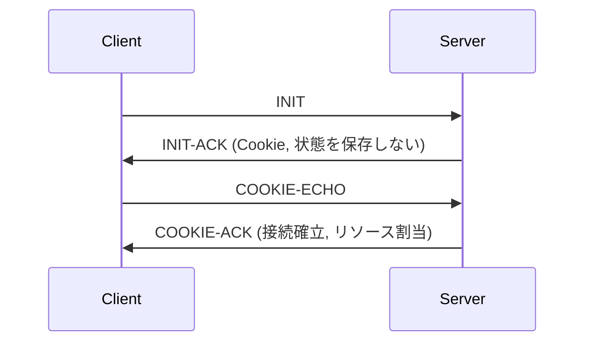

# SCTP (Stream Control Transmission Protocol)

## 1. 概要

### A. 定義
> TCP・UDPの限界を同時に補完した**トランスポート層プロトコル(RFC 4960)** であり、**メッセージ指向 + 信頼性 + マルチストリーミング + マルチホーミング**を同時に提供する。

トランスポート層には長らく二つの軸しか存在しなかった。順序・信頼性を保証するがバイトストリームであるためメッセージ境界がなく、単一の接続が一つの順序列に縛られる**TCP**、そして高速だが信頼性のない**UDP**である。SCTPはこの両者の長所を取り入れ、「信頼性のある転送」と「メッセージ単位の処理」を組み合わせ、さらに通信網の要求から生まれたマルチストリーミング・マルチホーミングを加えた第三のプロトコルとして設計された。

### B. 登場背景および必要性
SCTPは元々、電話網の信号(SS7)をIP網へ移行するSIGTRANの作業から始まった。信号トラフィックは個々の信号が**独立したメッセージ**であり、遅延・損失に敏感で高可用性が必須であるが、TCPで運ぶと二つの壁に突き当たる。一つは先行するセグメントが一つ失われると無関係な後続メッセージまで待たされる**HoL(Head-of-Line)ブロッキング**、もう一つは接続が単一のIP経路に縛られ、その経路が切れるとセッション全体が失われる**単一経路の脆弱性**である。SCTPは一つの接続内に独立した順序列(ストリーム)を複数持たせてHoLを緩和し、接続に複数のIPを登録して経路障害時に即座に切り替えることで、これらの限界を根本的に解消する。

## 2. 主な特徴

SCTPのアイデンティティは、4つの特徴がかみ合うことで生まれる。**マルチストリーミング**は、一つの論理接続(association)内に互いに独立して順序を管理するストリームを複数持たせるもので、あるストリームの損失が他のストリームを妨げないためHoLブロッキングを緩和する。**マルチホーミング**は、一つの接続が両端で複数のIPアドレスを保有するもので、主経路の障害時に予備経路へ切り替えて可用性を高める。**メッセージ指向**は、アプリケーションが送ったメッセージ境界をそのまま保持し、受信側の再組立負担をなくす。これに確認応答・再送に基づく**信頼性とストリームごとの順序**を提供し、接続確立時には**クッキー**でリソース枯渇攻撃を防御する。

| 特徴 | 説明 | 解決する問題 |
|---|---|---|
| **マルチストリーミング** | 一つの接続内に複数の独立ストリーム | HoLブロッキングの緩和 |
| **マルチホーミング** | 複数のIP経路を保有、障害時に切替 | 単一経路の可用性 |
| **メッセージ指向** | メッセージ境界を保持(TCPはバイトストリーム) | 再組立の負担 |
| **信頼性・順序** | SACK確認応答・再送、ストリームごとの順序 | 損失・順序逆転 |
| **セキュリティ(クッキー)** | 4-way handshake + クッキー | SYN Flooding |

## 3. プロトコル構造・動作

TCPが3-wayハンドシェイクで先にリソースを割り当てるのに対し、SCTPは**4-wayハンドシェイクにクッキーメカニズム**を導入し、接続が確定するまでサーバが状態を保存しない。サーバはINITを受信すると接続状態を作らず、必要な情報を署名したクッキーに格納してINIT-ACKで返す。クライアントがそのクッキーをCOOKIE-ECHOで送り返し、正当性が確認されて初めてサーバがリソースを割り当てるため、偽装アドレスでINITだけを大量に送りつける**SYN Floodingに構造的に強い**。

転送単位は**チャンク(Chunk)** であり、共通ヘッダの後に制御チャンク(INITなど)とデータチャンクが一つのパケットに複数バンドルされて載る。データチャンクにはストリーム番号と順序番号(SSN)が付与され、ストリームごとの順序を管理する。

| 要素 | 内容 |
|---|---|
| **Association** | 接続単位(マルチストリーム・マルチホーミングを含む) |
| **Chunk** | 共通ヘッダ + 制御/データチャンクのバンドル |
| **4-way handshake** | INIT→INIT-ACK(クッキー)→COOKIE-ECHO→COOKIE-ACK |
| **輻輳・フロー制御** | TCPに類似(SACKベース、経路ごとに管理) |

## 4. TCP・UDPとの比較

三つのプロトコルの違いは、結局「何を保証し、何を諦めたか」のトレードオフである。UDPはすべての保証を捨てて最高速度を、TCPは信頼性を得る代わりにバイトストリーム・単一経路・HoLを受け入れた。SCTPは信頼性を維持しつつメッセージ境界・マルチストリーム・マルチホーミングまで獲得したが、その分プロトコルが複雑で、中間装置のサポートが不足している。

| 区分 | TCP | UDP | SCTP |
|---|---|---|---|
| **信頼性** | O | X | O |
| **メッセージ境界** | X | O | O |
| **マルチストリーム** | X | X | O |
| **マルチホーミング** | X | X | O |

## 5. 考慮事項および示唆点
技術士の観点から見ると、SCTPは「技術的な優秀さが普及を保証するわけではない」ことを示す代表的な事例である。4G/5GコアのDiameter、SS7信号(SIGTRAN)、WebRTCデータチャネルなど**高可用・マルチパスが必須の領域**では事実上の標準として使われているが、汎用インターネットでは普及が遅い。最大の障害は**ファイアウォール・NAT装置の非対応**であり、多くのミドルボックスがSCTPのプロトコル番号を認識できずに遮断してしまう。これを回避するためにUDP上にSCTPをカプセル化する方式(例:WebRTCのDTLS/UDP上のSCTP)が実務上の解決策となった。したがって導入時には技術的利点とともに**経路上のミドルボックス互換性**を必ず事前検証すべきであり、HoL緩和を狙うのであればQUICのような代替案と比較検討することが望ましい。

---

> **一言まとめ**: SCTPは*信頼性 + メッセージ指向 + マルチストリーミング・マルチホーミング*を組み合わせたトランスポートプロトコルであり、クッキーベースの4-wayハンドシェイクでSYN Floodingを防ぎ、HoLブロッキングの緩和・マルチパスによる可用性を提供するが、NAT・ファイアウォールの非対応が普及の制約となっている。
