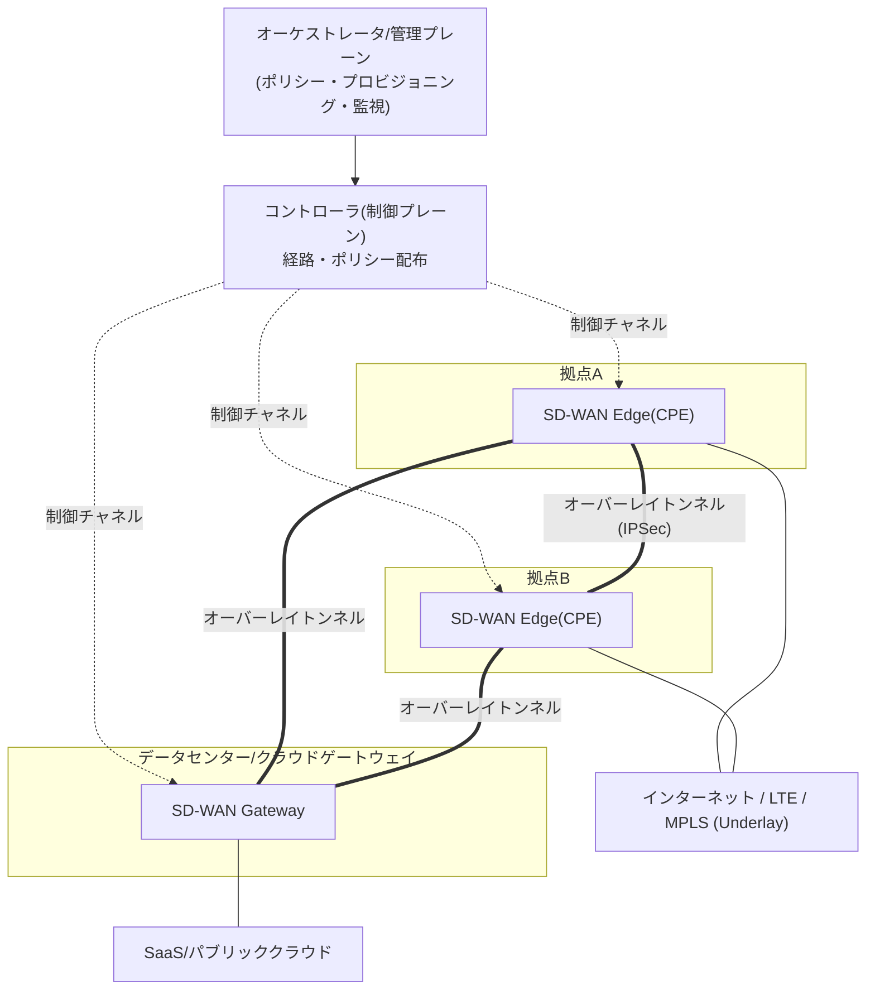
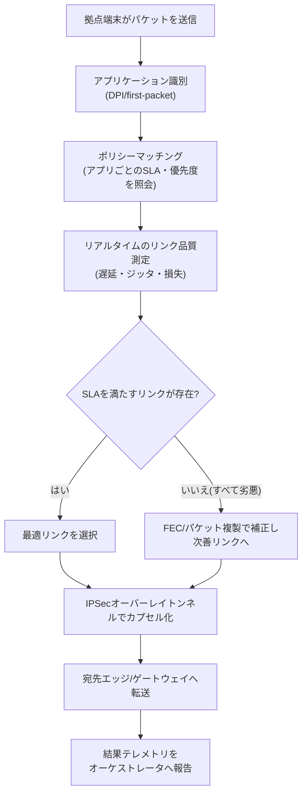

# SD-WAN(Software-Defined WAN, ソフトウェア定義広域網)

## 1. 概要

> **SD-WAN**は、SDN(ソフトウェア定義ネットワーク)の制御・データプレーン分離の思想を広域網(WAN)に適用し、インターネット・LTE/5G・MPLSなど異なる回線を一つの論理的なオーバーレイ(overlay)に束ね、**アプリケーション認識(application-aware)ポリシーに従ってトラフィック経路を中央からソフトウェアで制御**するWANアーキテクチャである。物理回線(underlay)の種類・品質に関係なく、ポリシーとリアルタイムのリンク品質に基づいて最適経路を自動選択する点が、従来のルータベースのWANと区別される。

SD-WANが登場した根本的な背景は、**企業トラフィックの宛先が本社データセンターからクラウド・SaaSへと移った**ことにある。かつて拠点のトラフィックは大部分が本社データセンターのアプリケーションに向かっていたため、高価なMPLS専用線で拠点を本社に接続するハブ&スポーク(hub-and-spoke)構造が合理的であった。しかしMicrosoft 365・SalesforceのようなSaaSやパブリッククラウドへ業務が移るにつれ、インターネットへ直接出ればよいトラフィックを本社へバックホール(backhaul)してから再びクラウドへ送る「トロンボーン(trombone)現象」が深刻化した。これは遅延(latency)と回線コストを同時に増大させる。

これに**MPLS回線の高コストと長いプロビジョニング期間(数週間〜数か月)、拠点ごとのルータを個別のCLIで管理しなければならない運用負担**が加わり、「安価なインターネット回線をMPLS並みに安定して使いつつ、管理は中央からソフトウェアで」行いたいという要求が高まった。SD-WANは回線をコモディティ化(commoditize)された帯域として扱い、その上に暗号化されたオーバーレイトンネルを載せ、**品質の悪いリンクはリアルタイムに迂回し、重要なアプリケーションには良いリンクを割り当てる**方式でこの問題を解決する。結果として、回線コストの削減、拠点開通時間の短縮、クラウド接続体験の改善を同時に狙う。

## 2. 概念構造と中核特性

SD-WANはSDNと同様に、**管理(management)・制御(control)・データ(data)・オーケストレーション(orchestration)プレーン**に機能を分離する。以下の概念図は、中央のコントローラ/オーケストレータが多数の拠点のエッジ装置をどのように統制し、物理回線(underlay)の上に論理オーバーレイがどのように形成されるかを示している。

SD-WANアーキテクチャの特性は4つの軸に整理される。第一に、**プレーン分離(decoupling)** である。経路計算・ポリシー判断は論理的に中央集権化されたコントローラが担い、エッジ装置(CPE)はそのポリシーに従ってパケットを転送するデータプレーンの役割に集中する。拠点のルータごとに個別設定を投入していた方式と異なり、ポリシーを一か所で定義すれば数百の拠点に一括配布されるため、運用が単純になる。例えば新規拠点を1つ開設する「ゼロタッチプロビジョニング(ZTP)」では、現場担当者がCPEの電源と回線を接続するだけで装置がオーケストレータに自動登録され、ポリシーをダウンロードして数十分以内にサービスを開始できる。

第二に、**アプリケーション認識(Application-aware)** である。SD-WANはDPI(ディープパケットインスペクション)とファーストパケット識別(first-packet classification)手法でトラフィックがどのアプリケーションであるかを識別し、アプリケーションごとのSLA(遅延・損失・ジッタの許容値)に合わせて経路を割り当てる。音声・ビデオ会議のようにジッタに敏感なトラフィックは品質の良いリンクへ、大容量バックアップのように遅延に鈍感なトラフィックは安価なリンクへ送るといった具合である。従来のルーティングが5タプル(送信元・宛先IP・ポート・プロトコル)だけで経路を決めていたのと異なり、SD-WANは「このセッションは何をするトラフィックか」というアプリケーションの意味(semantics)まで判断根拠とする。このため、ポリシーは「192.168.x.x帯域をリンク1へ」ではなく「Microsoft 365トラフィックはSLA A、バックアップトラフィックはSLA C」のようにビジネスの言葉で記述され、回線が変わってもポリシーを書き直す必要がない。

第三に、**オーバーレイ/アンダーレイの分離(Overlay/Underlay)** である。物理回線(underlay)がインターネットであれMPLSであれ関係なく、その上に暗号化された論理トンネル(overlay)を形成し、このオーバーレイのレベルで経路を制御する。回線事業者・回線種別への依存を減らし、マルチ回線・マルチ事業者構成を自由にする。

第四に、**中央の可視性・ポリシー一貫性(Centralized visibility)** である。すべてのエッジのリンク品質・アプリケーション使用量・ポリシー違反がオーケストレータのダッシュボードに集約され、全社WANを一つの画面で観測・制御する。これは装置ごとのログを収集して手作業で分析していた従来方式に比べ、障害対応の速度を大きく高める。例えば特定拠点のインターネット回線の遅延が急増した場合、管理者は個別ルータに接続することなくダッシュボードで原因リンクを特定し、ポリシーを調整して即座に迂回させることができる。

加えて、**ローカルブレイクアウト(local breakout)** はSD-WANが実質的な価値を生み出す代表的な機能である。拠点で発生したSaaS・インターネットトラフィックを本社へバックホールせず、拠点の回線から直接インターネットへ出すもので、前述のトロンボーン現象を根本的になくす。ただしこの場合、各拠点がインターネットへの出入口となるため分散したセキュリティ統制が併せて求められ、この点がSASEの議論へとつながる。

## 3. 中核技術要素とトラフィック処理手順

SD-WANの価値は結局、「**どのパケットを、どのリンクで、どの品質基準に合わせて送るか**」をリアルタイムに決定するデータプレーン技術から生まれる。主な技術要素は以下のとおりである。

| 技術要素 | 説明 | 実務的な含意 |
|---|---|---|
| 動的経路選択(DPS) | リンクごとの遅延・ジッタ・損失を継続測定しリアルタイムに最適経路を選択 | 回線品質低下時の無停止迂回 |
| アプリケーション識別 | DPI・first-packet・クラウドシグネチャでアプリを分類 | アプリごとの差別化ポリシー適用 |
| FEC/パケット複製 | 前方誤り訂正・重要パケットの二重送信で損失を補正 | 劣悪なインターネット回線での音声品質確保 |
| オーバーレイ暗号化 | エッジ間IPSecトンネルで機密性・完全性を保証 | インターネット回線をMPLSの代替として安全に利用 |
| アプリケーションSLA | アプリごとの許容遅延・損失しきい値の定義・強制 | ポリシーに基づく自動リンク切替 |

動的経路選択(DPS)はSD-WANの心臓部である。エッジ装置はBFD(Bidirectional Forwarding Detection)などで各リンクにプローブ(probe)を継続送信し、往復遅延・ジッタ・パケット損失を数ミリ秒〜数百ミリ秒の周期で測定する。あるリンクの損失率がアプリケーションSLAのしきい値(例:音声トラフィックの損失1%超過)を超えると、セッションを切断することなく別のリンクへ即座に切り替える(failover)。ユーザは通話が途切れる代わりに一瞬の品質低下を経験するか、あるいはそれに気付きもしない。

ここでSLAしきい値をどう設定するかが運用品質を左右する。しきい値を敏感にしすぎると些細な変動でも経路が揺れ動き(flapping)かえって不安定になり、鈍感にしすぎると品質低下を放置することになる。したがって、アプリケーション特性に合わせて遅延・ジッタ・損失それぞれの許容値とヒステリシス(hysteresis、復帰遅延)を併せて設計することが実務の核心である。

FEC(Forward Error Correction)とパケット複製は、インターネット回線に本来的な不安定さをソフトウェアで補正する手法である。損失の多い区間で重要なリアルタイムパケットを二つのリンクで同時に送信(duplication)し、一方が失われてももう一方の経路で到着するようにしたり、パリティパケットを付加(FEC)して一部の損失を再送なしに復旧したりする。再送が遅延を招くリアルタイムトラフィックで特に効果的である。ただしこれらの手法は帯域を追加消費するコストを伴うため(複製は最大2倍)、すべてのトラフィックではなくSLAが厳格な少数のアプリケーションにのみ選択的に適用するのが原則である。すなわちSD-WANの品質補正は「無条件に良くする」ことではなく、「重要なものに資源を集中する」というポリシー判断の結果である。

オーバーレイ暗号化は、安価なインターネット回線をMPLSの代替として安全に使うための前提である。エッジ装置間でIPSecトンネルを自動的に設定・更新(鍵交換を含む)し、公衆インターネットを通過する企業トラフィックの機密性と完全性を確保する。数百の拠点が互いにフルメッシュ(full-mesh)で接続される場合はトンネル数が急増するため、コントローラが必要なトンネルだけを動的に生成するオンデマンド方式で管理負担を軽減する。

以下の詳細プロセス図は、拠点で発生したパケット一つが識別・ポリシーマッチング・経路選択・トンネリングを経て宛先へ転送される過程を示している。

この流れで注目すべき点は、経路決定が宛先IPだけを見る静的ルーティングではなく、**「どのアプリケーションか × 今各リンクの品質はどうか × ポリシーが何を要求しているか」の3要素を刻々と組み合わせる**ことである。これこそがSD-WANを単純な多回線冗長化(load balancing)と区別する核心である。

一方、SD-WANはエッジ・ゲートウェイをどこに置くかによって大きく3つの展開形態に分かれ、組織のクラウド成熟度とトラフィックパターンに合わせて選択する。

- **オンプレミス型(On-premises)**: 拠点・データセンターに物理CPEを置き、拠点間のオーバーレイのみをソフトウェアで制御する。クラウド接続の比重が低く、既存の回線資産を活用したい組織に適するが、クラウドオンランプの利点は限定的である。
- **クラウド対応型(Cloud-enabled)**: オンプレミスのエッジに加え、主要IaaS/SaaS事業者のクラウドゲートウェイ(オンランプ)と直接連携する。クラウド接続経路が最適化され、SaaSの性能が改善される。
- **クラウド提供型(Cloud-delivered)**: ゲートウェイ機能をベンダーが運営するグローバルPoPでサービスとして提供する。リモートユーザ・多拠点環境に有利であり、SSEを載せればそのままSASEの形へと拡張される。

展開形態の選択は、すなわち「どこからインターネット・クラウドへ出るか」というブレイクアウト地点の設計に直結し、これは性能だけでなくセキュリティ統制の位置も決定するため、アーキテクチャの初期段階で確定すべきである。

## 4. 比較 — 従来型WAN(MPLS)・SD-WAN・SASE

SD-WANの位置付けを理解するには、従来のMPLS WAN、そして上位概念であるSASEとの関係を併せて見る必要がある。以下の表は三者を比較しつつ、差異が生じる理由も併せて説明する。

| 区分 | 従来型MPLS WAN | SD-WAN | SASE |
|---|---|---|---|
| 経路制御 | ルータごとの静的/ルーティングプロトコル | 中央ポリシー・アプリ認識による動的制御 | SD-WANを含む + セキュリティ統合 |
| 回線 | MPLS専用線中心 | インターネット・LTE・MPLSの混用 | クラウドPoPへ収斂 |
| コスト/開通 | 高価・数週間〜数か月 | 低価格・数十分(ZTP) | サブスクリプション型 |
| セキュリティ | 別装置(ファイアウォールなど) | 基本はIPSec、セキュリティは付加 | セキュリティを内在化(ZTNA・SWGなど) |
| クラウド接続 | 本社バックホール(トロンボーン) | 拠点のローカルブレイクアウト | PoPベースの最適経路 |

MPLSとSD-WANの根本的な違いは、**品質保証を「回線契約」で行うか「ソフトウェア制御」で行うか**にある。MPLSは事業者がSLAを契約で保証する代わりに高価で柔軟性が低い。SD-WANは安価な複数回線をソフトウェアで束ね、統計的に品質を確保する。したがってSD-WANがMPLSを完全に置き換えるというよりも、**基幹トラフィックはMPLSに残し、一般・クラウドトラフィックはインターネットへローカルブレイクアウト(local breakout)するハイブリッド構成**が現実的な解決策となる場合が多い。

SD-WANとSASEの関係は、包含関係として理解すると正確である。SASEは「SD-WAN(接続) + SSE(セキュリティサービスエッジ)」をクラウドエッジで融合した上位アーキテクチャである。SD-WANのみを導入すると、拠点がインターネットへ直接出るようになり、境界ファイアウォールがカバーしていたセキュリティ検査ポイントが消えるという空白が生じる。この空白をクラウドセキュリティサービスで埋めるのがSASEの発想であるため、**実務ではSD-WAN導入がSASEへ向かう第一段階**として進められることが多い。

実際の適用事例として、多数の店舗・支店を運営する金融・流通企業では、各拠点にSD-WAN CPEを置き、POS・決済のような基幹トラフィックはMPLS/専用線へ、従業員のWeb・SaaSトラフィックはインターネットへ分離して回線費を30〜50%削減した事例が報告されている。多国籍製造企業は、ビデオ会議(例:Microsoft Teams)トラフィックをアプリケーションSLAに紐付け、ジッタが悪化すると自動的にリンクを切り替えるよう構成して、会議品質に関する苦情を減らしている。

全国に多数の事業所を持つ公共・物流機関も代表的な受益者である。数百の拠点を個別のルータCLIで管理していた機関がSD-WANを導入すると、新規拠点の開通が数週間から数十分(ZTP)へ短縮され、ポリシー変更が中央から一括配布されることで運用人員の反復作業が大きく減る。ただしこの便益はポリシー・標準を事前に精緻に設計した場合に実現するものであり、設計なしに機能だけを導入すると、かえってポリシーの衝突と可視性の欠如によって運用が複雑になり得る点にも併せて留意すべきである。

## 5. 深化 — 最新動向とアーキテクチャの進化

近年のSD-WANは、**単独ソリューションからSASE/SSEの接続軸として吸収される方向**へ進化している。Gartnerは2019年にSASE、2021年にSSEの概念を提示し、ネットワークとセキュリティの融合を市場の潮流と位置付けた。主要ベンダーはSD-WAN製品をSASEプラットフォームの一部として再編している。すなわち「拠点接続」というSD-WAN本来の問題意識が、「どこから接続してもアイデンティティに基づいて安全に接続する」というより広い枠組みへと拡張されているのである。

技術的に注目すべき最新の流れは以下のとおりである。

- **AIOpsベースの自律運用(self-driving WAN)**: リンク品質・アプリケーション性能・ユーザ体験データを機械学習で分析し、障害を事前に予測してポリシーを自動最適化する。
- **クラウドオンランプ(cloud on-ramp)の高度化**: 主要IaaS/SaaS事業者のバックボーンに隣接するゲートウェイで直接接続し、クラウド接続経路を短縮する。
- **DEM(Digital Experience Monitoring)との結合**: ネットワーク指標を超えて実際のユーザが体感するアプリの応答性まで測定し、運用判断の基準を「回線品質」から「ユーザ体験」へと移す。
- **5G/衛星回線のアンダーレイへの編入**: 5Gローカル網・低軌道衛星が新たなバックアップ・主回線の選択肢として組み込まれ、有線回線の敷設が難しい拠点の接続性を広げる。

これらの流れの共通点は、SD-WANが「回線を束ねる技術」から「アプリケーションとユーザ体験を保証するポリシーエンジン」へと重心を移しつつあることである。

試験の観点から予想される出題方向は、(1) SDNとSD-WANの関係および違い、(2) SD-WANの4つのプレーンとオーバーレイ/アンダーレイの概念、(3) アプリケーション認識型経路選択とFECなどの品質補正手法、(4) MPLSと比較した長所・短所とハイブリッド移行戦略、(5) SASE・ZTNAとの連携である。答案構成時は「なぜ登場したか(クラウド移行・MPLSの限界) → どう動作するか(プレーン分離・動的経路) → 何と連携するか(SASE・ゼロトラスト)」というストーリーで展開すれば、論理的な完結性を確保できる。

## 6. 考慮事項および示唆点

技術士の観点から見ると、SD-WANの導入は単なる回線の置き換えではなくWAN運用モデル全般の再設計であるため、次の点を併せて考慮すべきである。

- **セキュリティ空白の先制的設計**: 拠点がインターネットへ直接出るローカルブレイクアウトは性能を改善するが、境界のセキュリティ検査ポイントをなくす。導入初期からクラウドセキュリティ(SWG・ZTNA)やSASEのロードマップを併せて設計し、性能とセキュリティが相反しないよう均衡を取るべきである。

- **ハイブリッド移行戦略とトレードオフ**: MPLSを全面廃止するよりも、基幹系は専用線に残し、一般・クラウドトラフィックをインターネットへ移行する段階的な移行がリスクを下げる。コスト削減(インターネット)と保証されたSLA(MPLS)の間のトレードオフを、アプリケーションの重要度を基準に判断すべきである。

- **ベンダーロックインと運用能力**: コントローラ・オーケストレータ・CPEは通常単一ベンダーのエコシステムに束ねられるため、ロックイン(lock-in)のリスクがある。標準(例:MEF SD-WANサービス標準)への準拠状況、マルチベンダー/マルチクラウドの相互運用性、そしてソフトウェア中心の運用に適した組織能力(ネットワーク+自動化)を併せて確保すべきである。

- **可視性とSLA測定体系**: SD-WANの利点は中央の可観測性から生まれるため、アプリケーション性能・ユーザ体験(DEM, Digital Experience Monitoring)を定量的に測定する体系を併せて構築してこそ、実際の改善効果を検証しポリシーを継続的に改善できる。

- **展望および関連技術**: SD-WANはSASE・ゼロトラスト・エッジコンピューティング・5Gローカル網と結合し、「分散アプリケーション時代の接続レイヤ」として定着する見通しである。AIOpsと結合した自律運用、クラウドオンランプの高度化が差別化のポイントとなるであろう。

## 参考資料
- Gartner, "The Future of Network Security Is in the Cloud" (2019) — https://www.gartner.com/en/documents/3956841
- MEF, "SD-WAN Service Attributes and Services (MEF 70.1)" — https://www.mef.net/resources/mef-70-1-sd-wan-service-attributes-and-services/
- Cisco, "What Is SD-WAN?" — https://www.cisco.com/c/en/us/solutions/enterprise-networks/sd-wan/what-is-sd-wan.html
- Fortinet, "What is SD-WAN?" — https://www.fortinet.com/resources/cyberglossary/sd-wan

---
> **一言まとめ**: SD-WANはSDNのプレーン分離の思想を広域網に適用し、インターネット・LTE・MPLS回線を暗号化されたオーバーレイで束ね、アプリケーション認識ポリシーとリアルタイムのリンク品質に従って経路を中央からソフトウェアで制御することで、コスト・俊敏性・クラウド接続体験を改善するWANアーキテクチャであり、セキュリティと融合することでSASEへと拡張される。
