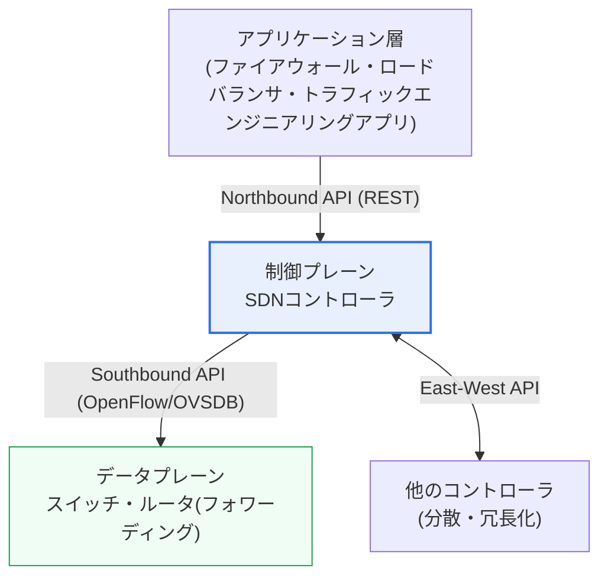
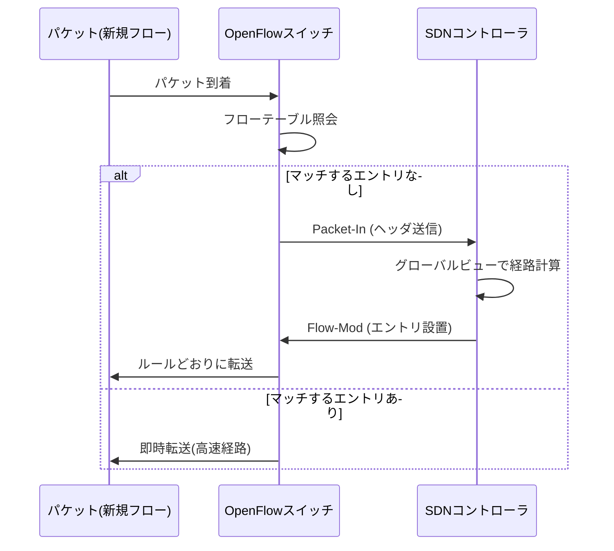

# ソフトウェア定義ネットワーク(SDN, Software Defined Networking)

## 1. 概要

### A. 定義
> **SDN(Software Defined Networking)** は、ネットワーク機器の**制御機能(Control Plane)とデータ転送機能(Data Plane)を物理的・論理的に分離**し、中央集権型のソフトウェア(コントローラ)がネットワーク全体を抽象化・プログラム可能な形で制御するアーキテクチャである。オープンなインタフェース(OpenFlowなど)を通じて、コントローラが下位装置の転送ルールを直接定義する点が核心である。

SDNの根本的な発想は、「**ネットワークをソフトウェアのように柔軟かつ中央集権的に制御しよう**」というものである。これを理解するには、まず従来のネットワークの限界を押さえる必要がある。既存のルータ・スイッチは、「パケットをどこへ送るかを決める頭脳(制御プレーン)」と「実際にパケットを送り出す手足(データプレーン)」を一台の装置の中に併せ持っている。そのため、ルーティングポリシーやアクセス制御ポリシーを一つ変えるにも、数十〜数百台の装置に一台ずつ接続して個別設定(CLI)を行わなければならず、ベンダーごとにコマンド体系が異なるため統合管理が難しい。ネットワークは一つの巨大なシステムであるにもかかわらず、管理の観点では自律的に動く個々の装置の集合のように扱われていたのである。

SDNはこの構造を根本から覆す。「どこへ送るか」を判断する頭脳を各装置から切り離して**中央コントローラ**に集め、残った装置はコントローラの指示どおりにパケットを転送するだけの単純なフォワーディングエンジン(データプレーン)となる。その結果、管理者は中央コントローラのソフトウェア上でネットワーク全体を一望し(グローバルな可視性)、ポリシーをプログラミングするように定義し、その変更を即座にネットワーク全体へ一括反映できる。トラフィックをリアルタイムに再配置して特定経路の混雑を迂回させることも、特定ベンダーに依存せず標準インタフェースで多様な装置を統合制御することも可能になる。

### B. 登場背景と必要性
SDNが浮上した決定的な背景は、**クラウドとサーバ仮想化の普及**である。一台の物理サーバ上に数十の仮想マシン(VM)・コンテナが立ち上がり、それらがオートスケーリングとライブマイグレーションによって頻繁に生成・移動・消滅するようになったことで、ネットワークが対応すべき構成変更の規模と頻度が爆発的に増加した。人が装置ごとに手作業でVLAN・ルーティングを設定する方式では、この速度についていけない。さらに大規模データセンター事業者(Google・Amazonなど)が自社トラフィックをきめ細かく最適化しようとする要求が加わり、ネットワークをコードで制御する**プログラマブルネットワーク**が切実に求められるようになった。SDNはこの流れの中で、スタンフォード・バークレーの研究(2008年頃のOpenFlow論文)とONF(Open Networking Foundation)による標準化を経て、産業標準の概念として定着した。

## 2. SDNの階層構造と制御プレーンの特徴

SDNは下図のように**アプリケーション層 – 制御プレーン – データプレーン**の3階層で構成され、階層間は標準APIで接続される。上側のインタフェースをノースバウンド、下側をサウスバウンドと呼ぶ。

**制御プレーン(コントローラ)** はSDNの頭脳である。ネットワークトポロジ全体を把握して各フロー(flow)をどの経路で送るかを決定し、そのルールを下位装置へ配布する。代表的なオープンソースコントローラとしてOpenDaylight、ONOSがあり、商用ではCiscoのAPIC(ACIベース)などがある。コントローラの特徴は3つに要約される。**中央集権(Centralized control)** は分散していた制御の知能を一か所に集めてポリシーの一貫性を保証し、**グローバルな可視性(Global view)** はネットワーク全体の状態をリアルタイムに俯瞰して最適経路の計算を可能にし、**プログラマビリティ(Programmability)** はネットワークの動作をソフトウェアAPIで定義・自動化できるようにする。

**アプリケーション層**は、コントローラが公開するノースバウンドAPI(主にREST)の上で、ファイアウォール、ロードバランシング、トラフィックエンジニアリング、侵入検知といったネットワークサービスをソフトウェアで実装する。開発者は物理装置の詳細を知らなくても、コントローラが提供する抽象化されたネットワークビューを対象にポリシーアプリを記述できる。これが「ネットワークのアプリケーション化」である。

**データプレーン(装置)** は、コントローラから下達されたルール(フローエントリ)に従って、受信したパケットを転送・破棄・変更する役割のみを担う。自ら経路を判断しないためハードウェアは単純化・高速化され、知能はコントローラのソフトウェアへ集中する。

| 階層 | 役割 | 代表的な技術・インタフェース |
|---|---|---|
| **アプリケーション** | ネットワークポリシー・サービス(ファイアウォール・LB・TE) | ノースバウンドREST API |
| **制御プレーン(コントローラ)** | トポロジ把握、転送ルールの決定・下達 | OpenDaylight, ONOS |
| **データプレーン(装置)** | ルールどおりにパケットを転送(フォワーディング) | OpenFlowスイッチ, OVS |

## 3. OpenFlowプロトコルと動作手順

**OpenFlow**は、SDNコントローラとスイッチ(データプレーン)の間の代表的な標準サウスバウンドプロトコルである。コントローラはスイッチの**フローテーブル(Flow Table)** に「このような特徴のパケットはこう処理せよ」という**フローエントリ(Flow Entry)** を配布し、スイッチは受信したパケットをこのテーブルと照合(match)して定められた動作(action)を実行する。各エントリは大きく**マッチフィールド**(入力ポート、MAC/IPアドレス、ポート番号など)、**アクション**(特定ポートへの転送、破棄、コントローラへの送信、ヘッダ変更)、**カウンタ・タイムアウト**で構成される。

パケットが処理される手順は次のとおりである。スイッチに初めて見るフローのパケットが到着すると、マッチするエントリがないため、スイッチはそのパケット(またはヘッダ)を**Packet-In**メッセージでコントローラに問い合わせる。コントローラはグローバルビューに基づいて経路を計算し、**Flow-Mod**メッセージで関連スイッチのフローテーブルに新しいエントリをインストールする。以後、同じフローのパケットはコントローラを経由せず、スイッチがテーブルだけを見て直ちに転送するため、最初のパケットだけが制御経路を通り、残りは高速なデータ経路を流れる。

この構造がもたらす実務上の利点は明確である。ポリシー変更がコントローラのソフトウェアロジック一か所で行われ、関連スイッチへ自動配布されるため、数百台の装置を個別に設定していた作業がAPI呼び出し一回に置き換わる。データセンターで新規VMが立ち上がる際に、必要なネットワーク経路・セキュリティポリシーをオーケストレータ(例:OpenStack Neutron)がコントローラAPIで即座にプロビジョニングするのが代表的な活用例である。

| 要素 | 内容 |
|---|---|
| **フローテーブル** | パケット処理ルール(マッチ-アクション)の格納場所 |
| **フローエントリ** | マッチ条件 + アクション(転送・破棄・変更) + カウンタ・タイムアウト |
| **Packet-In** | 未マッチのパケットをコントローラに問い合わせ |
| **Flow-Mod** | コントローラがエントリを設置・変更・削除 |

## 4. 従来型ネットワークとの比較、そしてNFVとの違い

SDNの価値を正確に理解するには、**何がなぜ変わるのか**を見る必要がある。従来のネットワークで制御と転送が一台の装置に束ねられている理由は、各装置が自律的にプロトコル(OSPF・BGPなど)を動かして経路を自ら学習するためであり、この自律性は堅牢ではあるものの、全体最適化や迅速なポリシーの一括変更には不利である。SDNは知能を中央に集めて全体最適化と自動化を得る代わりに、中央コントローラへの依存という新たなリスクを抱える。すなわち両者の違いは単純な優劣ではなく、**分散自律か中央集権かという制御哲学のトレードオフ**に由来する。

| 区分 | 従来型ネットワーク | SDN |
|---|---|---|
| 制御・転送 | 装置内で結合 | 分離(制御=コントローラ) |
| ポリシー変更 | 装置ごとの手動設定 | 中央でのプログラミング・一括配布 |
| 可視性 | 装置単位 | ネットワーク全体のビュー |
| ベンダー依存 | 高い | 標準APIで緩和 |
| 主なリスク | 管理の複雑さ・変更の遅さ | コントローラの単一障害点 |

一方、SDNとよく混同される概念が**NFV(Network Function Virtualization)** である。両者は相互補完的だが、異なる問題を解決する。SDNは「制御と転送を分離してネットワークを中央からプログラミングする」ことに焦点があり、NFVはファイアウォール・ルータ・ロードバランサのような**ネットワーク機能を専用ハードウェア(アプライアンス)から切り離し、汎用サーバ上のソフトウェア(VNF)として実装する**ことに焦点がある。通信事業者(Telco)は両技術を組み合わせ、NFVで仮想化したネットワーク機能をSDNで柔軟に接続・制御する方式で5Gコアとエッジインフラを構築している。例えばネットワークスライシングは、SDN・NFVの結合の上で一つの物理インフラを用途別の論理ネットワークに分割する代表的な事例である。

このトレードオフは展開方式にも現れる。コントローラがフロールールをいつインストールするかによって、**プロアクティブ(Proactive)** と**リアクティブ(Reactive)** に分かれる。プロアクティブは予想されるフローのルールを事前にスイッチへ配置しておく方式であり、最初のパケットもコントローラを経由しないため遅延が低くコントローラ負荷も小さいが、テーブル容量を多く消費する。リアクティブは前述のPacket-In方式のように、フローが初めて現れたときにルールをインストールする方式であり、テーブルを節約でき柔軟だが、最初のパケットの遅延とコントローラ負荷が大きくなる。大規模データセンターは通常、予測可能な大量トラフィックにはプロアクティブを、例外的なフローにはリアクティブを組み合わせたハイブリッドで運用する。

## 5. 深化 — 実務適用と最新動向

SDNはすでに研究概念を超え、大規模商用インフラの根幹となっている。最もよく知られた事例は**GoogleのB4**であり、世界中のデータセンターを結ぶWANにSDNを適用し、リンク利用率を大幅に引き上げたと報告されている(従来のWANが障害に備えてリンクに余裕を残しておくのとは異なり、中央制御でトラフィックを密に詰めることで利用率を大きく高めたとされる)。データセンター内部では、VMware NSX、Cisco ACIのような商用ソリューションがSDNの原理を適用した**ネットワーク仮想化(オーバーレイ)** を提供し、オープンソース陣営ではOpen vSwitch(OVS)が事実上の標準ソフトウェアスイッチとして使われている。

通信事業者の領域でも適用が活発である。5Gコア網は制御とユーザプレーンを分離するCUPS(Control and User Plane Separation)構造を採用したが、これは制御・データプレーンの分離というSDNの思想が標準的な移動通信アーキテクチャに反映された事例と見ることができる。これにNFVで仮想化したネットワーク機能を組み合わせることで、一つの物理インフラを超低遅延・大容量・大規模IoTなど用途別の論理ネットワークに分割するネットワークスライシングが実現される。

技術進化の方向性も明確である。第一に、**インテントベースネットワーキング(IBN, Intent-Based Networking)** への発展である。管理者が経路・ルールを細かく指定する代わりに、「AサービスはBサービスとのみ通信し、遅延10ms以内を保証せよ」のような**意図(intent)** だけを宣言すれば、システムがこれを具体的な設定へ自動変換し、継続的に検証・是正する。第二に、**データプレーンプログラミング**の深化であり、P4言語とプログラマブルスイッチが登場したことで、OpenFlowが扱っていた固定のマッチフィールドを超え、パケット処理パイプライン自体をコーディングできるようになった。第三に、WAN領域では**SD-WAN**が企業の拠点接続にSDNの原理を適用し、MPLS専用線への依存を減らしてインターネット・LTEをポリシーベースで併用する方式として急速に普及した。

同時に、純粋なOpenFlow中心の初期SDNビジョンは、現実には相当部分が修正されたという点もバランスよく見る必要がある。既存のルーティングプロトコルと装置エコシステムを一度に置き換えるのは難しく、コントローラの性能・拡張性の負担も大きいため、実際の商用展開は、物理ネットワークはそのままにその上に論理ネットワークを載せる**オーバーレイ方式(VXLANベースのネットワーク仮想化)** や、既存装置の標準API(NETCONF/YANG、gNMI)を活用した**ネットワーク自動化・プログラマビリティ**の方へ重心が移った傾向がある。すなわち、「制御・転送の完全分離」という原型よりも、「ネットワークをソフトウェアで定義・自動化する」というSDNの本質的価値が多様な形で継承・拡散していると見るのが正確である。

これらの動向に共通する流れは、「ネットワーク運用を人の手動介入からソフトウェアによる宣言的自動化へ移すこと」であり、これはインフラをコードで管理するIaC(Infrastructure as Code)・クラウドネイティブ運用の哲学と正確に符合する。結局SDNは、特定プロトコルの勝敗で評価すべき概念ではなく、ネットワークをプログラマブルな資源として扱う考え方そのものの転換として理解すべきである。

## 6. 考慮事項および示唆点

技術士の観点では、SDNを個別プロトコルではなく**ネットワーク運用パラダイムの転換**として理解し、導入時には次のトレードオフを併せて設計すべきである。

1. **中央コントローラの単一障害点(SPOF)を必ず解消する。** 制御の知能が一か所に集中するため、コントローラの障害はネットワーク制御の麻痺に直結する。したがって、コントローラのクラスタリング・冗長化、イースト-ウエストAPIによる分散コントローラ構成、コントローラとの接続断時にも既存フローで転送を維持するフェイルセーフ設計が必須である。

2. **制御チャネルのセキュリティと性能を確保する。** コントローラ–スイッチ間のチャネルが掌握されるとネットワーク全体が脅かされるため、TLSなどでチャネルを保護し、大量のPacket-Inがコントローラに殺到して処理ボトルネック・DoSとならないよう、フローのインストールポリシー(プロアクティブ vs リアクティブ)とレート制限を設計すべきである。

3. **段階的・ハイブリッドな移行戦略を採用する。** 既存の従来型装置を一度に置き換えるのは難しいため、オーバーレイ(VXLAN)ベースのネットワーク仮想化やSD-WANのようにリスクの低い領域から導入し、レガシーと共存させる段階的なマイグレーションが現実的である。

4. **自動化・オーケストレーションおよび関連技術と統合する。** SDNの真の価値は単独ではなく、NFV・クラウドオーケストレータ・IaC・インテントベース運用と組み合わせたときに発揮される。標準API(ノースバウンドREST)の確保、マルチベンダーの相互運用性、運用人員のソフトウェア・API能力の確保が、導入成功の前提となる。

5. **投資対効果と運用成熟度を併せて考慮する。** SDNの導入は装置の入れ替え・コントローラの構築・人員の再教育という初期コストを伴うため、ネットワーク変更が頻繁で規模の大きいデータセンター・マルチクラウド環境のように、自動化の効果が明確な領域に優先適用するのが合理的である。反対に、変更がまれで安定性が最優先の小規模・閉域網では従来方式が依然として有効な場合があるため、組織の運用成熟度とトラフィック特性に合わせた選択的な導入が求められる。

## 参考資料
- Open Networking Foundation, SDNの定義・アーキテクチャ. https://opennetworking.org/sdn-definition/
- OpenFlow Switch Specification(ONF). https://opennetworking.org/software-defined-standards/specifications/
- Software-defined networking(Wikipedia). https://en.wikipedia.org/wiki/Software-defined_networking

---

> **一言まとめ**: SDNは*制御プレーンとデータプレーンを分離*し、中央コントローラがグローバルな可視性・プログラマビリティによってネットワークをソフトウェアのように制御するアーキテクチャであり、OpenFlowで装置のフローテーブルにルールを下達し、ネットワーク仮想化・NFV・インテントベース自動化の基盤となるが、コントローラの単一障害点と制御チャネルのセキュリティが中核課題である。
