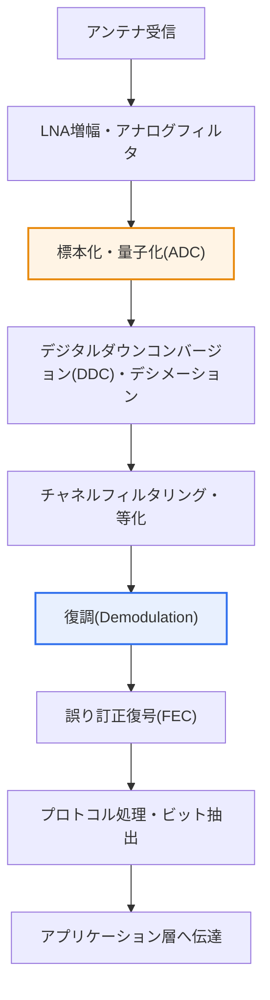

# SDR(Software Defined Radio)

## 1. 概要

### A. 定義

> **SDR(Software Defined Radio)**とは、無線通信の**信号処理機能(変調・復調・フィルタリング・周波数変換・プロトコル処理など)を専用ハードウェア回路ではなくソフトウェアで実装**し、一つの無線機器がソフトウェアの変更だけで異なる通信方式・周波数・帯域幅をサポートできるようにする、再構成可能(Reconfigurable)な無線技術である。

SDRの中核的な発想は、「**無線の機能をハードウェアに固定せず、ソフトウェアで柔軟に定義しよう**」というものである。従来の無線機器は特定の通信規格(例:2G GSM、FMラジオ)に合わせて、変復調器・ミキサ・フィルタなどを専用のアナログ/デジタル回路として作り込んでいた。規格がハードウェアに「焼き付けられて」いるため、新しい世代(3G・4G・5G)や異なる方式が登場すると、回路そのもの、すなわち機器を丸ごと交換しなければならなかった。これはコストが大きく、一度設置すると変更が難しいという根本的な硬直性を意味する。

SDRはこの構造を正反対にひっくり返す。アンテナで受信したアナログ信号を**可能な限り早い段階でデジタルに変換(早期デジタル化)**したうえで、以降のすべての処理(ダウンコンバージョン・フィルタリング・復調・誤り訂正・プロトコル解釈)を、汎用プロセッサ(CPU/GPU)・DSP・FPGA上で動作するソフトウェアで実行する。その結果、ハードウェア(RFフロントエンド・ADC/DAC)はそのままに、**ソフトウェアを入れ替えたりパラメータを変えたりするだけで全く異なる通信システムを動作**させることができる。コンピュータがプログラムを変えるだけで文書作成・ゲーム・計算のすべてをこなすように、一つの無線プラットフォームが複数の規格を扱えるのである。

こうした柔軟性により、SDRは多様な規格を同時に扱う必要のある**軍用戦術通信(JTRS)**、規格の進化が頻繁な**移動通信基地局**、ミッションごとに帯域が変わる**衛星・アマチュア無線**、そして周囲の電波環境を感知して自ら帯域を切り替える**コグニティブ無線(Cognitive Radio)**の共通基盤技術として定着した。要約すれば、SDRは無線を「ソフトウェア化」することで、再構成可能性(Reconfigurability)・拡張性(Scalability)・相互運用性(Interoperability)を同時に確保した技術であるといえる。

### B. 登場背景と必要性

SDRが求められた背景は、大きく三つに整理される。第一に、**無線規格の乱立と急激な世代交代**である。2G→3G→4G→5Gと約10年周期で標準が変わり、Wi-Fi・Bluetooth・LoRa・衛星など異種規格が共存するなかで、規格ごとに専用ハードウェアを用意する方式は、コスト・スペース・運用の面で持続不可能になった。第二に、**周波数資源の希少性**である。限られたスペクトルを効率的に再利用するには、状況に応じて帯域・変調方式を動的に変更できなければならないが、これはソフトウェアベースの再構成なしには不可能である。第三に、**半導体・演算性能の進歩**である。高速ADC/DACとFPGA・DSP・汎用プロセッサの性能が、無線帯域幅のリアルタイムなデジタル処理に耐えうる水準に達したことで、ハードウェアでしか実現できなかった信号処理をソフトウェアへ移すことが現実のものとなった。これら三つの流れが噛み合い、ハードウェアを交換せずにソフトウェアで対応する柔軟・再構成可能な無線技術の必要性が高まった。

## 2. 全体構造

SDRシステムは大きく、アンテナに近い**RFフロントエンド**、アナログとデジタルの世界をつなぐ**ADC/DAC**、そして信号処理・プロトコルを担う**ソフトウェア処理部**の三層で構成される。設計の中核的な思想は、前述のとおり「ADC/DACをアンテナにできるだけ近く配置」してアナログハードウェアの比重を最小化し、柔軟性が必要な機能を可能な限りデジタル・ソフトウェア領域へ引き込むことにある。

**RFフロントエンド**は、アンテナから入ってきた微弱な信号を低雑音増幅(LNA)し、目標帯域をアナログフィルタで抽出し、ミキサで周波数を移す純粋なアナログ領域である。この部分は物理法則上、完全なソフトウェア化が難しく、SDRにおいてもアナログとして残る最小限のハードウェアである。ただし広帯域RFフロントエンドを用いれば複数の帯域を一つのハードウェアでカバーできるため、柔軟性はここから始まる。

**ADC/DAC**は、SDRの成否を分ける中核部品である。ADC(受信)はアナログ信号を標本化・量子化してデジタルに変換し、DAC(送信)はその逆を行う。ADCをアンテナに近づけるほど(すなわち、より高い周波数で直接デジタル化するほど)ソフトウェアで扱える範囲は広がるが、ナイキストの定理に従い標本化レート(例:数百MSPS~数GSPS)と有効ビット数(ENOB)を高くする必要があるため、部品コスト・消費電力が急増する。ここで「どれだけ早い段階でデジタル化するか」という設計上のトレードオフが生じる。

**ソフトウェア処理部**は、デジタル化された標本ストリームを受け取り、ダウンコンバージョン・デシメーション(デジタルフロントエンド)の後、変復調・チャネル等化・誤り訂正符号化/復号・プロトコルスタックをソフトウェアで処理する。実行プラットフォームは、柔軟性の高い汎用CPU/GPU、リアルタイム性が重要なDSP、広帯域の並列処理に強いFPGAに分かれ、実際のシステムではこれらを組み合わせて(例:FPGAで高速前処理、CPUでプロトコル)性能と柔軟性の折り合いをつける。

| 構成層 | 代表的な機能 | 実装特性 |
|---|---|---|
| **RFフロントエンド** | 低雑音増幅・周波数変換・アナログフィルタ | アナログ(HW)、広帯域化で柔軟性を確保 |
| **ADC/DAC** | アナログ↔デジタル変換(標本化・量子化) | HW、標本化レート・ENOBが性能を左右 |
| **デジタルフロントエンド** | ダウンコンバージョン(DDC)・デシメーション・整形 | 主にFPGA |
| **ソフトウェア処理部** | 変復調・等化・FEC・プロトコルスタック | CPU/GPU・DSP・FPGAの組み合わせ |

## 3. 受信動作手順(Processing Pipeline)

SDRが信号を受信してデータに復元する過程を段階ごとに追うと、どこまでがハードウェアでどこからがソフトウェアなのかが明確になる。以下の手順図は受信(Rx)経路を細分化したものであり、前の全体構造図が「何で構成されるか」を示したのに対し、この図は「どの順序で処理されるか」を示している。

前半部(S1~S3)は、アナログおよび変換ハードウェアの領域である。アンテナから入った信号はLNAで増幅され、広帯域アナログフィルタで帯域が制限された後、ADCでデジタル標本に変換される。この地点がSDRの境界線であり、以降の段階はすべてソフトウェアで置き換え可能である。別の通信規格に切り替えたい場合、この前半部はおおむねそのままにして後半部のソフトウェアだけを入れ替えればよいという点に、SDRの柔軟性が具体的に表れている。

中盤部(S4~S6)は、ソフトウェア信号処理の核心である。デジタルダウンコンバージョン(DDC)は関心帯域をベースバンドへ移し、デシメーションによって標本レートを下げて後続の演算負荷を軽減する。続いてチャネルフィルタリング・等化によってマルチパス・雑音の影響を補正した後、復調段階で実際の変調方式(例:QPSK、64-QAM、OFDM)に合わせてシンボルをビットへ戻す。規格に応じてこの復調アルゴリズムだけを変えればよいため、一つのSDRでFMラジオとLTE信号の両方を復元できる理由はここにある。

後半部(S7~S9)は、信頼性の確保と上位処理である。チャネルを通過する間に生じたビット誤りをFEC(例:ターボ符号・LDPC符号)で訂正し、プロトコルスタックがフレームを解釈して実際のユーザーデータを抽出した後、アプリケーション層へ伝達する。この全過程がソフトウェアであるため、ログ収集・性能監視・リモートアップデートといった運用機能まで統合しやすいことも実務上の利点である。

## 4. 特徴・活用と類似概念の比較

SDRの特徴は柔軟性・拡張性・コスト効率という三つの軸に要約されるが、各特徴が「なぜ」生じるのかを理解することが重要である。**柔軟性・再構成性**は、機能がソフトウェアにあるために生じる。同じハードウェアでソフトウェアを変えるだけで複数規格・複数周波数をサポートするため、一台の機器で複数のミッションを遂行できる。**拡張性**は、新規格が登場してもソフトウェアアップグレード(事実上のリモート配布)で対応でき、機器の寿命が延びることに由来する。**コスト効率**は、初期のハードウェア単価はやや高くなりうるものの、世代交代のたびに機器を廃棄しないため、全ライフサイクルコスト(TCO)が低下するという形で現れる。

| 区分 | 内容 | 実務上の含意 |
|---|---|---|
| **柔軟性・再構成** | SW変更で複数規格・周波数をサポート | 一台で多ミッション、相互運用性の確保 |
| **拡張性** | 新規格にSWアップグレードで対応 | リモート配布、機器寿命の延長 |
| **コスト効率** | HW交換の最小化 | 初期コスト↑・ライフサイクル総コスト↓ |
| **主な活用** | 軍事戦術通信、基地局、衛星、コグニティブ無線 | 複数規格の共存・動的スペクトル環境 |

代表的な活用例として**コグニティブ無線(Cognitive Radio)**がある。コグニティブ無線は周囲の周波数使用状況をリアルタイムに感知(Spectrum Sensing)し、空いている帯域(White Space)を見つけて機会的に利用する技術である。このような「感知後に即座に帯域・変調を変更する」という動的再構成は、機能がソフトウェアで実装されたSDRの上でのみ実現可能である。すなわちSDRは、コグニティブ無線を支える実行基盤(Enabler)である。

類似・関連概念との関係も整理しておく必要がある。**SDR**が無線端末/機器レベルでの「無線機能のソフトウェア化」であるとすれば、**SDN(Software Defined Networking)**はネットワークレベルで「制御プレーンとデータプレーンを分離して制御をソフトウェア化」したものであり、**NFV(Network Function Virtualization)**はファイアウォール・ルータのようなネットワーク機能を汎用サーバ上のソフトウェアとして仮想化したものである。三つの技術は「機能をハードウェアからソフトウェアへ移して柔軟性を得る」という共通の思想を共有しており、**Open RAN**においてこれらが結合し、基地局(RU/DU/CU)の無線・ネットワーク機能がともにソフトウェア化・オープン化される流れへと収束する。違いが生じるのは扱う階層であり、SDRは物理(PHY)の無線信号、SDNはネットワーク制御、NFVはネットワーク機能にそれぞれ焦点を当てる。

| 区分 | 対象階層 | 中核アイデア |
|---|---|---|
| **SDR** | 物理(無線PHY) | 無線信号処理をSWで実装 |
| **SDN** | ネットワーク制御 | 制御/データプレーンの分離、制御のSW化 |
| **NFV** | ネットワーク機能 | 専用機器の機能をSWで仮想化 |

## 5. 深掘り — 最新動向と産業への適用

SDRは近年、移動通信・国防・宇宙分野で実質的なインフラ技術として普及しつつあり、これはSDRが単なる実験室の概念ではなく、商用システムの基盤であることを示している。

第一に、**Open RANとvRAN(仮想化基地局)**である。従来の基地局は特定ベンダーの専用ハードウェアに機能が縛られていたが、Open RANは無線アクセス網をRU(Radio Unit)・DU(Distributed Unit)・CU(Centralized Unit)に分離し、インタフェースをオープン化する。このときDU/CUのベースバンド信号処理は相当部分が汎用サーバ上のソフトウェアで実装されるが、これは本質的にSDR・NFVの思想の結合である。通信事業者が特定ベンダーへの依存を減らし、多様なサプライヤーの機器を組み合わせられるようにすることが中核的な動機である。

第二に、**衛星・非地上系ネットワーク(NTN, Non-Terrestrial Network)**である。低軌道(LEO)衛星通信では打ち上げ後に衛星ハードウェアを交換できないため、ソフトウェアで機能を更新・再構成できるSDRペイロードが特に有利である。実際、多くの低軌道衛星事業がソフトウェア定義ペイロードを採用し、軌道上でミッション・帯域を再プログラミングする方向に進んでいる。5G標準(3GPP Rel-17以降)がNTNを正式に含むようになったことで、地上網と衛星網を一つのソフトウェア定義インフラとして統合しようとする試みが続いている。

第三に、**国防・戦術通信**である。SDRの初期の大規模プロジェクトである米国のJTRS(Joint Tactical Radio System)以来、複数の異種無線規格を一台の端末で相互運用しようとする軍の要求は、SDR発展の強力な原動力であった。一台の無線機が味方の多様な通信方式をソフトウェアの切り替えだけでサポートできれば、戦場における相互運用性とセキュリティ対応が大きく向上する。

第四に、**低価格SDRの大衆化**である。かつて高価な機器であったSDRは、RTL-SDR・HackRF・USRPのような低価格~中価格帯のプラットフォームと、GNU Radioのようなオープンソースツールチェーンの普及により、研究・教育・アマチュアの領域まで広がった。これはSDR技術の裾野を広げると同時に、後述するセキュリティ脅威(信号改ざん・ジャミングの参入障壁の低下)という両面性ももたらした。

## 6. 考慮事項および示唆点

1. **性能と柔軟性のトレードオフを設計初期に決定しなければならない。** ソフトウェア処理は柔軟であるが、専用ハードウェア(ASIC)よりも処理遅延・消費電力が大きく、広帯域のリアルタイム処理には高性能なADC/DACとFPGAが必要となるためコストが上昇する。したがって「どの機能までソフトウェアに移すか」「ADCをどこまでアンテナに近づけるか」を要求性能・電力予算・コストに合わせてバランスよく決定し、遅延に敏感な部分はFPGA/DSPへ、柔軟性が重要な部分は汎用プロセッサへ配置する異種分割が現実的である。

2. **セキュリティ脅威への防御が必須である。** 無線機能をソフトウェアで変更できるということは、悪意あるソフトウェア改ざん・ジャミング・電波妨害・スプーフィングに悪用されうることも意味する。特に低価格SDRの大衆化により攻撃の参入障壁が下がった。したがってSDRソフトウェアの完全性検証(署名・セキュアブート)、リモートアップデートチャネルの認証・暗号化、異常信号の検知を併せて設計しなければならず、これは国防・基地局のような重要インフラであるほど厳格に要求される。

3. **標準化・相互運用性の確保が普及の鍵である。** SDRの価値は多様な規格を相互運用することにあるため、ソフトウェアとハードウェア間の標準インタフェース(例:SCA、Open RAN規格)を遵守して初めて、異なるサプライヤーのソフトウェア・ハードウェアを組み合わせることができる。標準を無視した独自実装は、SDRのオープン性・拡張性という本質的な利点を自ら損なう。

4. **5G/6G・衛星通信の再構成可能なインフラへと発展する。** SDRはSDN・NFV・Open RANと結合し、地上網と非地上系ネットワーク(NTN)を包含するソフトウェア定義無線インフラの物理層基盤となる。6Gで議論されている超広帯域・インテリジェントなスペクトル共用・AIベースの信号処理も、ソフトウェアで無線を定義するSDRの上で実装される可能性が高い。技術士の観点からは、SDRを個別の機器技術ではなく「ソフトウェア定義インフラ(Software Defined Infrastructure)」という大きな流れの一軸として理解し、関連技術と連携させてアーキテクチャを設計する視点が必要である。[[sdn]]

## 参考資料

- 3GPP, "Non-Terrestrial Networks (NTN)" 関連リリースの概要 — https://www.3gpp.org/technologies/ntn-overview
- O-RAN ALLIANCE, "O-RAN Specifications" — https://www.o-ran.org/specifications
- GNU Radio Project — https://www.gnuradio.org/about/

---

> **一言まとめ**: SDRは*無線信号処理(変復調・フィルタ・プロトコル)をソフトウェアで実装し、一台の機器で複数の規格・周波数をサポート*できるようにする再構成可能な無線技術であり、早期デジタル化とソフトウェア処理によって柔軟性・拡張性・相互運用性を確保し、コグニティブ無線・Open RAN・衛星(NTN)を含む5G/6Gソフトウェア定義インフラの物理層基盤となる。
