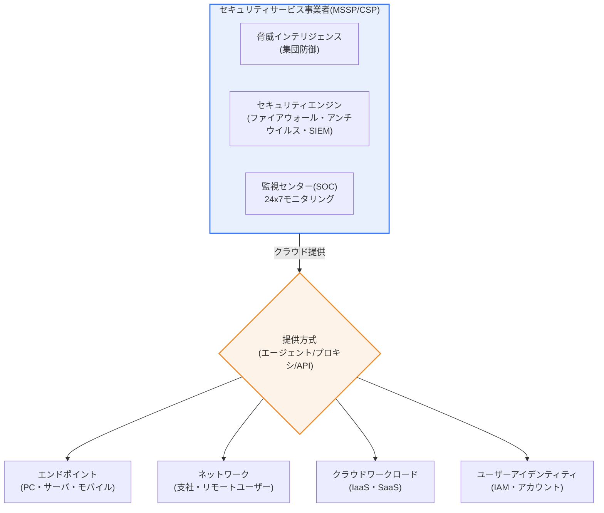
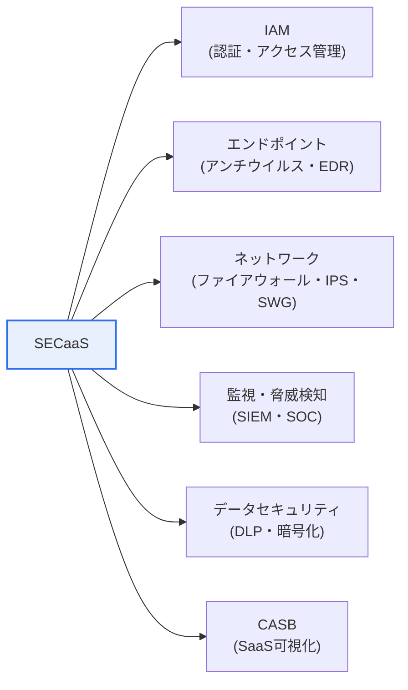

# SECaaS(Security as a Service)

## 1. 概要

### A. 定義
> **SECaaS(Security as a Service)** とは、ファイアウォール・アンチウイルス・認証・脅威検知・監視などの**セキュリティ機能(security function)をクラウドベースのサブスクリプション(subscription)サービスの形で提供**を受けて利用するモデルであり、組織がセキュリティ機器と人員を自ら保有・運用することなく、専門セキュリティ事業者(MSSP・CSP)のインフラと脅威インテリジェンスを利用料ベース(pay-as-you-go)で活用できるようにするクラウドサービス類型である。

SECaaSが登場した根本的な理由は、「**セキュリティはますます難しくなっているのに、すべての組織が自前のセキュリティ能力を備えることは困難である**」という構造的な不均衡にある。サイバー脅威はランサムウェア・サプライチェーン攻撃・API悪用のようにますます精巧・多様化しており、これに対応するには最新のセキュリティソリューションと24時間の監視要員、そして絶えず更新される脅威情報が必要である。しかし、この三つをすべて自前で備えることは、一部の大企業にとってさえ負担が大きい。中小企業は高価な次世代ファイアウォール(NGFW)やSIEMを購入し、セキュリティオペレーションセンター(SOC)を24時間運用する余力がなく、大企業もすべてのセキュリティ領域を内製化するにはコスト・専門性の限界が明らかである。

SECaaSはこの問題を、「**クラウドのサービス化(as-a-Service)の概念をセキュリティに適用**」する方式で解決する。セキュリティ専門事業者が大規模に構築・運用するセキュリティインフラを複数の顧客がマルチテナント(multi-tenant)のサブスクリプション形態で共有し、顧客は初期の資本投資(CapEx)なしに使用した分だけ運用費(OpEx)として支払い、常に最新状態にパッチ・更新された専門的なセキュリティサービスを受ける。特に複数の顧客から収集された脅威情報が一箇所に集約・共有されるため、ある顧客で検知された新種の脅威のシグネチャが直ちに全顧客の防御に反映される「**規模の防御(collective defense)**」効果が生じる。すなわちSECaaSはセキュリティを「所有(own)の対象」から「利用(consume)の対象」へ転換したものであり、同時にセキュリティ統制権の一部を外部に委ねる分、データ主権・責任境界の問題も併せて抱えている。

### B. 登場背景と特徴
脅威の高度化、セキュリティ専門人材・予算の慢性的な不足(セキュリティ人材の需給ギャップ)、クラウドおよびリモートワークの拡大によって保護対象がデータセンター境界の外へ分散した状況が重なり、セキュリティをサブスクリプション型サービスとして提供するSECaaSが急速に普及した。SECaaSの本質的な特徴は、①**クラウドによる提供**(エージェント・プロキシ・API連携で提供)、②**サブスクリプション・従量課金**(OpExへの転換)、③**自動更新**(シグネチャ・ルール・エンジンの常時最新化)、④**弾力的な拡張性**(トラフィック・エンドポイントの増加に柔軟に対応)、⑤**脅威インテリジェンスの共有**(マルチテナントベースの集団防御)に要約される。これらの特徴は、後述するSASE/SSEへの進化に直接つながっている。

## 2. 全体構造と提供アーキテクチャ

SECaaSは「**誰が(事業者)–何を(セキュリティ機能)–どのように(クラウド提供)–誰に(顧客資産)**」の四つの軸で構成される。以下の全体構造図は、セキュリティ事業者が提供するサービス群がクラウドを通じて顧客の多様な資産(エンドポイント・ネットワーク・クラウドワークロード・ユーザー)を保護する関係を示している。

提供アーキテクチャを文章で説明すると、SECaaSは大きく三つの方式で顧客資産に接続される。第一に、**エージェント(agent)方式**はエンドポイントに軽量ソフトウェアをインストールしてアンチウイルス・EDR・DLPを実行するものであり、端末が社内網の外に出ても保護が維持される。第二に、**プロキシ(proxy)・インライン方式**はトラフィックを事業者のクラウドゲートウェイへ迂回させてWebフィルタリング・ファイアウォール・IPSを適用するものであり、リモートワーカーのインターネット接続をクラウドSWGで検査するのが代表例である。第三に、**API連携方式**はSaaS(例:Microsoft 365、Salesforce)のAPIに接続してデータ漏えい・共有設定を監査(out-of-band)するものであり、CASBのAPIモードがこれに該当する。これら三つの方式は排他的ではなく併用され、どの方式を選ぶかによって遅延(latency)・可視性・ユーザー体験が異なるため、導入時にはトラフィック特性に合わせて設計しなければならない。

### A. 責任共有モデル(Shared Responsibility)
SECaaSをアーキテクチャの観点から理解する際に最も重要なのは、「**セキュリティ責任を事業者と顧客が分担する**」という責任共有モデルである。事業者はセキュリティサービス自体の可用性・エンジンの最新性・インフラのセキュリティに責任を負い、顧客はポリシー設定・アカウント管理・データ分類・ログレビューに責任を負う。問題は、この境界が曖昧なときに「**誰も責任を負わない管理の空白**」が生じる点である。例えば、クラウドファイアウォールのポリシーを顧客が誤って設定してポートを開けたままにすると、サービスが正常に動作していても侵害が発生する。したがって導入段階でRACI形式により責任境界を文書化し、事業者のダッシュボードが提供する可視性に見合うだけ顧客が実際にレビュー・対処しているかを、運用プロセスとして明確に定めておかなければならない。

## 3. 主なサービス類型

SECaaSは保護対象の階層に応じて複数のサービスに分化する。以下は類型別の概要であり、表の後に各類型が「なぜクラウドで提供されると有利なのか」を記述する。

| 類型 | 代表的な機能 | クラウド提供時の利点 |
|---|---|---|
| **IAM** | SSO・MFA・権限管理 | アイデンティティベースの統制をSaaS・リモートまで一貫して適用 |
| **エンドポイントセキュリティ** | クラウドアンチウイルス・EDR・XDR | 端末の位置に関係なく保護、脅威情報を即時反映 |
| **ネットワークセキュリティ** | ファイアウォール・IPS・Webフィルタリング(SWG) | 支社・在宅まで境界のない検査 |
| **脅威管理・監視** | SIEM・SOC・脅威インテリジェンス | 24x7の専門監視をサブスクリプションで確保 |
| **データセキュリティ** | DLP・暗号化・メールセキュリティ | SaaSのデータ漏えいまでポリシーを拡張 |
| **CASB** | SaaS利用の可視化・統制 | シャドーIT検知、クラウドアプリのガバナンス |

**IAM(Identity and Access Management)** がSECaaSとして提供される際の中核的な価値は、「境界が消えた環境ではアイデンティティが新たな境界となる」点にある。オンプレミスの時代には社内網への接続そのものが信頼の根拠であったが、ユーザーがカフェ・自宅・海外からSaaSに接続する今日では、「誰が接続しているのか」をリクエストのたびに検証しなければならない。クラウドIAMはSSOで複数のSaaSへのログインを一元化し、MFA・適応型認証(リスクベース)でアカウント乗っ取りを防御するものであり、これはゼロトラストの出発点となる。

**エンドポイントセキュリティ**は、EDR/XDRへと進化することでSECaaSの代表的な成功例となった。単純なシグネチャ型アンチウイルスは新種・亜種のマルウェアを見逃すが、クラウドEDRは全顧客の端末の振る舞いデータを集約・分析して異常な振る舞いを検知し、一箇所で発見された攻撃パターンを即座に全体へ適用する。例えば、特定のプロセスが大量のファイルを暗号化するランサムウェアの振る舞いパターンがある顧客で検知されると、その侵害指標(IoC)がクラウドを通じて他のすべての顧客端末の遮断ルールとして伝播される。自前構築のアンチウイルスでは不可能な「検知遅延の最小化」が、SECaaSの構造的な強みである。

**脅威管理・監視(SIEM/SOC)** は、人材の問題を直接狙ったものである。自前のSOCを24時間運用するには最低でも3交代制・多数のアナリストが必要であり、年間数億ウォンの人件費がかかる。監視型SECaaS(MSSP)はこの負担をサブスクリプション料金で置き換え、多数の顧客を担当する熟練アナリストのプールと自動化(SOAR)によって誤検知を減らし、対応時間を短縮する。ただし監視を委託すると、「自組織の文脈(正常な業務パターン)」を事業者が十分に理解しているかどうかが検知品質を左右するため、委託後もチューニング・エスカレーションの協議を継続しなければならない。

**CASB(Cloud Access Security Broker)** と**データセキュリティ(DLP)** は、SaaSの普及が生み出した新たな死角を狙ったものである。従業員が会社の承認なしに個人のクラウドストレージ・コラボレーションツールを使う「シャドーIT(Shadow IT)」は、自前のネットワーク機器からは見えない。CASBはSaaSのAPI・プロキシに接続してどのクラウドアプリが使われているかの可視性を確保し、危険なアプリの遮断・外部共有の統制・異常ダウンロードの検知を行う。ここにクラウドDLPが組み合わされると、機微情報(住民登録番号・カード番号のパターン)が外部に流出することをポリシーによって遮断できる。このようにデータが社内の境界を離れた環境では、「境界防御」ではなく「データ・アイデンティティ中心の統制」が必要であり、これは後述するSASE/SSEへの収束を導く実務上の原動力となる。

## 4. 比較: SECaaS vs 自前構築(On-premise)

両方式の違いは単なる「コスト削減」以上のものであり、統制権と対応速度のトレードオフとして理解しなければならない。

| 観点 | 自前構築(On-premise) | SECaaS(サブスクリプション型) |
|---|---|---|
| **コスト構造** | CapEx(大規模な先行投資) | OpEx(使用量ベース) |
| **導入速度** | 機器導入・構築に数か月 | 数日~数週間で有効化 |
| **最新性** | 手動パッチ・アップグレード | 自動・常時最新 |
| **専門性** | 自前の人材確保が必要 | 事業者の専門性を活用 |
| **統制権** | 完全な内部統制 | 一部を外部に委任(データ主権の問題) |
| **拡張性** | 機器の増設が必要 | 弾力的な拡張 |

コストの観点で違いが生じる理由は、「**固定費の変動費化**」にある。自前構築では最大トラフィックに合わせて機器を購入しておく必要があるため平常時には資源が遊休状態となる(過剰投資)が、SECaaSは実際の使用量に比例して課金されるため、資本を他の用途に振り向けることができる。例えば、季節的なトラフィック変動が大きいEC企業は、プロモーション期間にのみ防御容量を増やし、平常時には減らしてコストを最適化できる。逆に統制権の観点では自前構築が優位である。金融・国防のように規制上データの国外持ち出しが制限されていたり、ログの原本を直接保管しなければならない組織は、利便性よりも統制権を優先し、ハイブリッド(機微な領域は自前、一般的な領域はSECaaS)で折衷するケースが多い。結局のところ選択は、「何を守るのか」と「どれだけ迅速かつ専門的に守る必要があるのか」のバランス点で決まる。

### A. 適用事例
SECaaSの実効性は、具体的な導入パターンに表れる。第一に、**中小企業によるクラウドアンチウイルス・EDRのサブスクリプション**である。専任のセキュリティ人員が0~1名の組織が端末当たりの月額料金でクラウドEDRを契約すれば、自前のサーバやシグネチャ管理なしに、ランサムウェアの振る舞いベースの検知とリモート隔離を確保できる。自前構築と比べて初期投資を大きく削減しつつ、24x7の脅威対応を得られることが中核的な利点である。

第二に、**リモートワーク拡大期におけるクラウドSWG・ZTNAの導入**である。新型コロナウイルス感染症の流行以降、多くの企業が在宅社員のインターネット・社内アプリへの接続を既存のVPNゲートウェイに集中させ、ボトルネックとセキュリティの死角に直面した。これをクラウドSWG(Webトラフィック検査)とZTNA(アプリ単位の最小権限アクセス)に切り替えれば、トラフィックを社内へ迂回させずに近くのクラウド接点で検査して遅延を減らしつつ、「VPNの全面開放による横展開」のリスクを排除できる。

第三に、**DDoS防御のクラウド移行**である。大規模なボリューム攻撃は自前の回線・機器では吸収しにくいため、トラフィックをクラウドの防御網へ迂回させて正常なトラフィックのみをオリジンサーバへ転送する方式が事実上の標準となった。これは「防御容量を所有ではなく利用によって確保する」というSECaaSの本質をよく示す事例である。三つの事例はいずれも、「自前構築の限界(コスト・人材・容量)をクラウドの規模と専門性で置き換える」という論理の上に成り立っている。

## 5. 深掘り: SASE・SSEへの進化と最新動向

SECaaSを技術士の観点から論じる際に必ず押さえるべき流れは、「**個別セキュリティサービスの羅列から統合クラウドセキュリティプラットフォームへの収束**」である。Gartnerは2019年に**SASE(Secure Access Service Edge)**の概念を提示し、ネットワーク(SD-WAN)とセキュリティサービス(SWG・CASB・ZTNA・FWaaS)を一つのクラウド提供プラットフォームへ融合することを予見した。続いて2021年には、SASEからセキュリティ機能のみを切り出した**SSE(Security Service Edge)**を定義したが、SSEはユーザー・デバイス・アプリケーションの位置に関係なく、Web・クラウド・プライベートアプリへのアクセスを安全に保護するセキュリティスタックであり、**SWG(Secure Web Gateway)・CASB・ZTNA・FWaaS**を中核構成とする。

この流れが重要な理由は、初期のSECaaSのようにアンチウイルス・ファイアウォール・CASBをばらばらに導入すると、ポリシーが断片化しログが分散して、かえって管理の死角が生じるためである。SASE/SSEはこれらを単一コンソール・単一ポリシーエンジンに束ね、「ユーザーのアイデンティティを中心に、どこから接続しても同一のポリシーを適用」する。例えば在宅社員が社内アプリにアクセスする際、VPNで社内網全体を開放する代わりに、ZTNAが当該アプリに対してのみアイデンティティ・デバイス状態を検証してアクセスを許可する(最小権限)。これは「VPNゲートウェイの脆弱性を通じた横展開」攻撃を根本から遮断する構造的な改善である。

この統合の流れは、運用組織の負担を軽減する実用的な効果も大きい。個別のサービスを複数の事業者から導入すると、コンソール・アカウント・ポリシー・ログフォーマットがばらばらで相関分析が難しく、インシデントが発生してもどこが突破されたかを再構成するのに時間がかかる。SASE/SSEでまとめれば、単一コンソールでユーザー・デバイス・アプリ・データフローを一目で把握しながらポリシーを一貫して適用できるため、管理人員の少ない組織ほど統合プラットフォームの利点が大きくなる。ただし統合は単一事業者への依存を意味するため、後の考慮事項で扱うロックイン(lock-in)管理と併せて判断しなければならない。

また、SECaaSは**XDR(Extended Detection and Response)**や**SOAR(自動対応)**、さらに最近では**AI/LLMベースの脅威分析**と結合し、検知・対応を自動化する方向へ発展している。韓国国内の観点では、公共・金融のクラウド移行を支えるため、**CSAP(クラウドセキュリティ認証)**を取得したSECaaSを優先的に導入する流れがあり、これはデータ主権・規制遵守の要求とSECaaSの便益を調和させようとする試みと見ることができる。まとめると、SECaaSの未来は「個別サービスのサブスクリプション」ではなく「**アイデンティティ中心の統合クラウドセキュリティプラットフォーム(SASE/SSE)のサブスクリプション**」であり、そこにゼロトラスト原則が設計基盤として内在化される方向である。

## 6. 考慮事項および示唆点(技術士の観点)

1. **責任共有モデルの明確化が前提である。** クラウドと同様にSECaaSも事業者と顧客がセキュリティ責任を分担するため、どこまでが事業者の責任でどこからが顧客の責任かをRACIで文書化し、事業者ダッシュボードのアラートを顧客が実際にレビュー・対処する運用プロセスを整えて「管理の空白」をなくさなければならない。
2. **SLA・データ主権・規制遵守を契約に反映する。** セキュリティサービスの中断はそのままセキュリティの空白となるため、可用性SLA(例:99.9%以上)と障害時の賠償・代替手段を契約に明記し、ログ・個人情報の保存場所(国内/国外)・アクセス制御・保存期間を個人情報保護法・CSAPなどの規制に合わせて確定しなければならない。
3. **ロックイン(Lock-in)を管理し、移行可能性を確保する。** 特定の事業者にポリシー・ルール・ログが固定化すると交渉力の低下と移行コストの増大につながるため、標準ログフォーマット・データ持ち出し(export)条項・マルチベンダー戦略でロックインを緩和し、中核的な統制(暗号鍵管理など)は顧客が保有する(BYOK/HYOK)方策を検討する。
4. **ゼロトラストベースのSASE/SSEへの統合ロードマップを策定する。** 個別サービスの散発的な導入はポリシーの断片化を招くため、アイデンティティ(IAM)を中心軸としてSWG・CASB・ZTNAを段階的に統合するロードマップを策定し、「VPNの全面開放」から「ZTNAの最小権限アクセス」へ転換して攻撃対象領域を縮小する。
5. **委託の副作用(検知品質・内部能力の空洞化)を補完する。** 監視を外部に委ねると組織固有の正常業務の文脈の反映が弱まりうるため、定期的な検知ルールのチューニング・模擬訓練・エスカレーション協議を継続し、最低限の内部セキュリティガバナンス能力は維持して、事業者に対する監督・検証が可能な状態を保つ。

## 参考資料
- Gartner, "Definition of Secure Access Service Edge (SASE)", https://www.gartner.com/en/information-technology/glossary/secure-access-service-edge-sase
- Palo Alto Networks, "What Is Security Service Edge (SSE)?", https://www.paloaltonetworks.com/cyberpedia/what-is-security-service-edge-sse
- Cloudflare Learning, "What is security service edge (SSE)?", https://www.cloudflare.com/learning/access-management/security-service-edge-sse/

---

> **一言まとめ**: SECaaSは*ファイアウォール・アンチウイルス・監視などのセキュリティ機能をクラウドのサブスクリプションサービスとして提供*するモデルであり、初期投資なしに最新の専門的セキュリティと集団防御を利用可能にする一方、責任共有・SLA・データ主権・ロックインを必ず管理しなければならず、個別サービスのサブスクリプションからゼロトラストベースのSASE/SSE統合プラットフォームへと進化している。
