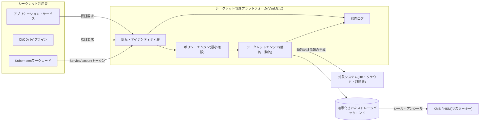
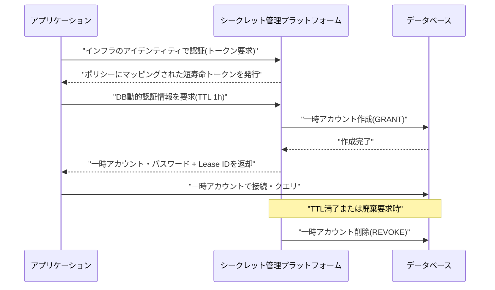

# シークレット管理(Secrets Management)

## 1. 概要

> シークレット管理(Secrets Management)とは、アプリケーション・インフラ・パイプラインが使用する認証情報(パスワード・APIキー・データベース接続情報・証明書・暗号鍵・トークン)をソースコードや設定から分離し、中央で安全に保管・発行・ローテーション・廃棄するとともに、アクセスを統制・監査する体系である。

情報システムは互いを信頼するために、必ず何らかの形の「シークレット」を交換する。アプリケーションはデータベースに接続するためにアカウントとパスワードを提示し、マイクロサービスは他のサービスを呼び出すためにAPIキーやトークンを使用し、CI/CDパイプラインはクラウドアカウントへデプロイするためにアクセスキーを保持する。問題は、これらのシークレットがソースコード・設定ファイル・環境変数・コンテナイメージ・ログ・コラボレーション用メッセンジャーに容易に散在してしまう点である。このように統制なく拡散した状態をシークレットスプロール(secret sprawl)と呼び、漏えい事故のよくある根源となる。

実際、GitGuardianの年次レポートは、公開GitHubリポジトリだけで毎年数百万件のハードコードされたシークレットが新たに露出していることを継続的に明らかにしてきており、2023年の公開コミットで検出されたシークレットは1,000万件を超えたと報告している。ハードコードされた一つのクラウドアクセスキーが漏えいすれば、攻撃者はそれを利用してアカウント全体を掌握したり、大規模な課金を発生させたりすることができる。シークレット管理は、こうしたリスクを「シークレットをコードの外に出し、短い寿命にし、アクセスを追跡する」という原則によって緩和しようとするアプローチである。

シークレット管理が単なる「パスワード金庫」以上の意味を持つ理由は、現代の環境が静的なシークレットを前提として設計されていないためである。Kubernetesではポッドが秒単位で生成・消滅し、サーバーレス関数は需要に応じて数千個が同時に起動する。これらすべてのワークロードが同一の長期認証情報を共有していると、一つが漏えいした際の影響範囲(blast radius)がシステム全体に拡大する。したがってシークレット管理は、「静的・長寿命のシークレット」から「動的・短寿命のシークレット」への転換を中核戦略とする。

### 1.1 登場背景と必要性

第一に、開発・デプロイの速度が、人手でシークレットを管理する速度を追い越した。かつては運用者がサーバに接続して設定ファイルにパスワードを書き込めば十分であったが、今ではIaCでインフラが自動生成され、コンテナが自動デプロイされる。シークレットを発行・注入・ローテーションする過程そのものを自動化しなければ、デプロイパイプラインのボトルネックであり死角ともなる。

第二に、規制と標準が認証情報の統制・ローテーション・監査を明示的に要求している。PCI DSSはカードデータ環境のアクセス制御と暗号鍵管理を、ISMS-P・個人情報の安全性確保措置はアクセス権限管理と接続記録の保存を要求する。シークレットがどこにあるのかさえ把握できなければ、こうした統制や監査証跡の提出は不可能である。

第三に、漏えいの結果は致命的である。2019年のキャピタル・ワン(Capital One)事件は、誤って構成されたファイアウォールを通じて取得した認証情報によって1億件以上の顧客情報が流出した事例であり、攻撃者がいったん有効な認証情報を手に入れれば、正常なトラフィックに偽装して検知を回避できることを示した。シークレットの寿命を短くし、アクセスをきめ細かく統制しなければならない理由はここにある。

第四に、「シークレットゼロ(secret zero)」問題が本質的に残る。アプリケーションが金庫からシークレットを取り出すには、まず金庫に認証しなければならないが、その最初の認証手段(secret zero)をいかに安全にブートストラップするかが中核的な難題である。この問題をインフラのアイデンティティ(クラウドインスタンスのメタデータ、KubernetesのServiceAccountトークンなど)で解決することが、現代のシークレット管理の設計上の焦点である。

### 1.2 中核用語

| 用語 | 意味 | 技術士の観点 |
|---|---|---|
| 静的シークレット(Static Secret) | 人が登録し長期間維持されるシークレット | ローテーションの負担・漏えい時の長期露出 |
| 動的シークレット(Dynamic Secret) | 要求時に即時生成され、TTL経過後に自動廃棄 | 影響範囲・寿命の最小化 |
| シークレットローテーション(Rotation) | シークレットを定期的・イベントベースで交換 | 漏えい時の有効期間の短縮 |
| シール/アンシール(Seal/Unseal) | 金庫のマスターキーを分割・復元する手順 | 鍵の分散・内部者脅威の統制 |
| シークレットゼロ(Secret Zero) | 金庫への認証に必要な最初の認証情報 | ブートストラップ信頼の根源 |
| KMS/HSM | 鍵の生成・保管・演算専用のサービス・機器 | マスターキーの保護・規制遵守 |
| エンベロープ暗号化 | データキーをマスターキーで再暗号化 | 大量データの性能・鍵の分離 |

シークレットは単なる文字列ではなく、「誰が、どのワークロードが、どのような条件で、どれくらいの期間」使用できるかというポリシーとともに管理されなければならない。すなわちシークレット管理は、保管(storage)だけでなく、アイデンティティ(identity)・ポリシー(policy)・監査(audit)の結合体である。

## 2. シークレット管理のアーキテクチャと概念図

### 2.1 全体構造

シークレット管理体系は大きく五つの要素で構成される。シークレットを安全に保管するストレージバックエンド、保存データを保護するマスターキー(KMS/HSM)、要求主体を確認する認証・アイデンティティ層、どの主体がどのシークレットにアクセスできるかを定めるポリシーエンジン、そしてすべてのアクセスを記録する監査ログである。アプリケーションはシークレットを直接保管せず、実行時に金庫(vault)から発行を受け、メモリ上にのみ一時的に置いて使用する。

この構造の核心は、シークレットが「保存時(at rest)」にはマスターキーで暗号化され、「転送中(in transit)」にはTLSで保護され、「使用中(in use)」には最小権限と短い寿命で統制されるという点である。金庫自体が奪取されても、マスターキーが別のKMS/HSMにあれば保存データを復号できないよう、信頼境界を分離する。

認証層は、人(管理者)に対しては組織のIdP(例:OIDC・LDAP)を、ワークロードに対してはインフラのアイデンティティを使用する。例えばKubernetesのポッドは自身のServiceAccount JWTを提示し、金庫はこれをAPIサーバに検証させてアイデンティティを確認した後、ポリシーにマッピングされたトークンを発行する。こうすれば、アプリケーションのコードやイメージにいかなる長期シークレットも埋め込む必要がない — これがsecret zero問題の現実的な解決策である。

ポリシーエンジンは、確認されたアイデンティティに対して「この主体は決済DBの読み取り専用の動的アカウントのみを、最大1時間のTTLで発行を受けることができる」といったルールを適用する。アクセスが許可されるとシークレットエンジンが実際のシークレットを返すが、静的エンジンは保存された値をそのまま返し、動的エンジンは対象システム(DB・クラウド)に即時にアカウントを作成して短寿命の認証情報を発行する。

### 2.2 動的シークレットの発行・廃棄手順

動的シークレットは、シークレット管理の最も強力な機能である。アプリケーションがDB接続を必要とする際に金庫へ要求すると、金庫が管理者権限でDBに接続して一時アカウントを作成し、そのアカウント情報をアプリケーションに返す。このアカウントは指定されたTTL(例:1時間)が経過すると、金庫が自動的にDBから削除する。結果として、漏えいしたとしても認証情報の有効時間が極めて短いため、影響範囲が大幅に縮小する。

この手順では、リース(lease)と失効(revocation)の概念が重要である。発行されたすべての動的シークレットはリースとして追跡され、管理者は侵害が疑われる際に特定のリース、または特定エンジンのすべてのリースを一括で失効させることができる。静的シークレットを使用していた時代には「漏えいしたようなので全システムのパスワードを変更しよう」という大規模な作業が必要であったが、動的シークレット体系ではリースの失効一回で即座に遮断できる。

また、シール・アンシール(seal/unseal)のメカニズムはマスターキー自体の保護を扱う。金庫が再起動すると、保存データを復号するマスターキーがない「シール」状態で起動し、シャミアの秘密分散(Shamir's Secret Sharing)で分割された複数のアンシールキーの断片のうち閾値(例:5個中3個)が揃って初めてアンシールされる。これは単一の管理者が一人で金庫を開けられないようにし、内部者脅威と鍵の奪取を併せて統制する設計である。運用では、このアンシールをKMSの自動アンシール(auto-unseal)に委ねて可用性を確保することもある。

## 3. シークレットの類型と管理パターン

### 3.1 静的シークレットと動的シークレット

静的シークレットは、人が登録し、明示的に変更するまで維持される値である。外部SaaSのAPIキーのように、発行主体を自組織で統制できず動的生成が不可能な場合にやむを得ず使用する。静的シークレットは必ずローテーションポリシーと対にしなければならず、ローテーション周期を90日などと定め、可能であれば無停止ローテーション(2世代の鍵を同時に有効化)をサポートすべきである。

動的シークレットは、前述のとおり要求時に生成され、TTLにより自動消滅する。DB・クラウド・メッセージブローカーのように、金庫が管理者権限でアカウントを制御できる対象に適している。動的シークレットの実務上の利点は、「ローテーション」という別作業が事実上なくなる点である。すべての認証情報がもともと短寿命であるため、ローテーションは自然な満了・再発行に吸収される。

両方式の選択は、対象システムの統制可能性と性能要件に依存する。毎秒数千件の接続を開くワークロードに対して毎回新しいDBアカウントを作成すると対象DBに負荷がかかるため、この場合はコネクションプールを設けて動的シークレットのTTLを長めに設定したりキャッシュしたりする折衷が必要である。すなわち、セキュリティ(寿命の最小化)と性能・可用性の間のトレードオフを設計しなければならない。

| 区分 | 静的シークレット | 動的シークレット |
|---|---|---|
| 生成時点 | 事前登録 | 要求時に即時 |
| 寿命 | 長い(ローテーションが必要) | 短い(TTLで自動廃棄) |
| 漏えいの影響 | 大きい(長期露出) | 小さい(短期・即時廃棄) |
| 適用対象 | 外部SaaSキー・証明書 | DB・クラウド・ブローカーのアカウント |
| 性能負担 | 低い | 生成コスト・対象への負荷 |

### 3.2 暗号鍵の管理: KMS・HSM・エンベロープ暗号化

シークレットの中でも暗号鍵は特別な扱いを受ける。データを暗号化するデータキー(DEK)をさらにマスターキー(KEK)で暗号化して保存するエンベロープ暗号化(envelope encryption)が標準的である。大量データは高速な対称鍵(DEK)で暗号化し、そのDEKのみをKMSのKEKで保護すれば、マスターキーを露出させることなく性能と鍵の分離を同時に得られる。例えば、クラウドストレージに数TBを保存する際にオブジェクトごとに別々のDEKを使用し、KEKで封印すれば、特定のオブジェクトの鍵が漏えいしても残りは安全である。

HSM(ハードウェアセキュリティモジュール)は、鍵をハードウェア境界の外へ決して出さず、内部でのみ暗号化・復号演算を行う機器であり、FIPS 140-2/140-3等級の認証を受けて金融・公共分野で要求される。マスターキーをHSMに置けば、ソフトウェアの侵害によっても鍵の原文を奪取できない。ただしHSMにはコストと処理量の制約があるため、大量の演算はDEKで処理し、HSMはKEKの演算にのみ使用する階層設計が一般的である。

鍵管理においては、鍵の全ライフサイクル(生成・有効化・ローテーション・廃止・破棄)と暗号アジリティ(crypto agility)を併せて考慮しなければならない。耐量子計算機暗号(PQC)への移行のようにアルゴリズム自体が変わる将来に備えるなら、アプリケーションが特定の鍵・アルゴリズムに強く結合しないよう、鍵の参照を抽象化(鍵IDベースの呼び出し)しておくことが望ましい。

### 3.3 アクセス制御・監査との結合

シークレット管理はゼロトラスト原則と自然に結び付く。「ネットワーク内部にいるから信頼する」のではなく、「すべての要求はアイデンティティを証明し、最小権限のみを受ける」というアプローチをシークレットの発行にそのまま適用する。ポリシーは主体・シークレットのパス・条件(時間・ソース・MFA)まできめ細かく規定し、発行されたすべてのシークレットは監査ログに残す。

監査ログは「誰がいつどのシークレットを発行・参照したか」を再現できなければならないが、ログ自体にシークレットの原文や個人情報が残らないよう、ハッシュ化・マスキング処理をしなければならない。これはログが新たな漏えいポイントとなるという逆説を防ぐための必須措置である。監査ログはSIEMと連携させ、異常なパターン(短時間での大量のシークレット参照、失効したアイデンティティによるアクセス試行)の検知に活用される。

## 4. 類似概念との比較と事例

シークレット管理は、しばしば隣接する概念と混同される。構成管理(Configuration Management)は機微でない設定値を扱うが、シークレット管理は機微な認証情報に特化し、暗号化・ローテーション・監査を追加で提供する。クラウド事業者のマネージド型シークレットストア(AWS Secrets Manager、Azure Key Vault、GCP Secret Manager)は運用負担が少なく便利であるが特定のクラウドに依存し、HashiCorp Vaultのような独立プラットフォームはマルチクラウド・オンプレミスを包含し、動的シークレット・多様なエンジンを提供する代わりに自前の運用負担が大きい。組織はワークロードの分布と規制要件(例:データ主権)に応じて、これらを選択または併用する。

Kubernetesの標準Secretオブジェクトは、よく誤解される部分である。標準のSecretはetcdにBase64でエンコードされるだけで暗号化ではないため、etcdの保存時暗号化(EncryptionConfiguration)を別途有効にしなければ、事実上平文に近い。したがって本番環境では外部のシークレット管理プラットフォームと連携(External Secrets Operator、CSI Driver)し、実際のシークレットは金庫に置き、ポッドには実行時にのみ注入するパターンが推奨される。

具体的なインシデント事例も教訓を与える。2022年のウーバー(Uber)侵害では、攻撃者が内部にハードコードされていた管理者認証情報を発見して権限を昇格させたと伝えられており、これは「シークレットをスクリプト・設定に残すな」という原則の重要性を再確認させた。逆に、動的シークレットと短いTTLを導入した組織は、認証情報の漏えいが検知されても既に失効しているため悪用が困難になるという防御効果を得る。

## 5. 深掘り: 最新動向とワークロードアイデンティティの標準化

シークレット管理の最近の流れは、「シークレットレス(secretless)認証」へと向かっている。ワークロードが長期シークレットを一切持たず、インフラが付与した検証可能なアイデンティティによって短期トークンをその都度受け取る方式である。代表的な標準であるSPIFFE/SPIREは、ワークロードにSVID(SPIFFE Verifiable Identity Document)という短寿命の証明書を自動発行し、サービス間の相互TLS認証をシークレットの共有なしに実行できるようにする。サービスメッシュ(Service Mesh)のサイドカーがこのアイデンティティを活用してmTLSを自動化するのも同じ文脈である。

クラウド間の連携では、OIDCベースのワークロードアイデンティティフェデレーションが広がっている。例えばGitHub Actionsがクラウドへデプロイする際、長期アクセスキーを保存する代わりに、実行ごとに発行されるOIDCトークンをクラウドが信頼するよう構成すれば、保存すべきシークレットがなくなる。これはsecret zeroを「保存されたシークレット」ではなく「実行コンテキストが証明するアイデンティティ」で置き換える進化である。

また、シークレットスプロールを事後に捕捉するシークレットスキャン(secret scanning)が、開発パイプラインに標準搭載されつつある。GitHub Push Protection、GitGuardian、TruffleHogなどはコミット・PRの段階でハードコードされたシークレットを検知・遮断し、漏えいが確認されれば自動ローテーション・失効まで連携する。これはDevSecOpsの「シフトレフト」原則をシークレット管理に適用した事例であり、予防(金庫)と検知(スキャン)の二重防御を構成する。

## 6. 考慮事項および示唆点

技術士の観点から、シークレット管理の導入にあたっては以下を総合的に考慮しなければならない。

- **可用性と単一障害点の管理**: 金庫がダウンするとすべてのシークレットの発行が止まり、システム全体が麻痺しうる。マルチノードのHA構成、自動アンシール、リージョン間レプリケーション、そして短時間のキャッシュなどにより、金庫自体が新たなSPOFとならないよう設計しなければならない。セキュリティ強化が可用性の低下につながらないようバランスを取ることが、中核的なトレードオフである。

- **secret zeroと信頼の根源の設計**: ブートストラップのアイデンティティをインフラ(クラウドインスタンス・KubernetesのServiceAccount・OIDC)に移し、保存される最初のシークレットをなくさなければならない。何を信頼の根源とするのか、その根源が偽造不可能であるのかを、アーキテクチャの初期段階で決定しなければならない。

- **寿命の最小化と性能のバランス**: 動的シークレットのTTLを短くするほど安全であるが、対象システムにおけるアカウントの生成・削除の負荷と遅延が大きくなる。ワークロードの特性(接続頻度・持続性)に合わせてTTL・リース・コネクションプールの戦略を設計し、侵害時の即時失効経路を必ず確保する。

- **規制遵守と監査証跡**: PCI DSS・ISMS-P・個人情報の安全性確保措置が要求するアクセス権限管理、接続記録の保存、鍵管理の要件を満たすよう監査ログを設計しつつ、ログにシークレット・個人情報の原文が残らないようマスキングする。規制対応は事後の付け足しではなく、初期設計に内在化させなければならない。

- **段階的導入と組織の変革管理**: 既存のハードコードされたシークレットを一度に除去することは難しい。まず観察モードでシークレットの使用状況を把握し、高リスクのシークレット(本番DB・クラウドのルート)から動的方式に切り替え、開発者体験(SDK・サイドカーによる注入)を改善して抵抗を減らす段階的戦略が現実的である。

- **暗号アジリティと将来への備え**: 鍵・アルゴリズムをアプリケーションから抽象化(鍵ID参照)しておけば、PQCへの移行やアルゴリズムの脆弱性発見時にもコードを変更せずに入れ替えられる。これは長期運用の観点から、保守性とセキュリティを共に高める。

## 参考資料

- HashiCorp, "Vault Documentation — Secrets Engines, Dynamic Secrets, Seal/Unseal": https://developer.hashicorp.com/vault/docs
- OWASP, "Secrets Management Cheat Sheet": https://cheatsheetseries.owasp.org/cheatsheets/Secrets_Management_Cheat_Sheet.html
- NIST SP 800-57, "Recommendation for Key Management": https://csrc.nist.gov/pubs/sp/800/57/pt1/r5/final
- SPIFFE/SPIRE Project Documentation: https://spiffe.io/docs/latest/spiffe-about/overview/
- GitGuardian, "State of Secrets Sprawl": https://www.gitguardian.com/state-of-secrets-sprawl-report

---

> **一言まとめ**: シークレット管理は、認証情報をコードから分離して中央で安全に保管・発行・ローテーション・監査する体系であり、静的シークレットを動的・短寿命のシークレットとインフラのアイデンティティに基づく認証へ転換し、漏えい時の影響範囲を最小化することが核心である。
