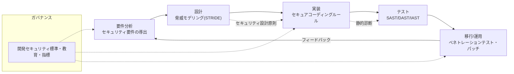
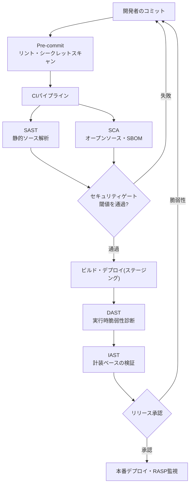

# セキュアコーディング(Secure Coding)とソフトウェア開発セキュリティ

## 1. 概要

> **セキュアコーディング(Secure Coding)**とは、ソフトウェア開発ライフサイクル(SDLC)全般において、設計・実装段階に内在するセキュリティ脆弱性(Vulnerability)を事前に除去するため、検証済みのコーディングルールと開発セキュリティ標準を遵守して安全なソースコードを作成する開発方法論をいう。広義の**ソフトウェア開発セキュリティ(Software Development Security)**は、セキュアコーディングを含め、要件・設計・実装・テスト・運用の全段階にセキュリティ活動を統合する体系を指す。

セキュアコーディングが注目された背景には、「セキュリティ事故の大半は運用段階の防御の失敗ではなく、開発段階で既に埋め込まれた欠陥に起因する」という洞察がある。伝統的にセキュリティはファイアウォール・IPS・WAFのような境界防御(Perimeter Defense)を中心に運用段階で扱われてきたが、Web・モバイル・クラウドによってアプリケーション層が攻撃の主要な標的となるにつれ、ネットワーク境界の統制だけではSQLインジェクションやクロスサイトスクリプティング(XSS)のようなアプリケーションロジックの欠陥を防げなくなった。実際、アプリケーション層を狙った攻撃は侵害事故全体の相当な割合を占めており、OWASPはWeb脆弱性の根本原因の大半が入力検証の欠落・誤った認証・安全でない設計にあると指摘している。

こうした転換は、「セキュリティは後から付け足す機能ではなく、最初から品質特性として設計・実装されなければならない」という認識へとつながる。セキュリティを別個の成果物ではなく、保守性・信頼性と並ぶソフトウェア品質特性(ISO/IEC 25010のSecurity)として扱うことが、セキュアコーディングの哲学的な出発点である。

もう一つの背景は、**欠陥修正コストの非対称性**である。IBM System Sciences Instituteなどで広く引用される研究によれば、要件・設計段階で発見・修正する欠陥のコストを1とすると、実装段階では約6.5倍、テスト段階では約15倍、運用(リリース後)段階では約60~100倍にまで増加する。すなわち脆弱性をコーディング段階で取り除くことは経済的に圧倒的に有利であり、これが「セキュリティを左側(開発初期)へ引き寄せる」という**シフトレフト(Shift-Left)セキュリティ**の論理的根拠となる。

制度的な背景も強力である。韓国国内では「電子政府法施行令」と行政安全部・KISAの「ソフトウェア開発セキュリティガイド」に基づき、一定規模以上の公共情報化事業に開発セキュリティ(セキュアコーディング)の適用が義務付けられており、監理の点検項目としても扱われている。国際的には、CWE(Common Weakness Enumeration)、SANS/CWE Top 25、OWASP Top 10、MITREのCWEと連携したCVE体系が、脆弱性分類の事実上の標準として定着している。したがってセキュアコーディングは単なる開発慣行ではなく、法・制度・標準が要求する必須のエンジニアリング活動として理解しなければならない。

## 2. ソフトウェア開発セキュリティのライフサイクルと活動体系

セキュアコーディングをコーディングルールの羅列としてのみ理解すると失敗する。脆弱性はコード一行から生まれることもあるが、誤った要件・安全でないアーキテクチャ上の決定から構造的に胚胎するからである。したがって開発セキュリティは、SDLCの全段階にセキュリティ活動を配置する**Secure SDLC(S-SDLC)**の観点からアプローチしなければならない。代表的な準拠モデルにはマイクロソフトのSDL(Security Development Lifecycle)、OWASP SAMM、BSIMMなどがあり、これらは共通して「段階ごとのゲートでセキュリティ検証を通過して初めて次の段階へ進む」という原則を共有している。

以下の概念図は、各段階にマッピングされる中核的なセキュリティ活動の全体構造を示している。

この構造で注目すべき点は、セキュリティ活動が段階ごとに断絶せず、前後にフィードバックされることである。テスト段階で発見された脆弱性パターンは再びコーディングルールと設計原則へ還流されなければならず、運用中に検知された攻撃類型は次のリリースの脅威モデリングの入力となる。こうした循環構造があってこそ、組織の開発セキュリティ能力は時間とともに蓄積・成熟し、一回限りの診断では得られない継続的改善(Continuous Improvement)が可能となる。

**要件分析段階**では、機能要件とは別に、機密性・完全性・可用性・認証・認可・監査といった**セキュリティ要件**を明示的に導出する。例えば「個人情報項目は保存時に暗号化する」「管理者機能は再認証を経る」といった非機能要件をSRSに定量的に明記してこそ、以降の段階で検証可能な基準となる。この段階が不十分であれば、いくらコーディングが優れていても「何を守るべきか」が不明確となり、防御のベースラインが揺らぐ。

**設計段階**の核心は**脅威モデリング(Threat Modeling)**である。データフロー図(DFD)を描いて信頼境界(Trust Boundary)を識別し、STRIDE(Spoofing・Tampering・Repudiation・Information Disclosure・Denial of Service・Elevation of Privilege)の観点から資産ごとの脅威を導出した後、各脅威に対応する緩和策を設計に反映する。このとき、最小権限(Least Privilege)、多層防御(Defense in Depth)、安全なデフォルト(Secure Defaults)、フェイルセーフ(Fail-Safe Defaults)といった**Saltzer & Schroederのセキュリティ設計原則**を適用し、構造的な脆弱性を根本から遮断する。

**実装段階**は、狭義のセキュアコーディングが適用される地点である。入力検証、出力エンコーディング、パラメータ化クエリ(Prepared Statement)、安全なセッション・暗号APIの使用など、言語・フレームワークごとのコーディングルールを遵守する。このとき重要なのは、ルールを開発者個人の規律だけに委ねず、フレームワーク・ライブラリレベルの安全なデフォルトとして強制することである。例えば、Spring SecurityのCSRFトークン自動挿入、ORMのバインド変数のデフォルト化、テンプレートエンジンの自動エスケープのように、「安全な道が最も簡単な道(Secure by Default)」となるよう開発環境を設計すれば、個々の開発者のミスが直ちに脆弱性につながることはない。これは人的ミスを前提とし、構造で防御するという安全工学の原則とも通じている。**テスト段階**では自動化ツール(SAST/DAST/IAST)と手動のコードレビュー・ペネトレーションテストで残存脆弱性を検出し、**運用段階**では脆弱性公表(CVE)の監視・緊急パッチ・ランタイム保護(RASP)によって継続的なセキュリティを維持する。これらすべての活動を貫くのが、標準・教育・指標から成る**開発セキュリティガバナンス**であり、開発者教育と脆弱性密度(KLoC当たりの欠陥数)のような指標管理が併行してこそ、活動が組織に定着する。

## 3. セキュアコーディングの脆弱性類型と診断プロセス

韓国の「ソフトウェア開発セキュリティガイド」は、脆弱性を**7大類型**に分類している。この分類は、開発者がコードレビューと診断の際に点検の観点を体系化できるよう支援する実務的なフレームである。各類型は単なるリストではなく、「どの地点で信頼できないデータが信頼境界を越えるのか」という共通の原理で貫かれている。

この7大類型を貫く思考の枠組みは、CWE・OWASPのような国際的な脆弱性分類体系と連動している。国内ガイドの類型は開発者がコードで点検すべき観点を提示し、CWEは個々の弱点を固有の番号で識別し、OWASP Top 10はWebにおいて最も危険なリスク群を優先順位付けする。三つの体系を併用すれば、「何を(CWE)、なぜ重要として(OWASP)、どこを(開発セキュリティ類型)点検するのか」を一貫して整理でき、診断結果の追跡性と対処の優先順位の決定が容易になる。

最も代表的な**入力データの検証および表現**類型は、外部から入ってきた値を検証なしにコマンド・クエリ・パスに結合するときに発生する。SQLインジェクション、XSS、コマンドインジェクション、パストラバーサルはすべてこれに属し、根本的な対策は「信頼できない入力はデータとしてのみ扱い、実行コンテキストから分離する」という原則である。**セキュリティ機能**類型は認証・認可・暗号化・アクセス制御の誤った実装であり、ハードコードされたパスワードや脆弱な暗号アルゴリズム(例:MD5、DES)の使用が典型である。**時間および状態**類型は、競合状態(Race Condition)・TOCTOU(Time-of-Check to Time-of-Use)のように、並行性制御の失敗に起因する。

このほか、**エラー処理**(過剰なエラー情報の露出による内部構造の漏えい)、**コードエラー**(ヌルポインタ参照・リソース解放漏れ)、**カプセル化**(デバッグコード・重要情報の平文露出)、**API誤用**(脆弱または廃止された関数の呼び出し)が残りの類型を構成する。以下の表は、7大類型と代表的な脆弱性、対策を整理したものである(表は補助手段であり、各対策の原理は本文と4章の事例で記述する)。

| 類型 | 代表的な脆弱性(CWE) | 根本原因 | 中核対策 |
|---|---|---|---|
| 入力データの検証・表現 | SQL Injection、XSS、パストラバーサル | 入力と実行コンテキストの未分離 | パラメータ化クエリ、出力エンコーディング、ホワイトリスト検証 |
| セキュリティ機能 | 脆弱な暗号、不適切な認可 | 誤ったセキュリティAPIの実装 | 標準暗号(AES/SHA-256)、サーバ側認可 |
| 時間および状態 | Race Condition、TOCTOU | 並行性制御の失敗 | アトミック操作、ロック、再検証 |
| エラー処理 | 情報露出、未処理例外 | 過剰なエラー情報 | 一般化されたエラーメッセージ、サーバ側ロギング |
| コードエラー | ヌル参照、リソースリーク | 防御的コーディングの欠如 | ヌルチェック、try-with-resources |
| カプセル化 | デバッグコード、平文保存 | 情報隠蔽の失敗 | デプロイ前の除去、機微情報の暗号化 |
| API誤用 | 脆弱な関数の使用 | 安全でないAPI | 安全な代替API、廃止関数の禁止 |

脆弱性診断は、開発から切り離された一回限りの監査ではなく、CI/CDパイプラインに統合された反復プロセスとして運用してこそ実効性がある。以下の概念図は、コミットからデプロイに至る診断パイプラインの詳細な流れを示している。

このパイプラインの設計意図は、「できるだけ左側で、できるだけ自動で」脆弱性を取り除くことにある。コミット直前のシークレットスキャンでAPIキー・パスワードの漏えいを遮断し、CIでSAST・SCAによりソースと依存関係を検査し、セキュリティゲートで閾値(例:High等級0件)を満たさなければマージを阻止する。こうすれば脆弱性が本番に到達する前に開発者へ即座にフィードバックされ、前述の60~100倍の事後修正コストを回避できる。

ただし自動化されたゲートは、誤検知と見逃しのバランスを慎重に調整しなければならない。閾値を過度に厳しく設定すると、誤検知によって正常なデプロイが阻まれ、開発チームがゲートを迂回しようとする誘因が生じる。逆に緩く設定すると、実際の脆弱性が通過してしまう。したがって初期には警告(warning)モードで運用しながら誤検知ルールをチューニング(Suppression・ベースライン設定)し、その後、新規脆弱性(New Findings)に限って遮断モードへ切り替える段階的導入が現実的である。これは、セキュアコーディングがツールの導入ではなく、組織に合わせた継続的な運用・チューニングの問題であることを示している。

## 4. 代表的な脆弱性の事例と対策 (具体的なコード・数値)

**事例1 — SQLインジェクション(CWE-89)。** ログイン処理で`"SELECT * FROM users WHERE id='" + input + "'"`のように入力を文字列として結合すると、攻撃者は`' OR '1'='1`を入力して認証を回避したり、`; DROP TABLE`でデータを破壊したりできる。2017年以降、OWASP Top 10においてインジェクションは長らく1~3位を占め、韓国国内の大規模漏えい事故の多くの根本原因であった。対策は**パラメータ化クエリ(Prepared Statement)**であり、`SELECT * FROM users WHERE id=?`のようにクエリ構造とデータを分離すれば、入力が決してSQL構文として解釈されることはない。ORM使用時にも動的クエリを組み立てる部分には必ずバインド変数を使い、やむを得ない場合はホワイトリスト検証を併用する。

**事例2 — クロスサイトスクリプティング(XSS, CWE-79)。** 掲示板に``を保存(Stored XSS)すると、閲覧者のセッションクッキーが窃取される。対策の核心は**コンテキスト別の出力エンコーディング(Output Encoding)**である。HTML本文では`<`を`&lt;`に、属性値・JavaScript・URLのコンテキストではそれぞれ異なるエンコーディングを適用しなければならず、入力検証だけでは回避が可能であるため、出力時点でのエンコーディングが原則である。さらにCSP(Content Security Policy)ヘッダでインラインスクリプトの実行を制限し、クッキーに`HttpOnly`・`Secure`・`SameSite`属性を付与して多層防御を構成する。

**事例3 — 脆弱な暗号・パスワード保存(CWE-327/916)。** パスワードをMD5や単純なSHAで保存すると、レインボーテーブル・GPUによる総当たり攻撃に脆弱である。毎秒数十億回のハッシュ計算が可能な現代のGPU環境では、MD5の8文字のパスワードは数分以内に復元されうる。対策は、**適応型ハッシュ関数**(bcrypt・scrypt・Argon2)にユーザーごとのソルト(Salt)を適用し、ワークファクタ(cost factor)をハードウェアの進歩に合わせて引き上げることである。共通鍵暗号はAES-256、通信区間はTLS 1.2以上を標準とし、独自実装の暗号(Roll-your-own crypto)は禁止する。

**事例4 — 安全でないデシリアライゼーション・SSRF(CWE-502/918)。** 最近のWebアプリケーションでは、信頼できないオブジェクトをデシリアライズした結果リモートコード実行(RCE)につながったり、サーバがユーザー入力のURLで内部リソースへリクエストを送るSSRF(Server-Side Request Forgery)が台頭している。特にSSRFは、クラウド環境でメタデータエンドポイント(例:169.254.169.254)にアクセスして一時的な認証情報を窃取する経路として悪用され、OWASP Top 10 2021に新たに登録された。対策は、デシリアライズ対象の型のホワイトリスト制限、外部リクエスト先のドメイン・IP帯域の検証(プライベート帯域の遮断)、そしてアプリケーションアカウントに最小権限のみを付与する多層防御である。これらの事例は共通して、「信頼境界を越えるデータのコンテキストを分離し、検証済みの標準メカニズムを使用せよ」という原理に収束する。特にクラウド・MSA環境ではサービス間の呼び出しが増えることで信頼境界自体が多数・動的に存在するため、コード一行の安全性だけでなく、呼び出し関係全体の検証が求められる。

## 5. 診断手法の比較 — SAST・DAST・IAST・SCA

脆弱性診断ツールは検査対象と時点が異なるため、相互補完的に組み合わせなければならない。いずれか一つですべての脆弱性を捕捉できるという期待は、誤検知(False Positive)と見逃し(False Negative)の狭間で必ず失敗する。各手法の違いが生じる理由は、「ソースコードを見るのか、実行を見るのか、内部の計装を見るのか」という観点の違いにある。

**SAST(静的解析)**は、ソースコード・バイトコードを実行せずにデータフロー・制御フローを解析して脆弱性を発見する。開発初期(コミット・ビルド)に適用可能でシフトレフトに合致し、コード行単位で原因を特定できるが、実行コンテキストを知らないため誤検知が多いことが実務上の含意である。**DAST(動的解析)**は、実行中のアプリケーションに実際の攻撃ペイロードを送って反応を観察するため誤検知が少なく、ランタイム・設定の脆弱性まで捕捉できるが、ソース上の位置を特定しにくく、実行環境が必要なため適用時点が遅い。**IAST**はアプリケーションにエージェントを組み込み、実行中の内部データフローを計装するため、SASTの精密さとDASTの正確さを折衷する。**SCA**は自作コードではなく、オープンソース依存関係の既知の脆弱性(CVE)とライセンスを検査し、SBOMと組み合わせてサプライチェーンセキュリティを担う。

| 手法 | 検査対象 | 適用時点 | 強み | 限界 |
|---|---|---|---|---|
| SAST | ソース・バイトコード | 開発・ビルド | 早期適用、行の特定 | 誤検知が多い、実行コンテキストを知らない |
| DAST | 実行中のアプリケーション | テスト・ステージング | 誤検知が少ない、ランタイム脆弱性 | 位置の特定が困難、時点が遅い |
| IAST | 計装された実行 | テスト(計装) | 精密さと正確さの折衷 | 性能オーバーヘッド、言語の制約 |
| SCA | オープンソース依存関係 | 全段階 | サプライチェーン・CVE・ライセンス | 自作コードの脆弱性は検出しない |

実務では、これらをパイプラインの段階ごとに配置する。例えばコミット時にSAST・シークレットスキャン、ビルド時にSCA、ステージングでDAST・IASTを実行し、本番ではRASPでランタイム攻撃を遮断する。最近では、これらの結果を統合・優先順位付けする**ASPM(Application Security Posture Management)**が登場し、ツールごとに散発するアラートを資産・リスク基準で整理することで、「アラート疲れ(Alert Fatigue)」の問題を緩和している。

一方、自動化ツールが見逃す領域は依然として大きい。認可ロジックの誤り(例:他のユーザーのリソースにアクセス可能なIDOR、CWE-639)、ビジネスロジックの欠陥、設計レベルの信頼境界の誤りは、ツールが「正常なコード」と判定しやすい。こうした脆弱性はアプリケーションの意図を理解する人間にしか発見できないため、手動のコードレビュー・脅威モデリング・ペネトレーションテストを自動診断と必ず併行しなければならない。すなわち診断戦略は、「自動化で広く洗い出し、人間が深く判断する」という二元構造で設計することが望ましい。

## 6. 深掘り — 最新動向: AI・サプライチェーン・DevSecOpsへの拡張

セキュアコーディングは固定されたルール集ではなく、脅威環境と開発方式の変化に応じて絶えず進化する領域である。クラウドネイティブ・MSA・AI開発が主流となるにつれ、防御の対象と方法も再編されており、最近の状況は大きく三つの方向へ急速に変化している。第一に、**AIを活用したコードセキュリティ**である。LLMベースのコードアシスタントが自動生成したコードに脆弱性が含まれる問題が実証的に報告されるにつれ、生成コードに対するリアルタイムのSAST検証とAIベースの自動修正(Auto-remediation)が組み合わされつつある。GitHub・Snykなどは、脆弱性の検知と修正提案をIDE内で即座に提供する方向へ進化しており、これは「開発者がセキュリティの専門家でなくても安全なコードを書けるように」支援するアプローチである。ただしAIが生成したコードはもっともらしく見えても微妙に脆弱な場合があるため、人間によるレビューと静的診断の二重検証は依然として不可欠である。

第二に、**ソフトウェアサプライチェーンセキュリティとの統合**である。SolarWinds事件以降、自作コードだけでなく、ビルドパイプライン・依存関係・アーティファクト全体の完全性が中核課題となった。セキュアコーディングは今やSBOM(構成要素の明細)・SLSA(ビルド完全性レベル)・署名(Sigstore)と連携し、「安全にコーディングされたコードが改ざんされずにビルド・デプロイされたこと」までを保証する範囲へと拡張されている。米国の大統領令(EO 14028)と韓国国内のSBOM導入の議論が、この流れを制度的に後押ししている。

これと併せて、**自動修正とSBOMの結合**も注目に値する。脆弱なオープンソースのバージョンを検知すると安全なバージョンへ自動的に引き上げる依存関係ボット(Dependabot・Renovate)が普及しており、これは既知の脆弱性(N-day)の露出時間を大幅に短縮する。実際、公開されたCVEの相当数はパッチが存在するにもかかわらず未適用のまま放置されて悪用されるため、検知・修正・検証の自動ループを構築することがサプライチェーンリスク管理の核心となる。

第三に、**DevSecOpsへの文化的統合**である。セキュアコーディングを、セキュリティチームによるゲートキーピングではなく、開発・運用・セキュリティが共有する責任として再定義するものである。そのために、セキュリティポリシーをコードとして管理するPolicy as Code(OPA)や、インフラ設定の脆弱性をコード上で検査するIaCスキャン(Terraform・Kubernetesマニフェストが対象)が、セキュアコーディングの範囲に取り込まれつつある。すなわち「コード」の定義がアプリケーションのソースからインフラ・ポリシー・パイプラインにまで広がるにつれ、セキュアコーディングもそれだけ外延を拡張している。

## 7. 考慮事項および示唆点

第一に、**費用対効果のバランスとリスクベースの適用**が必要である。すべてのコードに最高水準の診断を一律に適用すると、開発速度が低下し、アラート疲れによってかえってセキュリティが無力化する。資産の重要度・露出度に応じて診断の強度とゲートの閾値を差別化し、インターネットに露出したシステム・個人情報処理システムにリソースを集中するリスクベースのアプローチが現実的である。トレードオフは「速度対安全」であり、自動化とゲート閾値のチューニングによってこの緊張関係を管理しなければならない。

第二に、**ツールではなく人とプロセスが本質**である。セキュアコーディングの成否は、開発者の能力と組織文化にかかっている。定期的な開発セキュリティ教育、セキュアコーディングガイドの社内標準化、脆弱性密度・平均修正時間(MTTR)のような指標管理が併行してこそ、ツール導入の効果が持続する。ツールは見逃し・誤検知を残すため、手動のコードレビューや脅威モデリングのような人間の判断が最終防衛線として残る。

第三に、**シフトレフトとシフトライトの併用**である。開発初期の予防(シフトレフト)はコスト面で有利であるが、ランタイムでのみ顕在化する設定・連携の脆弱性や新規CVEは、運用段階の防御(RASP・継続的監視、シフトライト)で補完しなければならない。開発と運用の双方でセキュリティを確保する「双方向の展開」が、安全なソフトウェアの条件である。

第四に、**制度・標準の遵守と監理への対応**である。公共情報化事業では開発セキュリティの適用が義務であり監理の点検対象となるため、着手段階から診断計画・結果・対処履歴を成果物として管理しなければならない。今後はAI生成コード・サプライチェーンの完全性まで規制範囲が拡大する見通しであるため、SBOM・署名・診断の自動化をあらかじめパイプラインに内在化させておくことが、規制対応と競争力確保の面で有利である。

第五に、**関連技術との統合的な視点**が求められる。セキュアコーディングは、脅威モデリング(設計)、SBOM・SLSA(サプライチェーン)、DevSecOps(プロセス)、ゼロトラスト(ランタイムのアクセス制御)と一つの防御体系として結び付いたときに初めて効果を発揮する。個別活動の総和ではなく、SDLC全体を貫く多層防御の一部として設計することが、技術士の観点からの中核的な示唆である。

第六に、**測定可能な目標設定と成熟度の向上**が鍵である。「安全なコード」という定性的な目標は管理されなければ漂流するため、OWASP SAMM・BSIMMのような成熟度モデルで組織の現状を診断し、脆弱性密度・平均修正時間(MTTR)・ゲート通過率のような指標で改善を追跡しなければならない。予想される出題の観点からも、「セキュアコーディングの定着方策を組織・プロセス・技術・測定の4軸で論ぜよ」という形式が有力であるため、ツール・ルールの羅列を超えてガバナンスと指標までを包含する答案構成が高得点の要件である。

## 参考資料

- OWASP, "OWASP Top 10" — https://owasp.org/www-project-top-ten/
- MITRE, "CWE Top 25 Most Dangerous Software Weaknesses" — https://cwe.mitre.org/top25/
- KISA・行政安全部、「ソフトウェア開発セキュリティガイド」 — https://www.kisa.or.kr/
- OWASP, "Software Assurance Maturity Model(SAMM)" — https://owaspsamm.org/
- SLSA, "Supply-chain Levels for Software Artifacts" — https://slsa.dev/

---

> **一言まとめ**: セキュアコーディングはSDLCの全段階にセキュリティを統合し、設計・実装段階の脆弱性を事前に除去する開発セキュリティ活動であり、入力検証・出力エンコーディングなどのコーディングルールと脅威モデリング・SAST/DAST/SCA診断をCI/CDに内在化し、AI・サプライチェーン・DevSecOpsへと外延を広げて多層防御を完成させる。
