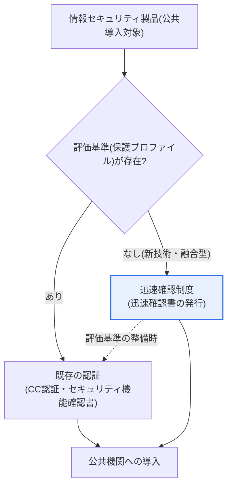
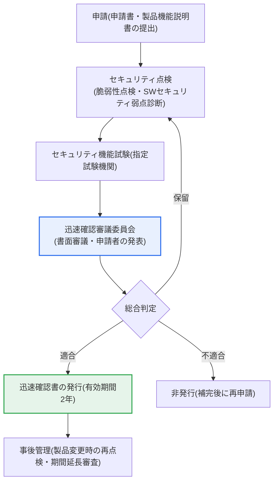

# 情報セキュリティ製品迅速確認制度

## 1. 概要

### A. 定義
> **情報セキュリティ製品迅速確認制度**とは、既存の認証体系に**評価基準(保護プロファイルなど)が存在しないため公共機関での導入が遅れていた新技術・融合型の情報セキュリティ製品**について、別途の迅速な手続きでセキュリティ性を確認(適合判定時には迅速確認書を発行)し、公共機関への導入の道を開く制度である。

この制度が必要となった根本的な理由は、「**技術発展の速度と認証制度との時間差**」にある。公共機関が情報セキュリティ製品を導入するには、「電子政府法」・「国家情報保安基本指針」などに基づき、セキュリティ性の検証を受けた製品を使用しなければならない。しかし代表的な検証手段である**CC(コモンクライテリア)認証**や**セキュリティ機能確認書**は、定められた評価基準、すなわち国家用保護プロファイル(PP)や国家セキュリティ要件が存在する製品類型しか評価できない。ところが、クラウドセキュリティ・ゼロトラスト・AIベースのセキュリティ・融合型(例:セキュリティ+ネットワーク+データ)製品のように新たに登場した類型は、**評価基準自体がまだ整備されていない**ため、製品がいかに優れていても公共市場に参入できないという死角に置かれていた。

迅速確認制度は、まさにこの空白を埋めるものである。定められた基準のない革新的な製品であっても、セキュリティ点検・機能試験の結果に基づいて迅速にセキュリティ性を確認することで公共市場への参入を可能にし、国内情報セキュリティ産業のイノベーションを促進する。すなわち「基準がないために導入できなかった」製品を「確認を通じて導入できるように」する**架け橋の役割**を果たす制度と理解するのが正確である。ただしこれは正式な認証を代替するものではなく、正式な評価基準が整備されるまでの**時限的・補完的な経路**であるという点が、制度設計の中核的な前提である。

### B. 登場背景と根拠
制度の背景には、新技術セキュリティ企業が抱えてきた積年の困難がある。新たな脅威に対応する革新的な製品が次々と発売されているにもかかわらず、それを評価する基準の整備が追いつかず公共調達への参入が阻まれ、スタートアップ・中小セキュリティ企業の成長が停滞するという問題が繰り返されてきた。これを受けて科学技術情報通信部は、**「情報保護システムの評価・認証等に関する告示」(科学技術情報通信部告示第2022-61号)**および韓国インターネット振興院(KISA)の詳細案内(2022年10月)を根拠として、**2022年11月から迅速確認制度を施行**した。運営はKISAが主管し、セキュリティ試験は指定試験機関(TTA、KTRなど)が実施する体系となっている。

## 2. 既存の認証体系との関係

情報セキュリティ製品が公共機関に導入されるためには、何らかの形でセキュリティ性が認められなければならない。以下の構造図は、評価基準の有無によって製品がどの検証経路に分岐するかを示している。

この構造において、二つの経路は競合関係ではなく**相互補完的**に機能する。評価基準のある製品は既存の認証(CC認証・セキュリティ機能確認書)という定型的な評価を経て、基準のない新技術・融合型製品は迅速確認制度を通じてセキュリティ性の確認を受ける。そして迅速確認を受けた製品類型について後に正式な評価基準が整備されれば、当該製品は正規の認証体系へ吸収・移行されることが望ましい(図の点線)。こうすることで、「基準のある製品」と「基準がまだない製品」の双方が検証を経て公共機関に導入されうる二重のセーフティネットが完成する。

既存の認証と迅速確認制度の違いは、単に「速いか遅いか」の問題ではなく、**検証の性格の違い**に由来する。CC認証は、事前に合意された保護プロファイルに製品が適合しているかを定型的・詳細に評価するため時間がかかるが、検証の深さは深い。一方、迅速確認は定型的な基準がない状態で、**セキュリティ点検(脆弱性点検・ソースコードのセキュリティ弱点診断)と機能試験の結果を根拠に審議委員会が総合判定**する方式であるため、相対的に迅速である反面、「最低限のセキュリティ性の確認」に重点が置かれている。この違いを理解していないと、迅速確認を正式な認証と同等のものと誤解しかねないため注意が必要である。

| 区分 | 既存の認証(CC・セキュリティ機能確認書) | 迅速確認制度 |
|---|---|---|
| **対象** | 評価基準(PP)のある製品 | 基準のない新技術・融合型製品 |
| **方式** | 定型評価(保護プロファイルに対する詳細評価) | セキュリティ点検・機能試験の結果に基づく審議 |
| **所要期間** | 相対的に長期 | 相対的に迅速(発行まで約2か月程度) |
| **成果物** | 認証書 | 迅速確認書(有効期間2年) |
| **性格** | 標準的な検証 | 革新的製品の迅速な導入支援(時限的な架け橋) |

## 3. 申請要件と審議手続き

迅速確認制度は「速いが検証のない」経路ではなく、**定められた要件と審議段階を経る手続き的な制度**である。以下のプロセス図は、申請から迅速確認書の発行・事後管理までの流れを示している。

### A. 申請とセキュリティ点検
申請段階で企業は、製品の機能説明書とともにセキュリティ性を立証する資料を提出する。このとき中核となるのが**セキュリティ点検**であり、大きく既知の脆弱性に対する**脆弱性点検**と、開発段階の欠陥を確認する**ソフトウェアセキュリティ弱点診断(セキュアコーディング)**が求められる。これは、製品が少なくとも既知のセキュリティ欠陥とコードレベルの脆弱性を統制していることを確認するためのものであり、迅速さを理由に基本的なセキュリティ衛生を省略しないようにする仕組みである。

この段階が重要な理由は、定型的な評価基準のない製品ほど「何を基準に安全とみなすのか」が曖昧になるためである。脆弱性点検とセキュリティ弱点診断は、基準のない状況でも適用可能な**共通のセキュリティ最低ライン**を提供する。例えば、ある新技術製品が機能面では革新的であっても、ソースコードに多数の深刻なセキュリティ弱点を抱えていれば、この段階でふるい落とされて補完を求められる。

### B. セキュリティ機能試験
次に、製品が標榜するセキュリティ機能が実際に動作するかを、指定試験機関(TTA、KTRなど)が検証する。これは製品文書に記載された機能仕様が実装と一致しているかを確認する手続きであり、「機能はあると言いながら実際には動作しない」という虚偽・誇張のリスクを低減する。新技術製品は参照できる標準試験項目がない場合が多いため、製品特性に合わせて試験範囲を協議・設計する柔軟性も併せて求められる。

セキュリティ機能試験は、申請企業の立場からすると準備負担の大きい段階でもある。試験項目の導出・環境構築・再現手順の整備に相当な時間とコストがかかりうるため、企業は申請前に試験機関と事前協議を行い、範囲を明確にしておくことが実務上有利である。

また、試験結果は審議段階で製品の安全性を判断する中核的な根拠となるため、機能仕様を誇張なく明確に記述し、試験可能な形で定義することが重要である。仕様が曖昧であれば試験範囲が不明確となり、保留・再申請につながりうる。これは「迅速」という制度の趣旨を自ら損なう結果となる。

### C. 迅速確認審議と事後管理
提出された文書とセキュリティ点検・機能試験の結果は、**迅速確認審議委員会**の審議を経る。審議には提出資料に対する**書面審議**と**申請者による発表**が含まれ、委員会は①製品が実際に新技術・融合型製品に該当するか、②製品の機能、③製品の安全性、④保守方策の適切性などを総合的に評価し、**適合・保留・不適合**を判定する。「適合」となれば**有効期間2年の迅速確認書**が発行され、全体の所要期間はおおむね申請後約2か月程度とされている。

発行で終わりではなく、**事後管理**が続く。製品に変更が生じた場合は脆弱性点検・セキュリティ弱点診断を再度実施して変更の承認を受けなければならず、有効期間(2年)を延長するには、既存の認証制度への移行可能性などを検討し、脆弱性点検を経て期間を延長する。こうした事後管理は、「一度確認を受ければ放置される」リスクを防ぎ、製品が継続的にセキュリティ水準を維持するよう強制する安全装置である。

| 審議判定 | 意味 | 後続措置 |
|---|---|---|
| **適合** | セキュリティ性確認の要件を充足 | 迅速確認書の発行(有効期間2年) |
| **保留** | 一部補完が必要 | 補完後に再審議 |
| **不適合** | 要件を満たさない | 非発行、補完後に再申請 |

### D. 適用例から見る手続きの意味
手続きの趣旨は、具体的な状況に当てはめてみると明確になる。例えばクラウドワークロードセキュリティ(CWPP)やゼロトラストのアクセス制御のような融合型製品は、機能が複数のセキュリティ分野にまたがるため、既存の単一の保護プロファイルでは評価項目を特定しにくい。こうした製品はCC認証の経路では「評価基準なし」で頓挫しやすいが、迅速確認制度では、脆弱性点検・セキュリティ弱点診断でコード・構成のセキュリティ最低ラインを確認し、製品が標榜する中核的なセキュリティ機能(例:ワークロードの分離、ポリシーベースのアクセス制御)が実際に動作するかを試験したうえで、審議委員会が新技術該当性と安全性を総合判定する。

この過程における審議委員会の四つの評価観点(新技術・融合型への該当性、機能、安全性、保守方策の適切性)は、「基準のない製品をいかに公正に判断するか」という難題に対する実務的な答えである。特に**保守方策の適切性**を判定要素に含めたのは、新技術製品ほど、リリース後の脆弱性対応・パッチ体制が整っているかどうかが実使用時の安全性を左右するためである。すなわち迅速確認は、「現時点でこの製品が安全か」だけでなく「今後も安全に維持されうるか」までを併せて見るという点で、単なる通過手続きではなく、最低限の持続可能性の検証を志向している。

## 4. 深掘り — 導入効果と最近の動向

迅速確認制度は施行以降、新技術セキュリティ企業の公共市場参入を実際に拡大する成果を上げた。クラウドセキュリティ、EDR、ゼロトラスト、AIセキュリティなど、既存の評価基準では包含しにくかった融合型製品が迅速確認を通じて公共調達に参加する根拠を得たことで、国内セキュリティスタートアップの導入実績の確保と売上創出に寄与している。これは情報セキュリティ産業の育成という政策目標に直結している。

制度の効果は単に「一製品の参入」にとどまらず、**産業エコシステムの好循環**を狙ったものである。公共分野での導入実績を確保した新技術企業はそれを足掛かりに民間・海外市場へと拡大し、その成長が再び新技術への投資と新製品の発売につながる。政府の立場からも、未検証製品の無分別な導入を防ぎながら革新的製品の普及を促すことができ、「セキュリティ」と「産業振興」という二つの政策目標を同時に達成する手段となる。この点で迅速確認は、調達制度であると同時に産業政策のツールとしての性格も併せ持つ。

同時に、制度の**整合性維持**のための後続の取り組みも進められている。迅速確認を受けた製品類型について正式な評価基準(保護プロファイル)を整備して正規の認証へ移行しようとする流れと、性能評価・セキュリティ機能確認書など隣接制度との整理が並行して進んでいる。例えば情報セキュリティ製品の性能評価制度に新たな製品群を追加し評価基準を強化するなど、新技術製品の検証体系全般が継続的に補強される傾向にある。ただし個々の制度の詳細な基準・対象品目は改正によって変わり続けるため、実際の申請・活用時には、KISA・情報保護産業振興ポータルの最新の公告を確認することが望ましい。

一方、導入機関の立場からの活用ポイントも押さえておく必要がある。公共機関の情報化担当者は、調達・購買仕様を作成する際、標準的な認証が存在する品目についてはCC認証・セキュリティ機能確認書を、まだ基準のない新技術品目については迅速確認書を、それぞれ要求の根拠とすることができる。このとき、迅速確認はCC認証と検証の性格が異なるという点を仕様に反映し、迅速確認製品を導入する場合でも、運用段階での独自のセキュリティ性レビュー(構成管理・脆弱性点検・ログ監視)を併せて規定しておくことが安全である。これは、制度が「導入のハードルを下げても、セキュリティ責任まで免除するものではない」という原則を実務において貫く方法である。

## 5. 考慮事項および示唆点

迅速確認制度は「イノベーション支援」と「セキュリティ検証」という二つの目標を同時に追求する制度であり、技術士の観点からは次の点をバランスよく考慮しなければならない。

1. **イノベーションの速度と検証の深さのバランスが制度の本質である。** 迅速さを前面に出しつつも、脆弱性点検・セキュリティ弱点診断・機能試験という最低限の検証を維持してこそ、イノベーション支援と安全確保を両立できる。検証を過度に緩和すれば未検証製品が公共分野に流入するリスクが、過度に強化すれば制度の存在理由である「迅速性」が損なわれるリスクがある。

2. **既存の認証体系への連携・移行を前提として運営しなければならない。** 迅速確認は有効期間2年の時限的な架け橋であるため、当該技術の正式な評価基準が整備されれば、CC認証・セキュリティ機能確認書などの正規の体系へ吸収・移行するロードマップが必要である。そうでなければ、迅速確認が「抜け道」として固定化しかねない。

3. **国内情報セキュリティ産業エコシステムの活性化という観点からアプローチしなければならない。** 評価基準の不在によって挫折していた新技術セキュリティ企業に公共市場参入の機会を開き、導入実績・売上を確保させることで、セキュリティ産業のイノベーションと自立を促進する。特に資本・人材が不足するスタートアップには、試験・審議の準備負担を軽減する支援を併せて行う必要がある。

4. **事後管理と責任の所在を明確にしなければならない。** 迅速確認書は発行で終わるものではなく、製品変更時の再点検、有効期間延長の審査など継続的な管理が求められる。導入機関は、迅速確認がCC認証とは検証の深さが異なることを認識し、製品の運用段階で独自のセキュリティ点検・監視を併行することが望ましい。

5. **AI・クラウドなど融合型新技術の普及に対応する柔軟性が必要である。** 今後も標準的な評価基準のない新たな類型のセキュリティ製品が次々と登場するため、制度は特定の品目に固定化されることなく、新技術の登場に合わせて審議基準と試験方法を柔軟に拡張できなければならない。

6. **制度の信頼性確保のための審議の透明性・専門性が鍵である。** 定型的な基準なしに審議委員会の総合判定に依存する構造であるため、判定の一貫性・客観性を担保する審議基準の公開、委員構成の専門性・独立性、判定理由の記録・フィードバック体制が裏付けとならなければならない。これが不十分であれば、「なぜこの製品は通り、あの製品は通らないのか」という公平性をめぐる論争によって、制度の信頼が損なわれかねない。

## 参考資料
- 韓国インターネット振興院(KISA)、新技術および融合・複合情報保護製品迅速確認制度: https://www.kisa.or.kr/1041502
- ZDNet Korea、「11月から情報保護製品迅速確認制…発行まで2か月」(2022): https://zdnet.co.kr/view/?no=20221018081026

---

> **一言まとめ**: 情報セキュリティ製品迅速確認制度は、*評価基準がないため公共導入が阻まれていた新技術・融合型セキュリティ製品*について、脆弱性点検・セキュリティ弱点診断・機能試験と審議委員会の判定を経て有効期間2年の迅速確認書を発行する時限的な架け橋となる制度であり、イノベーション支援と最低限の検証のバランス・既存認証との連携・事後管理を通じてセキュリティ産業の活性化に寄与する。
