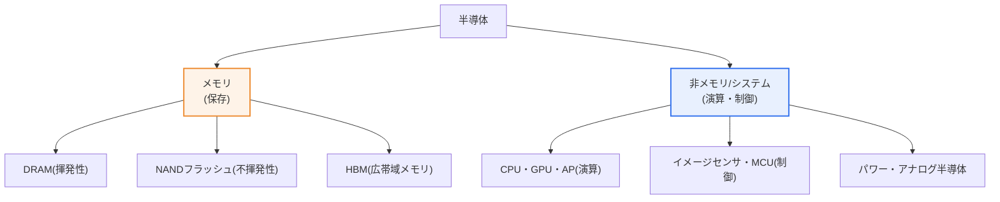
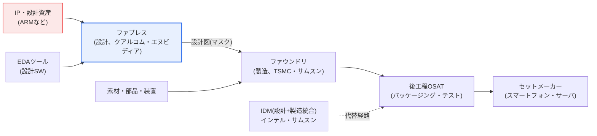

# 半導体産業 — メモリ・非メモリ、バリューチェーン、成長戦略

## 1. 概要

### A. 定義と背景
> 半導体はあらゆるデジタル機器の頭脳であり、データを保存する**メモリ**と、演算・制御を担う**非メモリ(システム)半導体**に大別される。韓国はメモリ半導体の強国であるが、非メモリでは相対的に劣勢であり、この構造的不均衡の解消が国家的課題である。

半導体産業を理解する第一の鍵は、「**メモリと非メモリは性格が根本的に異なる市場である**」という認識である。メモリはデータを保存する標準化された規格品(DRAM・NANDフラッシュ)であり、同一規格の製品を大量に生産する少品種・大量生産構造である。したがって競争力は「**どれだけ微細に、どれだけ安く、どれだけ多く**」作れるかにかかっており、これは大規模な設備投資と微細プロセス技術に帰結する。このゲームのルールが資本とプロセス技術であるため、莫大な投資に耐え、先行するプロセスを維持してきた韓国企業が世界1〜2位を争う強者の地位を築いた。

一方、非メモリ(システム半導体)は演算・制御・変換を担う多品種・少量のカスタム製品(CPU・GPU・AP・イメージセンサ・パワー半導体など)である。顧客ごとに要求する機能が異なるため、「**いかに優れた設計をし、いかに多様な顧客に対応するか**」が競争力の本質である。市場規模も半導体全体の約2/3を占め、メモリ(約1/3)より大きい。問題は、この大きな市場における韓国の地位が低い点である。設計(ファブレス)と設計資産(IP)の能力が脆弱であり、製造(ファウンドリ)は強いものの、最先端プロセスのリーダーシップと多様な顧客基盤の確保において挑戦を受けている。

このような異質性のため、半導体産業にはいくつかの明確な特徴がある。**極端な資本集約性**(最先端工場1棟に数十兆ウォン)、**急速な技術の陳腐化**(ムーアの法則に従う世代交代)、**高い歩留まり感度**(不良率数%が収益を左右)、そして**強い地政学性**(中核装置・素材・市場が特定国に偏在)である。これらの特徴は、後述するサイクル変動性・サプライチェーンリスク・経済安全保障問題の根本原因となる。

第二の鍵は「**分業**」である。メモリは設計と製造を一社が統合(IDM)する場合が多いが、非メモリは設計専門のファブレスと製造専門のファウンドリに分かれている。この水平分業構造のおかげで、資本が乏しい設計企業もアイデアだけで市場に参入できるようになり、逆にファウンドリは世界中のファブレスの物量を集めて規模の経済を実現する。したがって半導体強国になるには、メモリの優位を守りつつ非メモリの「設計エコシステム」を併せて育成し、バランスをとる二元戦略が必要である。本稿では、(1) メモリ・非メモリの違い、(2) バリューチェーンの分業構造、(3) 非メモリの成長戦略、(4) 最近のAI半導体動向を深掘りして扱う。

## 2. 産業全体構造図

半導体産業の全体像は、「何を作るか(製品)」と「誰がどの段階を担うか(バリューチェーン)」の2つの軸で描くことができる。以下の構造図は製品分類を、第3章以降のダイアグラムはバリューチェーンの流れをそれぞれ表現する。

メモリの中でも性格は分かれる。DRAMは高速であるが電源が切れるとデータが消える揮発性メモリであり主記憶装置に用いられ、NANDフラッシュは低速であるが電源が切れてもデータを保持する不揮発性メモリであり、ストレージ(SSD)に用いられる。近年は、複数のDRAMチップを垂直に積層して帯域幅を大きく高めた**HBM(High Bandwidth Memory)**がAIアクセラレータ用として急浮上しており、これは従来のメモリ市場とAI半導体を結ぶ決定的な接点となった。非メモリは演算(CPU・GPU・AP)、制御(MCU・イメージセンサ)、パワー・アナログなどに分かれ、製品の種類が数千に及ぶほど多様である。

## 3. メモリ vs 非メモリ半導体の比較

両市場の違いは単なる機能の違いではなく、「**競争のルールそのものが異なる**」点にある。メモリは規格が標準化されているため製品自体での差別化が難しく、結局は原価とプロセス微細化で勝負する。そのため好況・不況の振幅が大きい。需要が集中すれば価格が急騰し、供給が過剰になれば価格が暴落する「サイクル」産業であり、少数企業が大規模投資で競う寡占構造が形成される。

非メモリはその正反対である。顧客の要求に合わせてチップを設計するため、一度特定製品に採用されれば長く維持される安定的な売上構造を持ち、市場サイクルの振幅も相対的に小さい。その代わり参入障壁が「資本」ではなく「設計能力・ソフトウェアエコシステム・顧客の信頼」にあるため、後発企業が短期間で追いつくのは難しい。韓国がメモリでは世界の頂点にありながら非メモリで苦戦する理由は、まさにこのルールの違いにある。

| 区分 | メモリ半導体 | 非メモリ(システム)半導体 |
|---|---|---|
| **機能** | データ保存 | 演算・制御・変換 |
| **製品** | DRAM、NANDフラッシュ、HBM | CPU、GPU、AP、センサ、パワー半導体 |
| **生産** | 少品種・大量生産 | 多品種・少量カスタム |
| **競争力** | 微細プロセス・設備投資・原価 | 設計能力・SWエコシステム・顧客対応 |
| **市場特性** | サイクル(好不況の振幅大) | 相対的に安定、採用時に長期売上 |
| **市場比率** | 約1/3 | 約2/3 |
| **韓国の地位** | 強国(1位圏) | 劣勢(設計が脆弱) |

実例として、2021〜2022年にパンデミック特需でメモリ価格が急騰した後、2023年にIT需要の鈍化で大規模な赤字サイクルを経験したことは、メモリ市場の変動性をよく示している。反対に、イメージセンサ・パワー半導体のように特定機器に長く採用される非メモリは緩やかな成長を維持した。この違いは「韓国の半導体輸出がなぜこれほど乱高下するのか」を説明する根拠でもある — 輸出の相当部分がサイクル性のメモリに偏っているためである。

このサイクル性は単なる価格変動を超え、**投資タイミングのジレンマ**を生む。メモリは好況期に増設を決定するが、実際の量産まで数年かかるため、完工時点ですでに不況に入っており供給過剰を深刻化させる「豚サイクル(hog cycle)」が繰り返される。それでも微細プロセスのリーダーシップを失えば原価競争で劣後するため、不況期でも技術投資を止めることはできない。このように「止められない投資」がメモリ産業の参入障壁を極端に高めて少数寡占を固定化すると同時に、非メモリへの事業多角化がなぜ切実なのかを逆説的に示している。売上の安定性を確保するには、サイクルの緩衝役を果たし得る非メモリ・システム半導体の比率を高めることが構造的解決策となるからである。

## 4. 半導体産業のバリューチェーン(Value Chain)

非メモリ半導体は設計と製造が分業化されている。この分業構造を理解することが成長戦略の出発点である。以下のフロー図は、アイデアから完成チップまでの段階別の主体と流れを示す。

**設計(ファブレス)**段階は付加価値の源泉である。ファブレスは工場を持たずチップの設計のみを行い、製造はファウンドリに委託する。クアルコム・エヌビディア・AMDが代表的である。設計にはEDA(設計自動化ソフトウェア)と、ARMのような企業が提供する検証済みの設計ブロック(IP)が不可欠であるが、このEDAとIPの市場は少数の海外企業が掌握しており、設計エコシステムの「見えない関門」の役割を果たしている。韓国のファブレスが成長するには、単に設計人材だけでなく、このIP・ツールエコシステムへのアクセスと国産IPの確保が併せて実現されなければならない。

**製造(ファウンドリ)**は、ファブレスの設計図を受け取って実際のチップを製造する受託生産である。TSMCが最先端プロセスで圧倒的なシェアを握って市場を主導し、サムスンファウンドリがそれを追撃する構図である。ファウンドリ競争力の核心は、「**最先端微細プロセスを先に、安定した歩留まりで**」確保することと、「**多様な顧客を確保**」することである。微細プロセスで1世代(例: 5nm→3nm)先行すれば性能・電力効率で優位に立ち大口顧客を獲得できるため、ファウンドリは数十兆ウォン規模の設備投資を継続して耐え抜かねばならない「資金力の戦争」である。

ここで指摘すべきは、**EDA・IPという「見えないボトルネック」**である。いかに優れた設計人材がいても、チップを設計するソフトウェア(EDA)と検証済みの設計ブロック(IP)がなければ、現代の複雑なチップは設計できない。ところがこの2つの市場は少数の海外企業が事実上の標準を握っており、設計エコシステムの最上流に強力な参入障壁を形成している。韓国のファブレス育成が人材育成だけでは完成しない理由がここにある — 国産IPを蓄積し、EDAへのアクセス性を確保し、大学・研究所が設計資産を共有するオープンなエコシステムを併せて構築して初めて、設計の裾野が広がる。これは短期投資では解決しない、数十年にわたる知識蓄積の問題であるという点で、国家戦略の忍耐が求められる。

**後工程(OSAT)**は、完成したウェーハを切断してチップをパッケージングし、検査(テスト)する段階である。かつては付加価値の低い下請けと見なされていたが、微細プロセスが物理的限界(原子サイズ)に近づくにつれて状況が変わった。複数のチップを1つに結合する**先端パッケージング(チップレット・異種集積、2.5D/3D)**が性能を引き上げる新たな鍵として浮上し、後工程の戦略的重要性が大きく高まった。**素材・部品・装置**は、これらすべての段階を支える基盤であり、露光装置などの中核装置は特定海外企業への依存度が高く、サプライチェーンリスクの代表的事例となっている。最後に、設計と製造を一社がすべて行う**IDM(垂直統合型半導体企業)**モデルがあり、メモリ企業とインテルがこれに該当する。

## 5. 非メモリ成長のためのビジョンと戦略

これまでの診断を総合すると、戦略の方向性は明確である。メモリの優位を守りつつ、脆弱な設計(ファブレス)とIPを育成し、強みであるファウンドリを最先端へ押し上げ、これを支える素材・部品・装置、人材、エコシステムを併せて構築することである。以下の表の各戦略は互いに噛み合っており、単独では効果が限定的である。

| 戦略 | 内容 | 理由・含意 |
|---|---|---|
| **ファブレス育成** | 設計スタートアップ・人材育成、国産IP確保 | 付加価値の源泉、サイクル防御 |
| **ファウンドリ競争力** | 最先端微細プロセス投資、顧客多角化 | 先端プロセス優位=大口顧客獲得 |
| **エコシステム・分業強化** | 設計-製造-後工程の協力、素材・部品・装置の国産化 | サプライチェーン自立、リスク緩和 |
| **国家支援** | R&D・税制、特化団地(クラスター)、人材育成 | 資本・人材規模の問題解決 |
| **先端パッケージング** | チップレット・異種集積で微細化の限界を補完 | 後工程が性能の新たな鍵 |

特に国家レベルでは、大規模な半導体クラスターを造成し、設計-製造-素材・部品・装置企業と人材を一か所に集積させる「**エコシステム集積**」戦略が推進されている。これは個別企業の努力だけでは埋めがたい人材・インフラの規模の問題を、国家が共に解決するアプローチである。米国のCHIPS Act、EUのChips Actのように、主要国が自国内の生産基盤確保のため大規模な補助金競争に乗り出したのも同じ文脈であり、半導体が産業を超えて「経済安全保障」の問題になったことを示している。

戦略間の優先順位を判断する際に留意すべきは、ファブレスとファウンドリが互いを必要とする「**鶏と卵**」の関係にある点である。国内ファブレスが不足すれば国内ファウンドリは海外顧客に依存せざるを得ず、逆に信頼できる国内ファウンドリ・パッケージング基盤が薄ければ、ファブレスは設計を委託する先が見当たらない。したがって一方のみを支援する政策は効果が半減し、設計-製造-後工程-素材・部品・装置を1つのエコシステムとして束ね、同時に育成する「パッケージ型支援」が必要である。クラスター戦略が注目される理由も、まさにこの相互依存を物理的集積によって解消しようとする点にある。ただし補助金・税制支援は重複投資と供給過剰を招きかねないため、市場需要と技術ロードマップに整合した選択と集中が並行されなければならない。

## 6. 深掘り — AI半導体とHBM、そして最近の動向

近年、半導体産業の地形を揺るがした決定的な変数は**生成AI**である。大規模言語モデルの学習・推論には膨大な並列演算とデータ帯域幅が必要であり、これを担うのがGPU・NPUのようなAIアクセラレータと、その傍らでデータを超高速で供給する**HBM**である。ここで韓国のメモリ産業に重要な機会が開かれた。HBMは複数のDRAMを垂直に積層して作る高付加価値・高難度のメモリであり、従来のDRAMの強者である韓国企業が世界市場を主導している。すなわち「**メモリの強み(HBM)をAIという成長市場に接ぎ木する**」形で、サイクル性のメモリ事業が成長事業として再評価される契機となったのである。

一方、AI半導体競争は純粋なハードウェアの戦いだけではない。エヌビディアの事例のように、AIアクセラレータの真の参入障壁はチップそのものより、その上で動作する**ソフトウェアエコシステム(開発ツール・ライブラリ)**にある。開発者が特定プラットフォームに慣れると、ハードウェアを変更しにくい「ロックイン(lock-in)」が発生するためである。これは後発企業が高性能なチップを作っても市場への定着が容易でない理由であり、韓国のAI半導体(NPU)戦略がチップ設計に加えてソフトウェアスタック・開発者エコシステムの確保を並行すべき根拠となる。

同時にこの流れは非メモリ戦略にも示唆を与える。AIアクセラレータの頭脳であるGPU・NPUの設計は依然として海外ファブレスが主導しているため、韓国は (1) HBMなどAI用メモリにおける優位をてこにし、(2) AI半導体(NPU)の設計能力を国家的に育成し、(3) HBMとロジックチップを結合する先端パッケージングの競争力を確保する、という「三重連携」戦略が有効である。実際にAIブーム以降、最先端ファウンドリとHBM、先端パッケージングが1つのバリューチェーンとして結び付き、この3領域をすべて備えた企業が有利になる統合的な競争構図が現れている。ただしAI需要の持続性、米中の技術覇権競争に伴う輸出規制など不確実性が大きいため、特定の市況を断定するよりも「メモリ・ファウンドリ・パッケージングのバランスある強化」という構造的方向に重心を置くことが安全である。

## 7. 考慮事項および示唆

1. **設計エコシステムの育成が最優先課題**である。メモリの優位だけでは市場の2/3を占める非メモリを取り逃がすことになる。高付加価値のファブレス設計能力と国産IP・EDAへのアクセス性、そして何より設計人材を長期的に育成しなければならず、これは短期成果ではなく10年単位の投資として取り組むべきである。
2. **サプライチェーンの安定と技術主権**が核心である。半導体が経済安全保障の中心となり、中核装置・素材の特定国依存を下げる素材・部品・装置の国産化と、多角化された安定的なサプライチェーンの確保が国家戦略となった。特定装置・素材のボトルネックはそのまま全体生産のボトルネックとなるため、リスク分散が不可欠である。
3. **AI半導体・HBMが新たな成長軸**である。メモリ(HBM)の強みとAIアクセラレータ設計・先端パッケージングを連携する統合戦略が、サイクル産業の限界を超える突破口となる。ただしAI需要の変動性と地政学リスクを併せて管理しなければならない。
4. **微細化の限界と先端パッケージングへの転換**に備えなければならない。プロセス微細化が物理的限界に近づくにつれ、性能向上の重心が「より小さく」から「よりうまく接合する(チップレット・異種集積)」へと移動している。後工程を低付加価値の下請けではなく戦略領域として再認識し、投資すべきである。
5. **人材確保がすべての戦略のボトルネック**である。設計・プロセス・パッケージングのいずれの戦略も、最終的には人が実行する。理工系離れと高度人材の流出を防ぎ、海外人材を誘致する人材政策が裏付けとならなければ、他の投資の効果は半減する。

## 参考資料
- 韓国半導体産業協会(KSIA): https://www.ksia.or.kr/
- SEMI(国際半導体製造装置材料協会): https://www.semi.org/
- 韓国産業通商資源部 半導体産業政策: https://www.motie.go.kr/

---

> **一言まとめ**: 半導体は*保存のメモリ(韓国が強国)と演算の非メモリ(設計が脆弱)*に分かれ、競争のルールそのものが異なる。IP・ファブレス・EDA→ファウンドリ→後工程へと続くバリューチェーンにおいて、**ファブレス設計エコシステムの育成・素材・部品・装置の国産化・AI半導体(HBM・先端パッケージング)との連携**が、非メモリ成長と経済安全保障の核心戦略である。
