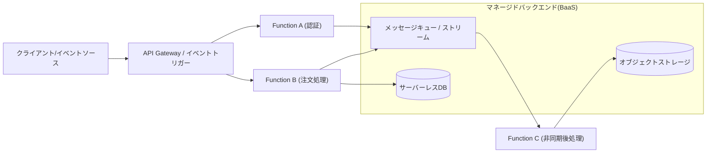
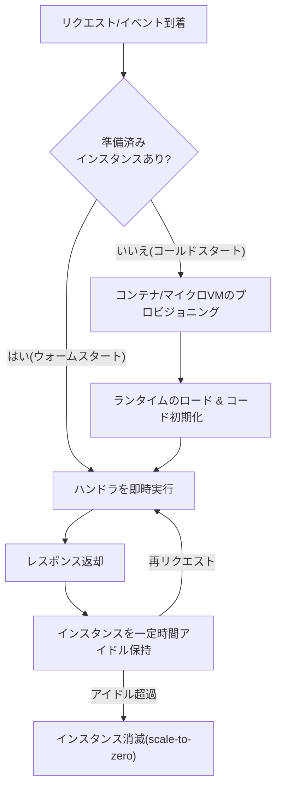

# サーバーレスコンピューティング(Serverless Computing / FaaS)

## 1. 概要

> **定義**: サーバーレスコンピューティングとは、開発者がサーバーのプロビジョニング・スケーリング・パッチ適用などのインフラ運用をクラウド事業者に完全に委任し、**イベントに反応する関数(Function)またはマネージドサービス単位でアプリケーションを構成**し、実際の実行に使用したリソース分だけ課金(pay-per-use)されるクラウド実行モデルである。

「サーバーがない」という名称は物理サーバーが消えることを意味するのではなく、**サーバーの存在が開発者の関心事から消える(server-less)**という意味である。従来のIaaS・PaaSでは、トラフィックがなくてもインスタンスを常時起動し、その分のコストを支払わなければならなかったが、サーバーレスはリクエストが到着した瞬間にのみ関数インスタンスを生成して実行し、アイドル時にはリソースを0まで縮小(scale-to-zero)する。これはすなわち**リソース使用の最小単位を「サーバー貸与時間」から「関数1回の呼び出し・数十ミリ秒」へ引き下げる**変化であり、マイクロサービス・イベント駆動アーキテクチャの普及と相まって登場の背景を形成した。

登場背景は3つある。第一に、**運用負担の急増**である。コンテナ・オーケストレーションが普及するにつれ開発チームが担うべきインフラ管理の範囲が広がり、ビジネスロジックよりも運用にリソースが偏る問題が浮上した。第二に、**コスト効率**である。トラフィック変動が大きい、あるいは断続的なワークロード(バッチ、Webhook、IoTイベント)では常時起動インスタンスの無駄が大きく、使用量ベースの課金がこれを解消する。第三に、**開発の俊敏性**である。関数単位のデプロイによってリリースサイクルを短縮し、マネージドバックエンド(BaaS)と組み合わせることで最小限のコードでサービスを完成できるようになった。2014年のAWS Lambda発表が商用化の起点であり、その後サーバーレスはFaaSを超えてサーバーレスDB・サーバーレスコンテナへと概念が拡張されている。

## 2. サーバーレスアーキテクチャの構造と構成要素

サーバーレスアプリケーションは大きく、**演算を担うFaaS(Function as a Service)**と**状態・機能を提供するBaaS(Backend as a Service)**の組み合わせで構成される。リクエストはAPI Gateway・イベントソースを通じて流入し、関数はステートレス(stateless)に実行された後、マネージドストレージ・DB・メッセージキューと相互作用しながら状態を外部に委ねる。

**FaaS**は、イベントによってトリガーされる短命な関数の実行環境である。開発者は関数コードとメモリ・タイムアウト設定のみを提供し、残りのランタイム・拡張はプラットフォームが担う。関数はステートレスの原則を守らなければならないため、セッション・キャッシュのような状態は必ず外部ストレージに置く。**BaaS**は、認証(Auth)、データベース、ストレージ、通知などのバックエンド機能をAPI形式で提供するマネージドサービスであり、サーバーレスのフロントエンドがサーバーコードなしで機能を完成できるよう支援する。**イベントソース**は関数実行の引き金であり、HTTPリクエスト・ストレージオブジェクトの生成・キューメッセージ・スケジュール(cron)・DB変更ストリームなどがある。

| 構成要素 | 役割 | 代表例 |
|---|---|---|
| FaaS | イベント駆動のステートレス関数実行 | AWS Lambda, Azure Functions, Google Cloud Functions |
| API Gateway | ルーティング・認証・スロットリング・リクエスト変換 | Amazon API Gateway |
| イベントソース | 関数トリガー | S3, SQS/SNS, EventBridge, Kinesis, cron |
| BaaS(状態) | マネージドDB・ストレージ・認証 | DynamoDB, Aurora Serverless, Firebase |
| オーケストレーション | 関数ワークフローの組み合わせ | AWS Step Functions |

## 3. 動作原理 — 実行ライフサイクルとコールドスタート

サーバーレスの中核的な技術論点は、**関数インスタンスのライフサイクル管理**である。リクエストがないときはリソースを0に保ち、リクエストが到着すると実行環境をその場で作らなければならないが、この準備過程で遅延が発生するのが**コールドスタート(Cold Start)**である。

コールドスタートは**実行環境のプロビジョニング → ランタイムのロード → 初期化コード(ハンドラ外)の実行**の3段階で発生し、言語・パッケージサイズ・メモリ設定によって数十msから数秒まで大きなばらつきがある。例えば大規模な依存関係を含むJVM関数は初期化が重くコールドスタートが1〜2秒に達する一方、軽量ランタイムは数百ms以下である。実務では初期化ロジックをハンドラの外に出してインスタンス再利用時にキャッシュし、**プロビジョンドコンカレンシー(Provisioned Concurrency)**でウォームインスタンスを常時確保し、AWSの場合はマイクロVMである**Firecracker**によって起動時間をミリ秒単位に短縮する。スケーリングはリクエスト数に比例して関数インスタンスを水平複製する方式であるため事実上自動であり、同時実行数にアカウント・リージョン単位の上限(quota)がかかる点を設計時に考慮しなければならない。

## 4. 従来モデルとの比較

サーバーレスの位置付けを理解するには、IaaS・コンテナ(CaaS)との責任境界の違いを比較する必要がある。以下の表は列挙であるが、その**違いが生じる理由**は「どこまで開発者が制御し、どこまで委任するか」という抽象化レベルの移動にある。抽象化が上がるほど、運用負担と細かな制御権とを引き換えにする。

| 区分 | IaaS(VM) | コンテナ(K8s) | サーバーレス(FaaS) |
|---|---|---|---|
| 拡張単位 | インスタンス | Pod/ノード | 関数呼び出し |
| スケールトゥゼロ | 不可(常時起動) | 限定的 | 標準サポート |
| 課金基準 | 時間 | 時間/リソース | 実行回数・時間(ms) |
| 運用負担 | 高い(OS・パッチ) | 中程度 | 最小 |
| 実行時間の制約 | なし | なし | あり(例: 15分上限) |
| コールドスタート | なし | 低い | あり |

IaaSは制御権が大きいが、OS・ミドルウェアの運用を抱え、アイドルコストを支払う。コンテナは移植性ときめ細かな制御を提供しつつも、オーケストレータの運用負担が残る。サーバーレスは運用をほぼ排除する代わりに、**実行時間の上限、コールドスタート、ローカルディスク・状態の制約、ベンダーロックイン**といった制約を受け入れる。したがって持続的かつ予測可能な高負荷ワークロードではコンテナ・IaaSが総所有コストで有利になり得、断続的・イベント型・スパイク型のワークロードではサーバーレスが有利であるという**損益分岐(break-even)判断**が、アーキテクチャ選択の核心である。

## 5. 適用事例

サーバーレスは**画像・データの後処理パイプライン**で特に強みを発揮する。例えば、ユーザーがオブジェクトストレージに画像をアップロードするとオブジェクト生成イベントが関数をトリガーしてサムネイルを生成し、メタデータをDBに記録する構成は、アップロードが集中すると自動的に数百のインスタンスへ拡張され、閑散時には0に縮小するため、コストが使用量に正確に比例する。また、**Webhook・チャットボット・IoTイベント収集**のようにリクエストが不規則で常時サーバー維持が無駄となるワークロード、**定期バッチ(cron)**、**APIバックエンドの特定エンドポイント**に幅広く用いられる。近年は**AI推論の前処理・軽量推論**、RAGパイプラインの文書処理段階にも活用されている。反対に、ミリ秒の遅延が致命的な超低遅延取引、長時間の連続演算(大規模学習)、状態を大量に保持するワークロードには不向きである。

## 6. 深掘り — サーバーレスの拡張と最新動向

サーバーレスはFaaSを超えて、**サーバーレスコンテナ**と**サーバーレスデータベース**へと概念が拡張されている。AWS Fargate、Google Cloud Runはコンテナをサーバーレス方式(scale-to-zero・使用量課金)で実行し、FaaSの実行時間・ランタイム制約を緩和しながらサーバーレスの運用上の利点を取り入れる。Aurora Serverless・DynamoDB On-DemandのようなサーバーレスDBは、トラフィックに応じて容量を自動調整する。標準化の側面では、**CloudEvents(CNCF)**がイベントメッセージフォーマットを標準化してベンダー間のイベント相互運用性を高め、**Knative**がKubernetes上でサーバーレス実行・オートスケールを提供し、オープンソースベースのベンダー中立なサーバーレスを志向している。コールドスタート緩和のためのマイクロVM(Firecracker)・スナップショット復元技法、エッジロケーションで関数を実行する**エッジサーバーレス(Edge Functions)**、WebAssemblyランタイムを活用した超軽量サーバーレスも活発な研究・商用化領域である。こうした流れは、「関数中心」を超えて「**必要なときだけ存在するコンピューティング**」というサーバーレスの哲学を多様なレイヤーへ一般化する方向として理解できる。

## 7. 考慮事項および示唆

技術士の観点から、サーバーレス導入は次の点を総合的に判断しなければならない。

- **ワークロード適合性と損益分岐分析**: トラフィックパターン(断続/スパイク vs 常時高負荷)と実行時間の特性を基準に、サーバーレス・コンテナ・IaaSの総所有コストを比較し、大規模な常時トラフィックではむしろサーバーレスの単価が不利になり得る損益分岐点を事前に算定する。
- **ベンダーロックイン(Lock-in)と移植性**: イベントフォーマット・トリガー・BaaS APIが事業者ごとに異なりロックインが深まるため、CloudEvents・Knativeなどの標準・オープンソースレイヤーを採用し、ビジネスロジックをベンダーSDKから分離するヘキサゴナル設計によって移植性を確保する。
- **性能・遅延のトレードオフ**: コールドスタートがSLAに与える影響を評価し、プロビジョンドコンカレンシー・初期化の最適化・軽量ランタイムで対応し、低遅延が絶対要件となる区間は常時起動モデルと組み合わせる(ハイブリッド)。
- **可観測性と運用成熟度**: 分散した多数の関数は追跡が困難であるため、分散トレーシング・構造化ロギング・相関IDベースの可観測性を必須で備え、IaC(Infrastructure as Code)によって関数・トリガー・権限を構成管理する。
- **セキュリティ・ガバナンス**: 関数ごとの最小権限(IAM)原則、イベントソースの信頼性検証、依存パッケージの脆弱性(SCA)管理、同時実行上限を活用したコスト暴走・DoS防御を設計段階で反映する。

今後サーバーレスは、エッジ・WebAssembly・サーバーレスコンテナと結合しながら適用範囲を広げていく見通しであり、「運用なき拡張」という価値と「制約・ロックイン」というコストをバランスよく設計するアーキテクトの判断力が成否を左右する。

## 参考資料
- AWS Lambda 開発者ガイド, https://docs.aws.amazon.com/lambda/
- CNCF CloudEvents 仕様, https://cloudevents.io/
- Knative Documentation, https://knative.dev/docs/
- CNCF Serverless Whitepaper, https://github.com/cncf/wg-serverless

---

> **一言まとめ**: サーバーレスは、インフラ運用を事業者に委任し、イベント駆動のステートレス関数(FaaS)とマネージドバックエンド(BaaS)を使用量課金・スケールトゥゼロで実行するモデルであり、運用負担排除の利点とコールドスタート・実行制約・ベンダーロックインのトレードオフを、ワークロード特性に合わせて判断しなければならない。
