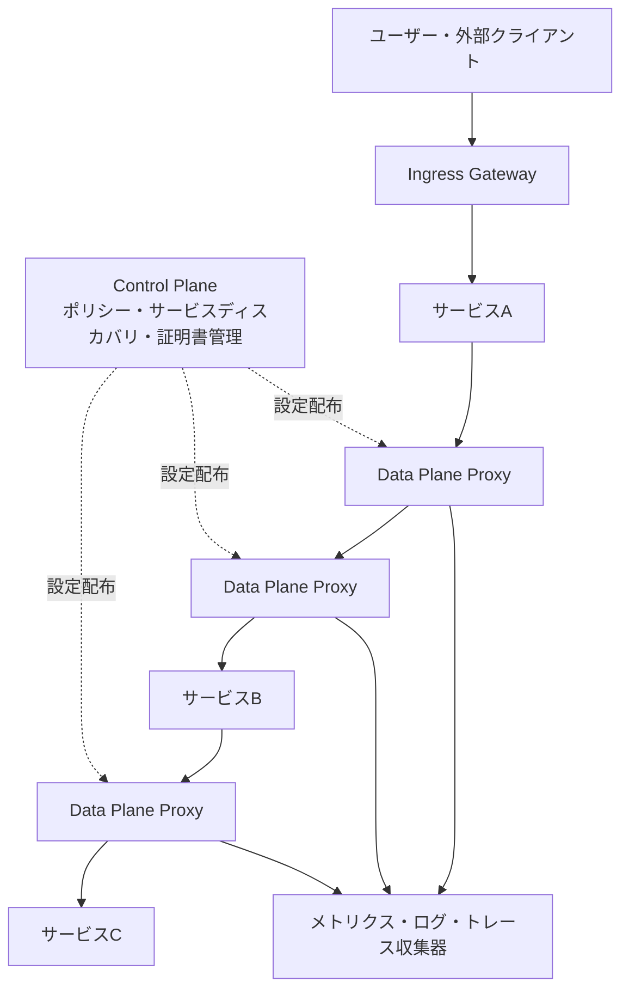
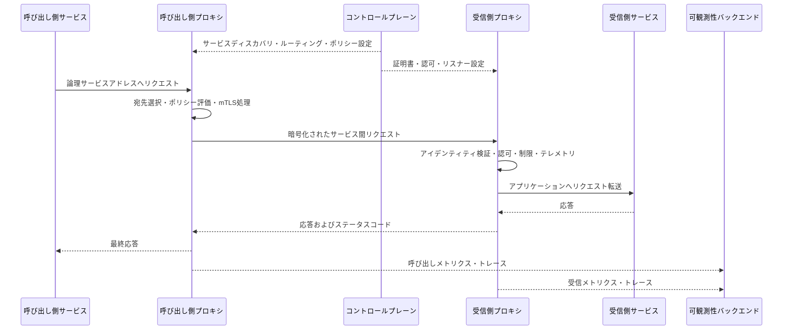

# サービスメッシュ(Service Mesh)

## 1. 概要

### A. 定義
> **サービスメッシュ(Service Mesh)**とは、マイクロサービス間の通信をアプリケーションコードから分離し、接続・トラフィック制御・信頼性・セキュリティ・可観測性を一貫して提供する専用のインフラ層である。

マイクロサービスが増えると、サービスの数よりもサービス間の呼び出し経路とポリシーの数のほうが速く増加する。あるサービスがHTTPを呼び出すのかgRPCを呼び出すのか、再試行とタイムアウトをどのように適用するのか、呼び出し主体をどのように認証するのか、障害がどの経路で発生したのかを各サービスがばらばらに実装すると、運用ルールは容易に分散してしまう。サービスメッシュはこれらの共通関心事を通信経路の中間層へ移し、アプリケーションがビジネスロジックに集中できるようにする。

CNCFはサービスメッシュを、クラウドネイティブ環境においてサービス間通信を安全・高速かつ信頼性高く扱う専用のインフラ層として説明している([CNCF Cloud Native Glossary](https://glossary.cncf.io/service-mesh/))。したがってサービスメッシュは、単にサービス同士を接続したネットワークトポロジーではなく、ポリシーを配布し、プロキシが実際のトラフィックを仲介する**管理可能な通信プラットフォーム**として理解しなければならない。

### B. 登場背景と必要性

モノリシックシステムではプロセス内部の関数呼び出しが多くネットワーク境界が少ないため、呼び出しの再試行、証明書の検証、分散トレーシングを共通ライブラリで処理しやすい。一方、マイクロサービスは複数のプロセス、ノード、アベイラビリティゾーン、言語ランタイムをまたぐ。呼び出し側はネットワーク遅延と一時的なエラーに遭遇し、受信側はバージョンの異なるAPIを提供し、運用者はリリース中に特定のバージョンへトラフィックの一部を送る必要がある。

この問題を各チームがGo、Java、Pythonなどのクライアントライブラリで個別に解決すると、機能のばらつきとバージョンの不一致が生じる。あるサービスは指数バックオフを実装しているが別のサービスは無限に再試行し、あるサービスはmTLSを検証するが別のサービスは平文通信を許可する、といった具合である。このばらつきは、障害とセキュリティ事故の共通の原因となる。

サービスメッシュは、プロキシとコントロールプレーンを通じて通信ポリシーを外部化する。サービスのコードが変わらなくても、プロキシがリクエストを観察し、宛先を選択し、暗号化されたチャネルを作り、応答時間とエラー率を収集できる。ただし外部化は万能ではない。プロキシを追加すると遅延・メモリ・運用の複雑さが増すため、サービスの数と通信の複雑さが実際にそのコストを正当化するかを、まず判断しなければならない。

### C. 中核的な価値と適用範囲

サービスメッシュは、次の四つの価値を一つの通信層で提供する。

1. **接続性**: サービスディスカバリ、ロードバランシング、プロトコル仲介のような呼び出しの基盤を標準化する。
2. **信頼性**: タイムアウト、再試行、サーキットブレーカー、障害分離、遅延注入をポリシーとして管理する。
3. **セキュリティ**: サービスのワークロードアイデンティティに基づき、mTLSと認可ポリシーを適用する。
4. **可観測性**: メトリクス、ログ、分散トレースをリクエスト単位で収集し、サービスの依存関係を把握する。

適用範囲はクラスタ内部の東西トラフィックが中心であるが、イングレスゲートウェイとイグレスゲートウェイを通じて、外部トラフィックおよび他のクラスタ・仮想マシンとの境界を管理することもできる。したがってAPIゲートウェイを置き換えるというよりも、外部の入口と内部サービス間のポリシーを、それぞれ異なる信頼境界に合わせて組み合わせるのが一般的である。

## 2. 全体構造と動作原理

### A. 論理アーキテクチャ

サービスメッシュは論理的に**データプレーン(data plane)**と**コントロールプレーン(control plane)**に分かれる。データプレーンは実際のリクエストを転送するプロキシの集合であり、リクエストのルーティングと暗号化、再試行、ポリシーの執行、テレメトリの生成が行われる実行領域である。サービスプロセスとプロキシが一緒に配置される従来の方式では、プロキシがサービスのインバウンドとアウトバウンドの通信をすべて仲介する。

コントロールプレーンは、データプレーンに適用する意図(desired state)を受け取り、サービスディスカバリ情報、ルーティングルール、証明書とポリシーを、プロキシが理解できる動的な設定に変換する。コントロールプレーンが通常のリクエストのデータ経路に直接入ることはなく、制御経路を通じてプロキシを構成する。この分離により、コントロールプレーンの一時的な障害が、既に配布済みのデータプレーンのすべてのリクエストを即座に停止させないよう設計できる。

Istioの公式アーキテクチャ文書も、データプレーンではEnvoyプロキシがサービス間通信を仲介してテレメトリを収集し、コントロールプレーンはプロキシを管理・構成すると説明している([Istio Architecture](https://istio.io/latest/docs/ops/deployment/architecture/))。特定の製品のコンポーネント名は異なりうるが、データプレーンとコントロールプレーンの役割分離は、サービスメッシュに共通する設計原理である。

### B. リクエスト処理フロー

呼び出し側のサービスは通常、サービス名や仮想ホストを宛先としてリクエストするだけであり、特定インスタンスのIPアドレスや障害の発生したインスタンスの状態を直接管理しない。呼び出し側のプロキシは、コントロールプレーンから受け取ったサービスディスカバリ情報とルーティングルールを用いて宛先インスタンスを選び、必要であればリクエストヘッダ・パス・重みに応じてバージョンを選択する。

受信側のプロキシは、リクエストがどのワークロードから来たのかを確認し、宛先サービスに許可された呼び出しかどうかポリシーを評価する。mTLSを使用する場合、プロキシが相互認証と暗号化チャネルを担うため、アプリケーションが証明書と鍵を直接扱う負担は軽減される。ただし業務上の権限は、HTTPメソッド、パス、ユーザークレームなどアプリケーションレベルの情報を必要とする場合があり、プロキシのネットワークポリシーだけですべてを解決することはできない。

リクエストが処理される間、二つのプロキシは共通形式の指標を生成する。呼び出し時間、応答コード、再試行回数、宛先ワークロード、トレース識別子などを統合すれば、複数の言語で開発されたサービスでも同一の基準で性能とエラーを比較できる。しかし個人情報やトークンを無分別にログに残すと、可観測性がかえって新たな情報保護上のリスクとなるため、マスキングと保存期間を併せて設計しなければならない。

## 3. 主な構成要素と機能

### A. データプレーンプロキシ

データプレーンプロキシは、サービスに近い位置に配置され、パケットまたはリクエストを実際に転送する。従来のサイドカーモデルでは、各アプリケーションPodにプロキシコンテナを一つずつ置き、ネットワークルールによってアプリケーションの送受信をプロキシへ迂回させる。この方式はアプリケーションの変更を最小化し、サービス単位のきめ細かいL7ポリシーを適用しやすい。

プロキシは、アプリケーションのビジネスロジックを代替しない。プロキシはリクエストを転送する宛先と方法を判断するが、注文金額の妥当性や顧客の決済限度額のようにドメイン上の意味を持つ判断は、サービスが担わなければならない。この境界を守らないと、プロキシの設定が事実上の隠れたアプリケーションとなり、テストと変更管理が困難になる。

プロキシを使用する際には、CPUとメモリのオーバーヘッド、ホップ増加による遅延、設定の伝播時間、障害時の迂回経路を評価しなければならない。特にサービス間の呼び出しが多いシステムでは、一つのリクエストが複数のプロキシを通過するため、単一呼び出しの追加遅延よりも、呼び出しのfan-outによる累積コストのほうが大きくなりうる。

### B. コントロールプレーン

コントロールプレーンは、サービスレジストリやオーケストレータからワークロードとエンドポイントの情報を読み取り、運用者が定義したルーティング・セキュリティ・可観測性のポリシーをプロキシの設定に変換する。また、ワークロードアイデンティティに使用する証明書を発行・更新し、ポリシーがどの名前空間とサービスに適用されるかを管理する。

コントロールプレーンは構成の信頼できる唯一の情報源(Single Source of Truth)の役割を果たすため、変更履歴と承認手続きが重要である。誤ったルーティングルール一つが全トラフィックを誤ったバージョンへ送ったり、過度な再試行が障害を増幅させたりしうる。Gitベースの宣言的管理、ポリシー検証、段階的デプロイ、自動ロールバックを適用すれば、コントロールプレーンの変更も通常のソフトウェアデプロイと同じ水準で統制できる。

コントロールプレーンの高可用性も必須である。既にプロキシに配布された設定が維持されていても、コントロールプレーンが長時間停止すると、新規ワークロードの登録、証明書の更新、ポリシーの変更が止まる。したがって複数のレプリカ、リーダー選出、状態ストアのバックアップ、失効前の証明書更新、制御経路とデータ経路の分離監視を併せて考慮する。

### C. トラフィック管理

サービスメッシュは、論理的なサービス名と実際のインスタンス集合を分離してトラフィックを制御する。ラウンドロビンのような単純な分配のほかにも、重みベースの分配、ヘッダ・クッキー・パスベースのルーティング、リージョン・アベイラビリティゾーン優先のルーティング、特定バージョンへのミラーリングをポリシーとして表現できる。

例えば、新しい決済サービスv2を最初は全リクエストの1%にのみ接続し、エラー率とp95遅延を確認した後に10%、50%、100%へと増やすカナリアデプロイを実装できる。問題が確認されれば、アプリケーションを再ビルドすることなくルーティングの重みを0%に変更し、迅速に以前のバージョンへ戻す。ただしデータベーススキーマが双方向に互換でなければ、トラフィックだけを戻してもデータの問題が残るため、デプロイ順序と契約の互換性を併せて点検しなければならない。

再試行とタイムアウトはネットワークエラーを吸収するが、誤って使用すると障害を拡大させる。呼び出し側が1秒のタイムアウトで3回再試行し、その呼び出し側がさらに複数のサービスへfan-outすると、元の一つのリクエストが数十個の下位リクエストに増幅されうる。冪等性が保証された読み取りリクエストを中心に再試行し、再試行バジェットとリクエスト全体のdeadlineを定めて、連鎖的な再試行を遮断しなければならない。

### D. レジリエンスと障害分離

サーキットブレーカー(circuit breaking)は、特定の宛先のエラー率や同時リクエスト数が閾値を超えた場合に呼び出しを一時的に停止し、障害の発生したサービスに回復の時間を与える。バルクヘッド(bulkhead)は、コネクションプールや同時実行数の上限を分離し、あるサービスの枯渇が他のサービスのリソースにまで及ばないようにする。この二つの機能は、それぞれ異なる障害の様相を扱う。

遅延注入とエラー注入は、実際の障害を待たずにレジリエンスを検証する方法である。例えば、推薦サービスに500msの遅延を入れて、注文サービスのタイムアウトと代替応答が正常に動作するかを確認できる。本番環境で実行する際は、対象範囲、時間、承認者、停止条件を明確にし、顧客への影響が少ない時間帯と限られたトラフィックから始めなければならない。

### E. サービス間セキュリティ

サービスメッシュは、ワークロードの暗号学的アイデンティティに基づいてサービス間認証を標準化できる。mTLSは通信内容を暗号化するだけでなく双方が互いを認証するため、ネットワーク上の位置だけで信頼する方式よりもゼロトラスト原則に近い。証明書の自動発行と更新は運用負担を軽減するが、ルートのトラストアンカーと鍵の保管、失効、有効期限の監視は別途管理しなければならない。

認証(authentication)と認可(authorization)は分けて設計する。「サービスAがサービスBであることを証明した」という事実は認証であり、「サービスAがBの照会APIを呼び出せる」という判断は認可である。最小権限ポリシーはサービス・名前空間・メソッド・パス単位で具体化し、デフォルト拒否としたうえで必要な通信のみを許可する方式へ移行する。

プロキシが主に扱うのは、サービスのアイデンティティと通信ポリシーである。エンドユーザーのログイントークン、個人情報へのアクセス目的、業務上の権限は、APIゲートウェイとアプリケーションの責任と結び付けなければならない。プロキシで単にトークンの存在だけを検査し、アプリケーションの権限判断を省略すると、認証はされているが権限が過剰であるという問題が生じる。

### F. 可観測性と運用の可視性

サービスメッシュが生成する基本的な指標は、リクエスト数、成功・失敗数、応答時間、再試行とサーキットブレーカーの発動回数などである。これらの指標をサービス・バージョン・パス・ステータスコード別にまとめれば、どのバージョンでエラーが増加したのか、ネットワーク遅延なのかアプリケーション遅延なのかを区別できる。

分散トレーシングは、一つのユーザーリクエストが複数のサービスを経由する経路を追跡する。呼び出し側サービスが渡すtrace IDとspan contextをプロキシが保持すれば、サービスのコードが異なる言語であっても共通のトレースが可能となる。トレースのサンプリング率を100%に固定するとコストと保存量が大きくなりうるため、エラーリクエスト優先、高遅延リクエスト優先、代表サンプリングなどのポリシーを選択する。

可観測性データは運用者にとってのみ有用なものではなく、容量計画とサービスレベル管理の根拠でもある。例えば、決済APIのp99遅延とエラーバジェットをリリース前後で比較すれば、デプロイの昇格可否を客観的に判断できる。指標名とラベルを無制限に増やすと、cardinalityの爆発によって監視システム自体が障害を起こしうるため、ラベル辞書と保存ポリシーを定める。

## 4. デプロイ方式と関連技術の比較

### A. サイドカー方式

サイドカー方式は、アプリケーションインスタンスごとに同一の機能を果たすプロキシを併せて配置する。呼び出し経路がアプリケーションコンテナからローカルプロキシへ移り、その後リモートプロキシへ転送されるため、サービスごとのポリシーとL7処理をきめ細かく適用できる。障害分析の際に、アプリケーションとプロキシのログを同じPod単位でまとめられるという利点もある。

一方、ワークロード数が数千に増えると、プロキシの数と設定の配布量も共に増加する。すべてのPodがプロキシを一つずつ持つため、メモリの予約とイメージの更新、セキュリティパッチ、起動順序の管理が負担となる。また、プロキシはアプリケーションと同じPodのリソースを使用するため、リソース制限を誤って設定するとビジネスコンテナの性能に影響を与える。

### B. アンビエント方式

アンビエント(ambient)方式は、アプリケーションPodごとにサイドカーを入れる代わりに、ノード単位の軽量なL4プロキシと、必要なときに使用するL7プロキシを分離するアプローチである。Istioの公式文書によれば、アンビエントのデータプレーンでは基本的にztunnelがL4通信とゼロトラストセキュリティを担い、L7機能が必要なときにwaypointプロキシを選択的に使用する([Istio Ambient Overview](https://istio.io/latest/docs/ambient/overview/))。

この方式は、すべてのワークロードに重いサイドカーを注入しないため、運用コストとアプリケーション互換性の負担を軽減できる余地がある。しかしL4で処理するポリシーとL7 waypointが必要なポリシーを区別しなければならず、既存のサイドカーと混在運用する際にはトラフィック経路とポリシーの優先順位を明確にしなければならない。機能が少ない方式が常によりシンプルであるとは限らず、組織の運用能力とデバッグツールが成熟しているかを併せて判断しなければならない。

Istioは、アンビエントモードが2024年に一般提供(GA)段階に到達したと発表しており、従来のサイドカー方式とアンビエント方式を選択できるデータプレーンモードを文書化している([Istio Ambient Mode Reaches General Availability](https://istio.io/latest/blog/2024/ambient-reaches-ga/)、[Istio Sidecar or Ambient](https://istio.io/latest/docs/overview/dataplane-modes/))。これは特定の製品を無条件に採用せよという意味ではなく、サービスメッシュがプロキシ配置のコストとポリシーの細かさとの間のバランスを調整する方向へ発展していることを示す事例である。

### C. 方式の比較

| 比較項目 | サイドカー | アンビエント | アプリケーションライブラリ |
|---|---|---|---|
| 配置単位 | Pod・ワークロード | ノードL4 + 選択的L7 | アプリケーションプロセス |
| コード変更 | ほぼ不要 | ほぼ不要 | 言語ごとの適用が必要 |
| L7ポリシー | 基本的にきめ細かい | waypointなどの選択が必要 | 実装範囲により異なる |
| リソースコスト | ワークロード数に比例 | ノード・選択的L7が中心 | プロセスのリソースに含まれる |
| 言語非依存性 | 高い | 高い | 低い~中程度 |
| 運用の複雑さ | プロキシ数の増加 | モード・経路の理解が必要 | ライブラリの標準化が必要 |

表の項目だけで結論を出してはならない。サイドカーはきめ細かい制御が必要な小規模のメッシュに適している場合があり、アンビエントは多数のワークロードに共通のL4セキュリティと接続性を迅速に適用する際に有利な場合がある。逆に非常に小規模なシステムでは、どのメッシュ方式よりも、シンプルなライブラリやプラットフォーム標準のネットワークポリシーのほうが費用対効果が高い場合もある。

### D. APIゲートウェイ・Ingress・サービスメッシュの比較

APIゲートウェイは、外部の顧客やパートナーが入ってくる南北トラフィックの入口として、認証、レート制限、APIの製品化、外部契約のバージョン管理を担うことが多い。Ingressは、クラスタ外部から内部サービスへ入る経路を定義する入口の概念であり、製品によってはゲートウェイ機能を併せて提供することもある。サービスメッシュは、内部サービス間の東西トラフィックにおける一貫した通信ポリシーに焦点を当てる。

三つの技術には重なる機能があるため、組織が同じプロキシを複数の境界で使用することもある。しかし外部ユーザーの認証と内部ワークロードの認証は脅威モデルが異なり、外部APIの公開契約と内部サービスのデプロイ単位も異なる。一つのコンポーネントにすべてのポリシーを詰め込むよりも、境界ごとに責任を分け、ログ・トレースID・ポリシーモデルを連携させるほうが、運用上より明確である。

## 5. 適用事例と導入手順

### A. ECにおけるカナリアデプロイの事例

ECプラットフォームが注文、在庫、決済、配送のサービスを分離したと仮定しよう。決済サービスv2を導入する際、サービスメッシュは注文サービスから発生するリクエストの5%のみをv2へ送り、残りはv1のまま維持できる。v2の承認成功率、p95応答時間、再試行率、エラーコードの分布を観察し、基準を満たせば段階的に比率を高める。

このとき重要なのは、トラフィック比率を変更する機能そのものではなく、昇格基準を測定可能なSLOとして定義することである。決済成功率が目標を下回ったり、特定のカード会社との連携エラーが増加したりすれば自動ロールバックし、障害がデータの重複承認につながらないよう、決済リクエストの冪等キーをアプリケーションで管理する。メッシュの再試行ポリシーだけでは決済の重複問題を解決できないという点が核心である。

### B. 金融・公共業務における内部セキュリティの事例

金融または公共のシステムで、顧客情報照会サービスと統計サービスが通信すると仮定すると、ネットワークでつながっているという理由だけで互いを信頼してはならない。ワークロードアイデンティティを基準にmTLSを適用し、統計サービスが顧客情報の非識別化された集計APIのみを呼び出すよう、パス・メソッド単位の認可ポリシーを設ける。

ポリシーの変更は担当者の承認とテスト環境での検証を経てデプロイし、証明書の発行・失効とポリシー拒否のイベントを監査ログに残す。個人情報を含む原文の応答は可観測性バックエンドに保存せず、トレースデータには業務識別子の代わりに仮名化された相関IDを使用する。こうすることで、サービスメッシュのセキュリティ機能が、個人情報保護と監査証跡の要求を併せて満たすことができる。

### C. 段階的な導入手順

1. **現状調査**: サービス一覧、呼び出しグラフ、プロトコル、平均・上位の遅延、障害経路、機微データを把握する。
2. **目標定義**: mTLS適用率、エラーバジェット、可観測性のカバレッジ、カナリアデプロイ時間のような測定可能な目標を定める。
3. **パイロットの選定**: 呼び出し量が統制されており、チームのオーナーシップが明確な非中核サービスを二、三個選ぶ。
4. **可観測性の優先適用**: まずリクエスト指標とトレースを確認し、プロキシ導入前後の性能のベースラインを作る。
5. **セキュリティの段階化**: 許可リストを観察モードで検証した後、段階的にデフォルト拒否とmTLS強制の段階へ移行する。
6. **トラフィックポリシーの適用**: タイムアウト、再試行、サーキットブレーカー、カナリアルーティングを一度にすべて有効化せず、機能ごとに検証する。
7. **運用の標準化**: ポリシーテンプレート、デプロイ承認、ロールバック手順、障害対応訓練、コスト指標を標準運用手順とする。
8. **拡大と再評価**: サービス数が増える際にはコントロールプレーンの負荷とプロキシのコストを再測定し、メッシュを適用しない例外の基準も文書化する。

## 6. 深掘り — 運用モデルと最新の方向性

サービスメッシュは、技術製品を一つインストールするプロジェクトではなく、通信ポリシーを運用するプラットフォームへの転換である。プラットフォームチームは基本テンプレートとガードレールを提供し、各サービスチームは自らのSLOとデータ分類に合わせてルーティング・権限のポリシーを宣言しなければならない。中央チームがすべてのポリシーを手動で承認するとボトルネックとなり、各チームが自由に変更すると全体の信頼境界が崩れうるため、リスクレベル別の承認体系を設ける。

可観測性は三つのシグナルを連携させなければならない。メトリクスはエラー率と遅延の傾向を素早く示し、ログは特定リクエストの詳細な原因を残し、トレースは複数のサービスがつながった経路を示す。プロキシは三つのシグナルに共通のtrace IDとワークロードidentityを記録しなければならないが、高カーディナリティのラベルと機微なヘッダを統制しなければ、保存コストと個人情報のリスクが大きくなる。

マルチクラスタ環境では、サービスディスカバリ、アイデンティティ体系、証明書発行者、ゲートウェイ経路、リージョン障害時のfailoverポリシーを併せて定めなければならない。クラスタごとに別々の信頼ドメインを使うか、一つの信頼ドメインにまとめるかによって、証明書とインシデントの影響範囲が異なる。単にクラスタを接続した後に同一のポリシーをコピーする方式では、地域ごとの規制とデータ主権を反映できない場合がある。

アンビエント方式の発展は、プロキシ機能をL4セキュリティ層と選択的なL7処理層に分けて、コストと機能を調整しようとする方向性を示している。しかしこれは、運用者がどの層でどのポリシーが執行されるのかを理解しなければならないという新たな要求を生む。技術士の答案では、「サイドカーは時代遅れでアンビエントが常に優れている」と断定するよりも、ワークロードの規模・L7要件・運用能力・性能予算を基準に選択すると記述するのが妥当である。

## 7. 考慮事項および示唆点

### A. 性能とコストのバランス

プロキシを経由するホップ、TLSの暗号化・復号、テレメトリの生成は、追加のCPUと遅延を生む。導入前後のp50・p95・p99遅延、CPU・メモリ使用量、ネットワークスループット、プロキシの再起動率を、同一の負荷条件で比較しなければならない。平均遅延だけを見るとテールレイテンシを見逃しうるため、ユーザー体験に直結する上位パーセンタイルの指標を使用する。

### B. 再試行ストームと障害伝播の防止

再試行は失敗を隠す機能ではなく、限られた時間内に成功の可能性を高める手段である。呼び出しのdeadline、最大再試行回数、バックオフとジッタ、冪等性、サーキットブレーカーを併せて設計し、依存サービスの容量を超える再試行が発生しないかを負荷試験で検証しなければならない。特に同期呼び出しの多いグラフでは、一つのノードの障害が上位サービスのスレッドとコネクションプールを枯渇させないよう、バルクヘッドを設ける。

### C. セキュリティとポリシーの実効性

mTLSが適用されたからといって、業務上の権限が自動的に保証されるわけではない。ワークロードアイデンティティ、ユーザーアイデンティティ、呼び出し目的、データ分類をポリシーモデルに結び付け、デフォルト拒否・最小権限・定期的な再レビューの原則を運用しなければならない。証明書とポリシーの失効、異常な拒否の急増、予期しない新規の呼び出し経路を検知する監査指標も必要である。

### D. コントロールプレーンの可用性と変更の安全性

コントロールプレーンはすべてのリクエストのデータ経路上にはないものの、誤った設定を配布すれば広範な影響を及ぼしうる。構成の検証、リント、ポリシーの競合チェック、テストクラスタへの適用、段階的デプロイ、自動ロールバックをパイプラインに組み込む。コントロールプレーン自体には複数のレプリカとバックアップを用意し、証明書の更新失敗がいつ発生するかについて事前にアラートを設定する。

### E. 組織と責任の境界

メッシュをプラットフォームチームだけのツールとして運用すると、サービスチームがポリシーを理解できず、例外を乱発しうる。逆に各サービスチームがプロキシの詳細設定を直接管理すると、共通の統制が崩れうる。プラットフォームチームが標準テンプレートと安全なデフォルト値を提供し、サービスチームがサービスのSLO・データ分類・呼び出し契約に対する責任を負う共同運用モデルが適切である。

### F. 技術士の観点からの導入判断

すべてのアプリケーションにサービスメッシュを義務付けることは、良いアーキテクチャ原則ではない。サービス数が少なく呼び出しが単純なシステムでは、プロキシの運用コストが得られる効果を上回る場合があり、サーバーレスや外部SaaS中心のシステムには別の統合方式が適している場合がある。逆に、多言語のマイクロサービス、頻繁なカナリアデプロイ、強固なサービス間認証、統合トレーシングが必要な環境では、共通通信層の価値が大きくなる。

最終的な判断は、機能一覧ではなくビジネス目標と運用指標に基づいて下さなければならない。障害復旧時間の短縮、ポリシー適用率、デプロイのリードタイム、セキュリティ監査への対応時間、クラウドコストをベースラインと比較し、メッシュ導入によって改善されない問題は、アプリケーション・データ・組織の領域で別途解決する。これこそが、サービスメッシュを流行りのインフラではなく、持続可能な情報システム管理の手段とするための核心である。

## 参考資料

- [CNCF Cloud Native Glossary — Service Mesh](https://glossary.cncf.io/service-mesh/)
- [CNCF — Service mesh: A critical component of the cloud native stack](https://www.cncf.io/blog/2017/04/26/service-mesh-critical-component-cloud-native-stack/)
- [Istio — Architecture](https://istio.io/latest/docs/ops/deployment/architecture/)
- [Istio — What is Istio?](https://istio.io/latest/docs/overview/what-is-istio/)
- [Istio — Ambient Overview](https://istio.io/latest/docs/ambient/overview/)
- [Istio — Sidecar or ambient?](https://istio.io/latest/docs/overview/dataplane-modes/)
- [Istio — Ambient Mode Reaches General Availability](https://istio.io/latest/blog/2024/ambient-reaches-ga/)
- [CNCF Cloud Native Security Whitepaper](https://www.cncf.io/wp-content/uploads/2022/06/CNCF_cloud-native-security-whitepaper-May2022-v2.pdf)

---

> **一言まとめ**: サービスメッシュは、データプレーンのプロキシとコントロールプレーンによってサービス間の接続・トラフィック・信頼性・セキュリティ・可観測性を一貫して管理するインフラ層であり、導入時には機能よりも性能コスト・ポリシーの実効性・運用能力を併せて評価しなければならない。
