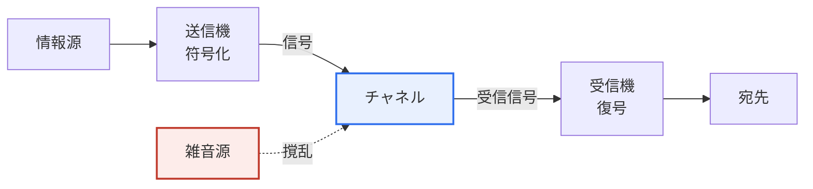

# 情報理論とシャノン(Shannon)の定理

## 1. 概要

### A. 情報理論の概念
> **情報理論(Information Theory)** とは、情報を定量的に測定し、**通信において情報をどこまで圧縮でき、どこまで速く誤りなく伝送できるかという限界を数学的に解明**する理論であり、1948年にクロード・シャノン(Claude Shannon)の論文「A Mathematical Theory of Communication」によって創始された。

情報理論が現代の通信・コンピューティングの根幹となった根本的な理由は、「**情報という抽象的な概念を数値で測れるようにし、通信の理論的限界を確定させた**」ことにある。シャノン以前には、「情報の量」というものを客観的に測定する方法がなかった。電信・電話の技術者たちは経験的に帯域幅と速度を扱っていたが、「このメッセージにはどれだけの情報が含まれているのか」を数値で表す道具はなかった。シャノンの決定的な転換は、情報の意味(semantics)を意図的に排除し、情報の量をもっぱら**不確実性(エントロピー)**として定義したことである。すなわち「何を意味するか」ではなく、「どれだけ予測しにくいか」によって情報を測定したのである。

この定義の直観は次のとおりである。ある事象が起こるかどうかを予測しにくいほど(不確実であるほど)、その結果が実際に観測されたときにもたらす情報量は大きい。例えば、常に表しか出ない細工されたコインは、結果を見ても新たに知ることが何もないため情報は0である(エントロピー0)が、表裏が半々の公正なコインは結果が完全に不確実であるため、観測時に最大の情報(1ビット)をもたらす。同様に、「明日太陽が昇る」というメッセージには情報量がほとんどないが、「明日ある株式が30%上昇する」というメッセージは確率が低いため情報量が大きい。

このように情報を**ビット(bit)**という普遍的な単位で定量化したことで、初めて「データを理論的にどこまで圧縮できるか」「雑音のあるチャネルでどれだけ速く正確に送れるか」という問いに明確な限界を示せるようになった。この二つの限界を規定したのが、シャノンの二つの定理である。この理論は今日、データ圧縮(ZIP・JPEG・MP3)、誤り訂正符号、5G・Wi-Fi通信、暗号学の理論的基盤となっており、さらには機械学習の損失関数や特徴選択にまで拡張されている。

### B. エントロピー — 情報量の定量化
情報理論の出発点であるエントロピーについて、もう少し具体的に押さえておく必要がある。個々の事象の情報量(自己情報量)は、発生確率pに対して`I = -log₂ p`と定義される。確率の低い(まれな)事象ほど対数値が大きくなり情報量が大きくなるが、これは先の直観を数式に置き換えたものである。そして情報源全体が発する**平均情報量**がエントロピー`H = -Σ pᵢ log₂ pᵢ`である。不確実性が大きいほど、すなわち複数の結果が均等に出るほど、エントロピーは大きい。

具体的な数値で見ると、表裏の確率がそれぞれ0.5の公正なコインのエントロピーは`-(0.5·log₂0.5 + 0.5·log₂0.5) = 1ビット`である。一方、表の確率が0.9に偏ったコインは約0.47ビットにすぎない。すなわち偏った情報源は平均的に予測可能性が高いため運ぶ情報が少なく、まさにこの「余った予測可能性」が圧縮の余地となる。

例えば英語のテキストは、アルファベットが均等に出現せず、e・tが頻繁に、z・qがまれに出現し、「qの次にはほぼuが来る」のように文字間の相関まであるため、実効エントロピーは1文字当たり約1ビット程度と低い。そのため、もともと8ビットのASCIIで保存されたテキストが可逆圧縮によって大きく縮小されるのである。このようにエントロピーは単なる理論上の概念ではなく、「このデータは原理的にどこまで小さくできるのか」という実務上の問いに直接答えるものである。

### C. 情報理論が答える根本的な問い
情報理論が提起し答えた問いを三つに整理すると、その構造が明確になる。第一に、「情報の量をどのように測るか」に対してはエントロピーで答えた。第二に、「データをどこまで圧縮できるか」に対しては第1定理(エントロピーが下限)で答えた。第三に、「雑音のあるチャネルでどれだけ正確・迅速に送れるか」に対しては第2定理とシャノン・ハートレーの定理(チャネル容量)で答えた。

これら三つの問いは、今日のITシステムにおける保存・伝送の全領域を貫いている。ファイルを圧縮して保存すること、無線でデータを送ること、ストレージのビット誤りを訂正することは、すべてこの枠組みの中で設計される。そのため情報理論は、特定の技術ではなく「デジタル情報を扱うあらゆる技術の物理学」に相当すると評価されている。

## 2. シャノンの第1定理と第2定理

情報理論の二つの軸は「どこまで小さくできるか(圧縮)」と「どこまで正確に送れるか(伝送)」であり、それぞれをシャノンの第1定理と第2定理が規定する。以下の図は、情報が情報源からチャネルを経て受信されるまでに、二つの定理が関与する地点を示している。

シャノンが提示した通信システムの一般モデルは、上の流れをさらに細分化したものである。情報源が生成したメッセージは送信機(符号化器)で信号に変換されてチャネルへ送られ、チャネルでは雑音源(noise source)が信号を撹乱し、受信機(復号器)がこれを復元して宛先へ伝達する。このモデルの意義は、「意味」を排除し、純粋に信号と雑音の問題として通信を抽象化した点にある。

この図において、第1定理は「送信機(符号化)」段階の圧縮限界を、第2定理は「チャネル+雑音源」を通過する際の伝送限界を、それぞれ規定する。二つの定理が異なる段階を担うため、実際のシステムは、情報源符号化(圧縮)でデータをエントロピーまで縮小した後、通信路符号化(誤り訂正)で改めて計算された冗長性を加えるという2段階構造をとる。一見矛盾しているように見える「減らしてから再び増やす」過程は、圧縮が情報源の無駄な冗長性を除去し、通信路符号化が雑音の克服に必要な「設計された冗長性」だけを正確に加えるという点で最適である。

### A. 第1定理 — 情報源符号化(圧縮の限界)
第1定理(情報源符号化定理)は、**可逆圧縮の下限は情報源のエントロピーである**と確定させる。データをいかに精巧に圧縮しても、平均符号長をその情報源のエントロピーHより小さくすれば、必ず情報の損失が生じる。逆に言えば、エントロピーには任意に近づくことができるため、良い圧縮アルゴリズムの目標は「エントロピーにどれだけ近づけるか」となる。

この定理が実務上持つ意味は、圧縮技術の「天井」を教えてくれる点にある。ハフマン符号(Huffman coding)は頻出するシンボルに短い符号を、まれなシンボルに長い符号を割り当てて平均長をエントロピーに近づけ、算術符号(arithmetic coding)はそれよりさらに近くまで迫る。例えば、あるテキストのエントロピーが1文字当たり1.5ビットであれば、いかなる可逆圧縮器も平均1.5ビット未満には縮小できないというのが、第1定理の保証である。JPEG・MP3のような非可逆圧縮はこの限界を「超える」ものではなく、人間が知覚できない情報を捨てて、元とは異なる(エントロピーがより低い)データを作り出すものと理解しなければならない。

### B. 第2定理 — 通信路符号化(伝送の限界)
第2定理(通信路符号化定理)は、情報理論において最も驚くべき結果として挙げられる。雑音のあるチャネルにも**チャネル容量(C)**という最大伝送速度が存在し、実際の伝送レートRがこの容量より小さくさえあれば(R < C)、適切な符号化によって**誤り確率を任意に0に近づける**ことができるというものである。直観に反して、雑音があっても速度を容量以下に抑えさえすれば、「ほぼ完璧な」通信が理論的に可能なのである。

この結果が革命的である理由は、それ以前まで人々が「雑音のあるチャネルでは、誤りを減らすには速度を限りなく下げなければならない」と信じていたためである。シャノンは誤りのない通信と意味のある速度が両立しうることを証明し、これが誤り訂正符号(FEC)研究の出発点となった。

ただし第2定理は「そのような符号が存在する」という存在証明にすぎず、「どのように作るか」は教えてくれない。証明はランダム符号の平均性能を利用したものであるため、実際に実装可能で復号が現実的な符号を見つけることは、別個の難題として残った。そのためその後の数十年間、理想的な限界に近づきつつも計算上実用的な符号を見つけることが通信工学の中核課題となり、この歩みが後述するターボ符号・LDPC符号へとつながる。

| 定理 | 内容 | 実務への適用 |
|---|---|---|
| **第1定理(情報源符号化)** | 可逆圧縮の限界は情報源の**エントロピー**。エントロピーより小さくすると損失は不可避。 | ZIP、ハフマン・算術符号、PNG |
| **第2定理(通信路符号化)** | 伝送レートR < チャネル容量Cならば、適切な符号化で**誤りを任意に0に近づける**ことができる。 | LDPC、ターボ符号、リード・ソロモン |

## 3. シャノン・ハートレー(Shannon-Hartley)の定理

第2定理が「チャネル容量が存在する」ことを示したとすれば、シャノン・ハートレーの定理は、帯域幅のあるアナログ雑音チャネル(ガウス通信路)におけるその**容量を具体的な数式で**提示する。この式は通信システムの容量設計の実質的な基準となるため、情報理論において最も頻繁に引用される。

> **C = B · log₂(1 + S/N)**  (C: チャネル容量 bps、B: 帯域幅 Hz、S/N: 信号対雑音比、線形スケール)

この式は、通信容量を増やす二つの道を示している。第一は**帯域幅(B)**を広げることであり、容量は帯域幅に線形に比例する。第二は**信号対雑音比(S/N)**を高めることであるが、ここには重要な含意がある。S/Nは対数の中に入っているため、いくら信号電力を大きくしても容量の増加効果は次第に小さくなる「収穫逓減」が起こる。例えばS/Nを10倍に上げてもlog₂項の増加は限定的であり、これは電力をむやみに大きくするよりも、帯域幅の確保や変調効率の改善のほうが効果的でありうることを示唆している。

具体的な数値例として、帯域幅20 MHz、S/N = 100(20 dB)のチャネルの容量は、`20×10⁶ × log₂(101) ≈ 20×10⁶ × 6.66 ≈ 133 Mbps`と計算される。このようにこの定理は、5G・Wi-Fi・LTEなどあらゆる通信システムにおいて、「この周波数資源と電力で理論上最大何bpsを出せるか」を見積もる設計基準となる。実際のシステムのスループットがこの限界にどれだけ近づいているかが、通信技術の成熟度の尺度である。

この式における実務上重要な含意の一つは、帯域幅が不足している環境でむやみに送信出力を上げる戦略は非効率であるという点である。S/Nが対数の中にあるため、電力を2倍にしても容量はわずか数%しか増えないからである。そのため現代の無線通信は、帯域幅の拡張(ミリ波)、複数アンテナ(MIMO)による空間資源の拡大、高次変調(256-QAMなど)によるシンボル当たりのビット数の増加を組み合わせて、この限界に迫っている。情報理論が提示した一つの数式が、こうした工学的選択の方向性を規定しているわけである。

また、この式は極端な状況についての洞察も与える。S/Nが非常に低い(雑音が信号を圧倒する)深宇宙通信や低消費電力IoTでも、チャネル容量は0ではなく依然として正の値であるため、伝送レートを十分に下げれば誤りのない通信が可能である。実際、深宇宙探査機が極めて微弱な信号でもデータを地球まで送り届けられるのは、この原理に基づいて伝送レートを下げ、強力な誤り訂正を適用しているためである。

## 4. 深掘り — 理論と実際のギャップ、そしてAIへの拡張

### A. 理想的な限界に迫ってきた符号化技術
シャノンが第2定理で「限界」を提示して以来、通信工学の歴史はその限界にどれだけ近づけるかの歩みであった。初期のハミング符号・リード・ソロモン符号は限界とかなりの距離があったが、1993年に**ターボ符号(Turbo Code)**が登場したことで、シャノン限界からわずか数十分の1 dBまで迫る実用的な符号が初めて実現された。

続いて、1960年代に提案されながら計算能力の不足により忘れられ、その後再発見された**LDPC(低密度パリティ検査)符号**は、5Gのデータチャネルや衛星・ストレージ(SSD)で広く用いられ、シャノン限界に非常に近い性能を示している。すなわち、シャノンの1948年の存在証明が、約半世紀を経て工学的にほぼ「追いつかれた」のである。この歴史は、理論が先に目標を示し、工学が後からそれを実現するという科学史の典型例としてしばしば引用される。

一つ留意すべき点は、「シャノン限界に迫った」という評価が、特定のチャネルモデル(多くの場合、ガウス雑音、無限に近い符号長)を前提としていることである。実際の無線環境はフェージング・干渉などにより理想的なモデルとは異なるため、理論上の近接度と実測性能の間には、条件に応じたギャップが依然として存在することも併せて理解しなければならない。

### B. AI・データ分野への拡張
情報理論の概念は、通信を超えて今日の人工知能・データサイエンスの中核ツールとなった。機械学習の分類モデルの標準的な損失関数である**交差エントロピー(Cross-Entropy)**は、予測分布と実際の分布の差をエントロピーの概念で測定したものであり、二つの分布間の距離を測る**KLダイバージェンス(Kullback-Leibler divergence)**も情報理論から生まれた。また、決定木(Decision Tree)の分割基準である**情報利得(Information Gain)**は、分割前後のエントロピーの減少量として定義され、「どの特徴で分割すれば不確実性が最も大きく減少するか」を判断する。

特徴選択で使われる**相互情報量(Mutual Information)**も、二つの変数が共有する情報量をエントロピーで測る概念である。このように「不確実性の定量化」というシャノンのアイデアは、通信理論の境界を大きく越え、現代のデータ技術全般の共通言語となった。深層学習の情報ボトルネック(Information Bottleneck)理論のように、学習の原理そのものを情報圧縮として解釈しようとする研究も続いており、情報理論は今なお生きた分析の枠組みである。[[decision-tree]]

### C. 理論と実際のギャップが与える教訓
シャノンの定理が「存在証明」にとどまったという点は、工学的に重要な教訓を残している。限界があることを知ることと、その限界に到達する方法を知ることは別物であり、二つの定理以後半世紀にわたる符号化研究は、まさにこのギャップを埋める過程であった。これは今日、エンジニアが性能目標を設定する際に、まず「理論的限界」を計算し、それに対する現在の水準を見積もるという方法論の原型となった。

すなわち情報理論は、具体的なアルゴリズムを超えて、「まず理論的上限を求め、それにどれだけ近づいたかで技術を評価する」という思考様式そのものを通信・データ分野に根付かせたという点で、その影響は方法論的でもある。

## 5. 考慮事項および示唆点 (技術士の観点)

1. **通信・圧縮の理論的上限を提示する。** シャノンの定理は、いかなる技術でも超えられない限界(エントロピー=圧縮の下限、チャネル容量=伝送の上限)を規定し、現在の通信・圧縮技術が理想にどれだけ近づいているかを評価する絶対的な基準となる。新技術の性能主張を検証する際にも、この限界を超えるという主張は原理的に退けることができる。
2. **現代デジタル技術の共通基盤である。** データ圧縮(ハフマン・算術・JPEG)、誤り訂正(LDPC・ターボ・リード・ソロモン)、移動通信の容量設計はすべて情報理論に基づいており、理論的限界と実際の性能とのギャップを縮める方向に発展してきた。システム設計の際には「理論的限界に対する効率」を指標とすることができる。
3. **AI・データ分野へと影響が拡大している。** エントロピー・交差エントロピー・相互情報量・KLダイバージェンスの概念が、機械学習の損失関数・特徴選択・決定木の分割基準として広く活用され、情報理論の波及は通信を超えている。データ駆動型システムの設計者にとって、情報理論は必須の素養となった。
4. **資源配分のトレードオフを定量化する。** シャノン・ハートレーの定理は帯域幅・電力・容量の関係を数式で提示し、周波数資源とエネルギー予算の範囲内で最適な設計点を見つける根拠となる。特にS/Nの対数的な収穫逓減は、電力の増大よりも帯域幅・変調効率の改善が有利な局面を判断するのに用いられる。
5. **意味(semantics)を排除した定義の力と限界を認識しなければならない。** シャノンの情報理論は情報の「意味」ではなく「不確実性」のみを扱うため、通信の信頼性設計には強力であるが、情報の価値・重要度・意味論的な正確さまでは包含しない。したがって意味通信(semantic communication)など最新の研究の流れと組み合わせる際には、この境界を明確に認識し、補完的に活用しなければならない。

## 参考資料
- C. E. Shannon, "A Mathematical Theory of Communication", Bell System Technical Journal, 1948: https://people.math.harvard.edu/~ctm/home/text/others/shannon/entropy/entropy.pdf
- Wikipedia, Shannon–Hartley theorem: https://en.wikipedia.org/wiki/Shannon%E2%80%93Hartley_theorem
- Wikipedia, Noisy-channel coding theorem: https://en.wikipedia.org/wiki/Noisy-channel_coding_theorem

---

> **一言まとめ**: 情報理論は*情報をエントロピーで定量化*し、シャノンの第1定理(可逆圧縮の限界=エントロピー)・第2定理(伝送レート<容量なら誤り→0)とシャノン・ハートレーの定理(C=B·log₂(1+S/N))によって通信・圧縮の理論的限界を規定し、さらに交差エントロピー・情報利得などを通じて現代のAI・データ技術の基盤となっている。
