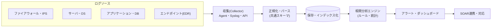
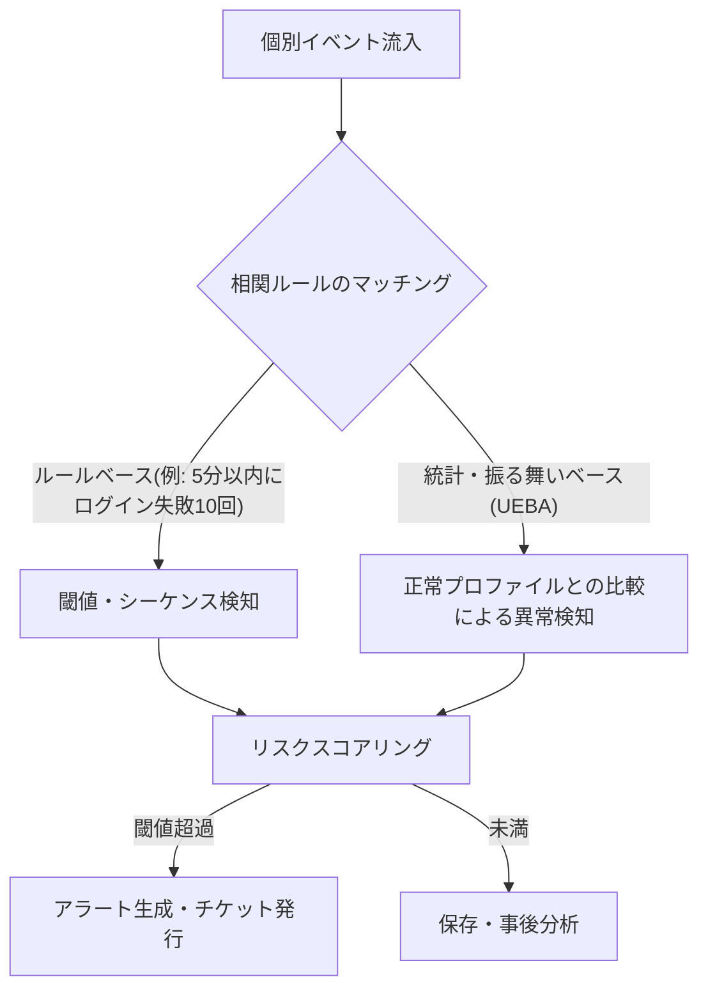

# SIEM(Security Information and Event Management、セキュリティ情報・イベント管理)

## 1. 概要

### A. 定義および登場背景
> **SIEM**は、組織全体に散在するセキュリティ機器・サーバ・ネットワーク・アプリケーションの**ログとイベントをリアルタイムに収集・正規化・相関分析**して脅威を検知し、コンプライアンス(Compliance)報告とインシデント調査に必要な根拠を提供する**統合セキュリティ監視プラットフォーム**である。

SIEMが登場した根本的な背景は、「**セキュリティデータは爆発的に増えているのに、それを一か所に集めて意味のある形で解釈する手段がない**」という問題であった。ファイアウォール・IPS・ウイルス対策ソフト・サーバ・DB・Webサーバは、それぞれ異なる形式のログを個別に大量に出力する。ある一つの機器のログだけを見れば「正常なログイン」に見えても、複数機器のログを時間軸上で重ね合わせると、「海外IPからのログイン成功 → 権限昇格 → 大量データ送信」という一つの攻撃シナリオが浮かび上がる。個々の機器の局所的な視野では、このような**多段階・低速(low-and-slow)攻撃**を捕捉することはできない。SIEMは散在するログを一か所に集めて共通フォーマットに正規化し、イベント間の因果・相関関係をルールと統計で結び付けて「全体像」を描き出す。初期にはログ管理(SIM)とリアルタイムイベント管理(SEM)が別製品であったが、2005年頃に両機能が統合され、今日のSIEMの概念が確立された。

### B. 必要性
ログの量的な爆発、攻撃の多段階化・高度化、そしてISMS-P・個人情報保護法・PCI-DSSなどが要求する**ログ保存・監査義務**が重なり合った結果、異種ログを統合して検知・調査・報告を一度に実行するSIEMは、セキュリティオペレーションセンター(SOC)の中核インフラとなった。特にセキュリティインシデント発生時に「いつ、どこで、何が起きたのか」を遡って追跡できる単一の根拠リポジトリとしての価値が大きい。

## 2. アーキテクチャとデータ処理パイプライン

SIEMは、ログが流れ込んで脅威アラートへと変換される一つのパイプラインとして理解するのが最も正確である。以下は全体構成図である。

**収集(Collection)**段階では、エージェント、Syslog、WMI、REST APIなど多様な方式でソースログを取り込む。ソースごとにプロトコルと形式が異なるため、欠損なく安定的に収集すること自体が設計の最初の関門となる。**正規化(Normalization)・パース**段階では、異なる形式のログをユーザ・IP・時刻・行為といった共通フィールドにマッピングする。この正規化が不十分であれば以後の相関分析は無意味になるため、SIEMの品質の8割はパーサの品質で決まると言っても過言ではない。**保存・インデックス化**段階では、大容量ログを圧縮・索引化し、高速検索と長期保存を同時に満たさなければならない。

中核となるのは**相関分析(Correlation)**エンジンである。ここで個々のイベントがシナリオへと組み立てられる。以下は相関分析の詳細な処理フローである。

相関分析は大きく二つの軸で動作する。一つは**ルール(Rule)ベース**であり、「同一アカウントで5分以内にログイン失敗10回の後に成功」のように、人が定義したシーケンス・閾値をマッチングする。明確ではあるが、既知のパターンしか捕捉できないという限界がある。もう一つは**統計・振る舞いベース(UEBA、User and Entity Behavior Analytics)**であり、ユーザ・資産の平常時の行動プロファイルを学習し、「このアカウントが午前3時に普段の100倍のデータをダウンロードした」といった未知の異常を検知する。近年のSIEMはこの二つを組み合わせ、各イベントにリスクスコアを累積し、スコアが閾値を超えた場合にのみアラートを発生させることで**誤検知(False Positive)**を削減している。

## 3. 中核機能と構成要素

SIEMの機能は単なるログビューアを超える。各機能は互いにかみ合い、「検知→調査→証跡」の循環を完成させる。

| 機能 | 説明 | 実務上の意味 |
|---|---|---|
| **ログ収集・正規化** | 異種ログを共通スキーマに統合 | 分析の基盤、パーサ品質が鍵 |
| **リアルタイム相関分析** | ルール・統計でイベントの関連を検知 | 多段階攻撃シナリオの捕捉 |
| **異常行動分析(UEBA)** | 正常プロファイルからの逸脱を検知 | 内部脅威・未知の脅威への対応 |
| **アラート・ダッシュボード** | 脅威の可視化、優先順位付け | アナリストの判断支援 |
| **ログ保存・検索** | 長期保存、フォレンジックの遡及検索 | コンプライアンス・インシデント調査の根拠 |
| **コンプライアンスレポーティング** | ISMS-P・PCI-DSSなどの報告書自動化 | 監査対応工数の削減 |
| **脅威インテリジェンス(TI)連携** | 外部IoCとログの照合 | 既知の悪性指標の即時検知 |

特に**コンプライアンスレポーティング**は、SIEM導入の現実的な動因の一つである。例えば韓国の個人情報保護法上、個人情報処理システムのアクセス記録は最低1年(5万人以上などの場合は2年)の保管・点検が義務付けられているが、SIEMはこのアクセス記録の収集・保存・定期点検・報告書生成を自動化し、監査対応の負担を大きく軽減する。このようにSIEMは「脅威検知ツール」であると同時に「コンプライアンス証跡ツール」という二重のアイデンティティを持つ。

## 4. ログ管理・SOARとの比較

SIEMは隣接概念としばしば混同されるため、違いが生じる理由を併せて理解しておく必要がある。

| 区分 | 単純なログ管理(Log Mgmt) | SIEM | SOAR |
|---|---|---|---|
| **焦点** | 収集・保存・検索 | 収集+**相関分析・検知** | 検知後の**対応自動化** |
| **分析能力** | 検索中心 | リアルタイム相関・異常検知 | プレイブックに基づく措置 |
| **成果物** | ログアーカイブ | 脅威アラート・レポート | 自動対応・ケース |
| **関係** | SIEMの下位機能 | 検知の中心 | SIEMアラートを入力として消費 |

単純なログ管理ツール(例: ログサーバ、基本的なELK)は「集めて検索する」までが役割であるが、SIEMはその上に**相関分析と検知の知能**を載せるという点で決定的に異なる。一方、SOARとの関係は相互補完的である。SIEMが脅威を「**検知**」してアラートを生成すると、SOARがそのアラートを受け取り、調査・遮断を「**自動対応**」する。すなわち、SIEMは目(検知)、SOARは手(対応)にたとえられる。近年ではこの二つにEDR・NDRを統合した**XDR(Extended Detection and Response)**、そしてインフラ負担をなくした**クラウドネイティブSIEM(SaaS型)**へと市場が再編されつつある。

### 適用事例
ある金融機関がSIEMを導入して不正金融取引の検知に活用した事例では、個々のチャネルでは正常であった「見知らぬ端末からのログイン → 口座情報照会 → 振込限度額の引き上げ → 大量振込」という一連の行為を一つの相関ルールにまとめ、リアルタイム遮断に成功したことが代表的である。逆に、ログソースが毎秒数万件(EPS、Events Per Second)規模に増えるにつれてライセンス費用とストレージが急増し、低価値ログをフィルタリング・ティアリングしなければ運用が不可能になるという問題も併せて現れる。つまり、SIEMの成否は「何をどれだけ収集するか」という**収集ポリシー設計**で決まる。

## 5. 深化: 最新動向と限界の克服

従来のオンプレミスSIEMは三つの限界に直面してきており、その克服過程こそが最新動向である。第一に、**アラート疲れ(Alert Fatigue)**の問題である。ルールが増えるほど誤検知が爆発的に増え、アナリストが本当の脅威を見逃してしまう。これを緩和するため、機械学習ベースのUEBAとリスクスコアリング、さらに生成AIを組み合わせた**AI-SIEM**が登場し、アラートを自動要約・優先順位付けし、調査クエリを自然言語でサポートしている。第二に、**コスト・拡張性**の問題である。ログ量がEPS単位で爆発的に増加し、保存・ライセンス費用が負担しきれなくなったことから、オブジェクトストレージに原本を低コストで保管し必要時に照会する**データレイク型・ティアリングアーキテクチャ**や、インフラ運用負担を排除したクラウドネイティブSIEMへの移行が進んでいる。第三に、**検知範囲**の問題である。クラウド・コンテナ・SaaSへと資産が分散したことでオンプレミス中心のSIEMの視野は狭まり、これに対してクラウドワークロード・APIログまで包括し、対応までを網羅する**XDR・SOAR統合**の方向へと進化している。要するに、SIEMは「検知精度(AI)、コスト効率(レイク・SaaS)、対応連携(XDR/SOAR)」という三つの軸で同時に進化しているのである。

## 6. 考慮事項および示唆

1. **収集ポリシーがコストと効果を同時に左右**する。すべてのログを無差別に収集すればコストが爆発的に増え、ノイズに埋もれてしまうため、脅威検知・コンプライアンスに実際に寄与するログを選別し、低価値ログはティアリング・フィルタリングする**価値ベースの収集戦略**が不可欠である。これは「完全性 vs コスト」のトレードオフを組織のリスク水準に合わせて調整する問題である。

2. **検知ルール(Use Case)は継続的にチューニングしなければ**ならない。SIEMは導入で終わる製品ではなく、ルールを磨き続けなければならない「運用」の対象である。MITRE ATT&CKフレームワークにルールをマッピングして検知カバレッジの空白を体系的に点検し、誤検知率を定期的に下げる運用プロセスが裏付けとなって初めて実効性が生まれる。

3. **人(SOCアナリスト)の能力との結合**が鍵となる。いかに精緻な相関分析であっても、最終判断と対応はアナリストの役割である。SIEMはアナリストを代替するものではなく拡張するツールであるため、脅威ハンティング・フォレンジック能力を備えた人材とSOAR自動化を併せて整えたとき、初めて「検知-分析-対応」の好循環が完成する。

4. **SOAR・XDR・TIとの統合ロードマップ**を前提に導入すべきである。SIEMを孤立した島にしておくと、検知後の対応が手作業にとどまる。脅威インテリジェンスで検知精度を高め、SOARで対応を自動化し、XDRでエンドポイント・クラウドまで視野を広げる統合アーキテクチャの観点から導入・発展させることで、投資対効果を最大化できる。

5. **個人情報・ログ自体のセキュリティ**も考慮しなければならない。SIEMは機微なログが集結する場所であるため、それ自体が攻撃の標的であり、個人情報の集積所となる。保存ログのアクセス制御・暗号化・完全性保証と、ログ内の個人情報の仮名化・マスキング処理を併せて設計することで、SIEMが新たなリスク源となることを防ぐことができる。

---

> **一言まとめ**: SIEMは異種ログを*収集・正規化・相関分析*して多段階の脅威を検知し、コンプライアンス証跡を提供する統合セキュリティ監視プラットフォームであり、SOAR(対応)・XDR・AIと結合して進化しており、その成否は収集ポリシー設計・ルールチューニング・アナリスト能力の結合にかかっている。
