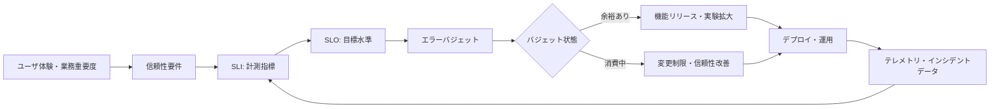
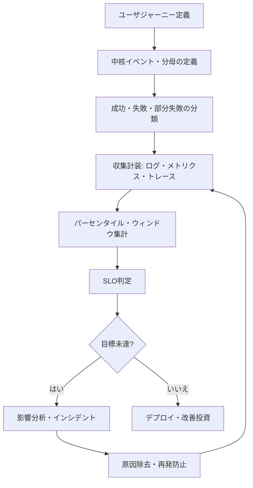

# SRE(Site Reliability Engineering)とサービス信頼性管理

## 1. 概要

> SREは、ソフトウェアシステムを安定的に運用する業務をエンジニアリングの問題として捉え、サービスレベル目標と自動化・計測・障害からの学習を通じて、信頼性と変更速度を併せて管理する実践体系である。

デジタルサービスは、一度デプロイした後に維持するだけの静的な成果物ではなく、継続的に変更され、外部環境と相互作用するシステムである。
ユーザは機能の存在そのものよりも、必要な瞬間に応答し、データが保全され、予測可能な品質を提供しているかどうかを基準にサービスを評価する。
したがって、機能開発の完了をプロジェクトの終了とみなす観点だけでは、運用品質を説明することは難しい。

従来の運用組織は障害を減らすために変更を統制し、開発組織は機能を迅速にリリースするために変更を増やそうとする傾向がある。
この目標の衝突を個人の努力や夜間対応で解決しようとすれば、運用者の疲弊と変更回避が蓄積していく。
SREは信頼性を抽象的なスローガンではなくユーザ視点の指標と目標として定義し、目標に対して使える変更の余裕をエラーバジェットとして管理する。

SREの核心は「障害があってはならない」という非現実的な完璧性ではない。
分散システムと外部依存性が存在する限り一定水準の失敗は発生するため、どの失敗を許容し、どの失敗を遮断するかをリスクベースで決定する。
サービスの重要度と業務損失を考慮して目標を個別に定め、目標未達時には機能リリースよりも信頼性改善を優先する意思決定ルールを作る。

SREはDevOpsと対立する別個の開発方法論ではない。
DevOpsが開発と運用の壁を低くしてデリバリーの流れを改善する文化・組織的な方向性であるとすれば、SREはその方向性を可用性・レイテンシ・障害対応・自動化という運用工学のメカニズムとして具体化するものである。
技術士はツールの導入よりも、サービスレベルの定義、責任境界、データに基づく意思決定、学習ループが機能しているかを評価しなければならない。

## 2. SREの構成原理と全体概念図

SREは、サービスのユーザ、製品要件、システム設計、運用データ、改善活動を一つの循環構造として結び付ける。
まずユーザが重視する体験を計測可能なSLIとして表現し、達成すべき水準をSLOとして定める。
SLOと実績の差はエラーバジェットに換算され、バジェットの残量はデプロイ速度と安定性投資の間の意思決定の根拠となる。

SLI(Service Level Indicator)は、サービスレベルを観察する実際の計測値である。
例えば全リクエストのうち成功したリクエストの比率、一定の閾値時間内に完了したリクエストの比率、処理されたメッセージのうち有効なメッセージの比率などを用いることができる。
CPU使用率は運用に有用なシグナルとなり得るが、ユーザが体験した品質を直接表すものではないため、中核SLIとインフラの補助指標を区別する必要がある。

SLO(Service Level Objective)は、特定の期間にSLIが達成すべき目標である。
「速く安定的に提供する」という表現を、「月間の有効リクエスト成功率99.9%以上」や「読み取りリクエストの99%が300ms以内」のように計測可能な形に置き換える。
目標を100%に設定すると、わずかなネットワーク遅延も失敗として扱われ過大なコストが発生し得るため、ユーザの期待とコストのバランスを反映させる。

SLA(Service Level Agreement)は顧客と提供者の間の契約または約束であり、SLOとは異なり補償・サービスクレジット・責任範囲が含まれ得る。
内部の運用目標であるSLOを外部契約であるSLAと同一に設定すると、内部改善のための余裕がなくなる可能性がある。
逆にSLAがSLOより過度に緩いと、契約違反は避けられても実際のユーザの信頼は低下し得るため、二つの目標の関係を明示しておく。

| 区分 | 問い | 主な利用者 | 設計時の注意点 |
|---|---|---|---|
| SLI | 現在の品質をどう計測するか? | 運用・開発チーム | ユーザジャーニーと計測の分母を明確にする |
| SLO | どの水準を目標とするか? | サービスオーナー・チーム | 期間・対象・例外・集計方式を固定する |
| SLA | 顧客に何を約束するか? | 顧客・事業部 | 補償と責任条件を契約に反映する |
| エラーバジェット | 許容可能な失敗の量はどれだけか? | 製品・開発・運用 | 残量に応じた行動ルールを事前に合意する |

信頼性は可用性だけで構成されるものではない。
可用性が高くても応答が過度に遅かったりデータが誤っていたりすれば、ユーザはサービスを信頼しない。
一般に、可用性、レイテンシ、スループット、正確性、耐久性、鮮度、セキュリティといった品質特性を業務フローに合わせて組み合わせる。
例えば検索サービスでは結果の鮮度と関連性が重要であり、決済サービスでは二重承認の防止と整合性が可用性と同じくらい重要である。

## 3. サービスレベル目標とエラーバジェット

### 3.1 SLIをユーザジャーニーに合わせる方法

SLIを定める際は、システム内部で計測しやすい値を先に選ぶのではなく、ユーザが完了しようとしている作業を定義する。
ECサイトのユーザが体験するのは「Webサーバが生きているか」ではなく、「カートから決済まで成功したか」である。
したがってリクエスト成功率を計測する際はステータスコードだけを見るのではなく、ビジネスエラーと部分的な失敗をどう扱うかも併せて決定しなければならない。

計測の分母の定義は指標の意味を左右する。
全リクエストに対する成功リクエストの比率を計算する際に、ボット・ヘルスチェック・リトライリクエストを重複して含めると、実際のユーザ品質とは異なる値が出る。
逆に失敗リクエストを分母から除外すると、数値は良く見えてもユーザへの影響が隠れてしまう。
フィルタ条件、サンプリング、リトライ、タイムアウト、地域別トラフィックを文書化し、指標が運用中に恣意的に変わらないようにする。

可用性SLIは、有効イベントの成功数を全有効イベント数で割る方式で表現できる。
レイテンシSLIは平均値よりも、パーセンタイルや閾値時間内の比率を用いてロングテールの遅延を明らかにするほうが適している。
データパイプラインでは、所定の時刻までに到着したデータの比率と、レコードの正確性・重複率を併せて見る必要がある。
一つの数値ですべての品質を代表させようとする試みは、障害の性質を覆い隠しかねない。

### 3.2 エラーバジェットの計算と運用

エラーバジェットは、SLOが許容する失敗量である。
月間SLOが99.9%であれば理論上許容されるエラー率は0.1%であり、全有効リクエスト数にこの比率を掛けて期間内の許容エラー数を計算できる。
例えば1か月に1,000,000件の有効リクエストがあれば許容エラーは1,000件であり、これはエラーを奨励するquotaではなく、リスクを管理するための上限である。

エラーバジェットの残量が多いからといって、品質が自動的に保証されるわけではない。
トラフィックが減少したり計装が漏れていたりしてバジェットが残っているように見えることがあるため、SLIの観測範囲とデータ品質を別途点検する。
逆に一時的な大規模障害でバジェットを使い切った場合は、原因を分析して復旧した後、チームが合意したポリシーに従ってリスクの高い変更をしばらく遅らせる。

エラーバジェットポリシーは、事前に行動と結び付けておかなければならない。
残量が十分であれば通常の機能デプロイを進め、警告区間では変更規模と承認レベルを調整し、枯渇区間では緊急のセキュリティパッチ以外の変更を制限する、といった形である。
ポリシーが曖昧だと、製品チームと運用チームが障害のたびに交渉し直すことになり、バジェットの意思決定機能が弱まる。

| バジェット状態 | 製品・開発の行動 | 運用の行動 | 管理ポイント |
|---|---|---|---|
| 十分 | 計画された機能・実験を許容 | 標準モニタリング | 変更リスクを記録する |
| 警告 | 段階的デプロイ・追加検証 | 原因候補と傾向の分析 | 新規エラー率を下げる |
| 枯渇間近 | 高リスク変更の延期 | 容量・依存性の点検 | 繰り返す障害を優先処理する |
| 枯渇 | 信頼性作業を優先 | インシデント復旧・安定化 | 例外承認と終了条件を記録する |

エラーバジェットは、チームを罰するスコア表になってはならない。
外部依存性の障害や制御できない共通プラットフォームの障害がチーム全体の実績を歪める可能性があるため、責任境界と除外条件を透明に定める。
ただし除外条件を広げる方法で数値を取り繕っても実際のリスクは消えないため、除外理由とユーザへの影響は別途記録しなければならない。

## 4. 運用自動化とインシデント管理

### 4.1 トイル(Toil)と自動化

トイル(toil)とは、サービスの成長に比例して繰り返され、手作業であり、自動化が可能で、長期的な価値が低い運用作業である。
障害のたびに同じコマンドをコピーしたり、容量を手動で調整したり、アラートを確認して人に伝達したりする作業が代表的である。
すべての反復作業がトイルというわけではなく、判断と学習が必要な作業や一回限りの設計業務を単純に自動化対象に分類するのは危険である。

トイルを減らす目的は人をなくすことではなく、人の時間を設計・予防・改善に振り向けることである。
自動化は手作業の手順をそのままコードに移すことで終わるものではなく、権限・検証・ロールバック・監査ログ・失敗時の停止条件を含まなければならない。
自動化が失敗した場合により大きな障害を引き起こしかねないため、段階的な適用と安全装置を併せて設計する。

例えば、デプロイ後にエラー率が閾値を超えると自動的に以前のバージョンに戻すポリシーを設けることができる。
しかし、レイテンシの増加が特定の地域でのみ現れている場合、全体ロールバックはかえって正常なユーザに影響を与えかねない。
したがって自動化は、観測範囲、影響度、段階的トラフィック、人間の承認条件を反映したポリシーエンジンへと発展させるのが望ましい。

### 4.2 インシデント対応フロー

インシデントとは、正常なサービスレベルを脅かす、またはすでに違反した事象である。
検知から復旧までの目標は、完璧な原因究明よりも、ユーザへの影響を減らし、安全にサービスを正常化した後、再発可能性を下げるという順序で定める。
対応者が原因を探している間にも、ステータスページ、迂回経路、機能制限によって被害を減らす緩和措置を並行して行う。

一般的な対応は、検知、分類、宣言、役割割り当て、緩和、復旧、終了、事後レビューの流れで運用する。
インシデントコマンダーは技術的な作業をすべて自ら行う人ではなく、優先順位とコミュニケーションを調整する役割である。
コミュニケーション担当者は、社内外のステークホルダーに確認済みの事実と次回の更新時期を伝えることで、憶測に基づく告知を減らす。

重大度は、ユーザ数、業務損失、継続時間、規制・セキュリティへの影響、復旧可能性などを基準に事前に定義する。
例えば決済承認の重複は、ユーザ数が少なくても金銭的・法的影響が大きいため、高い重大度に分類され得る。
逆に社内管理画面の一時的な遅延は、ユーザへの影響と復旧経路に応じて低い等級で管理できる。

障害の終了後に作成する非難なき事後レビュー(blameless postmortem)は、誰がミスをしたかではなく、どのような条件で失敗が起こり得たのかを分析する。
変更承認、テスト範囲、アラートのS/N比、文書の最新性、権限構造、組織的なプレッシャーまでをシステムの原因として扱う。
フォローアップ措置には担当者と期限、期待効果、検証指標を備える必要があり、文書を保管しただけで完了扱いにしてはならない。

| 段階 | 中核となる問い | 成果物 | 失敗しやすいポイント |
|---|---|---|---|
| 検知 | 何が正常から外れたのか? | アラート・ユーザ報告 | 閾値がユーザへの影響と無関係 |
| 分類・宣言 | どれほど深刻で、誰が指揮するのか? | 重大度・コマンダー | 役割が重複し意思決定が遅れる |
| 緩和 | 今何を遮断・迂回するのか? | ロールバック・機能制限 | 原因分析ばかりで影響が拡大する |
| 復旧 | 正常水準をどう確認するのか? | 検証結果・終了判断 | 指標が回復する前に終了する |
| 学習 | どの条件を変えて再発を防ぐのか? | 事後レビュー・改善backlog | 個人への非難や形式的な会議で終わる |

## 5. SREと関連アプローチの比較

SREとDevOpsはどちらも開発と運用の協業を重視するが、焦点が異なる。
DevOpsは、アイデアがコードとして届けられユーザからフィードバックされる流れを最適化することに強みがある。
SREはその流れにおける信頼性リスクを定量化し、デプロイ速度を無制限に高めないよう品質の安全境界を提供する。
したがって二つのアプローチは競合関係ではなく、DevOpsのデリバリー文化とSREの運用制御を組み合わせる関係として理解すべきである。

ITILは、サービスマネジメントの標準化されたプロセスと統制、役割、記録を重視する。
SREは自動化・計測・実験と工学的な改善を重視し、変更の速い環境でフィードバックを短くすることに有利である。
規制産業ではITILの承認・監査要件を無視できないが、承認手続きを手動チケットのみに依存すると対応が遅れるため、SRE方式で証跡と自動統制を結び付けることができる。

従来のモニタリングはサーバ・プロセスの状態確認から出発したが、SREはユーザジャーニーの結果とサービスレベルを中心に据える。
インフラ指標が正常であっても外部決済APIのエラーで注文が失敗することがあるため、サービス指標・依存性指標・リソース指標を階層的に併せて観察する。
比較の要点は、どのツールが優れているかではなく、意思決定に必要なシグナルがどこで生み出されるかにある。

| 観点 | 従来型運用 | DevOps | SRE |
|---|---|---|---|
| 中心目標 | 安定的な変更統制 | デリバリーフローと協業の改善 | 信頼性と変更速度のバランス |
| 計測単位 | サーバ・プロセスの状態 | デプロイ・リードタイムの流れ | ユーザ中心のSLI・SLO |
| 障害の捉え方 | 担当者による復旧と原因報告 | 迅速なフィードバックと共同対応 | 影響緩和・学習・再発防止 |
| 変更ポリシー | 事前承認中心 | 自動化されたデリバリー中心 | エラーバジェットに応じたリスク調整 |
| 自動化対象 | 反復コマンド・点検 | ビルド・テスト・デプロイ | 運用判断・復旧・ガードレール |

## 6. 実務適用事例

### 6.1 オンライン注文サービスの事例

オンライン注文サービスにおいて、チームは月間注文完了率を中核SLIと定め、成功注文数を全有効決済試行数で割った。
単にWebページのHTTP 200を数えるのではなく、決済承認と注文保存がともに完了した場合を成功と定義した。
月間SLOを99.95%とすると許容失敗率は0.05%であり、有効試行2,000,000件を基準に1,000件のバジェットを運用できる。

最初の月は、決済代行会社のタイムアウトが失敗の大部分を占めた。
チームはリトライ回数をむやみに増やさず、冪等キーで二重承認の可能性を防いだうえで、指数バックオフとユーザへの案内を適用した。
また、決済承認と注文保存の間の不一致を補償処理で検知し、ユーザが決済したのに注文が表示されないケースを別のSLIとして観察した。

一回のデプロイがバジェットの60%を消費したとき、製品チームは新しい割引機能の全面デプロイを中断し、5%トラフィックのカナリアデプロイに切り替えた。
開発チームはログの相関IDと決済段階ごとの遅延を補強し、運用チームは外部依存性障害時の代替決済経路を検討した。
この事例においてエラーバジェットは、機能リリースを阻む抽象的なルールではなく、リスクの規模に合わせてリリース方式を調整する根拠となった。

### 6.2 データプラットフォームの事例

データプラットフォームが、毎日午前7時までに営業データを分析テーブルに届けなければならないサービスであると仮定する。
このとき可用性だけを計測すると、パイプラインのプロセスが実行中であるという事実しか確認できない。
代わりに定時到着率、レコード欠損率、重複率、スキーマ検証通過率をSLIとし、業務の締め切りと結び付いたSLOを設定する。

スキーマ変更によって一部のカラムの意味が変わると、パイプラインが成功状態で終了しても指標が誤ったものになり得る。
データコントラクトと品質検証をデプロイ段階に組み込み、失敗したデータセットは隔離したうえで利用者に状態を通知する。
こうすることで、「パイプライン成功」という技術的イベントと、「分析可能なデータの提供」というユーザ価値との差を縮めることができる。

## 7. 深化: 大規模・分散環境における信頼性設計

マイクロサービスが増えると、個々のサービスのSLOを単純に掛け合わせて全体サービスの信頼性を計算することはできなくなる。
直列呼び出し経路では複数のコンポーネントの失敗が結合し、並列呼び出しでは部分成功と代替応答の意味を定義しなければならない。
したがってユーザジャーニーのクリティカルパスを識別し、サービス間の契約・タイムアウト・リトライ・サーキットブレーカー・バルクヘッドによって障害の伝播を制限する。

リトライは一時的なエラーを吸収するが、すべての層が同時にリトライするとトラフィックが急増するリトライストームが発生し得る。
リトライ予算、最大回数、指数バックオフ、ジッター、冪等性を併せて設計し、すでに時間制限を超えたリクエストはそれ以上リトライしない。
失敗を隠す代替応答も業務上許容される範囲でのみ用い、品質の低下をユーザと運用者に明確に示す。

マルチリージョン構成は障害の分離と復旧時間の短縮に役立つが、データ複製の遅延と一貫性モデル、コスト、運用の複雑性を増大させる。
読み取りトラフィックを他の地域に切り替えても、決済・在庫のように強い一貫性が必要なデータには、別途リーダーや業務上の補正手順が必要である。
技術士は「リージョンを二つに増やせば高可用性」と断定せず、障害シナリオごとの復旧目標とデータ損失の許容範囲を検証しなければならない。

信頼性はデプロイパイプラインの中でも管理される。
静的解析と単体テストだけでは運用リスクを完全に発見できないため、契約テスト・負荷テスト・障害注入・カナリアデプロイ・自動ロールバックをリスク度に応じて組み合わせる。
段階的デプロイはすべての障害を予防するわけではないが、影響範囲を限定し迅速なフィードバックを提供するという点で、エラーバジェットポリシーとよく適合する。

観測データは、ログ・メトリクス・トレースを相関IDで結び付ける必要がある。
メトリクスは傾向と閾値の検知に有利であり、ログは特定の事象の文脈を提供し、トレースは分散呼び出し経路のボトルネックと失敗の伝播を示す。
ただし、すべてのデータを無制限に保管するとコストと個人情報リスクが大きくなるため、サンプリング・保存期間・マスキング・アクセス権限をデータガバナンスと併せて設計する。

SREの成熟度は、ツールの数よりも学習速度と予防能力で評価する。
初期は手動のオンコールと基本的なアラートから始めても、繰り返す障害の自動化、サービスカタログ、標準ダッシュボード、ゲームデイ、容量予測へと段階的に発展させることができる。
成熟度評価で高い等級を得ることよりも、現在のリスクを正確に明らかにし、次の改善を実践することが重要である。

## 8. 考慮事項および示唆

### 8.1 目標の現実性と業務との整合性

SLOは技術チームが恣意的に決める数字ではなく、ユーザの期待と業務損失を反映しなければならない。
決済・医療・公共安全のように失敗のコストが大きいフローには高い信頼性と強力な復旧統制が必要だが、社内検索や実験的機能は相対的に異なる目標を持ち得る。
すべてのサービスに一律に99.99%を求めるとコストが急増し、中核サービスに投資すべき資源が減少する。

### 8.2 指標の操作可能性とデータ品質

指標を達成することと、実際の信頼性を確保することは異なる場合がある。
分母を縮小したり例外を過度に除外したりすると、ダッシュボードは良く見えてもユーザの失敗は消えない。
計測の定義をコードと文書で併せて管理し、指標の変更には影響分析と検証期間を設けるべきである。

### 8.3 組織・責任・オンコールの持続可能性

オンコールは特定のヒーローに依存する非常勤務ではなく、チームがサービスの設計と運用結果をともに所有する体制でなければならない。
勤務時間、重大度別の呼び出し、代替要員、休息と報酬、権限範囲を明確にしなければ、障害対応の品質が人の犠牲によって維持されることになる。
製品・開発・セキュリティ・データの各チームが、エラーバジェットポリシーとフォローアップ措置の優先順位をともに決定すべきである。

### 8.4 自動化の安全性と統制

自動復旧は迅速だが、誤ったシグナルを拡散させる可能性がある。
デプロイ停止・ロールバック・トラフィック遮断には、事前条件、最大影響範囲、停止スイッチ、監査ログ、手動への引き継ぎ手順を設ける。
特にセキュリティインシデントとデータ破損は単純な可用性障害とは異なる対応経路が必要であるため、自動化ポリシーに例外シナリオを反映させる。

### 8.5 コスト・性能・セキュリティのトレードオフ

冗長構成と高頻度の観測は信頼性を高め得るが、インフラ・ネットワーク・ストレージのコストを増大させる。
暗号化とアクセス制御を強化するとレイテンシと運用の複雑性が増す可能性があり、ログの詳細化は個人情報の露出面を広げ得る。
サービスの重要度と脅威モデルに応じてコスト対リスク低減効果を比較し、信頼性投資の根拠をビジネスの言葉で説明しなければならない。

### 8.6 技術士の観点からの連携戦略

SREは、クラウドネイティブ、DevSecOps、オブザーバビリティ、カオスエンジニアリング、データガバナンスと結合したときに効果が大きくなる。
しかし関連ツールを一度に導入するよりも、ユーザジャーニーと最も大きな失敗コストを基準に優先順位を定める。
アーキテクチャレビューの段階でSLOを非機能要件として明示し、設計・開発・検証・運用の各段階に計測と対応の責任を配置する。

SRE導入の成果は、障害件数一つで判断しない。
検知時間、緩和時間、復旧時間、変更失敗率、反復障害の比率、トイル時間、エラーバジェットの消費傾向を併せて見て、ユーザへの影響と結び付ける。
数値が改善してもチームの夜間呼び出しや手作業が増えていれば持続可能な信頼性とは言えないため、運用者の体験も品質指標に含めるべきである。

## 参考資料

- Google SRE Book: https://sre.google/sre-book/table-of-contents/
- Google SRE Workbook: https://sre.google/workbook/table-of-contents/

---

> **一言まとめ**: SREは、SLI・SLO・エラーバジェットと自動化・障害からの学習を結び付け、サービスの信頼性と迅速な変化を同時に運用するエンジニアリング体系である。
