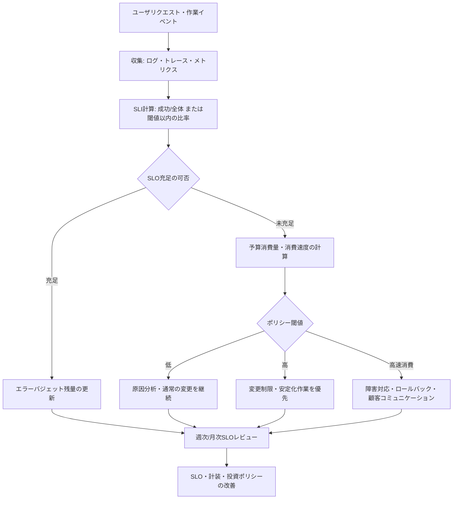
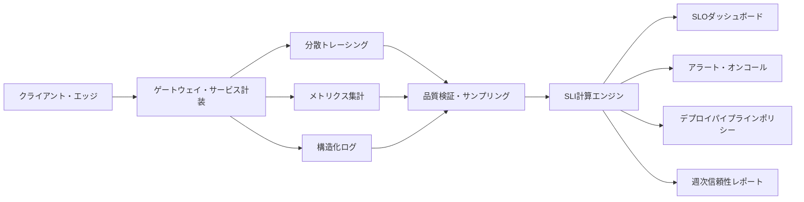

# SLO・SLI・エラーバジェット(Error Budget)に基づくサービス信頼性管理

## 1. 概要

### A. 定義

> **SLI(Service Level Indicator)**はサービスの信頼性を観察するために計測する定量指標であり、**SLO(Service Level Objective)**はその指標が目標期間中に満たすべき目標水準である。
>
> **SLA(Service Level Agreement)**はサービス提供者と利用者の間で合意したサービスレベルおよび未達時の責任・補償条件を契約として明示したものであり、**エラーバジェット(Error Budget)**はSLOを100%とみなさず、許容可能な失敗・遅延の余裕分に換算した運用上の意思決定基準である。

SLO・SLI・エラーバジェットは、単なるモニタリングダッシュボードの指標の束ではない。
この体系の本質は、開発速度とサービス安定性の間の緊張関係を、計測可能なポリシーへと変換することにある。
サービスは常に完璧に動作しなければならないと宣言すれば、現実的な障害やネットワーク遅延をすべて失敗として扱うことになる。
逆に障害を甘受しようという姿勢で運用すれば、顧客への影響と復旧責任が曖昧になる。
SLOは期待できる品質を数値で表現し、エラーバジェットはその品質目標の範囲内で許容できる変化の幅を提示する。

可用性が高いだけで良いサービスになるわけでもない。
ユーザが要求した結果が正確か、応答が十分に速いか、データが最新か、作業が決められた時間内に完了するかによって、体感される信頼性は変わる。
したがって、サービスの目的とユーザジャーニーに合ったSLIを選び、計測対象と除外対象を明確に定義しなければならない。
例えばログインサービスでは成功率とレイテンシが重要だが、バッチ分析サービスでは一定時間内に作業が終わる処理率とデータ品質のほうが重要となり得る。

### B. 登場背景と必要性

第一に、運用チームの「安定している」という判断は、開発チームの「デプロイ可能である」という判断としばしば衝突する。
障害がなかったという感覚だけでデプロイを止めれば小さな改善も遅くなり、逆にデプロイ件数だけを最適化すれば顧客への影響が蓄積する。
エラーバジェットは直近のSLO達成率を基に変更作業に使えるリスクの量を計算するため、議論の基準を経験や職位ではなくデータへと移す。

第二に、平均値中心のモニタリングは、一部のユーザの深刻な失敗を覆い隠す可能性がある。
平均応答時間が良好でも、特定の地域、特定のテナント、特定のAPIでタイムアウトが集中していることがある。
SLOを全体平均ではなく、イベント単位の成否と分位数レイテンシで設計すれば、ユーザが実際に経験する失敗をより忠実に表現できる。

第三に、サービスが分散するほど、原因と責任の境界が曖昧になる。
フロントエンド、APIゲートウェイ、認証、決済、データベースが連鎖的に呼び出されると、一つのコンポーネントの遅延がユーザジャーニー全体の失敗として現れる。
各サービスのSLOを独立して管理しながらも上位のユーザジャーニーの目標と結び付けてこそ、部分最適が全体の信頼性を損なう問題を減らすことができる。

第四に、エラーバジェットは障害を正当化する数値ではなく、リスクを管理する予算である。
予算が残っているという理由で無理な変更を自動承認してはならない。
変更のリスク度、復旧可能性、データ破損の可能性、規制への影響、顧客の重要度までを併せて考慮して予算を使うべきである。

## 2. SLI・SLO・SLAの概念と関係

### A. SLIの構成原理

SLIでは、計測値そのものよりも「どのユーザ事象を成功とみなすか」を先に定義することが重要である。
リクエスト数を分母とし、成功リクエスト数を分子とする可用性SLIは理解しやすいが、キャッシュヒットとオリジンデータ照会を同一の成功とみなすかどうかにはポリシーが必要である。
また、ヘルスチェックだけで成功率を計算すると、実際のユーザリクエストにおける認証・権限・データ処理の失敗を見落とす可能性がある。

時間ベースのサービスでは、全観測区間のうち正常にサービスを提供した時間の比率を用いることができる。
リクエストベースのサービスでは、全有効リクエストのうち成功したリクエストの比率を用いることができる。
レイテンシSLIは、全リクエストの平均よりも「目標閾値以内のリクエストの比率」として定義すると、ユーザ体験とより直接的に結び付く。
このとき、閾値、計測ポイント、タイムアウト、リトライリクエストの重複集計ルールを併せて記録しなければならない。

データの鮮度や正確性も、サービスの目的によってはSLIとなり得る。
例えば在庫照会サービスで、最終更新時刻が一定時間以内である応答の比率を計測すれば、サーバが応答したという事実だけでは表れない品質を監視できる。
レコメンドサービスでは、結果が返された比率だけでなく、禁止語フィルタ通過率や必須属性の欠落率を品質指標とすることができる。
ただし品質の判断が主観的である場合は、計測方法と検証サンプルを別途定義しなければならない。

### B. SLOの設定方式

SLOは「可用性99.9%」のように数字を一つ決めるだけの作業ではない。
対象サービス、ユーザ集合、計測期間、成功条件、データソース、例外条件、目標未達時の措置を一つのセットとして定義して初めて、運用可能な目標となる。
計測期間はローリング期間とカレンダー期間のうち目的に合った方式を選択し、期間が変われば傾向やエラーバジェット消費速度の解釈も変わる。

可用性SLOが99.9%であれば、許容失敗率は0.1%である。
1日の有効リクエストが1,000,000件であれば、単純計算で許容される失敗リクエストは1,000件である。
しかし、すべての失敗が同じ価値と被害を持つわけではないため、決済承認の失敗と非中核のレコメンドウィジェットの失敗を一つのSLOにまとめると、意思決定が歪められかねない。
重要なユーザジャーニーと社内管理機能を分離してSLOを設計する理由はここにある。

目標は高ければ高いほど良いのではなく、コストと期待品質が均衡する水準でなければならない。
目標を99.99%に上げると許容失敗率は99.9%と比べて10分の1に減り、冗長化・容量・テスト・オンコール対応のコストが大きく変わり得る。
顧客が実際には区別できないわずかな目標の引き上げよりも、失敗が集中する原因を取り除く投資のほうが大きな価値を生む場合もある。
したがって初期のSLOは、計測可能な現在の水準と顧客の期待を併せて見て定め、運用データを通じて段階的に調整する。

### C. SLAとの違い

SLAは外部顧客との契約または公式な約束であるため、法的・商業的な責任が伴い得る。
一方SLOは内部の運用目標として用いることができ、SLAより厳格であったり、サービスごとにより細分化されていたりすることがある。
SLAで99.9%の可用性を約束したのであれば、内部SLOを99.95%に設定し、契約違反の前に検知・改善する余地を残すことができる。
SLOをSLAと同一に設定すると、内部アラートと顧客補償の基準が限界線に張り付き、早期対応が困難になる。

| 区分 | SLI | SLO | SLA |
|---|---|---|---|
| 性格 | 計測指標 | 目標水準 | 外部との合意・契約 |
| 問い | 何をどのように計測するか | どの水準を守るか | 守れなければ何に責任を負うか |
| 主な利用者 | 開発・運用・分析チーム | サービスオーナー・運用チーム | 顧客・営業・法務・運用チーム |
| 例 | 300ms以内の応答の比率 | 月間99.9%以上 | 未達時にサービスクレジットを提供 |
| 変更方式 | 計装・定義変更のレビュー | ポリシー・レビューで調整 | 契約変更手続きが必要 |

三つの用語を混同すると、ダッシュボードに指標は多いのに決定すべきポリシーがない状態に陥る。
SLIは観察の言語であり、SLOは品質の基準であり、SLAはステークホルダー間の責任の言語であるという区分が有用である。
技術士はこの関係を文書化する際に数値を羅列するだけでなく、業務目標と運用上の措置までを結び付けなければならない。

## 3. エラーバジェットの算定と運用

### A. 算定式

エラーバジェットは、目標水準において許容される失敗の量として定義する。
可用性SLOが99.9%であれば、エラーバジェット比率は次のように計算する。

\[
エラーバジェット比率 = 1 - SLO
\]

リクエストベースの計測では、次のように表現できる。

\[
許容失敗数 = 全有効リクエスト数 \times (1 - 目標成功率)
\]

時間ベースの計測では、観測期間にエラーバジェット比率を掛けて許容停止時間を計算する。
30日を43,200分とみなし99.9%のSLOを適用すると、理論上の許容停止時間は43.2分である。
この数値は障害を43.2分まで放置してよいという意味ではなく、計画メンテナンスと計画外障害を含むサービス影響の総量を管理する基準である。
計測方式によってメンテナンスの除外、予定されたテストの除外、地域別の分離などのポリシーが変わるため、計算の前に範囲を確定しなければならない。

エラーバジェットの消費率(バーンレート)は、残り予算よりも迅速な対応を可能にする。
予算の10%が1か月かけて消費されたのであれば正常に見えるかもしれないが、1時間で10%が消費されたのであれば大きな障害が進行中である可能性がある。
したがって累積消費率と短期消費率を併せて観察し、短期消費が閾値を超えた場合にはページングや変更凍結を実行できるようにする。

### B. 予算消費の流れ

まずユーザ事象を収集し、信頼できるソースからSLIを計算する。
次にSLOと比較してエラーバジェットを差し引き、予算の残量と消費速度に応じて運用ポリシーを適用する。
この流れにおいて、ダッシュボードの更新が遅れたり分母が欠落したりすると予算が残っているように見えることがあるため、計装品質も管理対象である。

予算の閾値には、単一の数字よりも段階的な措置が適している。
予算が50%残っている時点で原因分析を開始し、25%残っている時点で高リスク変更に追加の承認手続きを設け、0%に近づいたら安定化作業を優先する、といった方式である。
ただし閾値が自動的にすべてのデプロイを止めるように設計すると緊急のセキュリティパッチまで遅れる可能性があるため、変更の種類と緊急度に応じた例外手続きが必要である。

### C. 予算に基づく意思決定

エラーバジェットが十分であれば、機能デプロイ、性能実験、アーキテクチャ変更といった革新的な作業に一定水準のリスクを許容できる。
このときのリスク許容とは、無作為な障害を許容することではなく、影響範囲を限定し迅速に元に戻せる変更を選択するという意味である。
カナリアデプロイ、フィーチャーフラグ、自動ロールバック、事前検証環境は、同じエラーバジェットでより多くの学習を得ることを助ける。

エラーバジェットが不足している場合は、機能開発を無条件に中断するよりも、信頼性作業の優先順位を引き上げる。
例えばタイムアウトの原因がデータベースのコネクションプール枯渇であれば、容量増設だけでなく、クエリパターン、リトライの暴走、コネクションの回収、負荷分散を併せて分析する。
根本原因を解決せずに一時的にSLOの目標を下げれば、指標は良くなっても顧客体験は改善されない。

## 4. 計測設計と技術的実装

### A. イベント・分母の定義

良いSLIは計算式が短く、同じ入力に対して再現可能であり、サービスオーナーが結果を説明できるものでなければならない。
「正常なリクエスト」の定義には、HTTPステータスコードだけでなく、業務上の成否や必須データの完全性も含まれ得る。
例えばHTTP 200を返しても決済承認の結果が`pending`である場合、決済完了SLIでは成功とみなすことはできない。

分母に内部リトライと重複リクエストを含めるかどうかを決めなければならない。
ユーザの1回のクリックがネットワークのリトライによって3回送信された場合に3件すべてを分母に数えると、ユーザの体感と指標の間に差が生じ得る。
逆にサーバが受け取った実際のリクエストをすべて数えれば、システムがリトライの暴走にどの程度さらされたかを見ることができる。
両方の観点が必要であれば、ユーザ事象SLIとインフラリクエストSLIを分離する。

除外条件は透明に管理しなければならない。
メンテナンス時間、テストトラフィック、遮断された悪性リクエストを除外することはできるが、障害が発生した後に不利なデータを除外すれば、SLOは指標ロンダリングの手段となってしまう。
除外リストはコードと文書でバージョン管理し、変更時にはサービスオーナーと観測担当者のレビューを受けることが望ましい。

### B. レイテンシとパーセンタイル

平均レイテンシは、非常に遅い少数のリクエストを覆い隠す可能性がある。
p50は典型的なユーザの体験を、p95とp99はテールレイテンシと一部ユーザの悪い体験を示す補助指標として活用する。
しかし「p99が何ms以下」という観測値をそのままSLOとするよりも、全有効リクエストのうち閾値以内のリクエストの比率を目標とする方式のほうが、期間ごとの比較においてより明確になり得る。

計測ポイントによって値は変わる。
クライアントで計測したレイテンシはDNS・転送・レンダリングまで含むためユーザ体験に近いが、ネットワーク環境の影響を大きく受ける。
サーバ内部で計測したレイテンシは原因分析に有利だが、クライアントが感じる全体時間を説明することはできない。
したがってユーザジャーニーSLIとコンポーネント別の原因分析指標を併せて運用しつつ、両者を同じSLOとして混用しない。

### C. データパイプライン

収集層は、元のイベントを失わずにコストと個人情報を管理しなければならない。
すべてのリクエストの本文をログに残せばデバッグには役立つかもしれないが、個人情報とコストのリスクが大きくなる。
代わりに識別子を非識別化し、必要なフィールドだけを構造化し、原本の保存期間とアクセス権限を分離する。

集計の遅延とサンプリングも、SLOの解釈に影響を与える。
トレースはコストの理由からサンプリングできるが、エラーリクエストと遅いリクエストを優先的に保存するポリシーが必要である。
メトリクスは高カーディナリティのラベルを無制限に使うとストレージコストと照会性能が悪化するため、サービス・地域・バージョン・テナントなど意思決定に必要な次元から選定する。

## 5. 運用プロセスと組織への適用

### A. SLO策定手順

1. 中核となるユーザジャーニーと事業上重要な成果を識別する。
2. ジャーニーごとに成功事象と失敗事象を文章で定義する。
3. ログ・トレース・メトリクスのうち、信頼できる計測ソースを選定する。
4. SLIの分母・分子・閾値・除外条件・計測期間を文書化する。
5. 現在の水準、顧客の期待、コスト、規制要件を反映してSLOの草案を定める。
6. 過去の障害とピークトラフィックに当てはめ、目標が現実的かを検証する。
7. 予算消費の段階別の運用措置と例外手続きについて合意する。
8. 一定期間の運用後、誤検知・欠落・業務との不一致をレビューして改善する。

初期段階では、すべての機能に同一のSLOを適用するよりも、中核ジャーニーから始めるのがよい。
ログイン・決済・注文状況のように顧客と収益に直接結び付くフローを先に定義すれば、投資の優先順位が明確になる。
その後、付加機能や社内システムへと拡大しながら、指標運用に必要な共通テンプレートを作成する。

SLO文書には担当チームだけでなく、依存サービスと意思決定権限も併せて記載する。
データベースチームの障害が注文サービスのSLOに影響を与える場合、原因チームと顧客コミュニケーションチームの役割があらかじめ定められていなければならない。
責任を分担する目的は責任を転嫁することではなく、障害時の復旧経路を短くすることである。

### B. デプロイ・変更管理との連携

CI/CDパイプラインは、エラーバジェットをデプロイ承認に活用できる。
直近期間のSLO達成率と短期消費速度が良好であれば小規模なカナリアデプロイを許容し、消費が速ければ自動的にデプロイ範囲を縮小したり承認者を追加したりできる。
ただしパイプラインはポリシーの実行手段であって、SLO定義の代替物ではない。
計装エラーによって自動遮断や自動承認が発生しないよう、データの鮮度と計算の失敗を別途監視しなければならない。

高リスクの変更には、エラーバジェット以外の安全装置を併用する。
データスキーマの変更はロールバックが困難な場合があるため、互換性のある拡張を行った後に切り替える段階的な方式が必要である。
認証・決済の変更はフィーチャーフラグだけでは不十分な場合があるため、事前承認、限定されたユーザ群、取引停止手順、監査ログを追加する。

### C. 障害対応と学習

障害が発生した場合は、まず顧客への影響と復旧を優先し、原因究明は復旧と並行して進める。
SLOとエラーバジェットは、障害の深刻度を迅速に説明する共通言語となる。
しかしエラーバジェットの数値が低いからといって顧客への影響が常に小さいわけではないため、影響を受けたユーザ数・取引金額・データ破損の有無を併せて確認する。

事後レビューでは、個人のミスよりもシステムの条件を分析する。
アラートが遅れたか、ロールバック経路があったか、変更は十分に小さな単位だったか、テストは実際のトラフィック特性を反映していたか、依存サービスの状態を把握できたかを問う。
再発防止措置には担当者と完了時期を定め、同じSLOの傾向において効果が確認できるかを検証する。

## 6. 比較・事例

### A. 従来型KPIとSLOの比較

従来型KPIは、売上・処理量・デプロイ回数のように事業の生産性を示すことに強みがある。
しかし処理量の増加とともにエラーと遅延も増加する可能性があり、KPIだけを見ていると品質低下の発覚が遅れることがある。
SLOはユーザが期待するサービスの結果を中心に品質の下限を定め、KPIと併用することで速度と安定性のバランスを取る。

| 比較軸 | 従来型運用KPI | SLO・エラーバジェット体系 |
|---|---|---|
| 焦点 | 産出量・活動量 | ユーザ視点の信頼性 |
| 失敗の解釈 | 障害件数・平均値 | 目標に対する予算消費 |
| 開発と運用の関係 | 目標の衝突が協議に依存 | データに基づく変更ポリシー |
| 改善の方向 | より多く・より速く | リスクを統制しながら学習 |
| 限界 | 顧客への影響の分散した表現 | 指標設計・計装コスト |

二つの体系は代替関係ではなく補完関係である。
例えばデプロイ回数はイノベーションの速度を表し、SLOはデプロイが顧客に与えた品質面の影響を表す。
デプロイ回数が多いにもかかわらずSLOも維持されているなら、自動化と小さな変更の効果を確認できる。
逆にデプロイ回数は増えたがエラーバジェットが急速に減っているなら、速度指標だけを最適化した結果である可能性がある。

### B. ECサイト注文APIの事例

あるECサイトの注文APIが、月間有効リクエスト10,000,000件のうち成功リクエスト9,995,000件を記録したと仮定する。
成功率は99.95%であり、目標SLOが99.9%であればこの期間のリクエストベースのエラーバジェットは10,000件であるため、5,000件を使用して5,000件が残る。
予算が残っているからといってすべての変更を承認するのではなく、次のデプロイが在庫引当と結合しているかどうかを確認しなければならない。

在庫引当の失敗が注文作成の失敗よりも遅れて現れる場合、単純な成功率SLIでは問題を見落とす可能性がある。
注文受付の成功と在庫確定の成功を別のユーザジャーニーとして分離し、補償トランザクションと未確定注文の処理時間を追加で計測しなければならない。
こうすることで、「API応答の成功」と「顧客の注文が実際に完了したこと」との意味の差を縮めることができる。

1時間でエラーバジェットの40%が消費されたなら、月間の残量だけを見て正常と判断してはならない。
デプロイバージョン別・地域別・依存データベース別に消費を分解し、問題となったバージョンをカナリアで停止するかロールバックする。
同時に顧客に対して注文の再試行や二重決済の可能性を案内し、復旧後には冪等キーと在庫整合性の検証を改善する。

### C. バッチ分析サービスの事例

毎時需要予測バッチを実行するサービスでは、すべてのリクエストの即時応答率よりも、決められた時刻までに結果が準備されているかどうかが核心である。
例えば「営業開始30分前までに、最新データで予測結果が準備された作業の比率99%」をSLOとして定義できる。
この場合、作業の失敗、データ入力の遅延、モデル実行の遅延、結果ロードの失敗を区別し、原因別の指標を設けなければならない。

バッチ作業には再実行が可能という特性があるため、エラーバジェットをリクエスト失敗数だけで計算すると実際のコストを反映できない。
再実行にかかったコンピューティングコスト、意思決定の遅延、人が行った手動補正の時間を別の運用指標として管理する。
SLOは顧客の成果に関する時間の約束を表現し、コスト指標はその約束を守るために支払ったリソースを示す。

## 7. 深化: マルチサービス環境におけるSLOの階層化

### A. ユーザジャーニーとコンポーネントの目標

マイクロサービス環境では、各サービスのSLOを単純に掛け合わせて全体のSLOと断定してはならない。
実際の呼び出しグラフには、並列呼び出し、選択的機能、キャッシュヒット、リトライ、代替経路が存在するためである。
呼び出し構造を分析し、ユーザジャーニーの成功条件を直接計測したうえで、下位サービスのSLOを予算配分の参考値として用いるほうが安全である。

中核ジャーニーのSLOは、顧客価値の成果を代表する。
下位サービスのSLOは、チームが制御できる技術的品質を代表する。
上位目標が未達であるにもかかわらず下位サービスがすべて目標を達成しているなら計装の漏れや相互作用の問題があり得るし、一部の下位サービスだけが未達であれば、その依存性の改善優先順位を定めることができる。

### B. 予算配分と依存性管理

上位の注文ジャーニーに0.1%の失敗予算がある場合、認証・商品・在庫・決済にそれぞれ同じ予算を付与することはできない。
並列呼び出しか逐次呼び出しか、失敗時に代替可能か、顧客に見える中核段階かによって、寄与するリスクが異なる。
予算配分は数学的な計算から始めつつ、障害の伝播経路と復旧可能性を反映したポリシー協議によって確定する。

依存性の契約には、成功条件だけでなくタイムアウトとリトライも含めなければならない。
上位サービスが下位サービスの遅延を待ちながらリトライすると、小さな遅延が全体障害へと増幅され得る。
タイムアウト予算を区間ごとに分割し、リトライ回数とバックオフを制限し、サーキットブレーカーと隔離プールを適用すれば、エラーバジェットの急激な消費を緩和できる。

### C. 信頼性投資のポートフォリオ

エラーバジェットのデータは、どの投資が顧客品質を改善するかを評価する根拠となる。
キャッシュの導入、データベースインデックスの改善、オブザーバビリティの強化、デプロイの自動ロールバック、災害復旧訓練は、それぞれ異なるコストと効果を持つ。
短期的なSLO改善だけで判断すると隠れた運用負債と長期的な保守コストを見落とす可能性があるため、投資効果を消費率・復旧時間・変更失敗率・手作業量の傾向と併せて検証する。

## 8. 考慮事項および示唆

### A. 指標設計の整合性

第一に、SLIはシステムが計測しやすい値ではなく、ユーザが成功したと判断する結果を反映しなければならない。
HTTPステータスコードだけで業務の成功を表現できないのであれば、ドメインイベントと結果状態を計装に含める。
分母から特定のトラフィックを恣意的に除外しないよう、定義と例外をコードレビューのレベルで管理する。

第二に、サービスごとに指標の定義が異なると、組織全体での比較が困難になる。
共通の用語と計算テンプレートを作りつつも、すべてのサービスに同一の閾値を強制することはしない。
標準化すべきは定義の方式と検証手順であり、目標水準はユーザの期待と業務の重要度に応じて差をつける。

### B. 結果整合性とユーザコミュニケーション

第三に、分散システムではSLOを達成していてもデータが一時的に遅延する場合がある。
ユーザに処理中の状態、最終更新時刻、再試行方法を提供すれば、結果整合性を品質問題としてのみ体験させずに済む。
運用者は技術的な成功率と併せて、状態案内の正確性も点検しなければならない。

第四に、障害の告知は技術用語よりも、影響・範囲・対応方法を中心に作成する。
エラーバジェットの消費量は内部の意思決定には有用だが、顧客に対してはどの機能がいつまで使えないのか、およびデータ保護措置を説明することが優先である。

### C. 自動化と例外統制

第五に、予算連動の自動化は迅速な対応を可能にするが、誤った計装が組織全体を誤作動させる可能性がある。
SLO計算の失敗、データの遅延、観測システムの障害をサービス障害と区別するメタモニタリングを設ける。
緊急のセキュリティパッチや法定措置のように予算とは無関係に実施すべき変更には、別途の承認・事後レビュー手続きを設ける。

第六に、自動ロールバックはすべてのエラーに適しているわけではない。
データマイグレーションや外部契約の変更のように、すでに外部への影響が発生した作業には、バージョンを戻すよりも補償処理と互換性の維持が必要である。
変更の種類ごとの復旧戦略をランブックとして整備し、定期的に実地訓練を行う。

### D. 個人情報・監査・コスト

第七に、SLIを計算するために収集するログやトレースデータも、個人情報保護の対象となり得る。
最小収集、目的制限、保存期間、アクセス制御、マスキングを適用し、運用分析に不要な原文データは保存しない。
監査証跡が必要な場合は、原本データと分析用の派生データを分離し、アクセス権限と保存ポリシーに差をつける。

第八に、オブザーバビリティのコストがサービスの価値を上回らないよう、計装のレベルを調整する。
高カーディナリティのラベルと原本の長期保管はコストを増大させ得るため、中核のSLO計算データと詳細調査用データを保存等級ごとに分ける。
コスト削減によってエラー分析能力が損なわれないよう、代表サンプルとエラー・遅延優先の保存ポリシーを検証する。

---

> **一言まとめ**: SLIでユーザ視点の信頼性を計測し、SLOで目標を定めたうえで、エラーバジェットの消費速度に応じてデプロイ・安定化・投資を調整することが、データに基づくサービス運用の核心である。
