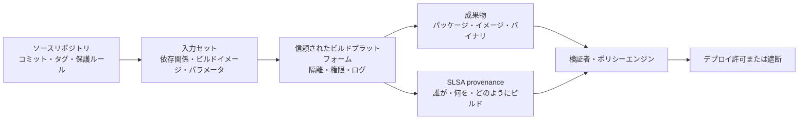
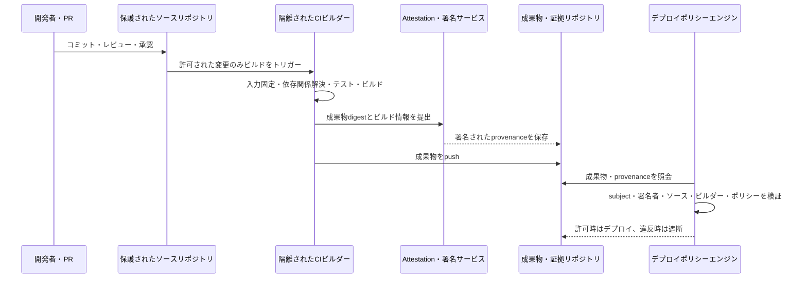

# SLSAに基づくソフトウェアサプライチェーンセキュリティとビルドの完全性

## 1. 概要

> **SLSA(Supply-chain Levels for Software Artifacts)**は、ソースコード、ビルドプラットフォーム、依存関係、成果物の間の信頼関係をprovenance(出所・生成履歴)と段階別の要件で表現し、ソフトウェアサプライチェーンの改ざん・汚染リスクを低減するセキュリティフレームワークである。

ソフトウェアサプライチェーン攻撃は、稼働中のサーバに直接侵入するのではなく、開発・ビルド・デプロイ過程における信頼を悪用する。
開発者が使用するオープンソースパッケージに悪性コードが混入したり、CIランナーの権限が奪取されたり、正常なソースから作られたように見えるバイナリがビルド後に差し替えられたりする可能性がある。
組織は最終ファイルのハッシュを確認するだけでは、「何を使って、どこで、どのような入力でこのファイルを作ったのか」という問いに答えることは難しい。

特に現代のCI/CDパイプラインは、ソースリポジトリ、パッケージリポジトリ、コンテナレジストリ、外部アクション、ビルドキャッシュ、署名システム、そして複数のクラウドアカウントを結び付けている。
一つの段階の権限が過剰であったり、生成履歴が偽造可能であったりすれば、攻撃者は正規のデプロイ手順の中に悪性の成果物を紛れ込ませることができる。
したがってサプライチェーンセキュリティは、ファイアウォールやランタイムのアンチウイルスだけの問題ではなく、ソフトウェアが作られる過程そのものを証明し検証する問題である。

SLSAはこの問題を、「成果物がどのように作られたかについての検証可能な証拠」と「その証拠をどれだけ信頼できるかについての水準」とに分ける。
Build trackはビルド成果物とビルドプラットフォームの関係を扱い、Source trackはソースがリポジトリに取り込まれ変更される過程の信頼を扱う。
各トラックは、すべての組織に一度に最高水準の達成を強制するのではなく、現在の統制水準を測定し、段階的に引き上げることを支援する。

論述答案では、SLSAを単なるツールや署名製品として説明するだけでは不十分である。
第一に、SBOMは構成要素のリストであり、SLSA provenanceは生成過程の証拠であるという違いを区別しなければならない。
第二に、署名さえあれば安全であると断定するのではなく、署名主体・鍵の保護・ビルドの隔離・ポリシー検証を併せて説明しなければならない。
第三に、開発者の利便性とセキュリティ統制をバランスよく考慮し、リスクベースの段階的導入戦略を提示しなければならない。

### A. 登場背景と必要性

第一の背景は、攻撃対象領域の拡大である。
一つのアプリケーションが自ら作成したコードだけで構成されていた時代とは異なり、現在は数百のパッケージとビルドプラグイン、コンテナイメージ、デプロイアクションを組み合わせている。
パッケージが正規のバージョンであるかを確認することと、そのパッケージが実際のビルドに使用されたかを確認することは別の問題である。
SLSAは、入力と実行環境を記述するprovenanceによってこの結び付きを明らかにする。

第二の背景は、「再現可能に見えるビルド」と「信頼できるビルド」の違いである。
同じソースコミットで再ビルドできたとしても、ビルド過程で任意のシークレットが注入されたり、外部からダウンロードしたファイルが変わったりすれば、結果は異なり得る。
再現性は有用な品質特性であるが、ビルド主体が正当であったか、provenanceが偽造されていないかまでを自動的に保証するものではない。
したがって、再現性、署名された証拠、隔離されたビルド環境をそれぞれ別の統制として設計しなければならない。

第三の背景は、規制・調達・顧客要求の変化である。
公共・金融・医療の領域では、納品されたソフトウェアの構成要素と脆弱性対応だけでなく、開発・ビルドの統制が重要な評価項目となっている。
組織はインシデント発生後に「どのソースと依存関係で、どのビルドが作られたのか」を追跡できなければならず、サプライヤーの主張も検証可能な証拠として受け取る必要がある。
SLSAとNIST SSDFを併せて適用すれば、開発プロセスの実践項目と成果物生成の証拠を結び付けることができる。

### B. 目標と範囲

SLSAの目標は、すべての攻撃を防ぐことではなく、サプライチェーンで発生するミスと改ざんを検知・抑止し、利用者が成果物の生成経路に関するポリシーを判断できるようにすることである。
例えば組織は、「本番環境にデプロイされるイメージは、承認されたリポジトリの保護されたコミットから、中央のCIプラットフォームで、署名されたprovenanceを残してビルドされなければならない」というポリシーを作ることができる。
ポリシーエンジンはイメージのprovenanceを読み取り、この条件を満たしているかを自動判定する。

範囲は、ソースリポジトリの変更統制、依存関係の取得、ビルドの実行、成果物の生成、provenanceの発行、署名・保管、デプロイ前の検証へと続く。
一方、稼働中のアプリケーションのあらゆる脆弱性、事業承認、開発者のセキュリティ教育、ペネトレーションテストをSLSA一つで代替することはできない。
フレームワークの範囲を明確にしておくことで、導入後に「SLSAを達成したのでサプライチェーンリスクはすべて除去された」という過信を避けることができる。

## 2. SLSAの中核概念と構造

SLSAを理解する鍵は、成果物(artifact)、入力(input)、ビルドプラットフォーム(build platform)、provenance、検証者(verifier)の関係である。
成果物はバイナリ・パッケージ・コンテナイメージのように利用者がインストールまたはデプロイする結果物であり、入力はソース・依存関係・ビルドパラメータ・ビルドイメージのように結果に影響を与える要素である。
ビルドプラットフォームは入力を受け取って成果物を作り、その過程を説明する証拠を発行する。
検証者は成果物のdigestとprovenanceのsubjectを結び付けたうえで、組織のポリシーに従ってデプロイの可否を判断する。

### A. 成果物とdigest

検証対象は、ファイル名よりも暗号学的digestで識別しなければならない。
ファイル名やバージョン文字列はリポジトリの移動や再パッケージングによって変わり得るが、成果物のバイトに対するdigestは内容が変わったときに変化する。
したがってprovenanceのsubjectには成果物の名前とdigestを記録し、検証時には実際にダウンロードしたファイルのdigestを再計算して一致するかを確認する。

digestの一致は必要条件であって十分条件ではない。
攻撃者が悪性ファイルのdigestに合わせて偽のprovenanceを作成したり、正規のビルドプラットフォームの署名鍵を盗んだりすれば、単純な文字列比較だけでは問題を解決できない。
検証者は、digest、provenanceの署名、署名者の身元、ビルド経路、入力コミット、ポリシー条件を併せて確認しなければならない。

例えば`payment-api:2.4.1`というコンテナタグが同じ名前で再度上書きされ得るレジストリであれば、デプロイシステムはタグよりもimmutableなdigestを固定しなければならない。
その後、provenanceが指すdigestとレジストリから受け取ったイメージのdigestが同じかを確認する。
この手順は、「どの名前のイメージを受け取ったか」ではなく、「検証したまさにそのバイトをデプロイしているか」を保証する点に意味がある。

### B. Provenance

provenanceは、成果物がどのような入力と実行過程を経て生成されたかを示す、署名可能な証拠である。
一般に、ビルド定義、外部パラメータ、解決済みの依存関係、ビルドワークスペース、ビルドプラットフォームの識別子、生成された成果物といった情報が含まれる。
利用者はこの情報を用いて、許可されたソースコミットであるか、承認されたビルドサービスであるか、予期しない外部入力が紛れ込んでいないかを判断する。

provenanceは、開発者が作成する宣言文だけでは信頼を得られない。
ユーザが制御するビルドステップがprovenanceの内容を任意に変更できるのであれば、攻撃者は実際には悪性の入力を使用しながら正常な入力を使用したと主張できてしまう。
したがって高い水準では、ビルドプラットフォームの統制領域で証拠を生成し、署名鍵をユーザのビルドコマンドから隔離し、証拠が成果物と正しく結合されているかを確認しなければならない。

SLSAが推奨するprovenanceは、in-toto attestation frameworkと併せて用いられる形式である。
attestationは成果物に関する主張を収める封筒であり、predicateはビルドやテストのようにその主張の具体的な意味を収める。
この構造は、ビルドprovenance以外にも、脆弱性検査、テスト結果、ライセンス検査など異なる種類の証拠を同一のポリシー体系で扱えるよう拡張できる。

### C. Build trackとSource track

SLSA v1.2は、Build trackとSource trackを区別している。
Build trackは、ビルドプラットフォームがprovenanceを生成し、そのprovenanceが成果物とビルド入力を正確に記述し、ビルド環境の改ざんにどれだけ強いかを段階的に評価する。
Source trackは、ソースコードがどこから来て、どのような変更統制を経て信頼されたソース状態になったかを扱う。
二つのトラックを分離すると、「ビルドは安全であったが悪性のコミットをビルドした場合」と「ソースは承認されていたがビルドプラットフォームが改ざんされた場合」を別々に分析できる。

SLSA v1.0以降のBuild levelはL0からL3までで説明される。
L0は保証がない状態であり、L1はビルドprovenanceの存在を要求する。
L2は、ホスト型ビルドプラットフォームがprovenanceを生成・署名し、事後の改ざんに対する防御を高める段階である。
L3は、ビルドプラットフォームの強固な隔離と偽造耐性を要求し、ビルド中の改ざんリスクをさらに低減する段階である。

| 区分 | 中核となる保証 | 代表的なリスク緩和 | 導入時の問い |
|---|---|---|---|
| Build L0 | 特段の保証なし | 体系的な統制がない状態 | 成果物の生成経路を説明できるか |
| Build L1 | provenanceの存在 | ミス・追跡性の不足 | すべてのリリースが生成履歴を残しているか |
| Build L2 | 署名されたprovenanceとホスト型ビルド | ビルド後の証拠改ざん | 署名主体とCIの身元は信頼できるか |
| Build L3 | 強化・隔離されたビルドプラットフォーム | ビルド中の操作 | 鍵・ワークスペース・ビルド間の境界を保護しているか |

この段階は、製品セキュリティ全体の成熟度スコアではない。
例えばL3水準のビルドプラットフォームであっても、アプリケーションが脆弱なライブラリを使用していたり、本番サーバのアクセス制御が弱かったりすれば、全体のリスクは残る。
したがって組織はトラック・水準を資産の重要度と攻撃シナリオにマッピングし、SBOM・脆弱性管理・SSDF・ランタイムセキュリティと併せて管理しなければならない。

### D. ProducerとConsumer

Producerには、ソフトウェアを作りprovenanceを発行するビルドプラットフォームと、そのプラットフォームを使用する組織が含まれる。
Producerの責任は、ビルドの入力と結果を正確に識別し、要求水準に合ったprovenanceを生成し、署名鍵とビルド環境を保護することである。
Consumerはパッケージをインストールしたりイメージをデプロイしたりする組織・サービスであり、provenanceを実際のポリシー判断に用いなければならない。

利用者が検証しなければ、provenanceは飾りのログにとどまる。
例えばレジストリにprovenanceが併せて保存されていても、デプロイパイプラインが署名者やソースリポジトリを確認せずに最新タグを取得すれば、セキュリティ統制は機能しない。
利用者は、許可されたビルダー、ブランチ、リポジトリ、組織、ビルドパラメータ、依存関係の条件をポリシーとして定義し、失敗時の遮断・例外・承認手続きを区別しなければならない。

## 3. サプライチェーン攻撃シナリオとSLSAによる対応

サプライチェーン攻撃は、開発者のミスと外部からの攻撃が同じ経路を利用するという点に特徴がある。
メールフィッシングでCIトークンを奪取したり、オープンソースリポジトリのリリースアカウントを乗っ取ったり、パッケージ名を混同させるdependency confusionを引き起こしたりすれば、正常な開発フローに逆らうことなく悪性の成果物を届けることができる。
SLSAは攻撃を魔法のように取り除くのではなく、攻撃者が越えなければならない信頼境界を明確にし、事後検証のための証拠を残す。

### A. 悪性の依存関係とdependency confusion

攻撃者は、社内パッケージと同じ名前の公開パッケージを作成し、ビルドツールに外部パッケージを先に選択させることができる。
あるいは正規パッケージのメンテナーアカウントを奪取し、悪性コードを含む新バージョンを配布することもできる。
このときSBOMは最終成果物に含まれるパッケージを教えてくれるが、パッケージがどのリポジトリ・digest・ビルド過程から来たのかを追加で確認しなければならない。

対応としては、依存関係のリポジトリを許可リストで制限し、lockfileとchecksumをレビューし、依存関係の取得時にprovenanceと署名の検証を行う方式で構成する。
外部パッケージを社内プロキシでキャッシュする場合でも、検証されていないファイルを無条件に信頼してはならない。
依存関係の名前だけでなく、出所、バージョン、digest、署名者、transitive dependencyをポリシーの対象としなければならない。

### B. CI/CD認証情報とビルドランナーの奪取

攻撃者がCIランナーからクラウドのデプロイ鍵やprovenanceの署名鍵を読み取れば、正規のパイプラインを通じて悪性の成果物を作ることができる。
特にビルドスクリプトが処理する外部PRやuntrusted inputにシークレットが露出すると、ソースの変更権限とリリース権限が連鎖的に奪取される可能性がある。

対応は、ビルドステップごとの最小権限、短期トークン、シークレット注入範囲の制限、信頼されたブランチの承認、ephemeral runner、ネットワークegressの制限に分けられる。
署名鍵はビルドコマンドが実行されるワークスペースにファイルとして置かず、信頼境界内の署名サービスが限定されたリクエストにのみ署名するよう設計する。
provenanceにはどのビルダーが実行したかを残し、検証者は承認されたビルダーでない場合にデプロイを遮断する。

### C. ビルド後の成果物差し替え

正常にビルドした後にレジストリやデプロイリポジトリでファイルを差し替える攻撃は、生成過程が正常であっても最終的な消費物が異なってしまうという問題である。
これを防ぐために、成果物のdigestをprovenanceのsubjectとして結び付け、provenanceに署名し、利用時にダウンロードしたバイトを再度ハッシュ化する。
レジストリのimmutable tag、署名検証、transparency log、アクセス権限の分離を組み合わせれば、単一リポジトリ侵害の影響を減らすことができる。

ここでの署名は、「誰が署名したか」が核心である。
攻撃者が自分の鍵で悪性ファイルに署名するのは難しくないため、検証者は組織が信頼する証明書・OIDCの主体・ビルドワークフロー識別子と署名時点を確認しなければならない。
鍵が交換または失効された場合に既存の成果物をどう扱うか、鍵の侵害前後で信頼範囲をどう分けるかも、運用ポリシーとして定めておく必要がある。

| 攻撃シナリオ | 侵害ポイント | 必要な証拠・統制 | 検証または対応 |
|---|---|---|---|
| 悪性オープンソースリリース | 依存関係リポジトリ・管理者アカウント | パッケージの出所、checksum、依存関係のprovenance | 許可リポジトリと署名・脆弱性ポリシーの適用 |
| dependency confusion | パッケージ解決の順序 | 社内リポジトリの優先順位、namespaceポリシー | 外部名の遮断・プロキシ固定 |
| CIランナーの奪取 | ビルド実行環境 | ビルダーの身元、隔離、最小権限のログ | 承認されたビルダーとprovenanceのみ許可 |
| provenanceの偽造 | 証拠リポジトリ・署名鍵 | 署名、鍵の保護、transparency | 署名者・subject・ポリシー条件の検証 |
| 成果物の差し替え | レジストリ・デプロイリポジトリ | digestの結合、immutableな保存 | デプロイ直前のdigest再検証 |

## 4. CI/CDの実装と検証手順

SLSAの実装は、「パイプラインにツールを一つ追加する」ことではなく、ビルド経路の信頼境界を再設計する作業である。
まず、どの成果物が重要か、どの入力が結果に影響を与えるか、どのビルダーを信頼するかをリスト化する。
その後、provenanceの生成、署名・保管、利用者による検証を段階的に組み込んでいかなければならない。

### A. ベースラインと資産分類

すべてのリポジトリに同一の統制を強制すると、小規模チームの開発フローが過度に遅くなる可能性がある。
逆にインターネットに公開された決済APIや公共配布イメージに低い基準を適用すれば、インシデント時のコストは大きい。
したがって成果物を、重要度、外部公開、個人情報の処理、変更頻度、サプライチェーンへの依存、復旧可能性で分類し、目標水準を定める。

例えば社内開発用ツールはprovenanceの生成から始めてL1水準の追跡性を確保し、顧客に配布される金融サービスのイメージには署名された証拠と中央CI、隔離・短期認証情報を要求することができる。
このようにリスクベースで目標を定めれば、「SLSAレベルの数字の競争」ではなく、実際の脅威と統制の関係を説明できる。
ベースラインには例外の承認者と有効期限も含めるべきであり、恒久的な例外が事実上の統制の抜け道とならないよう定期的に再評価する。

### B. ソースとビルド入力の固定

ソースの入力は、コミットdigestや保護されたタグのように変更を追跡できる形で固定する。
`main`の最新状態をビルドするとだけ記録すると、ビルド時点で正確にどのコミットが選ばれたかを再現することが難しい。
外部アクションとビルドイメージもタグではなくdigestまたは検証可能なバージョンで固定し、lockfileでパッケージ解決の結果を統制する。

入力の固定は、再現性のためだけの作業ではない。
検証者がprovenanceで宣言されたソースコミットと実際の成果物との関係を確認できるようにするセキュリティ統制である。
ただし、すべての環境変数を静的に固定することはできないため、外部パラメータを明示的に列挙し、機密情報がprovenanceに漏洩していないかを別途レビューしなければならない。

### C. Provenanceの生成と保管

ビルドプラットフォームは、成果物が作られた後に結果ファイルのdigestを計算し、信頼境界の内側でprovenanceを生成する。
証拠には、ビルドプラットフォームの識別子、ソースの場所とコミット、ビルド定義、入力リスト、結果のsubject、生成時点といった情報を含める。
サプライチェーンのインシデント発生時に過去の証拠を照会できるよう、成果物とprovenanceの保存期間、バックアップ、アクセス権限、削除ポリシーも定める。

証拠リポジトリには、一般的なログリポジトリとは異なる要件がある。
ログが改変されたかどうかを検知できなければならず、署名検証に必要な公開鍵・証明書チェーンを管理しなければならない。
セキュリティチームは、provenanceの生成成功率、検証失敗率、署名鍵の使用異常、予期しないビルダーを監視し、統制そのものの障害も検知しなければならない。

### D. 利用者による検証とポリシー判定

検証者はまず、成果物のdigestとprovenanceのsubjectを比較する。
次に、provenanceの署名が信頼された鍵または身元から生成されたか、その署名対象が改ざんされていないかを確認する。
その後、ソースリポジトリ・ブランチ・コミット、ビルダー識別子、ビルド水準、許可された入力と脆弱性ポリシーを順に評価する。

ポリシーの結果は、許可・遮断・手動承認に分けるほうが運用に適している。
例えば本番デプロイでは承認されたリポジトリとビルダーでなければ即座に遮断し、開発環境では警告とチケット発行で許可することができる。
ただし緊急デプロイの例外が自動的に恒久的な許可に変わらないよう、有効期限、承認者、事後レビュー、影響範囲を記録しなければならない。

### E. 失敗時の処理と復旧

provenanceがない場合や署名検証に失敗した場合にデプロイを黙って進めれば、SLSAの統制は無力化される。
ポリシーエンジンは、失敗の理由を成果物ID、ルール、確認された証拠、対処の案内とともに返さなければならない。
開発者はどのフィールドを修正すべきかを知ることができなければならず、セキュリティチームは繰り返される失敗をパイプライン改善の課題として集計すべきである。

鍵の侵害やビルダーの侵害が確認された場合、単に新しい鍵で署名し直すだけでは不十分である。
侵害期間中に生成されたprovenanceと成果物を特定し、影響を受けた依存関係とデプロイ環境を遡って追跡し、許可リスト・鍵・トークンを失効・交換しなければならない。
provenanceが充実しているほど、影響範囲を絞り込み、再ビルドの対象を決定するのに役立つ。

## 5. 関連技術との比較と連携

### A. SLSAとSBOM

SBOMは、成果物に含まれる構成要素、バージョン、関係をリストとして表現する。
したがって「何が含まれているか」を確認し、脆弱性・ライセンスの影響分析を行うことに強い。
SLSA provenanceは、「その成果物がどのソース・依存関係・ビルドプラットフォームを経て作られたか」を説明する。
両者は代替関係ではなく、同じ成果物に併せて結び付けられるべきものである。

例えばSBOMに`openssl 3.x`があると記録されていても、そのパッケージが社内の承認リポジトリから取得されたものなのか、別の外部URLからダウンロードされたものなのか、実際のイメージdigestに含まれているのかまでは自動的に証明されない。
逆にprovenanceが信頼されたビルド過程を説明していても、その結果物の中にある脆弱なライブラリのリストを便利に提供してくれるわけではない。
SBOMは構成分析に、provenanceは生成経路の検証に配置する。

### B. SLSAとNIST SSDF

NIST SSDFは、セキュアな開発慣行を準備・保護・生産・対応の実践項目として整理したプロセスフレームワークである。
SLSAはその中で、ソフトウェアサプライチェーンと成果物生成の完全性を測定・証明する具体的な統制と証拠形式に焦点を当てている。
組織はSSDFでポリシー・役割・脆弱性対応プロセスを整備し、SLSA provenanceでビルド・リリースに関する検証可能な証拠を残すことができる。

二つの体系を比較する際に、一方が他方を認証するとか、完全に包含すると断定してはならない。
SSDFへの準拠だけで成果物のprovenanceが偽造されていないという保証はなく、SLSA L3だけで脅威モデリング・セキュアコーディング・脆弱性対応が完了するわけでもない。
技術士の答案では、プロセスガバナンスと技術的な証拠生成を相互補完の関係として記述するのが適切である。

| 区分 | SLSA | SBOM | NIST SSDF |
|---|---|---|---|
| 中心となる問い | どのように作られ、信頼できるか | 何が含まれているか | セキュアな開発慣行を運用しているか |
| 代表的な成果物 | provenance・attestation | 構成要素リスト | ポリシー・手順・実践の証拠 |
| 強み | ビルド経路・署名・完全性の検証 | 脆弱性・ライセンス・影響分析 | 組織プロセスと開発ライフサイクル |
| 限界 | アプリケーションの脆弱性自体は除去しない | 生成経路と署名の信頼を単独では保証しない | 機械検証可能なビルド証拠が不足し得る |
| 連携 | 成果物digestにSBOM attestationを結び付け | provenanceと併せて利用者が検証 | 役割・ポリシー・教育・対応の上位体系として活用 |

### C. 署名とprovenance

電子署名は、データの完全性と、特定の鍵によって発行されたという事実を確認する手段である。
しかし、署名鍵を持つ主体が悪性ファイルに署名した場合や、検証者が任意の鍵を信頼している場合、署名は安全という結論にはつながらない。
provenanceは署名された主張の中にビルドの入力・プラットフォーム・結果を収め、検証者は署名者の身元と内容のポリシー適合性を併せて判断する。

したがって「署名したので安全」ではなく、「信頼されたビルダーが、許可された入力で、期待された成果物を作ったという主張が検証された」と表現すべきである。
この違いは、証明書管理とポリシーエンジンの設計において特に重要である。
鍵の交換・失効、証明書の期限切れ、組織の異動、ビルダーワークフローの変更を運用シナリオに含めなければならない。

## 6. 適用事例と期待効果

### A. コンテナベースの決済サービスの事例

決済サービスを運営する組織が、毎週コンテナイメージをデプロイしていると仮定する。
従来はGitタグを基準にビルドし、`payment-api:latest`を本番クラスタが取得していたが、タグが再利用され、外部PRでも同じランナーが実行されるという問題があった。
組織はまず、保護されたリリースブランチ、承認された中央CI、イメージdigestの固定、SBOMの生成、provenanceの署名をベースラインとして定めた。

ビルドが完了すると、イメージdigest、ソースコミット、ビルダーワークフロー、ベースイメージと依存関係の情報を、provenanceとSBOM attestationに結び付ける。
デプロイポリシーは、署名者が組織のリリースビルダーであるか、ソースが保護されたブランチの承認済みコミットであるか、イメージに重大な脆弱性がないか、provenanceのsubjectと実際のイメージdigestが同じであるかを検査する。
一つの条件でも失敗すれば本番デプロイは遮断され、開発環境では承認チケットが生成される。

この設計の効果は、単に攻撃を防ぐことにとどまらない。
インシデント調査担当者は本番イメージからソースコミットとビルダーを遡って追跡でき、特定のビルダーが侵害された期間の成果物を一括で特定できる。
また開発チームは、「セキュリティチームが手動で検査する」という曖昧な手順の代わりに、失敗したポリシーと修正方法をCIの結果で確認できる。

### B. オープンソースパッケージのサプライヤー評価の事例

企業が外部の業者からパッケージを受け取り、社内製品に組み込むとする。
契約書に脆弱性の通知義務だけを記載するよりも、リリースごとにパッケージのdigest・SBOM・provenanceを提供し、承認されたビルドプラットフォームと署名の身元を公開するよう求めれば、検証可能性が高まる。
購買組織は、サプライヤーが提供した証拠を社内のポリシーエンジンに投入し、ソース・ビルダー・署名・脆弱性の条件を評価する。

ただし、サプライヤーのフレームワークレベルに関する主張をそのまま信頼してはならない。
どの範囲の成果物にどの水準が適用されるのか、例外・手動ステップ・外部入力は何か、証拠はいつから保管されているかを確認しなければならない。
調達・法務・開発・セキュリティが共同で最低限の証拠リストと、インシデント時の再ビルド・通知・撤回の手順を契約に反映することが望ましい。

## 7. 深化: SLSA v1.2と最新の適用方向

SLSA公式文書によれば、v1.2はBuild trackのL0~L3の要件とSource trackを併せて説明し、provenance・検証サマリーattestationなどの推奨形式を提示している。
実務では、組織が高い数字を宣言することよりも、各水準の要件がどの脅威を低減するのか、そしてその統制が実際のパイプラインで観察可能かを確認しなければならない。

Source trackは、ビルド以前のソースの信頼を別の問題として扱うという点で重要である。
ビルドが完全に隔離されていても、攻撃者が保護されていないリポジトリに悪性のコミットをマージすれば、信頼されたビルダーは悪性のソースを正常にビルドしてしまう。
逆にソースの変更統制が強固であっても、ビルダーが任意の外部入力を使用したりprovenanceを偽造したりできるなら、結果物への信頼は不十分である。
したがって、ソースの変更、ビルド、デプロイという三つの境界を分離し、それぞれに証拠を結び付ける。

SLSAの今後の適用は、依存関係の取得とビルド環境の証拠へと拡張される方向にある。
依存関係をどこから、どのような検証を経て受け入れたかに関するevidenceをprovenanceに残せば、単純なパッケージ名の確認を超えて、ingestion経路の完全性をポリシー化できる。
また、ハードウェアベースの測定・証明とビルド環境の状態検証も議論されているが、草案・実験段階の要件は、承認された安定仕様と区別して導入しなければならない。

技術士の答案では、最新バージョンに言及する際には適用日と公式文書のバージョンを併記し、草案段階の機能を確定した義務事項のように表現しないのが安全である。
組織の現実的なロードマップは、リリース成果物のリスト化 → provenance L1による可視化 → 中央CI・署名によるL2強化 → 隔離・鍵保護・ポリシー検証によるL3志向 → Source・依存関係トラックとの連携、という順序で設計できる。

## 8. 考慮事項および示唆

### A. ガバナンスと責任

SLSA導入の責任をセキュリティチームだけに負わせると、開発チームは検査ツールを外部からの統制と認識し、回避しようとする可能性がある。
ソースオーナー、ビルドプラットフォーム運用者、リリース承認者、デプロイの利用者の責任をRACIで分離し、各段階の証拠オーナーを明確にしなければならない。
ビルドプラットフォームがprovenanceを発行するとしても、入力を選択する開発チームとデプロイ前に検証する運用チームの責任がなくなるわけではない。

### B. セキュリティと開発生産性のバランス

すべてのコミットに最高水準の隔離と手動承認を適用すれば、開発速度が急激に低下する可能性がある。
逆に危険な成果物に警告を残すだけでは、統制の実効性が弱まる。
開発・ステージング・本番でポリシーの強度を区別し、繰り返される違反は自動修正・テンプレート・セルフサービスのビルダーで減らす方式が必要である。

### C. 鍵と身元の管理

provenanceの署名鍵はサプライチェーンの中核資産であるため、長期固定の秘密鍵を複数のランナーに配布する設計は避けなければならない。
短期の身元、鍵管理システム、外部の鍵保管、署名の監査ログ、鍵の交換と失効の手順を組み合わせる。
検証ポリシーは鍵そのものよりも、組織・ワークフロー・ビルダーの身元と成果物の関係を信頼するよう構成し、身元の変更時には影響分析を行わなければならない。

### D. 例外とレガシー

古いビルドシステムや外部サプライヤーがprovenanceを提供できない場合がある。
このとき例外を恒久的に許可するよりも、隔離されたリポジトリ、手動検証、追加スキャン、デプロイ範囲の制限、再ビルド計画を一時的な補完統制として記録する。
例外にはリスク受容者・根拠・有効期限・代替統制を記載し、新しいリリースや契約更新の際に自動的に再レビューする。

### E. 測定と継続的改善

成功の可否を「SLSAレベルを達成したリポジトリ数」だけで測ると、形式的な証拠生成に偏る可能性がある。
provenance生成率、検証済みデプロイの比率、検証失敗の平均解決時間、未承認ビルダーの検知件数、侵害時に影響を受ける成果物の特定時間といった運用指標を併せて確認する。
ポリシーの失敗が開発者のミスなのかプラットフォームの欠陥なのかを分類し、繰り返される失敗はパイプラインテンプレートとプラットフォームのデフォルト値に反映する。

### F. 技術士の観点からの連携戦略

SLSAは、SBOM・SCA・署名・シークレット管理・CI/CD・コンテナ・Kubernetes admission control・SIEMと連携する。
デプロイゲートでprovenanceを検証し、違反イベントをSIEMに送り、脆弱性・構成・ランタイムのポリシーと併せてリスクスコアを算定すれば、生成から運用までの追跡性が高まる。
ただし、ツールを数多く組み合わせることよりも、成果物IDとdigestを共通キーとして、証拠が実際のポリシー決定に使われるよう統合することが重要である。

## 9. 予想される出題方向と答案構成戦略

出題時には、「ソフトウェアサプライチェーンセキュリティ方策」、「SLSAとSBOMの比較」、「CI/CDパイプラインの完全性確保」、「provenanceに基づくデプロイ検証」のように、さまざまな表現が用いられ得る。
答案は、定義と背景でサプライチェーンの信頼の問題を提示し、概念図でソース・入力・ビルダー・provenance・成果物・検証者を結び付けると、展開が安定する。

本論では、Build/Source trackとL0~L3を説明したうえで、dependency confusion・CIの奪取・成果物の差し替えといった攻撃シナリオを統制と結び付ける。
その後、CI/CDの実装手順、SBOM・SSDFとの比較、コンテナまたはパッケージの事例を提示すれば、単なる用語の羅列を避けることができる。
結論では、リスクベースの導入、鍵と身元、例外、測定、運用統合を考慮事項として提示し、「証拠の生成」と「利用者による検証」の両方が必要であるという点を強調する。

## 参考資料

- SLSA公式仕様 v1.2: https://slsa.dev/spec/v1.2/
- SLSA Build trackの基本および水準: https://slsa.dev/spec/v1.2/build-track-basics
- SLSAビルド成果物の要件: https://slsa.dev/spec/v1.2/build-requirements
- SLSA Provenance v1.0形式: https://slsa.dev/spec/v1.0/provenance
- in-toto Attestation Framework: https://github.com/in-toto/attestation
- NIST SP 800-218 SSDF v1.1: https://csrc.nist.gov/pubs/sp/800/218/final
- NIST SP 800-218 Rev.1 SSDF v1.2 初期公開草案: https://csrc.nist.gov/pubs/sp/800/218/r1/ipd

---

> **一言まとめ**: SLSAは、SBOMだけでは見えないソフトウェアの生成経路をprovenanceと段階別のビルド・ソース統制によって証明し、利用者がdigest・署名・入力・ビルダーのポリシーを検証して、信頼できる成果物のみをデプロイできるようにするサプライチェーンセキュリティフレームワークである。
