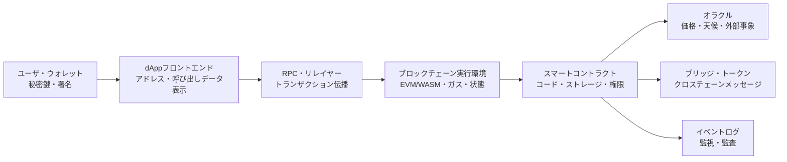
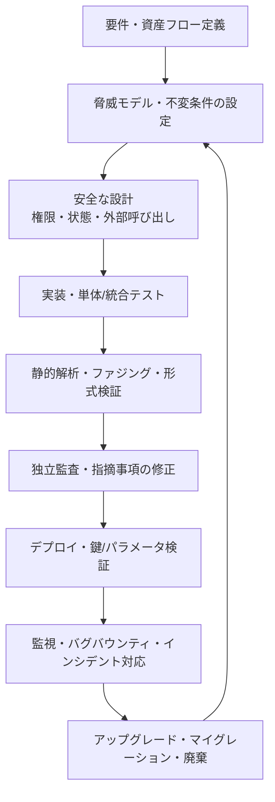

# スマートコントラクト(Smart Contract)のセキュリティと監査戦略

## 1. 概要

> **スマートコントラクト(Smart Contract)**とは、ブロックチェーンネットワークにデプロイされ、定められた条件と状態遷移を決定論的に実行するプログラムであり、参加者間の仲介による信頼をコードと合意・暗号技術で置き換えるデジタル契約実行装置である。

スマートコントラクトは、単にブロックチェーンに保存されたコードを意味するものではない。ユーザが署名したトランザクションが呼び出しデータとともにネットワークに提出され、各ノードが同じ入力と同じ現在の状態から同じ実行結果を計算した後、合意された状態を更新するという実行体系全体を指す。したがってソースコードは一度デプロイされると変更が難しく、小さな論理エラーが多数のユーザの資産・権限・取引記録に同時に影響を与え得る。

従来のWebサービスでは、サーバ運用者がエラーを発見すればデータベースを復旧したりコードをロールバックしたりできる。一方スマートコントラクトは、ブロックの確定と複製のために運用者による恣意的な修正が制限され、管理者鍵・プロキシアップグレード・ガバナンス投票が別途の統制ポイントとなる。すなわち「コードこそが法である」という表現は、コードが完璧であるという意味ではなく、コードの実行結果が自動的に資産と権利を移転させるため、事前検証の責任がはるかに大きくなるという意味として理解すべきである。

セキュリティの範囲もコントラクトのコードだけに限定されない。ウォレットと鍵管理、オラクルやブリッジといった外部依存、フロントエンドと署名リクエスト、デプロイパイプライン、運用監視、緊急停止と復旧手順までを含めなければならない。コントラクトの関数が安全であっても、管理者の秘密鍵が奪取されたり価格オラクルが操作されたりすれば、経済的損失が発生するからである。

スマートコントラクトのセキュリティは、機密性よりも**完全性・資産の安全性・可用性・決定論性**の比重が大きい領域である。ブロックチェーンの公開台帳という特性上、コードと呼び出しは観察可能であり、攻撃者は脆弱性を繰り返し実験する。したがって、アクセス制御、状態の不変条件、入力検証、リエントランシー防止、価格データの信頼性、ガス上限、アップグレード権限を一つの脅威モデルとして結び付けなければならない。

試験答案では「脆弱性の一覧」を羅列するだけでは不十分である。資産がどこに保管され、どの関数が状態を変更し、外部呼び出しがどの時点で発生し、失敗時にアトミックに巻き戻されるのかを説明したうえで、設計・実装・検証・デプロイ・運用の各段階の統制を続けて記述してこそ論述形式の答案となる。

### 1.1 登場背景と必要性

スマートコントラクトは、仲介機関なしに決済・貸付・取引・投票・資産発行を自動化したいという要求から発展した。参加者が互いを信頼しなくても同一の台帳を検証し、同一のルールを実行できるという長所は、金融・サプライチェーン・デジタル資産の分野で魅力的である。

しかし、分散化は責任の分散を意味しない。デプロイされたコントラクトにバグがあれば、「管理者がうまく直してくれるだろう」という前提は成り立たない可能性がある。特に資産を保管するDeFiコントラクトでは、単一関数の価格計算エラーや権限検証の漏れが、担保の引き出し・トークンの発行・ガバナンスの掌握へと連鎖し得る。

セキュリティ投資はコストではなく、損失の非線形性を減らす統制と捉えるべきである。例えば単体テストをいくつか追加するだけでは、オラクル操作やアップグレード鍵の奪取を検証することはできない。脅威モデルと不変条件、独立監査、テストネットでの運用、制限された初期上限、リアルタイム検知を組み合わせてこそ、リスクを段階的に下げることができる。

### 1.2 中核的特徴

- **決定論的実行:** 同一のブロック状態と入力であればすべての検証ノードが同じ結果を計算しなければならないため、外部APIの非決定的な応答を直接信頼してはならない。
- **資産とコードの結合:** コントラクトがトークン・預託金・権限を直接保管できるため、論理エラーがそのまま金銭的損失につながる。
- **公開検証可能性:** バイトコードとトランザクションが観察可能であるため、攻撃者も同一のテストとリバースエンジニアリングを行うことができる。
- **不変性と限定的な修正:** 新バージョンのデプロイは可能であっても、既存の状態とアドレスの互換性、管理者権限、マイグレーションを併せて設計しなければならない。
- **ガスとリソースの制約:** すべての実行はブロックのガス上限とコスト制約を受けるため、無限ループ・大量の配列処理・サービス拒否が危険である。

## 2. スマートコントラクトの構造と信頼境界

スマートコントラクトシステムは、ユーザウォレット、アプリケーションのフロントエンド、RPCノード、ブロックチェーン実行環境、外部のオラクルとブリッジの結合として理解しなければならない。各構成要素が異なる信頼前提を持つため、境界を区別しなければ「チェーン上のコードは安全だがチェーン外の入力が操作される」という抜け穴を見落とすことになる。

### 2.1 ユーザ・ウォレット・署名層

ユーザはウォレットでコントラクト呼び出しの対象アドレス、関数セレクタ、パラメータ、手数料を確認し、秘密鍵で署名する。秘密鍵が漏洩すれば、コントラクトが安全であっても攻撃者は正規ユーザの権限でトランザクションを作成できる。したがって、ハードウェアウォレット、マルチシグ、取引上限、出金アドレスのホワイトリストは、コード監査とは別の統制である。

フロントエンドは、ユーザが読みやすいトークン数量と目的を表示しなければならない。悪意あるWebページが、ユーザが認識していない無制限の承認や権限委任の署名を誘導すれば、ユーザは正規のコントラクトを呼び出していると思いながら資産を奪取する権限を渡してしまう可能性がある。ウォレットの生のcalldataと人が読める説明との間の不一致を減らすことが重要である。

署名は、メッセージの意図・チェーン・コントラクト・有効期限を区別しなければならない。ドメイン分離とnonceを適用しなければ、あるチェーンで作成された署名が別のチェーンや別の関数で再利用される可能性がある。EIP-712のような構造化署名は、ユーザへの表示と検証可能なフィールドとの対応を明確にするのに役立つが、その適用自体が権限モデルを代替するわけではない。

### 2.2 実行・状態・イベント層

コントラクトは、コードと永続ストレージを持つステートマシンである。関数呼び出しは状態を読み取り、検証し、変更し、必要に応じて他のコントラクトを呼び出す。すべての検証ノードが同一の結果を得なければならないため、現在のブロック状態・呼び出し元・入力・合意されたブロック情報のみに基づいて計算しなければならない。

状態の変更は、アトミックにコミットされるか、失敗時には巻き戻されなければならない。しかし外部呼び出し後の後続コードが失敗すると、リエントランシーや部分的な状態変更が問題を引き起こし得る。したがって、状態への効果を先に記録し、外部呼び出しを最後に置くChecks-Effects-Interactionsの順序が基本的な設計原則となる。

イベントログはユーザインタフェースと分析システムにとって重要な観察手段であるが、コントラクトストレージの権威ある状態と同じではない。イベントを欠落させたり誤った引数を記録したりすると、インデクサが実際の状態とは異なる画面を提供する可能性がある。資産の移動・権限の変更・アップグレード・緊急停止には意味の明確なイベントを残し、監視ルールと結び付けなければならない。

### 2.3 外部依存と信頼境界

ブロックチェーンは現実世界の価格・配送・身元情報を自ら知ることはできないため、オラクルが必要である。オラクルが単一の取引所価格や単一の運営者に依存していると、短時間の操作によって担保評価と清算が歪められる可能性がある。複数ソース、時間加重平均価格、外れ値フィルタ、価格の鮮度検証を併せて設計しなければならない。

ブリッジは、一つのチェーンでのロック・バーンと別のチェーンでの発行・解放を結び付ける。この過程には、バリデータ集合、メッセージの順序、リプレイ防止、資産供給量の不変条件が関与する。ブリッジの鍵やバリデータの閾値が崩れると、単一コントラクトのバグよりもはるかに大規模な損失が発生し得るため、別途の脅威モデルが必要である。

RPCとフロントエンドは、ユーザが直接制御しないインフラである。悪意あるRPCが残高・ガス・シミュレーション結果を歪めたり、フロントエンドが別のアドレスへの呼び出しを構成したりする可能性がある。TLS、複数RPCの比較、デプロイ成果物のハッシュ検証、フロントエンドの完全性保護が、オンチェーン統制を補完する手段となる。

## 3. ライフサイクルとセキュリティ検証手順

スマートコントラクトは、要件定義から廃棄・マイグレーションまで長いライフサイクルを持つ。監査はデプロイ直前の一回限りの成果物ではなく、設計の不変条件とテストがコード・デプロイ・運用へとつながる継続的な統制体系でなければならない。

### 3.1 要件と脅威モデル

最初の段階は、機能一覧ではなく資産フローを描くことである。預託金、担保、報酬トークン、管理者権限、価格データ、クロスチェーンメッセージを識別し、各資産がどのアドレスと関数の間を移動するかを示す。その結果、「誰が何をいつ、どこまで変更できるか」というセキュリティ上の問いを明確にすることができる。

脅威モデルには、外部ユーザ、悪意あるコントラクト、権限を持つ運用者、オラクル提供者、バリデータとブリッジの中継者を含める。攻撃者は一回のトランザクションで複数の関数を呼び出したり、同一ブロック内で価格を動かしてから元に戻したり、失敗が発生する境界でガスと戻り値を操作したりできると仮定しなければならない。

不変条件は、テストと監視の共通言語である。例えば「総発行量はバーンと発行の純合計と一致する」、「担保価値より貸出額が大きくなることはない」、「pause状態では出金以外の変更関数は実行されない」、「一つのnonceは一度しか消費されない」といった命題を、数式・検査コード・アラートルールへと結び付ける。

### 3.2 安全な実装とテスト

実装では、まず入力範囲と権限を検証し、状態変更と外部呼び出しの順序を明示する。`msg.sender`と`tx.origin`を混同せず、アドレスがコントラクトかどうかを確認すべき関数には、コードの存在確認とインタフェース検証を設ける。整数型の範囲、単位(decimals)、丸め方向、ゼロ除算も明示的に扱う。

単体テストは正常シナリオだけでは不十分である。権限のない呼び出し、0・最大値・境界時刻、失敗するトークンの戻り値、リエントランシーのコールバック、オラクルの遅延、手数料不足、チェーン再編成の可能性をテストしなければならない。一つの関数が通るかどうかよりも、複数の呼び出しを組み合わせた状態遷移が常に不変条件を保つかどうかが重要である。

ファジングと不変条件ベースのテストは、入力空間を広げる。例えば預入・貸出・返済・清算を任意の順序で数千回組み合わせながら総資産と負債の保存を検査すれば、手作業では予想しにくい順序依存のエラーを発見できる。テストが失敗した場合は単にシードを保存するのではなく、再現可能なトランザクションシーケンスとブロック状態を保存しなければならない。

### 3.3 静的解析・形式検証・独立監査

静的解析は、危険な外部呼び出し、リエントランシーの可能性、アクセス制御の漏れ、使用されていない戻り値といったパターンを素早く発見する。しかしツールのルールを通過したからといって、経済的設計が安全になるわけではない。「担保比率の計算が意図したポリシーと合っているか」は、単純な構文パターンよりもドメインの不変条件の問題である。

形式検証は、状態遷移と不変条件を数学的命題として表現し、許容されるすべての入力について性質を証明するアプローチである。中核となる金庫モジュールやトークン発行量の保存のように範囲を限定できる部分には効果的だが、外部オラクル・ガバナンス・経済的行為者に関する前提が誤っていれば、証明結果の適用範囲も制限される。

独立監査は、開発チームが見落とした前提と攻撃経路を外部の視点からレビューする。監査報告書は指摘事項の深刻度を羅列するだけでなく、影響を受ける資産、再現手順、修正コミット、回帰テスト、残存リスク、運用上の推奨事項を含めなければならない。監査後にコードが変更された場合は変更範囲を再度比較し、中核的な変更については再監査を受けなければならない。

## 4. 主要な脆弱性と対応原理

### 4.1 リエントランシー攻撃

リエントランシーとは、コントラクトが外部アドレスを呼び出している間に、相手のコントラクトが元の関数を再度呼び出し、状態がまだ更新されていない隙を突く攻撃である。預託金残高を差し引く前に出金を送信すると、悪意ある受信者のコールバックが同じ残高を再び引き出すことができる。根本原因は、外部コードが実行されている間、内部状態が中間状態にとどまっていることである。

対応は、Checks-Effects-Interactionsの順序、リエントランシーロック、出金上限と引き出しキューの組み合わせで設計する。残高を先に差し引き、外部呼び出しを最後に配置すれば、同一トランザクション内で再呼び出しされても引き出し可能な残高は減っている。ただし、ロックを一つ追加しただけで複雑なコントラクト間呼び出しを放置すると、関数をまたぐリエントランシーや読み取り専用リエントランシーを見落とす可能性がある。

トークン規格と受信者の実装によって呼び出し方式が異なり得るため、戻り値を確認し、予期しないトークンのフック(hook)呼び出しを信頼してはならない。出金関数がトークン送信とイベント記録をどの順序で行うのか、失敗時にすべて巻き戻されるのかをテストしなければならない。

### 4.2 アクセス制御と権限の集中

`onlyOwner`のような単純な管理者チェックは権限主体が明確な場合には有用だが、一つの管理者鍵がアップグレード・ミント・資金移動のすべてを実行できるのであれば、単一障害点となる。初期化関数が一度だけ実行されるか、プロキシと実装コントラクトの管理者アドレスが同じか、権限変更のイベントが発生するかをレビューしなければならない。

高リスクの操作にはマルチシグと時間遅延を適用し、一つの鍵の奪取が即座に資産移動につながらないようにする。ロールベースのアクセス制御では、ロールの付与・剥奪の権限を別に分離し、運用者・アップグレード担当者・緊急停止担当者の権限を最小化する。権限を分離すると運用の複雑さは増すが、侵害の範囲と内部不正の可能性を減らすことができる。

緊急停止機能も万能ではない。すべての機能を停止すると正規ユーザの出金まで阻まれる可能性があるため、pause時に許可する最小限の機能と解除手順を事前に定義しなければならない。停止鍵が奪取されるとサービス拒否になり得るため、マルチシグ、承認閾値、自動失効を併せて考慮する。

### 4.3 オラクル・価格・経済的攻撃

コントラクトが担保価値や交換比率をオラクルから読み取るのであれば、価格の正確性だけでなく、鮮度と操作コストもレビューしなければならない。単一プールの瞬間価格をそのまま使用すると、攻撃者は大口取引で価格を動かした直後に貸出・清算を行い、再び価格を元に戻すという方式で利益を得ることができる。

複数のデータソースと時間加重平均価格は、単一時点の操作の効果を緩和する。価格変動の上限、最大貸出上限、流動性基準、stale priceの遮断、異常価格時のfallbackを併せて設ければ、オラクルの障害と操作の影響を限定できる。ただし遅延の大きい価格を使用すると、正常な急落時にも清算が遅れるというトレードオフが生じる。

フラッシュローンは一つのトランザクション内で大規模な資金を借りて返済できるようにするため、資本を持たない攻撃者でも価格・ガバナンス・担保計算の脆弱性を増幅できる。対応は、フラッシュローン自体を禁止することよりも、一つのブロックの瞬間的な状態だけで重要な意思決定を行わず、時間遅延・平均価格・投票権スナップショット・流動性上限を適用することである。

### 4.4 整数・精度・単位のエラー

トークンごとに小数点以下の桁数と金額単位が異なるため、`wei`、トークンの最小単位、ドル価格、利率のスケールを混同すると、資産が過剰発行されたり清算が誤作動したりする。二つの値を掛けてから割る順序、丸め方向、中間値のオーバーフローの可能性を分析しなければならない。

現代の言語に算術チェック機能があっても、論理的な精度エラーまで防いでくれるわけではない。例えば100を3で割る際に切り捨てを繰り返すと端数がシステムに蓄積する可能性があり、特定の利用者に有利な方向に丸めると裁定取引が可能になる。金額・比率・時間の単位を型またはライブラリで分離するのが安全である。

### 4.5 外部呼び出し・delegatecall・プロキシ

外部コントラクトの戻り値と動作を無条件に信頼すると、悪意あるトークンや互換性のない実装によって状態が壊される可能性がある。呼び出しの成否、戻りデータの形式、ガスの受け渡し、リエントランシーの可能性を明示的に確認しなければならない。低レベルの`call`は柔軟だがエラーを隠してしまう可能性があるため、ラッパーと検証コードを併せて設ける。

delegatecallは、呼び出し元のストレージと権限のコンテキストで別のコードを実行する。プロキシアップグレードに有用だが、ストレージスロットの衝突、実装アドレスの変更権限、初期化の漏れ、誤った関数セレクタによって致命的な事故が発生し得る。実装コントラクトのストレージレイアウトを保持し、アップグレード前後の状態マイグレーションをテストしなければならない。

プロキシのアップグレード可能性は、バグ修正という利点と不変性の弱体化というリスクを同時に持つ。ユーザは、コントラクトが永続的に固定されているのか、誰がアップグレードできるのか、遅延と告知を経るのかを確認できなければならない。アップグレード権限を隠していては、技術的な信頼がガバナンスへの信頼に変わることはない。

### 4.6 ガス・サービス拒否とフロントランニング

配列の長さを外部入力に委ねたループは、ガス上限を超えて関数が永久に失敗する状態を引き起こし得る。ユーザ数の増加に伴い、報酬分配・清算・投票集計が一つのトランザクションに収まらなくなる状況が代表的である。ページネーション、pull方式の請求、処理の分割、上限と脱出経路を設計しなければならない。

公開メモリプールのトランザクションは、マイニング・検証の順序と価格操作にさらされる可能性がある。攻撃者がユーザの取引の前後に取引を挟み込んで価格差益を得るサンドイッチ攻撃や、承認取引と実行取引の間のfront-runningが発生し得る。スリッページ上限、deadline、コミット・リビール方式、プライベートな伝播経路、最低受取量の検証によって被害を限定する。

サービス拒否は、単に関数が遅いことだけを意味しない。攻撃者がストレージを異常に大きくして後続処理のコストを上げたり、特定の条件でのみ実行可能な清算を阻止したりすることもあり得る。状態のサイズ・呼び出しコスト・失敗時の復旧可能性を運用指標として管理しなければならない。

### 4.7 署名・リプレイ・フィッシング

オフチェーン署名はガスコストを削減し、注文・許可を便利にするが、メッセージのドメイン・チェーンID・コントラクトアドレス・nonce・有効期限・行為の目的が明確でなければ、リプレイ攻撃の材料となる。署名検証関数は、空の署名・不正な長さ・署名者の復元失敗を明確に拒否しなければならない。

無制限の`approve`と`permit`はユーザの利便性を高めるが、悪意あるコントラクトに資産を移動し続ける権限を与える可能性がある。権限の有効期限と最小許可量、使用後の回収、ウォレット画面での人間中心の説明を適用しなければならない。ソーシャルエンジニアリングはコードだけでは解決できないため、ユーザが署名しようとしている効果を検証するUIもセキュリティ統制である。

## 5. 比較と適用事例

### 5.1 スマートコントラクトと従来型サーバアプリケーションの比較

どちらの構造でも入力検証・権限・テストが必要だが、障害と変更の統制方式が異なる。サーバは運用者が迅速にパッチを当てられる代わりに、運用者とデータベースを信頼しなければならない。スマートコントラクトは実行結果の独立検証と透明性が強い代わりに、パッチを当てる時間的猶予が短く、デプロイ後の状態互換性の確保が難しい。

| 区分 | スマートコントラクト | 従来型サーバ・DB | 実務上の含意 |
|---|---|---|---|
| 実行主体 | 多数の検証ノード | 運用組織のサーバ | 決定論性と運用上の信頼を区別 |
| 変更 | 不変または統制されたアップグレード | パッチ・ロールバック可能 | 事前テストとアップグレードガバナンスの強化 |
| データ | 公開台帳・状態・ログ | アクセス制御されたDB | 機密性には別途暗号化・オフチェーン設計が必要 |
| コスト | トランザクションのガス・ブロックリソース | サーバ・DBリソース | 反復・大量処理をチェーン外へ分離 |
| 障害対応 | pause・マイグレーション・ガバナンス | バックアップ・復旧・ロールバック | 事前に定義された復旧シナリオが必要 |

したがって、オンチェーンには合意が必要な最小限の状態とルールだけを置き、大容量ファイル・個人情報・複雑な分析はオフチェーンに置くハイブリッド構造が現実的である。オフチェーンデータを使う際には、ハッシュ・Merkle proof・署名・オラクルで結果の完全性を結び付けなければならず、単に「DBに保存してアドレスだけを記録する」だけでは検証可能な証拠として不十分な場合がある。

### 5.2 事例1: 担保貸付プロトコル

担保貸付コントラクトは、預入、担保価値の算定、貸出、返済、清算の状態を管理する。例えば担保価値1,000万ウォン、安全担保比率70%であれば理論上の貸出上限は700万ウォンだが、価格の急落とオラクルの遅延を考慮して実際の上限を600万ウォンに制限することができる。

攻撃者は、価格プールの流動性が薄い瞬間にフラッシュローンで価格を操作し、操作された価格で過大な貸出を受けた後に価格を元に戻すことができる。したがって単一プールの価格の代わりに複数のソースと時間加重平均価格を使用し、価格の乖離が閾値を超えた場合には新規貸出と清算を制限するサーキットブレーカーを設ける。

清算関数は誰でも呼び出せるようにしてこそ迅速な回復が可能になるが、清算報酬とガス代が不十分であれば清算者が参加しない可能性がある。清算を一つのトランザクションにすべて詰め込まずにポジション単位で分割し、悪意あるトークンのコールバック・リエントランシー・丸め損失を含む不変条件テストを実施する。

### 5.3 事例2: NFTマーケットプレイスと承認権限

NFTマーケットプレイスは、販売者が資産を保有しているか、価格と有効期限が有効か、購入者の署名が特定のチェーンとコントラクトに紐付けられているかを確認しなければならない。販売署名にトークンID・数量・価格・手数料受取人・nonce・deadlineを含めなければ、同じ署名が別の価格や別のチェーンで再利用される可能性がある。

購入取引が公開メモリプールに長く滞留すると、攻撃者が販売者と購入者の取引順序を入れ替えたり、同じNFTをより高いガス価格で先取りしたりする可能性がある。コントラクトは署名のnonceを一度だけ消費し、チェーンIDとコントラクトアドレスをEIP-712のドメインに含め、価格と手数料の上限を検証しなければならない。

ユーザ体験の面では、「承認」と「購入」を分離して無制限の権限を残さないようにし、取引完了後の承認の取り消しまたは期間制限を提供する。フロントエンドが表示するコレクションアドレスと実際の呼び出しアドレスが一致するかを、デプロイパイプラインで自動検証することも重要である。

### 5.4 事例3: アップグレード可能なDAO

DAOが投票によって実装コントラクトを入れ替える構造であれば、アップグレード権限と投票権の算定が中核的なリスクとなる。攻撃者が一つのブロックで大量の投票権を借りて提案に参加したり、投票終了直前にトークンを移動して結果を変えたりするケースを防ぐため、スナップショットブロックと定足数、投票遅延を用いる。

アップグレード提案では、対象アドレス・関数呼び出し・変更後のストレージレイアウト・権限変更を人が読める形で公開し、投票通過後にもtimelockを設けて、ユーザと監視システムが離脱または対応する時間を確保する。緊急停止と通常のアップグレードの権限を分離すれば、迅速なインシデント対応と長期的なガバナンスの独立性を併せて確保できる。

プロキシの実装を入れ替える際には、既存のストレージスロットの意味が保持されているか、初期化関数が再実行されないか、新しい実装が管理者権限を迂回しないかを検証する。これをソースコードのdiffだけで判断せず、テストネットでの状態マイグレーションとストレージレイアウトの検査で確認しなければならない。

## 6. 深化 — 標準に基づく監査体系と答案構成

スマートコントラクトの監査は、自動化ツールの警告数を減らす作業ではなく、ビジネスルール・コード・デプロイ権限・運用の証跡を結び付ける保証活動である。OWASP Smart Contract Security Verification Standard(SCSVS)は、EVMベースのコントラクトを対象に、設計・コード・ガバナンス・権限・通信・暗号・オラクル・ブロックリソース・ブリッジ・DeFiなど領域別の検証観点を提供しているため、プロジェクトの統制リストを構造化する基準として活用できる。

実務では、まず資産の等級と最大損失を定め、監査範囲を決定する。単純なポイントコントラクトと数億ウォン相当の担保金庫を同じ深さでレビューすることはできないため、高リスクの資産保管・ミント・アップグレード・ブリッジの経路に検証リソースを集中させる。範囲を縮小する場合は、除外したコードと前提を明記し、「監査完了」という表現がシステム全体の安全を意味しないようにしなければならない。

自動化パイプラインは、コンパイラ警告、フォーマット・リント、静的解析、単体テスト、ファジング・不変条件テスト、ガスの回帰、依存関係の固定、ソース検証を段階的に実行する。CIを通過したとしても、デプロイ直前にアドレス・チェーンID・初期パラメータ・権限・プロキシ実装のハッシュを再確認しなければならない。デプロイスクリプトが別のネットワークを指しているという単純なミスも、金銭的な事故になり得る。

監査結果は、深刻度とともに攻撃条件、影響範囲、再現テスト、修正状況、残存リスクを記録する。指摘事項を修正した後は同じテストを回帰実行し、コードではなく設定・オラクル・フロントエンドが変更された場合にも影響分析を更新する。バグバウンティとオンチェーン監視は、監査終了後に新たに発生する脆弱な相互作用を補完する。

技術士の答案は、次の順序で構成すると論理性が高まる。第一に、スマートコントラクトの定義と、不変性・公開性・ガス制約を背景として提示する。第二に、ウォレット-フロントエンド-RPC-実行環境-オラクルの構成図を描いて信頼境界を区別する。第三に、リエントランシー・権限・オラクル・算術・ガス・署名の脆弱性を、原因-攻撃-対応の形で記述する。

第四に、要件・脅威モデル・不変条件・テスト・監査・デプロイ・監視のライフサイクルと比較事例を結び付ける。最後に、資産上限、マルチシグ・timelock、暗号・鍵管理、pause・復旧、オフチェーンでの個人情報保護を考慮事項として整理し、一行の結論で締めくくる。このとき、脆弱性の名前を列挙するよりも、「なぜこの構造で発生し、どの統制で残存リスクを減らすのか」を説明しなければならない。

## 7. 考慮事項および示唆

- **コードの不変性とアップグレードガバナンス:** アップグレード可能性はパッチや機能拡張に有利だが、管理者鍵とプロキシが新たな信頼主体となる。マルチシグ・timelock・変更告知・ロールバックまたはマイグレーション計画を適用し、ユーザが現在の実装アドレスと権限を検証できるよう公開しなければならない。

- **最小権限と鍵管理:** 一人のオーナーにミント・出金・アップグレードの権限を集中させず、ロールを分離する。ハードウェアでの保管、マルチシグ、鍵のローテーション、緊急失効、署名者の交代と監査ログを運用ポリシーとして管理しなければならず、コントラクト監査が秘密鍵管理の失敗を補ってくれるわけではないことを明確にしておく必要がある。

- **経済的安全性と上限:** 技術的にリエントランシーがなくても、担保比率・手数料・トークン供給・清算インセンティブの経済設計が誤っていれば攻撃は可能である。初期のTVL・ミント量・出金量・価格乖離・単一取引上限を保守的に設定し、利用量と流動性が増えるにつれて段階的に引き上げなければならない。

- **オラクル・ブリッジの独立検証:** 外部データとクロスチェーンメッセージはコントラクト内部で生成されるものではないため、複数の署名者・複数ソース・鮮度・リプレイ防止・供給量の不変条件を検証する。ブリッジの信頼前提がサービスの分散化の水準と一致しているか、バリデータの閾値が現実的な攻撃コストを確保しているかを評価する。

- **運用監視と対応:** 管理者権限の変更、大量の引き出し、異常価格、繰り返される失敗、新規実装のデプロイ、急激なガス使用をリアルタイムで監視する。アラートを作るだけでなく、pauseの承認者、ユーザへの告知、出金制限、フォレンジック、証跡の保全、再開基準を含むインシデント対応訓練を実施しなければならない。

- **個人情報と規制の境界:** 公開台帳に個人識別情報を直接記録すると、削除・訂正・アクセス制御の要求と衝突する可能性がある。個人情報はオフチェーンに最小限保管し、オンチェーンには検証可能なハッシュ・証明・参照のみを置き、鍵の紛失・同意の撤回・法的保存要請に対する運用手順を別途整備する。

- **暗号の俊敏性とサプライチェーン:** コンパイラのバージョン、ライブラリ、デプロイプラグイン、オープンソース依存関係の再現性を確保し、ソース・バイトコード・デプロイ成果物のハッシュを記録する。暗号アルゴリズムやウォレットの署名方式が変わっても段階的に移行できるよう、鍵・ドメイン・nonceの体系を設計する。

- **残存リスクの透明性:** 監査報告書が存在するという事実は、リスクがないことを意味しない。監査時点・コミット・範囲・除外事項・未解決項目・管理者権限・オラクルの前提をユーザに公開し、システムの変更のたびにリスク受容の可否を再評価しなければならない。

## 参考資料

- OWASP Smart Contract Security Verification Standard — https://scs.owasp.org/SCSVS/
- OWASP Smart Contract Security Testing Guide — https://owasp.org/www-project-smart-contract-security-testing-guide/
- OWASP Smart Contract Top 10 — https://owasp.org/www-project-smart-contract-top-10/
- Ethereum Foundation, Smart contract security — https://ethereum.org/en/developers/docs/smart-contracts/security/
- Solidity Documentation, Security Considerations — https://docs.soliditylang.org/en/latest/security-considerations.html
- Ethereum Improvement Proposal 712, Typed structured data hashing and signing — https://eips.ethereum.org/EIPS/eip-712

---

> **一言まとめ**: スマートコントラクトのセキュリティは、コードの脆弱性を修正するだけの作業ではなく、資産フロー・権限・オラクル・鍵・アップグレード・運用を不変条件と監査ライフサイクルで統制し、決定論的実行の信頼を守る総合的なセキュリティ設計である。
