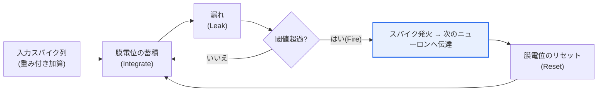
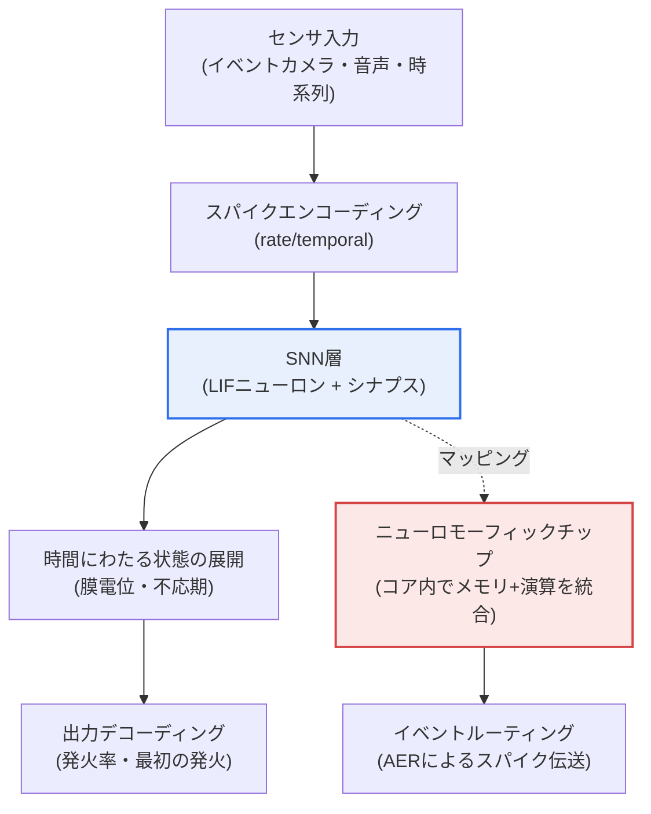

# スパイキングニューラルネットワーク(SNN、Spiking Neural Network)

## 1. 概要

### A. 定義
> **SNN(Spiking Neural Network)** は、生物学的ニューロンが**電気信号(スパイク、Spike)を特定の時点で発火(firing)させて情報を伝達する**方式を模倣した第3世代のニューラルネットワークであり、値の大きさではなく、スパイクが**いつ・どれだけ頻繁に**発生するかという時間情報でデータを表現するイベント駆動型(event-driven)のニューラルネットワークである。

SNNが注目される根本的な理由は、「**脳をより忠実に模倣し、低電力で動作する**」という点にある。従来の人工ニューラルネットワーク(第2世代、ANN/DNN)では、ニューロンが常に連続的な実数値を計算・伝達する。正確ではあるが、入力が0に近いときでも積和演算(MAC)が漏れなく実行されるため、多くの電力を消費する。大規模言語モデルの学習・推論コストがデータセンターの電力問題にまで波及している現在、この「常にオンの計算」構造はスケーリングの根本的な限界として指摘されている。

一方、実際の人間の脳は約860億個のニューロンを持ちながら、20W前後、すなわち白熱電球1個よりも少ない電力で動作する。その秘訣の一つが**スパース性(sparsity)** である。ニューロンは普段は静かにしており、刺激が閾値を超えたときにのみ瞬間的にスパイクを発し、それ以外の時間には事実上計算を行わない。SNNはこの方式を模倣し、**スパイクがあるときにのみ計算する**イベント駆動型で動作する。その結果、入力の大部分が「無発火(no spike)」である状況では、消費電力が劇的に低くなる。

また、スパイクが「いつ」発生したかという時間そのものが情報であるため、時系列・音声・イベントカメラの信号のように時間軸が本質的なデータを自然に扱うことができる。ただし、スパイクは不連続(0か1か)であるため勾配の大部分が0か未定義となり、第2世代のニューラルネットワークを支えてきた微分ベースの学習(誤差逆伝播、Backpropagation)をそのまま使うことが難しいという点が最大の難題である。結局のところSNNは、**ニューロモーフィック(neuromorphic)ハードウェアと組み合わせて超低電力AIを実現する**ことを目指しつつ、その潜在力を実際の精度へと変換する学習手法が成否を分ける技術である。

### B. 登場背景と必要性
第2世代のディープラーニングが画像・言語で人間を上回る性能を示すにつれ、モデルとデータは爆発的に大きくなり、その代償として電力・発熱・コストも急増した。クラウドでは冷却・電力が、エッジ(スマートフォン・ウェアラブル・ドローン・ロボット)ではバッテリーがボトルネックとなる。「より大きなモデル」だけでは対処できないこの局面において、計算パラダイムそのものを変えて**エネルギー効率(演算あたりの消費電力)** を引き上げようとする試みが、SNN・ニューロモーフィック研究の背景である。自動運転・産業IoT・常時オン(always-on)の音声検知のように、**リアルタイム・低遅延・低電力**が同時に求められる応用が増えるにつれ、SNNは学問的な好奇心を超え、実用技術として再び脚光を浴びている。

### C. 世代比較
下表はニューラルネットワークの世代を要約したものであるが、世代区分の核心は「何で情報を表現するか」の変化であるという点を文章で押さえておく必要がある。第1世代のパーセプトロンはステップ関数で0/1のみを出力するため表現力が限られており、第2世代は連続的な活性値と誤差逆伝播によって表現力・学習性を飛躍的に高めたが、その代償として常時計算の負担を抱えることになった。第3世代のSNNは再び離散的なスパイクに戻るものの、今回は「時間」という軸を加えて表現力を確保しようとしている点で、単なる回帰ではなく新たな折衷である。

| 世代 | ニューラルネットワーク | 情報表現 | 学習 | 特徴 |
|---|---|---|---|---|
| **第1世代** | パーセプトロン | 二値出力(ステップ) | 限定的 | 線形分離のみ可能 |
| **第2世代** | ANN/DNN | 連続活性値 | 誤差逆伝播 | 高性能・常時計算・高電力 |
| **第3世代** | **SNN** | **スパイク・時間** | 代理勾配・STDPなど | イベント駆動・低電力・学習の難題 |

## 2. ニューロンモデルと動作原理

SNNニューロンの動作は、「**蓄積し(Integrate)、漏れ(Leak)、発火し(Fire)、戻す(Reset)**」という4段階に要約される。最も広く用いられているのが**LIF(Leaky Integrate-and-Fire)** モデルである。ニューロンは前段のニューロンから入ってきたスパイクにシナプス重みを掛け、膜電位(membrane potential)に加算し続ける(Integrate)。このとき膜電位は時間の経過とともに少しずつ漏れ出して基準値に戻ろうとするが(Leak)、この漏れ項があるからこそ、「ずっと前の入力」と「直前の入力」を区別する時間的フィルタが生まれる。漏れがなければいずれ必ず発火することになり、時間情報が失われてしまう。

膜電位が閾値(threshold)を超えた瞬間、ニューロンはスパイクを1発放ち(Fire)、膜電位を初期値に戻す(Reset)。発火直後にしばらくどの入力にも反応しない不応期(refractory period)を設けることもある。この単純なルールが繰り返されることで、強い入力が集中するほどスパイクは密に、弱ければまばらに発生する。すなわち、**入力の強さが発火の頻度・タイミングとして自然に符号化される**。

情報をスパイクで表現する方式(符号化、coding)は、大きく二つに分けられる。**レートコーディング(rate coding)** は、一定の時間窓内のスパイク数(発火率)で値を表現する。実装が容易でノイズに強いが、十分な数を数えるには時間がかかるため、遅延・電力の面で不利になる。**テンポラルコーディング(temporal coding)** は、「最初のスパイクがどれだけ早く来たか」のように、発火時点そのものに情報を載せる。少数のスパイクで多くの情報を表現できるため高速かつ効率的だが、タイミングのノイズに敏感で学習が難しい。実際のシステムは、二つの方式を問題の特性に合わせて折衷する。LIFより生物学的に精緻なIzhikevich・Hodgkin-Huxleyモデルもあるが、計算量が大きいため、大規模なSNNでは単純なLIF系が主に選ばれる。

## 3. 全体構造とニューロモーフィックアーキテクチャ

SNNシステムは、**入力をスパイクに変換するエンコーディング → SNN層での時間的処理 → 結果を値に戻すデコーディング**という流れを持つ。前段のエンコーディングが重要なのは、世の中のデータの大部分が実数値(ピクセルの輝度、オーディオの振幅)だからである。これをレート/テンポラル方式でスパイク列に変換して初めて、SNNで処理できる。例外的に**イベントカメラ(DVS、Dynamic Vision Sensor)** は、ピクセルの輝度変化が起きた瞬間にのみイベントを出力するため、別途のエンコーディングなしにそれ自体がスパイクストリームとなり、SNNとの相性が良い。

核心は、SNNが**時間にわたって状態が展開される動的システム**であるという点である。第2世代のニューラルネットワークが1回の入力に対して1回の出力を返す静的な関数であるとすれば、SNNは複数のタイムステップの間、膜電位が上下し、スパイクが行き交いながら状態が変化する。そのため、同じニューロン数であっても、再帰型ニューラルネットワーク(RNN)のように時間軸に沿って展開して理解しなければならない。この動特性は時系列処理に強みをもたらすと同時に、学習時に「時間を遡って誤差を伝播」しなければならないという複雑さを生む。

SNNの低電力という利点は、ハードウェアと組み合わさって初めて実現される。フォン・ノイマン型のCPU/GPUは演算器とメモリが分離しているため、データの行き来(メモリの壁、memory wall)に電力の大部分が費やされる。**ニューロモーフィックチップ**はこれとは異なり、**演算とメモリをニューロン・シナプス単位で一か所に統合**し、スパイクが発生したニューロンのみを非同期に活性化させる。スパイクはAER(Address-Event Representation)のような方式で、「どのニューロンがいつ発火したか」というアドレス-イベントとしてのみ伝送されるため、通信量と電力を併せて削減する。要するに、SNNはアルゴリズムであり、ニューロモーフィックはそのアルゴリズムを最も効率的に動かすハードウェアであって、両者は一体として設計されてこそ意味を持つ。[[neuromorphic]]

## 4. 学習方法 — 不連続の壁を越える三つの系統

SNNにおける最大の技術的障壁は学習である。スパイクの発火はステップ関数と同様で、大部分の区間で勾配が0となり、閾値の点では微分不可能である。誤差逆伝播は勾配を掛け合わせながら誤差を伝播させるが、勾配が0であれば学習信号が消失してしまう。これを回避するアプローチが、大きく三つの系統として発展してきた。

**第一に、代理勾配(Surrogate Gradient)** 方式である。順伝播(forward)では本物のステップ関数でスパイクを発生させつつ、逆伝播(backward)でのみステップ関数を滑らかな曲線(例: シグモイドの微分形)で「代わりに」微分する。時間軸に展開してから逆伝播するBPTT(通時的誤差逆伝播)と組み合わせることで、今日ではSNNをディープラーニングフレームワーク上でend-to-endに学習させる事実上の標準となった。精度は最も高いが、学習自体はGPU上で行われるため、学習段階での電力削減効果は大きくないという限界がある。

**第二に、STDP(Spike-Timing-Dependent Plasticity、スパイクタイミング依存可塑性)** である。「前段のニューロンが先に発火し、後段のニューロンがその直後に発火すれば結合を強化し、順序が逆であれば弱化する」という生物学的ルールをそのまま学習に用いる。ラベルなし(教師なし)で局所的な情報のみによって学習が行われるため、ハードウェア上のオンチップ(on-chip)学習に適しているが、大域的な目標(正確な分類)に向けて収束させることが難しく、大規模な問題では性能が劣る。

**第三に、ANN-to-SNN変換**である。まず十分に学習された第2世代のANNを作り、その重みをレートコーディングベースのSNNへと移す。ReLUの活性値を発火率に対応させる方式で、高い精度を容易に得られるという長所がある。ただし精度を維持するには十分な数のタイムステップが必要であるため、推論の遅延と電力が増え、時間情報を積極的に活用できないという根本的なトレードオフがある。実務では、目標(精度なのか、超低電力・超低遅延なのか)に応じて、これら三つの系統を選択または組み合わせる。

## 5. ANNとの比較および適用事例

SNNと第2世代ANNの違いは、単なる性能の優劣ではなく、**「何を最適化するか」の違い**から生じる。ANNは精度と学習の容易さに最適化されているのに対し、SNNはエネルギー効率と時間的な応答性に最適化されている。そのため精度ベンチマークの数値だけを比較するとSNNは概して不利であるが、「ワットあたりの推論回数」や「イベントへの応答遅延」に軸を変えれば話は変わってくる。

| 区分 | 第2世代 ANN/DNN | 第3世代 SNN |
|---|---|---|
| 情報表現 | 連続活性値 | 離散スパイク・タイミング |
| 計算方式 | 常時計算(dense) | イベント駆動(sparse) |
| 電力 | 高い | 非常に低い(ハードウェアと組み合わせた場合) |
| 学習 | 誤差逆伝播(成熟) | 代理勾配・STDP・変換(発展途上) |
| 得意なドメイン | 大規模な認識・生成 | 時系列・イベント・エッジでの低電力 |

具体的な事例として三つを挙げることができる。第一に、インテルのニューロモーフィックチップ**Loihi 2**と研究フレームワークLavaは、キーワード認識・ジェスチャー認識のようなタスクにおいて、従来のGPU/CPUと比べて**演算あたりのエネルギーを数十倍以上低減した**結果を報告してきた(タスク・測定条件によってばらつきが大きいため、絶対値は一般化しない)。第二に、IBMの**TrueNorth**は約100万個のニューロン・2.56億のシナプスを搭載しながら、リアルタイムのパターン認識を数十mWレベルの電力で実行するよう設計されており、ニューロモーフィックの低電力の可能性を初期から象徴的に示したチップである。第三に、**イベントカメラ(DVS)+ SNN**の組み合わせは、毎秒数千~数万のイベントをマイクロ秒単位の遅延で処理し、高速物体追跡・ドローンの回避のように、フレームベースのカメラでは遅延・電力が負担となる応用で実効を上げている。このようにSNNは、「あらゆる問題でANNを置き換える」技術ではなく、**電力・遅延・時間性が決定的なニッチにおいて圧倒的な効率を発揮する**技術として位置付けられつつある。

## 6. 深化 — 最新動向と標準・エコシステム

最近の流れの第一は、**ハードウェアとソフトウェアの共同エコシステムの成熟**である。インテルはLoihi 2とともにオープンソースフレームワークLavaを公開し、PyTorchベースのsnnTorch・SpikingJelly・Norseといったライブラリが代理勾配学習を普及させたことで、研究者が慣れ親しんだディープラーニングツールでSNNを扱えるようになった。これはSNN研究の参入障壁を大きく下げた変化である。

第二に、**大規模ニューロモーフィックシステム**の登場である。インテルはLoihi 2チップを多数結合した大規模研究システム(Hala Point)によってニューロン・シナプスの規模を大きく拡張し、これはSNNが小規模なエッジでの実験を超えて大規模な問題に向かえるかどうかを見極める試金石となっている。第三に、**Transformer・LLMとの融合**の試みである。アテンション構造をスパイクベースで再解釈したSpiking Transformer系の研究が登場し、低電力な大規模モデルの可能性を探っている。ただし、精度・成熟度の面では第2世代と比べてまだ初期段階であるため、具体的な性能数値は発表・条件ごとのばらつきが大きいことを踏まえ、断定的に受け止めないことが望ましい。

第四に、**オンデバイス・常時オンAI**との結合である。スマートウォッチの常時音声検知、補聴器のリアルタイムノイズ抑制、産業用センサの異常検知のように、バッテリーで常時稼働しなければならない応用において、SNN・ニューロモーフィックが有力な代替案として検討されている。[[on-device-ai]]

### 予想される出題方向と答案構成戦略
SNNは、AI・データ領域においてニューロモーフィック・低電力AIとともに、あるいはディープラーニングの世代変化の文脈で出題される可能性がある。答案は次の軸で展開すると深さを確保しやすい。

- **定義・差別化ポイント**: 第2世代ANNと対比し、「スパイク・時間・イベント駆動」という本質をまず明確にする。
- **動作原理**: LIF(Integrate-Leak-Fire-Reset)とレート/テンポラルコーディングを図とともに記述する。
- **中核的な難題**: 不連続性 → 誤差逆伝播の困難 → 代理勾配・STDP・ANN変換の三系統へとつなげる。
- **ハードウェアとの連携**: ニューロモーフィック(Loihi・TrueNorth)・メモリの壁・AERによって低電力の「実現条件」を説明する。
- **適用・展望**: エッジ・イベントカメラ・オンデバイスAIなどの適合ドメインとトレードオフで締めくくる。
- **関連トピック**: ニューロモーフィックコンピューティング、オンデバイスAI、グリーンAIと組み合わせて拡張答案を構成する。

## 7. 考慮事項および示唆(技術士の観点)

1. **アルゴリズムとハードウェアの協調設計が前提である。** SNNの低電力という利点は、GPU上ではむしろ不利になり得る(スパイク処理のオーバーヘッド)。低電力はニューロモーフィックチップ上でのみ実現されるため、導入時にはアルゴリズムとターゲットハードウェアを併せて決める協調設計(co-design)戦略が不可欠である。ハードウェアを定めずにSNNを導入すれば、利点の大部分を失う。

2. **精度-遅延-電力の三者間トレードオフを明示的に管理しなければならない。** タイムステップを増やせば精度は上がるが、遅延・電力もともに上がる。応用の要求(例: 自動運転の応答遅延 vs ウェアラブルのバッテリー)に応じてこの均衡点を異なる形で設定しなければならず、唯一の正解はない。

3. **まず問題への適合性を判断する。** SNNは万能ではない。時間軸が本質的である問題(イベント・時系列)や、電力が極端に制約された問題に強く、静的な大規模画像分類・生成では成熟した第2世代が依然として有利である。「技術の流行」ではなく、**問題の特性との整合性**によって採用の可否を決定すべきである。

4. **成熟度・エコシステムのリスクを考慮した段階的導入が必要である。** 学習手法・ツール・標準がまだ発展途上であるため、人材確保・デバッグ・検証が第2世代よりも難しい。PoC → 特定の低電力エッジ応用 → 拡大という段階的アプローチと、第2世代ANNとのハイブリッド(中核となる低電力経路のみをSNNにする)によってリスクを分散する戦略が現実的である。

5. **展望: 持続可能なAIの一翼。** AIの電力消費が社会的コストとして浮き彫りになる中で、エネルギー効率を根本的に引き上げるSNN・ニューロモーフィックは、「グリーンAI」・エッジインテリジェンスの有力な候補である。短期的にはニッチな低電力応用で、長期的には大規模モデルの効率化の経路として、並行して発展する可能性が高い。

## 参考資料
- Intel Neuromorphic Computing / Loihi 2 · Lava: https://www.intel.com/content/www/us/en/research/neuromorphic-computing.html
- IBM TrueNorth (Science, 2014): https://www.science.org/doi/10.1126/science.1254642
- snnTorch (surrogate gradient tutorial): https://snntorch.readthedocs.io/
- Wikipedia — Spiking neural network: https://en.wikipedia.org/wiki/Spiking_neural_network

---

> **一言まとめ**: SNNは*ニューロンのスパイク発火と発火時点(時間)を模倣した第3世代のイベント駆動型ニューラルネットワーク*であり、スパイクがあるときにのみ計算することで超低電力・低遅延を実現するが、不連続な特性ゆえに誤差逆伝播をそのまま使えないため、代理勾配・STDP・ANN変換といった専用の学習手法とニューロモーフィックハードウェア(Loihi・TrueNorth)との協調設計によって発展しており、時間性と電力が決定的なエッジ・イベント応用でその真価を発揮する。
