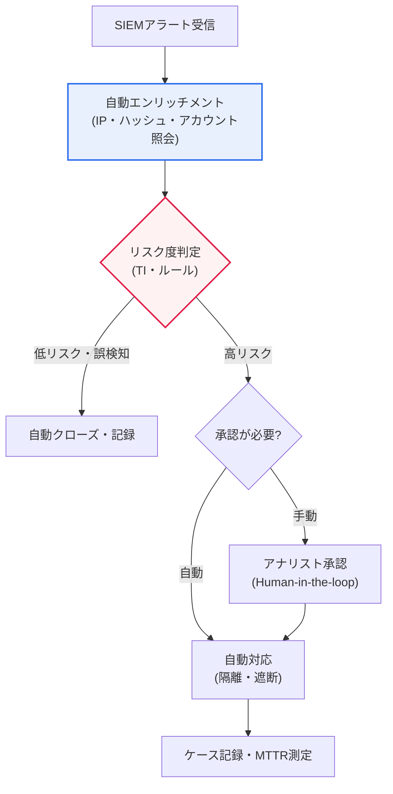

# SOAR(Security Orchestration, Automation and Response)

## 1. 概要

### A. 定義

> **SOAR**とは、セキュリティ脅威の検知から対応までのプロセスを**オーケストレーション(Orchestration)・自動化(Automation)・対応(Response)** として統合し、分散したセキュリティツールと反復業務を一つのワークフローにまとめることで、セキュリティ運用(SecOps)を自動化・効率化する体系である。

SOARの定義を分解すると、三つの軸がそれぞれ異なる問題を狙っていることがわかる。**オーケストレーション**は「ツールが断片化している」という問題を、**自動化**は「反復業務が人を疲弊させる」という問題を、**対応**は「措置が遅い」という問題を解決する。すなわちSOARは単一の製品というより、SOC(セキュリティ監視センター)の運用方式を人中心からワークフロー中心へと再設計する「運用フレームワーク」に近い。この点がSOARを単なる自動化スクリプトの寄せ集めと区別する。

### B. 登場背景

SOARが登場した根本的な背景は、「**セキュリティアラートは急増しているのに、対応する人員が不足している**」という現実である。今日のSOCでは、ファイアウォール・IPS・EDR・SIEMなど多数のセキュリティ機器から1日に数千〜数万件のアラートが押し寄せる。アナリストがこれを一つずつ確認し、複数のコンソールを行き来してIPレピュテーションを照会し、ログを突き合わせ、手動で遮断を設定するという方式では、時間も人員も到底足りない。その結果、本物の脅威がアラートの洪水に埋もれる「**アラート疲れ(Alert Fatigue)**」が発生し、対応が遅延し、熟練アナリストは単純な反復業務に消耗して離職していく。

SOARはこの悪循環を自動化によって断ち切る。分散したセキュリティツールをAPIで連携して一つの画面で扱い(オーケストレーション)、反復的な調査・分類・対応作業をあらかじめ定義した手順(プレイブック)に従って自動実行し(自動化)、脅威を迅速に遮断・隔離・措置する(対応)。そうすればアナリストは単純な照会やコピー&ペーストから解放され、本当に重要な判断や脅威ハンティングに集中でき、対応速度(MTTR)が劇的に向上する。

### C. 必要性

サイバー脅威の量的な急増、セキュリティ人材の構造的不足、そして多数のセキュリティツールの断片化が重なり、SOARは「あれば便利なもの」から「なければ運用が崩壊するもの」へと位置付けが変わった。特にツールが増えるほどアナリストが行き来すべきコンソールが増え、かえって生産性が低下する「**ツールスプロール(Tool Sprawl)**」の問題が深刻化したが、SOARはこれらを一つの上位レイヤーで統合することで、この問題を正面から解消する。

## 2. 構成要素と主要機能

SOARの動作を概観すると、異種ツールを結びつけるオーケストレーションが土台となり、その上でプレイブックによる自動化が動き、最終的に対応措置が実行される3層構造をなす。

| 構成要素 | 内容 |
|---|---|
| **オーケストレーション** | 異種セキュリティツール(SIEM・EDR・ファイアウォール・TI)のAPI連携・統合 |
| **自動化(プレイブック)** | 対応手順をプレイブックとして定義・自動実行 |
| **インシデント対応(IR)** | 脅威の調査・隔離・遮断、ケース(チケット)管理 |
| **脅威インテリジェンス(TI)** | 脅威情報の連携による判断・分類の支援 |
| **ダッシュボード・測定** | 対応状況・指標(MTTR・MTTD)の管理 |

**オーケストレーション**はSOARの土台である。SIEM・EDR・ファイアウォール・チケットシステム・脅威インテリジェンスプラットフォームなど、異なるベンダーのツールをAPI・コネクタで接続し、あるツールの出力を別のツールの入力へ自動的に受け渡す。例えば、SIEMが上げたアラートから悪性IPを抽出し → TIプラットフォームにレピュテーションを問い合わせ → 結果が悪性であればファイアウォールAPIで遮断ルールを設定する、という一連の流れを、人がコンソールを行き来することなく自動的につなぐ。オーケストレーションがなければ、自動化は「各ツールの中に閉じ込められた部分的な自動化」にとどまる。

**自動化(プレイブック)** はSOARの心臓部である。プレイブックとは、「このような種類のアラートが来たら → このように調査し → 条件に応じてこのように分岐し → このように対応せよ」という対応手順をコード・ダイアグラムで定義したワークフローである。標準化が可能な反復作業(IPレピュテーション照会、アカウントロック、ファイルハッシュ検査、隔離など)を、人の介入なしに(あるいは最小限の承認だけで)自動実行する。よく設計されたプレイブック一つで、数十分かかっていた初動調査が数秒に短縮される。

**インシデント対応(IR)とケース管理**は、自動化されていない部分を人が処理できるよう支援する。SOARは関連するアラートを一つの「ケース(事案)」にまとめ、調査履歴・証拠・タイムラインを一か所に蓄積することで、協業と監査(Audit)を可能にする。これは対応の「記録化・標準化」という観点から重要である。

**脅威インテリジェンス連携と測定**は、判断の品質と運用の成熟度を支える。外部の脅威情報を自動照合して誤検知を除外し、MTTD(平均検知時間)・MTTR(平均対応時間)といった指標で運用効率を定量的に管理する。

## 3. プレイブック実行構造(プロセス詳細図)

SOARの実質的な価値は、プレイブックがアラートを受けて自動的に分岐・対応するプロセスにある。以下は典型的なプレイブック実行フローを示した詳細プロセス図である。

プレイブックの最初の段階である**エンリッチメント(Enrichment)** は、アラートにコンテキストを付与するプロセスである。アラートに含まれるIP・ドメイン・ファイルハッシュ・ユーザーアカウントなどの指標(IoC)をTIプラットフォーム・資産DB・ディレクトリに自動照会し、「このIPは悪性として知られているか」「このアカウントはどのような権限を持つか」といった判断材料を集める。この段階が自動化されると、アナリストが手作業で複数のコンソールを探し回っていた時間がなくなる。

**トリアージ(Triage)** 段階では、エンリッチされた情報をルール・TIスコアで総合してリスク度を判定し、分岐させる。低リスク・明白な誤検知は自動クローズするが記録を残して監査証跡を確保し、高リスクは対応段階へ引き渡す。この自動分岐が、アラート疲れの主因である「誤検知の洪水」をふるい落とし、アナリストの認知負荷を軽減する。

**対応(Response)** 段階では、措置の影響範囲に応じて自動/手動を分ける。アカウントの一時ロックや疑わしいファイルの隔離のように元に戻しやすい措置は自動実行するが、ファイアウォール全体の遮断やサーバー隔離のようにサービスへの影響が大きい措置には**Human-in-the-loop**の承認ゲートを設けるのが安全である。最後に、すべての措置はケースに記録されMTTRが測定されて、運用改善のフィードバックループへとつながる。

## 4. SIEMとの関係および比較

SOARを理解する際に最もよくある混同が、SIEMとの境界である。表は要約であり、核心は両者が競合関係ではなく、「検知」と「対応」を分担する**相互補完関係**にあるという点である。

| 区分 | SIEM | SOAR |
|---|---|---|
| **焦点** | ログ収集・相関分析・検知 | 対応の自動化・オーケストレーション |
| **役割** | 脅威検知・アラート生成 | 検知後の調査・分類・対応 |
| **関係** | SOARの入力(アラートを提供) | SIEMアラートを受けて自動対応 |

SIEMは膨大なログを収集・正規化・相関分析し、「何が疑わしいか」を見つけ出す**検知の目**である。しかしSIEM自体は措置能力が弱く、アラートを生成するだけで、その後の調査・対応は人に委ねる。まさにこの「検知後の空白」をSOARが埋める。SIEMが脅威を「検知」すると、SOARがそのアラートを受けてエンリッチメント・分類・対応を「自動化」する。そのため実務では、SIEM(検知)とSOAR(対応)を対にして構成するのが一般的である。

ただし近年はこの境界が曖昧になりつつある。SIEM製品が独自のSOAR機能を取り込み、クラウドベースの統合SecOpsプラットフォームが検知・調査・対応を一つにまとめる方向へと市場が再編されている。さらにEDRを多様なソースへ拡張した**XDR**が登場し、「検知–対応」スタック全体の統合が加速している。こうした統合の流れにおける具体的な製品の勢力図は急速に変化するため、導入時には最新の市場動向で確認することが望ましい。

## 5. 期待効果と導入時の考慮事項

| 区分 | 内容 |
|---|---|
| **期待効果** | 対応時間(MTTR)の短縮、アナリストの業務軽減、一貫した対応、24/365の自動対応 |
| **導入時の考慮** | プレイブック設計の品質、誤検知時の自動対応リスク(承認手順)、ツール連携の標準化、人材の力量 |

期待効果の核心は単なる「速度」ではなく、「**一貫性と拡張性**」である。人はコンディションや熟練度によって対応品質がぶれるが、検証済みのプレイブックは午前3時でも同一の手順で対応する。また、アラート量が増えても人員を線形に増やさずに対応できるため、脅威の増加に対する拡張性を確保できる。実際に初動調査・エンリッチメントを自動化した組織では、1件あたりの処理時間を数十分から数秒レベルに短縮したと報告されており、これはアナリストを反復業務から解放し、脅威ハンティングのような高付加価値活動へ再配置する余地を生む。

一方、導入には落とし穴がある。最大のリスクは「**誤った自動化の増幅効果**」である。誤検知に対して自動対応を設定すると、正常なサービスを遮断して自ら障害を引き起こしかねず、そのミスが自動化の速度で大規模に広がる。そのため影響の大きい措置には承認ゲートを設けなければならない。また、ツールごとのコネクタ・APIが標準化されていなければ連携・保守コストが大きくなり、プレイブックを設計・改善できる人材の力量がなければ、SOARは「高価な抜け殻」になってしまう。

### 参考:代表的な適用シナリオ

SOARの効果は、抽象的な概念よりも具体的なシナリオで明確になる。代表例として「**フィッシングメール報告処理**」プレイブックを見てみよう。ユーザーが疑わしいメールを報告すると、SOARが自動的にメールヘッダーから送信元IP・URL・添付ファイルのハッシュを抽出してTIプラットフォームとサンドボックスに問い合わせ、悪性と判定されればメールゲートウェイで同一メールを全ユーザーのメールボックスから回収(Purge)し、当該URLをプロキシの遮断リストに登録したうえで、報告者に結果を返信する。人が手作業で行えば30分以上かかっていた手順が、自動化すると数十秒に短縮される。

別の例として、「**不審ログイン対応**」プレイブックは、SIEMが「不可能な移動(Impossible Travel)」アラートを上げると、SOARが当該アカウントの最近の活動を自動照会し、リスクが高ければセッションを強制終了してアカウントを一時ロックした後、ユーザーに本人確認を要求する。このようにSOARは「検知–調査–措置–通知」という反復手順を一つのワークフローに圧縮し、組織によっては初動対応1件あたりの処理時間を数十分から数秒レベルに短縮したと報告されている(数値は組織やプレイブックの成熟度によって大きく異なるため、概略的な参考値として理解すべきである)。

## 6. 深掘り:AIとの結合と自律型SOCへの進化

SOARの最新の進化方向は、**AI・生成AIとの結合**である。従来のプレイブックでは人がすべての分岐を事前に定義する必要があったが、大規模言語モデル(LLM)を組み合わせると、自然言語でアラートを要約し、類似する過去事案を検索して対応を推奨し、初動調査レポートを自動作成するレベルまで高度化する。これはプレイブック作成の参入障壁を下げ、定型化が困難だった判断領域にまで自動化の範囲を広げる。

さらに業界は、**自律型SOC(Autonomous SOC)** という概念に向かって動いている。人は例外のみを処理し、大半の反復的な対応はAIエージェントが自律的に遂行するモデルである。ただし、この方向性には明確な歯止めも併せて議論されている。AIが誤った判断で自動対応すればその被害も自動的に拡散するため、「説明可能性(Explainability)」と「人による最終承認(Human oversight)」をいかに維持するかが核心的な課題として残る。関連して、SecOpsプラットフォームの統合(SIEM+SOAR+XDR)とクラウド移行も並行して進んでおり、こうした最新動向の具体的な成熟度・採用率は流動的であるため、断定するよりも方向性として理解するのが適切である。

## 7. 考慮事項および示唆(技術士の観点)

1. **プレイブックの品質が成否を左右する。** 自動化の効果は全面的にプレイブックにかかっているため、正確で検証済みの対応手順を設計し、継続的に改善(運用後のレトロスペクティブに基づく)しなければならない。誤ったプレイブックは対応を助けるどころか、むしろ被害を自動的に拡大させる。

2. **完全自動化と人の介入のバランスが必要である。** 誤検知に対して無条件に自動対応すると正常なサービスを遮断しかねないため、影響の大きい措置は人の承認を経る半自動(Human-in-the-loop)設計が安全である。「何を自動化し、何を人に残すか」の境界設定が戦略の核心である。

3. **ツール連携の標準化と統合戦略が重要である。** SOARの価値は、連携されたツールエコシステムの広さに比例する。コネクタ・APIの標準化、そしてSIEM・XDR・TIとの統合アーキテクチャを併せて設計してこそ、断片化(Tool Sprawl)の問題を実際に解消できる。

4. **AIとの結合により知能化・自律化が進む。** 生成AI・機械学習を組み合わせて脅威分析・プレイブック推奨・自動調査を高度化する方向へ発展し、最終的には自律型SOCを目指す。ただし、説明可能性と人による監督を併せて確保してこそ、自動化のリスクを統制できる。

5. **成果測定と継続的改善の体制が裏付けとなるべきである。** MTTD・MTTR・自動クローズ率・誤検知率といった指標で運用成熟度を定量化し、それを根拠にプレイブックと自動化範囲を反復的に改善するフィードバックループを備えることが、SOARを「導入プロジェクト」ではなく「運用能力」として定着させる鍵である。

## 参考資料

- Gartner, "Security Orchestration, Automation and Response (SOAR)" Glossary — https://www.gartner.com/en/information-technology/glossary/security-orchestration-automation-response-soar
- NIST SP 800-61 Rev.2, "Computer Security Incident Handling Guide" — https://csrc.nist.gov/pubs/sp/800/61/r2/final
- MITRE ATT&CK — https://attack.mitre.org/

---

> **一言まとめ**: SOARは*オーケストレーション・自動化・対応*によって分散したセキュリティツールと反復業務を統合的に自動化する体系であり、**プレイブック**がアラートをエンリッチメント・分類・対応するワークフローを自動実行してMTTR(対応時間)を短縮する。SIEM(検知)と相互補完の関係にあり、成否は**プレイブックの品質と人の介入(Human-in-the-loop)のバランス**にかかっており、最新の流れはAIとの結合による自律型SOCへの進化である。
