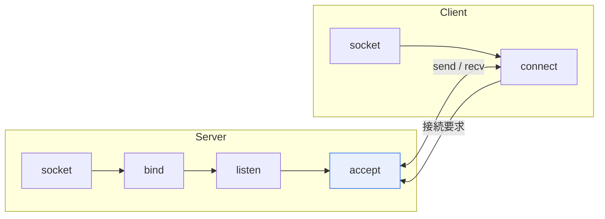

# ソケット(Socket)通信

## 1. 概要

### A. 定義
> **ソケット**は、ネットワーク上でのプロセス間通信のための**両端点(Endpoint)** であり、IPアドレスとポート番号の組み合わせで識別される。ソケット通信とは、このソケットを通じてデータを送受信する方式である。

ソケットを理解する鍵は、「**アプリケーションが複雑なネットワークを扱うための抽象化された窓口**」であるという点である。TCP/IPの内部動作(パケット分割、ルーティング、再送)は非常に複雑であるが、開発者はソケットAPI(socket、connect、send、recv)という標準インタフェースさえ知っていれば、この複雑さを意識せずに通信できる。ソケットは、IPアドレスによって「どのコンピュータか」を、ポート番号によって「そのコンピュータのどのプログラムか」を特定する。例えばWebサーバは通常80番(HTTP)・443番(HTTPS)ポートでソケットを開き、クライアントからの接続を待つ。IP:ポート = 「建物の住所:部屋番号」にたとえることができる。

### B. 必要性
異なる機器上のプログラムが通信するには、相手を特定し、データを安定的にやり取りするための標準的な方法が必要である。ソケットはオペレーティングシステムが提供するこの標準通信メカニズムであり、Web・メッセンジャー・ゲームなど、ほぼすべてのネットワークアプリケーションの基盤となっている。

## 2. 通信方式の概念図および種類

TCPソケット通信において、サーバはsocketの生成 → bind(アドレスの結合) → listen(待機) → accept(接続の受け入れ)の順でクライアントを待ち、クライアントはsocketの生成 → connectによって接続を要求する。接続が確立されると、双方がsend/recvでデータをやり取りする。ソケットは、使用するプロトコルによって二つの種類に分けられる。**ストリームソケット(TCP)** は接続を確立し、データの順序・信頼性を保証する。**データグラムソケット(UDP)** は接続なしで高速に送信するが、順序・到達を保証しない。

| 種類 | プロトコル | 特徴 |
|---|---|---|
| **ストリームソケット** | TCP | コネクション指向、信頼性・順序を保証 |
| **データグラムソケット** | UDP | コネクションレス、高速だが非信頼(映像・ゲーム) |

## 3. TCPソケットとWebSocketの流れ

TCPソケットがトランスポート層を直接扱う低レベルの通信であるとすれば、**WebSocket** はWeb環境のための上位層の技術である。WebSocketは最初に通常のHTTPリクエストとして開始した後、`Upgrade`ヘッダによってプロトコルを切り替え(ハンドシェイク)、以降は一つの持続的な接続でサーバとクライアントが自由に(full-duplex)メッセージをやり取りする。これにより、サーバがクライアントに先にデータを送る「サーバプッシュ」が可能となり、チャット・リアルタイム通知・株価情報のようなリアルタイムWebサービスを実現できる。

| 区分 | TCPソケット | WebSocket |
|---|---|---|
| **層** | トランスポート層(TCP)を直接 | アプリケーション層(HTTP上でアップグレード) |
| **接続** | socket→connect→3-way handshake | HTTPハンドシェイク後にUpgrade |
| **通信** | 双方向ストリーム | 双方向full-duplex(リアルタイム) |
| **用途** | 一般的なネットワークアプリ | Webのリアルタイム(チャット・通知) |

## 4. ソケット通信とHTTP通信の比較

ソケット通信とHTTPは、接続の維持方式が根本的に異なる。HTTPはリクエスト-レスポンスの後に接続を切断する**ステートレス(Stateless)** 方式であるため、サーバから先に話しかけることができず、リアルタイム性が必要な場合はクライアントが繰り返しリクエストするポーリングに依存することになり、非効率である。ソケット通信(特にWebSocket)は接続を維持するため、双方向・リアルタイムの通信が可能である。

| 区分 | ソケット通信 | HTTP通信 |
|---|---|---|
| **接続** | 持続的接続(状態を維持) | リクエスト-レスポンス後に終了(ステートレス) |
| **方向** | 双方向(サーバプッシュ可能) | 単方向(クライアントが開始) |
| **リアルタイム性** | 高い | 低い(ポーリングが必要) |
| **用途** | リアルタイム・双方向 | Web文書・REST API |

## 5. 考慮事項および示唆

1. **要求特性に合った選択**が重要である。単純なリクエスト-レスポンスにはHTTP/RESTがシンプルであり、リアルタイムの双方向通信にはWebSocketが適しており、サーバからの単方向プッシュのみが必要であればSSE(Server-Sent Events)が経済的である。
2. **大規模なリアルタイムサービスでは接続管理が鍵**となる。多数の持続的接続を維持するには、サーバリソース・拡張(メッセージブローカー、スケールアウト)の設計が必要である。
3. 信頼性 vs 速度のトレードオフにおいて、映像・ゲームは遅延に敏感であるためUDPを、ファイル・取引は正確性が重要であるためTCPを選ぶなど、データの特性がプロトコルの選択を左右する。

---

> **一言まとめ**: ソケットはIP・ポートで識別される通信の両端点であり、TCP(信頼性)・UDP(速度)のソケットとリアルタイム双方向のWebSocketがあり、持続的・双方向であるソケット通信は、リクエスト-レスポンス型・ステートレスのHTTPと対比され、リアルタイムサービスに適している。
