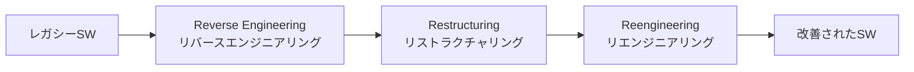
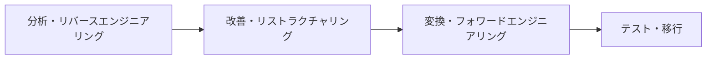

# ソフトウェア保守の3R(Reverse Engineering・Restructuring・Reengineering)

## 1. 概要

### A. 定義
> 老朽化・複雑化したソフトウェアの**保守性を高め、コストを削減する**ために、既存システムを分析(リバースエンジニアリング)・改善(リストラクチャリング)・再構築(リエンジニアリング)する三つの代表的な技法を総称する概念(3R)。

3Rは互いに独立した技法ではなく、**分析 → 改善 → 再構築**へと続く連続線上にある。リバースエンジニアリングが「何がどのように作られたかを理解する」段階であるとすれば、リストラクチャリングは「理解したものを同じ機能の範囲内でより良く整理する」段階であり、リエンジニアリングはこの二つを含んで「新たに作り出す」段階である。すなわち、リエンジニアリングが最も包括的であり、リバースエンジニアリング・リストラクチャリングを部分工程として内包する。

### B. 登場背景および必要性
長く運用されてきたレガシー(legacy)システムでは、担当者が替わり文書が失われるにつれて**構造を知る人がいなくなり**、頻繁な修正が積み重なってコードの複雑度と**技術的負債(technical debt)** が雪だるま式に膨らむ。この状態では小さな変更でも予測不能な副作用を引き起こし、保守コストが急増する。かといって全面的な新規開発で作り直せば、蓄積された業務ルール(ドメイン知識)が失われ、リスク・コストも大きい。3Rは**既存資産を最大限に再活用しながら**リスクとコストを下げる折衷案であり、今日ではクラウド移行・MSA移行といった**レガシーモダナイゼーション(Modernization)** の中核的な手段となっている。

## 2. 3Rの構成

三つの技法は、**抽象化レベルの移動方向**で区別すると明確になる。リバースエンジニアリングは、実装(コード)から設計・仕様という上位の概念へと遡る**上向き(bottom-up)** の活動である。リストラクチャリングは抽象化レベルを変えずに、**同じ階層の中で**表現のみを改善する(例: スパゲッティコードのモジュール化)。リエンジニアリングは、リバースエンジニアリングで上位の仕様を復元した後、改善を経て再びフォワードエンジニアリングで実装へと降りてくる、**上向き→下向きの往復**の活動である。

- **リバースエンジニアリング(Reverse Engineering)**: ソースコード・実行ファイル・成果物から設計・仕様を抽出・復元する。文書のないレガシーの構造を把握する出発点であり、機能はそのままにして「理解」のみを目的とする。
- **リストラクチャリング(Restructuring)**: 外部から見た機能・動作はそのまま維持しつつ、内部のコード・構造を改善する。可読性を高め、モジュール化を進め、複雑度を下げることで、以後の変更を容易にする。
- **リエンジニアリング(Reengineering)**: リバースエンジニアリング + 改善 + フォワードエンジニアリングを組み合わせてシステムを再構築する。単なる整理を超えて、機能・品質・プラットフォームまで向上させることができる。

| 技法 | 目的 | 機能の変化 | 抽象化の方向 |
|---|---|---|---|
| **リバースエンジニアリング** | 設計・仕様の抽出(理解) | なし | 上向き(コード→設計) |
| **リストラクチャリング** | 構造・可読性の改善 | なし | 同一レベル |
| **リエンジニアリング** | 再構築・品質向上 | あり得る | 上向き→下向き |

## 3. 関連概念

3Rを正確に用いるには、隣接する概念との関係を区別しなければならない。特にリストラクチャリングとリファクタリング、リエンジニアリングとマイグレーションがしばしば混同される。

| 概念 | 説明 | 3Rとの関係 |
|---|---|---|
| **Forward Engineering(フォワードエンジニアリング)** | 仕様→設計→実装という順方向の開発 | リエンジニアリングの最終工程 |
| **Migration(移植)** | プラットフォーム・言語・DBを別の環境に移す | リエンジニアリングの一形態・一部 |
| **Refactoring(リファクタリング)** | 外部の動作を維持しつつ内部構造を改善 | リストラクチャリングをコード単位で実践 |

リファクタリングはリストラクチャリングの概念をソースコードレベルで小さな単位として繰り返し適用する実践技法であり、マイグレーションはリエンジニアリングの過程で対象環境を変える特殊なケースとみなすことができる。

## 4. リエンジニアリングのプロセス

リエンジニアリングでは、まず**分析・リバースエンジニアリング**によって既存システムの構造と業務ルールを復元し、**改善・リストラクチャリング**によって設計上の欠陥と重複を除去し、**変換・フォワードエンジニアリング**によって新しいプラットフォーム・構造に合わせて再実装した後、**テスト・移行**によって既存機能が保持されているかを検証して運用に反映する。この過程で最も重要な統制ポイントは最後のテスト段階であり、再構築後も元の機能が同一に動作することを**回帰テスト(regression test)** で必ず確認しなければならない。

## 5. 考慮事項および示唆
技術士の観点から見ると、3Rの成否は「何を、なぜ、どこまで手を入れるか」の判断にかかっている。第一に、すべてのレガシーをリエンジニアリングすることはできないため、**保守コスト・ビジネス上の重要度・技術的負債の水準**を基準に対象の優先順位を付けなければならない。第二に、再構築の過程で既存機能が損なわれないよう、**回帰テストと並行運用**による機能の保持が不可欠である。第三に、3Rはオンプレミスのレガシーを**クラウド・MSAへ移行**するモダナイゼーション戦略(リファクタ・リアーキテクト)の中核的な手段であり、最近では**AIベースのコード分析・自動変換ツール**によって、リバースエンジニアリングと変換工程の効率が大きく高まっている。ただし、自動化の結果も人による検証を経てこそ品質を担保できる。

---

> **一言まとめ**: 3Rは*リバースエンジニアリング(設計の抽出)・リストラクチャリング(構造の改善)・リエンジニアリング(再構築)*へと続くレガシー改善技法であり、抽象化の方向と機能変化の有無によって区別され、対象の優先順位付けと回帰テストに基づく機能の保持を前提として、クラウド・MSAモダナイゼーションの中核的な手段となる。
