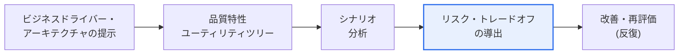
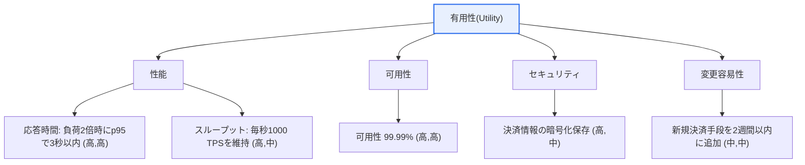

# ソフトウェアアーキテクチャ分析とATAM

## 1. 概要

### A. ソフトウェアアーキテクチャ分析の定義と登場背景

> **ソフトウェアアーキテクチャ分析(Software Architecture Analysis)**は、システムの**構造(アーキテクチャ)が要求される品質特性(性能・セキュリティ・可用性・変更容易性など)を満たしているかを実装前に評価し、リスク・トレードオフ・改善点を導き出す活動**である。代表的な評価手法が、SEI(カーネギーメロン大学ソフトウェア工学研究所)が確立した**ATAM(Architecture Trade-off Analysis Method)**である。

アーキテクチャ分析が必要とされる根本的な理由は、「**アーキテクチャの欠陥は後になって修正するほど最も高くつく**」という点にある。アーキテクチャはシステムの骨格であり、一度決まればその後のすべての詳細設計・実装がその上に積み上げられる。そのため、アーキテクチャ段階での誤った決定(例: 拡張性を考慮しない単一のモノリシック構造、同期呼び出しだけで結ばれたサービス間の結合)は、開発が進むほど是正が難しくなり、完成後には全面的な再設計という莫大なコストを招く。ソフトウェア欠陥の修正コストが開発段階の後半になるほど指数関数的に増大することは古くから観測されてきた経験則であり、要求・設計段階で捕捉できた問題を運用段階で捕捉すると数十倍のコストがかかるという報告が繰り返し示されてきた。アーキテクチャの欠陥は、この曲線の最も左側、すなわち最も安価に修正できる時点で捕捉すべき対象である。

また、アーキテクチャは複数の品質特性が互いに**衝突する地点**でもある。性能を高めるためにキャッシュ・非正規化を導入すればデータの一貫性とセキュリティ検証のコストが悪化し、柔軟性を高めるために抽象化レイヤーを増やせば性能と理解のしやすさが低下する、といった**トレードオフ(trade-off)**が随所に潜んでいる。この衝突はコード1行で表面化するものではなく、構造全体の相互作用の中で発現するため、個々のコンポーネントをいくら上手に作っても、構造が誤っていればシステムの品質は崩れてしまう。ソフトウェアアーキテクチャ分析は、まさにこうした構造的な決定を**実装前に**評価する。ステークホルダーが求める品質特性を明確にし、アーキテクチャがそれを満たしているか、どのようなトレードオフとリスクが隠れているかを体系的に検討する。それによって高価な後工程での手戻りを防ぎ、勘ではなく**根拠のあるアーキテクチャ上の決定**を下せるようにする。

アーキテクチャ分析が本格的に方法論化された背景には、1990年代後半の大規模システムの失敗経験がある。機能はすべて実装したものの、性能・拡張性・保守性といった非機能要求(品質特性)を満たせずに廃棄されるシステムが増えるにつれ、「何を作るか(機能)」と同様に「どのような品質で作るか(構造)」を事前に検証すべきだという問題意識が高まった。ATAM・SAAM・CBAMといったシナリオベースの評価手法群は、この時期に登場した。

### B. 順方向分析と逆方向分析

アーキテクチャ分析は、「どの方向から構造を扱うか」によって順方向と逆方向に分けられる。順方向分析は、まだコードがない(または確定していない)状態で要求・設計からアーキテクチャを導出・評価する方式であり、新規システムの設計段階で用いられる。逆方向分析は、すでに稼働しているが文書がない、または老朽化したレガシーシステムから実際のアーキテクチャを抽出・復元し、改善点を探る方式である。

| 区分 | 時点・対象 | 目的 | 代表的な手法・成果物 |
|---|---|---|---|
| **順方向分析(Forward)** | 設計段階、要求・設計成果物 | アーキテクチャが品質要求を反映しているかを評価 | ATAM・SAAM、ユーティリティツリー |
| **逆方向分析(Reverse)** | 運用中のレガシー、ソースコード・バイナリ | 実際の構造の復元・技術的負債の把握 | アーキテクチャ復元ツール、依存関係分析 |

順方向は新たに作るシステムのアーキテクチャが要求を適切に反映しているかを見ることに焦点があり、逆方向は既存のシステムから実際に実装されたアーキテクチャを引き出し、設計意図との乖離(アーキテクチャの侵食、architectural erosion)を見つけることに焦点がある。実務ではこの二つが循環する。レガシーを逆方向に分析して現在の構造を把握し、その上で目標アーキテクチャを順方向に再設計した後、再びマイグレーションの結果を逆方向に検証する、といった具合である。例えばモノリシックをマイクロサービスへ移行するプロジェクトでは、まず逆方向分析でドメイン間の実際の依存関係を描き出し、その境界を根拠にサービス分割(順方向)を設計する。

## 2. ATAM(Architecture Trade-off Analysis Method)

> **ATAM**は、複数の**品質特性間のトレードオフを分析**し、アーキテクチャが品質要求をどの程度満たしているか、どのようなリスクがあるかを**ステークホルダーとともに**評価するシナリオベースの手法である。特定の一つの品質ではなく、**複数の品質の相互影響**を併せて見るという点が核心である。

ATAMは大きく「準備→評価→総合」の流れで進められ、ビジネスドライバーを確認し、アーキテクチャの提示を受けた後、品質要求をユーティリティツリーとして構造化し、具体的なシナリオでアーキテクチャを試験してリスクとトレードオフを導き出す。以下は、その全体の流れを示した概念図である。

### A. ユーティリティツリー — 品質要求の構造化

ATAMの出発点は、漠然とした「性能が良くなければならない」を**計測可能な品質シナリオ**に置き換えることである。そのために、品質特性を根とし、下位の関心事へと枝を伸ばす**ユーティリティツリー(Utility Tree)**を作成する。例えば根となる「有用性」の下に「性能・可用性・セキュリティ・変更容易性」の枝を置き、「性能」の下にさらに「応答時間・スループット」の葉を置き、各葉に優先順位(重要度、難易度)を付けた具体的なシナリオを吊り下げる。以下は、その詳細な構造を示した概念図である。

各葉には、具体的な**品質特性シナリオ**を吊り下げる。シナリオは刺激(stimulus)・環境・応答・応答の測定で構成され、例えば「**ピーク時間帯の同時ユーザ数が普段の2倍に増えても(刺激・環境)、照会の応答を95パーセンタイル基準で3秒以内に維持する(応答・測定)**」のように記述する。こうすることで、「速い」という主観的な要求が検証可能な目標となる。次に、各シナリオについて**(ビジネス上の重要度、アーキテクチャ上の達成難易度)**をそれぞれ高/中/低で評価し、優先順位を付ける。両方が「高」であるシナリオ、すなわちビジネスにとって重要でありながら構造的に達成が難しいものが、集中分析の対象となる。この優先順位付けがなければ評価が散漫になり、時間の限られたワークショップで肝心の重要なシナリオを見落とすことになる。

### B. シナリオ分析と四つの成果物

優先順位の高いシナリオを選び、そのシナリオを満たすためにアーキテクチャが採用した**アーキテクチャアプローチ(パターン・戦術)**を一つずつレビューする。「可用性99.99%のためにアクティブ-スタンバイの冗長化を採用した」、「拡張性のためにロードバランサーの背後にステートレスサーバを配置した」のように決定と根拠を明らかにし、その決定が他の品質に及ぼす波及効果を検討する。この分析から、次の四つが成果物として導き出される。

| 成果物 | 定義 | 例 |
|---|---|---|
| **感度ポイント(Sensitivity Point)** | 特定の品質に大きな影響を与えるアーキテクチャ上の決定(パラメータ) | スレッドプールのサイズがスループットを左右 |
| **トレードオフポイント(Trade-off Point)** | 二つ以上の品質に相反する影響を与える決定 | 暗号化強度↑ → セキュリティ↑・性能↓ |
| **リスク(Risk)** | 品質目標の達成を脅かす決定・未決事項 | 単一DBによる拡張性のボトルネック懸念 |
| **非リスク(Non-risk)** | 根拠に基づき安全と判断された決定 | ステートレス設計により水平拡張が容易 |

ここで**感度ポイント**とは「この値を変えると品質が大きく変わる」というてこの支点であり、そのてこが**複数の品質に同時に、互いに逆方向へ**作用すると**トレードオフポイント**となる。トレードオフポイントはすなわち意思決定が必要な中核地点であるため、ATAMが最も注目する成果物である。例えばデータの冗長化レベルを上げると可用性は上がるが、書き込み遅延とコストも上がる — この地点では、「可用性何%のために、遅延何msとコストを受け入れるのか」をステークホルダーが明示的に合意しなければならない。リスクと非リスクは、その後リスクを**リスクテーマ(risk theme)**としてまとめてビジネスドライバーと結び付け、補完課題へと転換する。

### C. ATAMの進行段階と2回のステークホルダー参加

ATAMは通常、二つの局面(phase)に分けられる。第1フェーズはアーキテクト・主要な意思決定者を中心とした小規模なセッションで、ATAMの手法を紹介し、ビジネスドライバーとアーキテクチャを発表した後、アーキテクチャアプローチを識別し、ユーティリティツリーを作成して、優先順位の高いシナリオを一次分析する。第2フェーズではより広いステークホルダーグループが加わり、**ブレインストーミングによって新たなシナリオを発掘・投票**してユーティリティツリーを補強した後、拡張されたシナリオでアーキテクチャを再分析し、結果(リスクテーマ・トレードオフ)を総合的に発表する。

このようにステークホルダーの参加を2回に分けることには、実務上の理由がある。第1フェーズでアーキテクトがあらかじめユーティリティツリーの骨格を作っておけば、第2フェーズで多数のステークホルダーが参加した際に議論が脱線せず、構造化された枠組みの上で速やかに収束する。逆に第2フェーズでは、現場・運用・セキュリティなど多様な観点が加わることで、アーキテクトが見落としたシナリオ(例: 「障害時、夜間の無人運用中に自動復旧が可能か」)を引き出し、少数の視野にとらわれた評価の死角を埋める。すなわち、「構造化」と「多様性」を時間の順序で配置することで、その両方を得ようとする設計である。

各シナリオの分析では、**アーキテクチャアプローチ → 品質特性に関する質問 → 感度ポイント・トレードオフ・リスクの識別**というミクロな手順が繰り返される。例えば「ステートレスサーバ + ロードバランサー」というアプローチに対して、「セッション状態はどこに置くのか、サーバを増設した際に線形な拡張が保証されるのか」を問い、その答えから「セッションストアが拡張性の感度ポイントである」こと、さらに「セッションストアを中央集約すると拡張性↑・単一障害点(SPOF)のリスク↑」というトレードオフを引き出す。このミクロな手順がシナリオごとに積み重なり、最終的なリスクテーマへと総合される。

## 3. 他の評価手法との関係および比較

ATAMは複数の品質特性を総合的に評価する代表的な手法であるが、唯一の方法ではない。初期のシナリオベース手法である**SAAM(Software Architecture Analysis Method)**は、主に**修正容易性**をシナリオで評価する単純な形態であり、ATAMはこれに**複数の品質間のトレードオフ**分析を加えて拡張したものである。**CBAM(Cost-Benefit Analysis Method)**は、ATAMが導き出したアーキテクチャ戦略に**コスト・便益(経済性)**という軸を加え、「この改善にかかるコストに対して期待効用はどれだけか」を根拠に投資の優先順位を決められるよう支援する。

| 手法 | 焦点 | 特徴・限界 |
|---|---|---|
| **SAAM** | 修正容易性中心のシナリオ | 最初のシナリオベース手法、品質間の相互作用の扱いは弱い |
| **ATAM** | 複数品質特性のトレードオフ | ステークホルダーワークショップ、リスク・感度ポイント・トレードオフの導出 |
| **CBAM** | コスト-便益に基づく経済的評価 | ATAMの成果物を投資の意思決定へと結び付ける |

この三つの違いは、単なる機能の羅列ではなく、**評価が答えようとする問い**が異なることから生じる。SAAMは「この構造は変更しやすいか」を、ATAMは「複数の品質要求を同時に満たしながら何を譲歩すべきか」を、CBAMは「その譲歩と改善にお金をかける価値があるか」を問う。実務では、ATAMでトレードオフとリスクを明らかにした後、CBAMで改善案の経済性を評価するというように、**連携**させて用いることが多い。例えばある決済システムにおいて、ATAMが「同期的な決済承認経路が性能・可用性のトレードオフポイントである」という結論を出したのであれば、CBAMは「非同期・キューベースに変更するのにかかる開発・運用コストに対する、障害時の損失回避の効用」を計算し、投資の可否を判断する。

## 4. 深化 — アジャイル・DevOps時代の軽量アーキテクチャ評価と実務適用

従来のATAMは、数十名のステークホルダーが2日間にわたって行う重いワークショップを前提としていた。しかし反復開発・継続的デプロイが日常化した今日では、アーキテクチャはスプリントごとに進化するため、毎回大規模なワークショップを開くことはできない。そこで、ATAMの中核的なアイデア(シナリオ・トレードオフ・リスクの導出)を**軽量化**して反復適用する流れが定着した。

第一に、**品質特性ワークショップ(QAW)やミニATAM**をスプリントの境界に配置し、新たに追加されたシナリオだけを迅速に評価する。第二に、アーキテクチャ上の決定を**ADR(Architecture Decision Record)**として残し、各決定の文脈・代替案・トレードオフ・結果を文書化する。ADRは「この決定がどの品質のために、何を譲歩して下されたのか」を記録するものであるため、ATAMのトレードオフ分析と自然につながる。第三に、**適応度関数(fitness function)**によって品質シナリオを自動検証する。進化的アーキテクチャ(evolutionary architecture)では、「結合度が閾値を超えない」、「p95応答が300ms以内である」といった品質目標をテスト・モニタリングで常時計測し、アーキテクチャが目標から外れるとパイプラインがそれを通知する。これは、人によるワークショップだけで行っていた品質評価をCI/CDに組み込み、常時化したものとみなすことができる。

実務事例として、大規模なマイクロサービスを運用する組織は、サービスごとに品質シナリオ(可用性SLO、レイテンシ予算)を定義し、これをオブザーバビリティツールで常時計測しながら、SLO違反が頻発するサービスに対してのみ集中的なアーキテクチャレビューを開くという方式で、ATAMの精神を受け継いでいる。また、公共・金融のように安全性が重要なドメインでは、依然として正式なATAMワークショップによって大規模システムの構築前にアーキテクチャのリスクを公式に評価し、監理の根拠としている。すなわち、ドメインのリスク水準に応じて「正式なATAM」と「軽量・自動化された評価」を選択・併用することが、現在の実務標準に近い。

## 5. 考慮事項および示唆(技術士の観点)

1. **ステークホルダーの参加が成否を左右する。** ATAMはアーキテクトだけの作業ではなく、ビジネス・運用・セキュリティ・ユーザなど多様なステークホルダーがともに品質要求と優先順位を合意する場である。参加が不十分であればユーティリティツリーの優先順位が歪み、肝心のトレードオフを見落とす。したがって、ワークショップの設計段階で**主要ステークホルダーの識別と事前準備(ビジネスドライバーの整理)**に力を注がなければならない。

2. **トレードオフの明示的な管理が中核的な価値である。** すべての品質を同時に最高にすることはできない。どの品質を優先し何を譲歩するかを**根拠とともに文書化(ADR)**し、意思決定の透明性と追跡性を確保しなければならない。このように記録されたトレードオフは、その後の人員交代・再設計の際に「なぜこのように作ったのか」を説明する組織の資産となる。

3. **早期・反復的な適用によって手戻りコストを最小化する。** アーキテクチャ上の決定の初期に評価するほど、欠陥の修正コストは低くなる。アジャイル環境では、進化するアーキテクチャを軽量かつ反復的に評価(ミニATAM・適応度関数)し、アーキテクチャの侵食と技術的負債が閾値を超える前に常時是正する体制を整えなければならない。

4. **定量的な計測と自動化によって評価を常時化する。** 品質シナリオをSLO・適応度関数として定義し、オブザーバビリティ・CIに結び付ければ、人の判断だけに依存していた評価をデータに基づいて常時実施できる。これは評価の客観性・再現性を高め、違反発生時の迅速な介入を可能にする。

5. **評価結果の実行への連携が重要である。** ATAMがリスク・トレードオフを導き出しても、それがバックログ・改善課題に転換されて実際に修正されなければ、文書として残るだけである。導き出されたリスクテーマを**改善ロードマップと予算(CBAMとの連携)**に結び付けて実行力を確保してこそ、アーキテクチャ分析が組織の品質向上へとつながる。

## 参考資料
- SEI Carnegie Mellon, "Architecture Tradeoff Analysis Method (ATAM)": https://www.sei.cmu.edu/library/architecture-tradeoff-analysis-method-collection/
- SEI, "Evaluating Software Architectures: Methods and Case Studies" 概要: https://insights.sei.cmu.edu/library/
- Neal Ford et al., Evolutionary Architecture / fitness functionsの概念: https://www.thoughtworks.com/insights/articles/fitness-function-driven-development
- ADR(Architecture Decision Records)概要: https://adr.github.io/

---

> **一言まとめ**: ソフトウェアアーキテクチャ分析は*構造が品質特性の要求を満たしているかを実装前に評価する*活動であり、ATAMはユーティリティツリーで品質シナリオを構造化し、シナリオ分析によって感度ポイント・トレードオフ・リスク・非リスクを導き出して高価な後工程での手戻りを防ぐものであり、ステークホルダーの参加・トレードオフの明示的な管理・早期の反復適用が成否を左右する。
