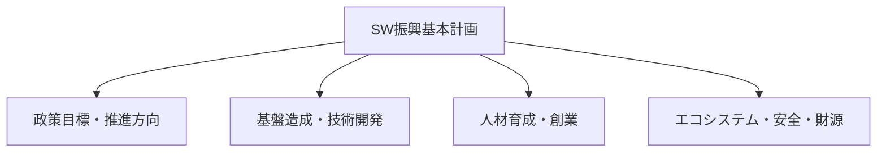

# ソフトウェア振興法(施行 2023.10.19)

## 1. 概要

### A. 定義・目的
> ソフトウェア産業の**基盤造成・振興とSW安全・エコシステムの育成**のための法的根拠を整えた韓国の法律であり、旧ソフトウェア産業振興法を全部改正(2020)し、産業振興中心から**価値・安全・エコシステム中心**へとパラダイムを転換した。

ソフトウェア振興法の目的は、単なる産業育成を超えて、SWが社会のあらゆる領域の基盤となった**SW中心社会**において、SWの価値が正当に認められ、安全に活用される環境を作ることにある。かつての産業振興法が「産業の量的成長」に焦点を当てていたとすれば、改正法は**公正な契約・正当な対価・SW安全・人材・エコシステム**という質的な基盤を法律で明確に定めたという点で、その性格が異なる。

### B. 登場背景および必要性
公共SW事業において、契約後に業務範囲が際限なく拡大(追加業務)する一方で対価は据え置かれ、開発会社が経営難に陥るという慣行が長く続いてきた。また、自動運転車・医療機器・スマートファクトリーのように、SWの欠陥がそのまま人命・財産の被害につながる領域が急増したことで、SWを「納品物」ではなく**安全が保証されるべき社会インフラ**として扱う必要性が高まった。こうした背景から、改正法は対価算定・業務変更の公正性の確保とともに、**SW安全(SW Safety)** という概念を初めて法制化した。

## 2. 第5条 — ソフトウェア振興基本計画の記載事項

基本計画は、政府が3年ごとに策定するSW振興の**最上位ロードマップ**であり、個々の施策がばらばらにならず一貫した方向に整合するようにするための仕組みである。基本計画に盛り込まれる事項は、大きく**方向設定 → 基盤構築 → 人材育成 → エコシステム・安全の確保**という流れで理解できる。まず政策目標と推進方向によって全体像を定め、これを支える技術開発・標準化などの産業基盤を造成する。その上で、SWを実際に作る専門人材を育成し、創業・企業の成長を支援し、最後にSWの利用・融合を促進する健全なエコシステムとSW安全、そしてこれらすべてを実行するための財源調達計画を盛り込む。この構造によって、基本計画は宣言にとどまらず、実行・財政へと結び付けられる。

| 区分 | 記載事項(例) |
|---|---|
| **政策の方向** | SW振興政策の目標・推進方向 |
| **基盤・技術** | 技術開発・標準化、産業基盤の造成 |
| **人材・創業** | 専門人材の育成、創業・企業成長の支援 |
| **エコシステム** | SWの融合・利用促進、流通・公正な環境の造成 |
| **安全・財源** | SW安全の確保、財源調達・投資計画 |

## 3. 第30条 — SW安全確保指針の記載事項

SW安全は情報セキュリティ(機密性・完全性)とは区別される概念であり、**SWの誤作動・欠陥が人の生命・身体・財産に及ぼす被害を防止する**ことを目標とする。例えば自動運転制御SWの判断ミスや医療機器SWの誤作動は、ハッキングがなくてもそれ自体が致命的であるため、セキュリティとは別の安全の観点からの管理が必要である。第30条は、政府がこうしたSW安全確保指針を整備するよう定め、その指針が**安全基準 → リスク管理 → 検証 → 事故対応**という安全工学の手順を備えることを求めている。すなわち、何が安全かの基準を定め(基準)、どのようなリスクがあるかを識別・評価し(リスク管理)、実際に安全であるかを試験・点検し(検証)、それでも事故が起きた場合には予防・復旧する体制(対応)を設けるということである。

| 区分 | 記載事項 |
|---|---|
| **安全基準・方法** | SW安全確保の基準・手順・方法 |
| **リスク分析・管理** | 安全リスクの識別・評価・対応(軽減) |
| **点検・試験** | 安全性の点検・試験・検証方法 |
| **事故対応** | 事故の予防・対応・復旧体制 |

> SW安全: SWの欠陥・誤作動による**人の生命・身体・財産の被害防止**のための安全確保活動であり、情報セキュリティとは区別される。

## 4. 主要制度(参考)

法の振興・安全の目標は、いくつかの具体的な制度によって実現される。**公正契約**は、業務変更時に適正な対価を再算定し、下請代金を保護することで開発会社の経営悪化を防ぎ、**SW影響評価**は、公共が自らSWを開発する際に民間市場を侵害しないかを事前に検討し、民間エコシステムを保護する。**SW安全制度**は、前述の確保指針・診断を通じて、実際の現場で安全が管理されるよう支える。これらはそれぞれ、「開発会社の保護–民間市場の保護–社会の安全」という異なる利害をバランスよく扱っている。

| 制度 | 内容 | 保護対象 |
|---|---|---|
| **公正契約** | 業務変更時の適正な対価、下請代金の保護 | 開発会社・労働者 |
| **SW影響評価** | 公共SW事業が民間市場に与える影響の事前評価 | 民間SW市場 |
| **SW安全** | 安全確保指針・安全診断 | 利用者・社会 |

## 5. 考慮事項および示唆(技術士の観点)
- **SW安全の重要性の増大**: 自動運転・医療・スマートファクトリーなど組込み・CPSの領域が拡大するほど、SW安全は選択ではなく必須となり、機能安全(ISO 26262など)と連携した設計が求められる。
- **正当な対価の確保**: SW事業の対価算定ガイドと連動し、業務審議委員会の運営によって業務変更の公正性を担保することが、実効性の鍵となる。
- **エコシステムの観点**: オープンソース・商用SWの利用促進と公正な流通環境の造成によって産業の裾野を広げ、制度が規制ではなくエコシステム成長の触媒となるよう運用しなければならない。
- **法・制度の実行力**: 基本計画が宣言にとどまらないためには、財源・成果指標と結び付けて定期的に履行状況を点検するガバナンスが必要である。

---

> **一言まとめ**: ソフトウェア振興法は*SW産業の振興・安全・エコシステムの法的根拠*であり、第5条の基本計画に政策方向・基盤・人材・エコシステム・安全・財源を、第30条のSW安全指針に安全基準・リスク管理・検証・事故対応を盛り込むよう定めることで、公正契約・影響評価とともにSW中心社会の質的な基盤を築く。
