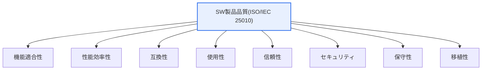
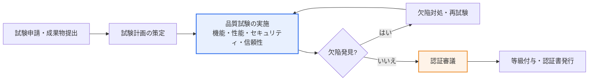

# ソフトウェア品質認証(GS認証)

## 1. 概要

### A. 定義
> **ソフトウェア品質認証**とは、ソフトウェア製品の品質を**公認された国際・国家標準(ISO/IEC 25000 系列など)に基づき第三者試験機関が試験・評価し、一定水準以上であることを公式に認証**する制度である。韓国の代表的な制度が **GS(Good Software)認証**であり、「ソフトウェア振興法」に基づいて公認試験機関(TTA など)が試験し認証する。

品質認証が必要とされる根本的な理由は、「**ソフトウェアの品質は目に見えないため、客観的な信頼の根拠が別途必要である**」という点にある。ハードウェアは手で触れ、仕様書と照合して性能を確認できるが、ソフトウェアの品質――機能が要求どおり正確に動作するか、負荷がかかっても耐えられるか、セキュリティ脆弱性がないか――は外からは見えない。購入者はソースコードを受け取っても、それが正しく動作するか、安全であるかを判別することが難しい。この**情報の非対称性(information asymmetry)**は市場の失敗につながる。品質を立証する手段がなければ購入者は価格の安さだけで選ぶようになり、品質に投資した良い製品がかえって淘汰される「レモン市場」問題が生じる。

品質認証は、この情報の非対称性を解消する**シグナリング(signaling)装置**である。利害関係のない第三者試験機関が国際標準の品質モデルに従って製品を客観的に試験し、合格すれば認証マークを付与する。これにより購入者は認証を信頼の根拠として安心して導入でき、開発企業は品質を客観的に立証して競争力を得る。特に韓国の GS 認証は**公共調達における随意契約の根拠・優先購買の対象**となるため、実質的な市場参入効果が大きい。すなわち品質認証は市場の信頼基盤であると同時に、開発企業が品質に投資するよう促すインセンティブ構造でもある。

### B. 登場背景と必要性
品質認証制度が発展した背景には三つの流れがある。第一に、**ソフトウェアの社会的影響力の拡大**である。金融・医療・交通・国防など、失敗がそのまま人命・財産の被害につながる領域にまでソフトウェアが浸透するにつれ、「作った者の主張」ではなく「独立した検証」を求める声が高まった。第二に、**品質評価の国際標準化**である。ISO/IEC 9126 を継承した 25000 シリーズ(SQuaRE)が品質を測る共通の言語と尺度を提供したことで、国や企業を越えて通用する認証が可能になった。第三に、**公共部門の呼び水政策**である。韓国では GS 認証を公共調達の優遇と連動させ、中小ソフトウェア企業が品質に投資する実質的な動機を提供した。

### C. 根拠となる標準
品質評価の基準は国際標準 **ISO/IEC 25000(SQuaRE, Systems and software Quality Requirements and Evaluation)**系列である。このうち品質モデルを定義する **ISO/IEC 25010** が 8 つの品質特性を、評価プロセスを定義する **ISO/IEC 25040** が試験手順を規定しており、GS 認証の試験はこれらを韓国の実情に合わせて適用した試験基準に従って実施される。

## 2. 品質モデル — ISO/IEC 25010 の 8 大品質特性

### A. 品質特性の全体構造

ISO/IEC 25010 は製品品質を上記 8 つの上位特性に分け、各特性をさらに副特性(sub-characteristic)に細分化する。たとえば機能適合性は機能完全性・機能正確性・機能適切性に、信頼性は成熟性・可用性・障害許容性・回復性に、セキュリティは機密性・インテグリティ・否認防止性・責任追跡性・真正性に分解される。このように階層化するのは、「品質が良い」という漠然とした判断を**測定可能な指標に還元**するためである。試験機関は副特性ごとに試験項目と合格基準を定義し、それを満たして初めて当該特性を満足したとみなす。

ここで注意すべきは、品質特性の間に**トレードオフ(trade-off)**が存在することである。セキュリティを高めるために暗号化や認証の段階を強化すれば性能効率性や使用性が低下しうるし、移植性を高めるために抽象化層を設ければ性能が犠牲になりうる。したがって品質認証は「すべての特性を最大化する」ことではなく、製品の用途に応じてどの特性を優先するかを要求段階で定め、その基準の達成を検証する活動である。

### B. 品質試験のプロセスアーキテクチャ

この図は、GS 認証が一回限りの検査ではなく、**欠陥対処を繰り返す改善ループ**であることを示している。核心は中央の「品質試験の実施」と「欠陥対処・再試験」が形成する循環である。試験で欠陥が見つかれば開発企業が修正して再び試験を受け、欠陥が基準以下に減るまでこの過程を繰り返す。すなわち認証の実質的な価値は「合格の判子」そのものよりも、この反復過程で製品品質が実際に向上するという点にある。右側の認証審議段階では、試験結果の妥当性と再現性を審議委員会が検討して等級を確定する。

品質特性ごとの試験は、それぞれ異なる技法を用いる。機能適合性は要求ベースのブラックボックステストで、性能効率性は負荷・ストレステストで応答時間とスループットを測定し、セキュリティは既知の脆弱性点検とアクセス制御試験で、使用性はシナリオベースのユーザ試験で評価する。このように特性ごとに検証方法が異なるため、品質認証試験は多様なテスト能力を総合的に要求する。

### C. 品質特性別の詳細
次の表は 8 大特性を要約したものであり、その意味と試験上の含意は前述の各段落で述べた内容を補足するものである。

| 品質特性 | 内容 | 代表的な試験方法 |
|---|---|---|
| **機能適合性** | 要求機能の完全性・正確性・適切性 | 要求ベースのブラックボックステスト |
| **性能効率性** | 資源に対する応答・処理・容量の性能 | 負荷・ストレステスト |
| **互換性** | 他システムとの共存・相互運用 | 相互運用試験 |
| **使用性** | 習得・運用・アクセスの容易性 | ユーザシナリオ試験 |
| **信頼性** | 成熟性・可用性・障害許容性・回復性 | 長期稼働・障害注入試験 |
| **セキュリティ** | 機密性・インテグリティ・真正性・責任追跡性 | 脆弱性点検・アクセス制御試験 |
| **保守性** | モジュール性・再利用性・解析性・修正容易性 | 静的解析・コード品質測定 |
| **移植性** | 他環境への適応性・設置性・置換性 | 複数環境での設置・移植試験 |

## 3. GS 認証の等級と実務手順

GS 認証は試験結果に応じて **1 等級と 2 等級**を付与する。一般に 1 等級は国際標準の基準を満たし、実運用に適した完成度を備えた製品に、2 等級は基本要件は満たすものの完成度・適用範囲の面で相対的に低い水準の製品に付与される(具体的な付与基準・名称は制度改正により変わりうるため、最新の試験機関の公告を確認する必要がある)。認証を受けた製品は有効期間中、公共調達で優遇され、機能が大きく変更された場合は変更試験を通じて認証を維持する。

手順の観点で重要な実務ポイントは、**成果物準備の完結性**である。試験申請時には製品の実行ファイルだけでなく、要求仕様書、設計書、ユーザマニュアル、テストケースなどの開発成果物を併せて提出しなければならず、これらの成果物が不十分だと試験自体が遅延する。したがって認証を目指すのであれば、開発初期から成果物を体系的に管理すべきである。

| 手順 | 内容 | 実務上の留意点 |
|---|---|---|
| **試験申請** | 製品・開発成果物の提出 | 成果物の整合性・完結性の確保 |
| **試験計画・実施** | 標準基準に基づく特性別試験 | 試験環境の再現性確保 |
| **欠陥対処** | 発見された欠陥の修正・再試験の反復 | 欠陥原因の根本対処、回帰防止 |
| **認証審議・発行** | 審議後の等級付与・認証書発行 | 有効期間・変更試験の管理 |

## 4. 類似認証との比較

品質認証は GS 認証だけではなく、目的に応じて複数の類型が共存している。これらを区別すれば、どの認証がどの状況で必要かを判断できる。

| 区分 | 対象 | 中核的な観点 | 例 |
|---|---|---|---|
| **製品品質認証** | 完成した SW 製品 | 製品が基準を満たしているか | GS認証(ISO/IEC 25000) |
| **プロセス成熟度** | 開発組織・プロセス | うまく作る能力があるか | CMMI, ISO/IEC 15504(SPICE) |
| **情報セキュリティ認証** | セキュリティ管理体系 | セキュリティを体系的に管理しているか | ISMS-P, ISO/IEC 27001 |

核心的な違いは**「何を保証するか」**にある。GS 認証のような製品認証は「この製品は現時点で基準を満たしている」という結果を保証し、CMMI のようなプロセス認証は「この組織は品質の良い製品を繰り返し作る能力がある」という過程を保証する。実務上の含意も異なる。発注者が特定の納品製品の品質を確認したい場合は製品認証を、長期的な委託開発パートナーの信頼度を見たい場合はプロセス認証を要求する、といった具合である。成熟した発注組織はこの二つを組み合わせ、プロセス成熟度でパートナーを選び、製品認証で成果物を検証する。

具体例として、韓国の公共情報化事業では、商用 SW の導入時に GS 認証製品を優遇し、大規模 SI 事業の参加資格では組織のプロセス能力(品質マネジメント・セキュリティ認証)を要求するという二元的なアプローチが一般的である。これは「製品の品質」と「組織の能力」を異なるレンズで検証しようとするものである。

## 5. 深化 — 品質認証の拡張動向

従来の品質認証は完成した製品を事後に試験する方式であったが、ソフトウェアの開発・流通方式の変化に伴い、認証の対象と方法も進化している。

第一に、**セキュリティ・安全の品質特性への組み込み強化**である。ソフトウェアが社会基盤となるにつれ、セキュリティと SW 安全が機能と同等に重要な品質要素として浮上した。特にオープンソースの活用が一般化したことで、構成要素の出所と脆弱性を追跡する **SBOM(Software Bill of Materials)**、開発段階で脆弱性を遮断する**セキュアコーディング**が品質検証の中核項目として取り込まれつつある。米国の大統領令や EU のサイバーレジリエンス法(CRA)などの規制が SBOM を義務化する流れは、今後品質認証がサプライチェーンセキュリティまで包含するようになることを示唆している。[[software-safety-analysis]]

第二に、**開発方式の変化への対応**である。アジャイル・DevOps によってリリース周期が数週間から数日に短縮されたことで、「ある時点の製品」を試験する従来の認証と「絶えず変化する製品」という現実との間にギャップが生じた。そこで継続的インテグレーション/デリバリーのパイプラインに品質ゲートを組み込み、自動化された品質測定を常時実施し、その結果を認証と連携させようとする議論が続いている。静的解析・自動テストのカバレッジ・脆弱性スキャンをパイプラインに内蔵することが代表例である。

第三に、**AI・データ駆動型 SW への拡張**である。学習データによって振る舞いが変わる AI ソフトウェアは、従来の機能試験だけでは品質を保証することが難しい。そこで ISO/IEC 25000 系列を補完し、AI の信頼性・公平性・説明可能性を扱う標準(例:ISO/IEC TR 24028 などの AI 信頼性系列)が整備されつつあり、AI マネジメントシステム標準(ISO/IEC 42001)と連携した品質・ガバナンス認証が新たな軸として浮上している。[[iso-42001-ai-management-system]]

## 6. 考慮事項および示唆

技術士の観点では、品質認証は「合格か否か」ではなく、「品質を組織にいかに内在化するか」という観点からアプローチすべきである。

1. **品質の開発初期への内在化(Shift-left)。** 認証は最終確認にすぎず、合格するためには要求工学・設計・実装・テストの全過程で品質特性を考慮しなければならない。欠陥を開発後半や認証直前にまとめて修正すると、対処コストが指数関数的に増大する(要求段階での欠陥対処コストを 1 とすると、運用段階では数十〜数百倍になるとされる)。品質は検査によって得るものではなく、作り込むものである。
2. **公共市場参入の戦略的レバレッジ。** 韓国において GS 認証は公共調達での優遇・随意契約の根拠となり、中小 SW 企業にとっては市場参入の実質的な鍵である。したがって認証は技術活動であると同時に事業戦略でもあり、ターゲット市場(公共/民間)と調達要件を考慮して、認証取得の時期と目標等級を事業計画に反映すべきである。
3. **品質・セキュリティ・安全の統合的観点。** 品質認証が SBOM・セキュアコーディング・SW 安全へと拡張される以上、機能品質とセキュリティ・安全を別個の活動ではなく、一つの品質体系として統合的に設計しなければならない。セキュリティを後付けするとコストが大きく、効果も低い。
4. **トレードオフの明示的管理。** 品質特性は互いに相反するため(セキュリティ↔性能・使用性、移植性↔性能)、製品の用途に応じて優先順位を定め、その根拠を文書化すべきである。「すべての特性で最高等級」を目標とすることは資源の浪費であり、失敗への近道である。
5. **認証の持続性確保。** アジャイル・DevOps 環境では、一度の認証はすぐに陳腐化する。CI/CD パイプラインに品質ゲート(静的解析・カバレッジ・脆弱性スキャン)を内蔵して品質を常時測定し、変更時の再認証・変更試験を管理する継続的な品質体系を備えてこそ、認証の価値が維持される。

## 参考資料
- ISO/IEC 25010:2011(製品品質モデル)、ISO/IEC 25040(評価プロセス) — SQuaRE シリーズ
- TTA ソフトウェア試験認証研究所 GS 認証案内: https://www.tta.or.kr/
- 「ソフトウェア振興法」 — 品質認証・公共調達優遇の根拠
- ISO/IEC 42001:2023 — AI マネジメントシステム標準

---

> **一言まとめ**: ソフトウェア品質認証(GS認証)は、*ISO/IEC 25000 基準で製品品質を第三者が試験・認証* することで情報の非対称性を解消し、公共調達優遇の根拠を提供する制度であり、品質を開発の全過程に内在化し、セキュリティ・SBOM・AI 信頼性までを包含する継続的な品質体系へと拡張することが鍵である。
