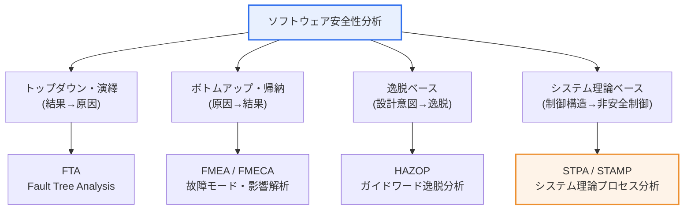
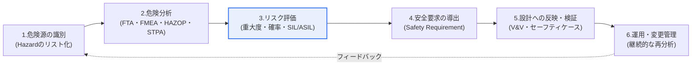

# ソフトウェア安全性分析(Software Safety Analysis)

## 1. 概要

### A. 定義および必要性
> ソフトウェア安全性分析とは、**ソフトウェアに内在する潜在的な危険(Hazard)を開発ライフサイクル全体にわたって事前に識別・分析・除去し、事故(Accident)を予防する**体系的な工学活動であり、自動運転・医療機器・航空・鉄道・原子力など、誤りがそのまま人命・財産の被害につながる安全重要(Safety-Critical)システムにおいて必須とされる。

ソフトウェア安全性分析が独立した工学分野として確立された根本的な背景は、ソフトウェアがもはや画面上の情報処理を超えて、**物理世界を直接制御**するようになったことにある。かつてソフトウェアの欠陥は画面の不具合やデータ破損にとどまっていたが、今日では自動車の制動制御、人工呼吸器の酸素供給、航空機のフライ・バイ・ワイヤ(Fly-by-wire)ソフトウェアの欠陥が、そのまま事故と人命被害に直結する。実際に、1985~1987年の放射線治療装置Therac-25のソフトウェアにおける競合状態(Race Condition)の欠陥は、患者に通常量の数百倍に達する放射線を照射し、少なくとも3名が死亡した代表的な事例であり、物理世界を制御するソフトウェアの危険性を象徴する事件として記憶されている。

こうした危険は、先に欠陥を作り込んだ後にテストで見つけ出すという事後的(Reactive)なアプローチだけでは十分に統制できない。安全重要システムで要求される信頼度は、通常、1時間あたりの危険事象発生確率が10⁻⁷~10⁻⁹の水準(IEC 61508のSIL 3~4に相当)であり、これは有限のテストだけでは統計的に立証することすら不可能な領域である。したがって、設計初期から「何が誤り得るか(What can go wrong)」を体系的に予測・除去する予防的(Proactive)な分析を必ず併行しなければならない。

分析手法は、論理展開の方向によって大きく二系統に分かれる。懸念される結果(事故)から出発してその原因をさかのぼって追跡する**トップダウン(演繹、Deductive)**手法と、個々の構成要素の故障原因から出発してそれがどのような結果をもたらすかを検討していく**ボトムアップ(帰納、Inductive)**手法である。これに、正常な設計意図からの逸脱を探索するガイドワードベースの手法と、近年のシステム理論ベースの手法が加わる。

### B. 安全性(Safety)とセキュリティ(Security)の融合
伝統的に、安全性分析はランダム・偶発的な故障(Random Failure)を、セキュリティ分析は悪意ある攻撃(Malicious Attack)を扱う別個の領域であった。しかし、自動運転車・スマート医療機器・産業IoTのように物理制御とネットワーク接続が結合するにつれ、誤動作(Safety)とハッキング(Security)が結びついて一つの事故を引き起こす状況が増えている。例えば、遠隔からブレーキECUを操作する攻撃は明らかにセキュリティ事案であるが、その結果は人身事故、すなわち安全の問題である。そのため、SAE J3061、ISO/SAE 21434などの最新標準は安全性分析とセキュリティ脅威分析(TARA)を統合的に実施することを推奨しており、「Safety of the Intended Functionality(SOTIF, ISO 21448)」のように、誤動作ではなく機能的な限界に起因する危険まで扱う概念も広がっている。

## 2. 安全性分析手法の概観

ソフトウェア安全性分析の手法は、上図のようにアプローチの論理によって、トップダウン・ボトムアップ・逸脱ベース・システム理論ベースに系統化される。これら四つの系統は競合関係ではなく、**異なる角度から危険を照らし出す相互補完的なツール**として理解すべきである。ある手法が見逃す危険を別の手法が捉えるからである。以下では、各手法の原理と手順、適用の文脈を順に説明する。

### A. FTA(Fault Tree Analysis、故障の木解析)
> FTAとは、懸念される一つの頂上事象(Top Event、最上位の事故)から出発し、その原因を**論理ゲート(AND・OR・抑制ゲートなど)でトップダウンに展開**しながら根本原因まで追跡する演繹的な分析手法である。

FTAの思考の流れは、「この事故が起こるためには、その下でどのような下位事象が、どのような論理的組み合わせで結合しなければならないか」を問うことにある。最上位の事故を根として、その原因を枝のように下方へ広げ、各中間事象をさらに下位の原因へと分解する。ANDゲートは下位事象がすべて同時に発生して初めて上位事象が起こること(冗長設計・多重防御の効果)を、ORゲートは一つでも発生すれば上位事象が起こること(単一故障点の脆弱性)を表す。

FTAの最大の強みは、複数の原因が複合的に絡み合って事故を引き起こす経路を視覚的に明確に示す点である。特に、各基本事象(Basic Event)に発生確率を付与すれば、ブール代数を用いて最小カットセット(Minimal Cut Set)を求め、最上位事故の発生確率を定量的に算出できる。例えば、航空機の制御システムにおける「三重化された飛行制御コンピュータがすべて故障」という事故は三つのコンピュータ故障のAND結合であるため、個々の故障確率が10⁻³であれば理論上10⁻⁹の水準まで下がる、といった定量的な根拠を示すことができる。

ただし、FTAは分析対象を一つの特定の事故(Top Event)に限定するため、分析者が想定できなかった種類の事故はそもそも木に現れないという限界がある。また、ソフトウェアのように状態・タイミング・相互作用が複雑な対象では「確率」の意味が曖昧になるため、定量分析よりも定性的な原因構造の把握に用いられることが多い。

### B. FMEA / FMECA(故障モード・影響解析)
> FMEAとは、システムを構成する各要素の**故障モード(Failure Mode)を漏れなく列挙し、その影響(Effect)と原因を評価**するボトムアップ・帰納的な分析手法であり、重大度・発生度・検出度を掛け合わせた**リスク優先数(RPN, Risk Priority Number)**によって対応の順序を定める。

FMEAはFTAとは正反対の方向からアプローチする。事故ではなく**部品・モジュール・機能単位の故障**から出発し、「この要素がこのように故障すると、システム全体にどのような影響が波及するか」を表形式で一つひとつ点検する。各故障モードについて、重大度(Severity, 1~10)、発生度(Occurrence, 1~10)、検出度(Detection, 1~10)を評価し、この三つを掛け合わせてRPN(最大1000)を算出する。RPNの高い故障から、設計改善・検出強化などの対応リソースを優先的に投入する。

FMEAに危険度(Criticality)評価を強化した拡張がFMECA(Failure Mode, Effects and Criticality Analysis)であり、自動車産業では、AIAG-VDAが2019年に発表した改訂版においてRPNの代わりに**処置優先度(AP, Action Priority)**を導入し、数値の積だけで判断していた慣行の限界を補った。これは、RPNが同じ値であっても、重大度の高い故障の方が検出度の悪い故障よりも危険であるという実務上の洞察を反映したものである。

FMEAの強みは、要素ごとに漏れなく洗い出す網羅性と予防重視の姿勢にあるが、各故障を独立に扱うため、**複数の要素の同時発生・相互作用によって生じる複合故障**を捉えにくいという限界がある。この点こそが、FTA(複合原因の追跡)やSTPA(相互作用の分析)との相互補完が必要な理由である。

### C. HAZOP(Hazard and Operability Analysis、危険性および運転性の分析)
> HAZOPとは、設計意図(Design Intent)に**ガイドワード(No・More・Less・Reverse・Part of・As well asなど)を当てはめ**、正常からの逸脱(Deviation)とそれに起因する危険・運用上の問題を体系的に導出する定性分析手法である。

HAZOPは元々1960年代の英国の化学プロセス産業(ICI)に始まったが、その後ソフトウェア・システム運用の危険分析へと拡張された。核心は、「正常な設計意図」を明示した上で、各パラメータ(流量・圧力・データ・タイミングなど)にガイドワードを組み合わせ、「流量がなければ(No Flow)」「データが多く来すぎたら(More)」「信号が逆だったら(Reverse)」といった逸脱シナリオを強制的に生成することにある。こうすることで、分析者の想像力だけに頼らず、漏れなく危険を発掘する。

HAZOPの特徴は、安全性(Safety)だけでなく**運転性(Operability)**まで併せて点検する点、そしてプロセス・計装・制御・運転など多分野の専門家が参加する構造化されたワークショップ形式で進められる点である。この協働的な性格のおかげで、個人では見落としがちな組織・運用面の危険まで明らかになる。ただし、会議体中心であるため時間・コストが大きく、大規模システムでは組み合わせ爆発によって分析量が膨大になるという短所がある。

## 3. 手法の比較

手法間の違いは、単に「方向が異なる」ことにとどまらず、**どのような種類の危険をうまく捉え、何を見逃すか**という実務上の含意につながる。FTAは特定の事故の原因構造と確率をよく扱うが想定外の事故に弱く、FMEAは要素ごとの網羅性に優れるが相互作用による故障に弱く、HAZOPは運用上の逸脱の発掘に強いがコストが大きい。したがって、システムの性格と開発段階に合わせて組み合わせる必要がある。

| 区分 | FTA | FMEA / FMECA | HAZOP | STPA |
|---|---|---|---|---|
| **方向** | トップダウン(演繹) | ボトムアップ(帰納) | 逸脱分析 | システム理論(トップダウン) |
| **出発点** | 事故(Top Event) | 構成要素の故障 | 設計意図 | 制御構造 |
| **中核ツール** | 論理ゲート・確率・カットセット | RPN / AP優先度 | ガイドワード | 非安全制御動作(UCA) |
| **強み** | 事故経路・定量的確率 | 要素別の予防・網羅性 | 運用逸脱・協働による発掘 | 相互作用・SW/人的要因 |
| **限界** | 想定外の事故の漏れ | 複合・相互作用故障に弱い | 時間・コストが過大 | 定量的リスク評価が不十分 |
| **適した対象** | HW信頼度・多重化 | 部品・機能単位のシステム | プロセス・運用システム | ソフトウェア集約型システム |

注目すべき点は、伝統的なFTA・FMEAが「構成要素の故障」を事故の原因とみなすのに対し、後述するSTPAは「**どの要素も故障していないが、相互作用が安全でない場合**」まで扱うということである。ソフトウェアには摩耗・破損のような物理的故障がなく、大部分の事故は要求仕様の誤りや構成要素間の誤った相互作用に起因するため、ソフトウェア集約型システムであるほど、システム理論ベースの手法の重要性が高まる。

## 4. 分析手順と標準との連携

安全性分析は一回限りの活動ではなく、上図のように**危険源の識別 → 分析 → 評価 → 安全要求の導出 → 設計への反映・検証 → 運用・変更管理**という循環プロセスとして実施される。特に第3段階のリスク評価は、機能安全規格の完全性レベルと直接結びついている。

産業全般の基本規格である**IEC 61508**は、リスク低減の要求水準をSIL(Safety Integrity Level)1~4として定義しており、レベルが高いほど要求される開発の厳格さと検証の水準が強化される。自動車分野の派生規格である**ISO 26262**は、ハザード分析・リスクアセスメント(HARA)を通じて、重大度(S)・暴露頻度(E)・制御可能性(C)の三要素を組み合わせてASIL(A~D、非安全機能はQM)を決定する点で、一つのリスク確率だけでSILを定めるIEC 61508とは決定方式が異なる。例えば、制動装置の喪失のように重大度・暴露・制御不能性がすべて高い機能は最高レベルのASIL Dに分類され、形式検証・MC/DCカバレッジなど最も厳格な開発・検証が要求される。

このほか、航空(DO-178C)、医療機器(IEC 62304)、鉄道(EN 50128/50657)など、ドメインごとの規格がそれぞれ安全性分析とそれに相応する開発プロセスを要求している。このように、分析手法は規格が求める完全性レベルを根拠をもって裏付ける手段であるため、開発初期から規格と統合して計画しなければならない。

特に完全性レベルは単なるラベルではなく、その後の開発全工程の強度を左右する「調節つまみ」として機能する。レベルが上がるほど、要求される検証活動—静的解析、カバレッジ基準、独立検証チーム(Independent V&V)、形式手法の適用範囲—が段階的に強化され、これらすべての根拠が一つの**セーフティケース(Safety Case)**としてまとめられ、認証機関を納得させる論証体系となる。したがって、安全性分析の成果物はそれ自体で完結するものではなく、要求・設計・実装・試験の各成果物と双方向トレーサビリティ(Bidirectional Traceability)で結びつけられて初めて、その価値が認められる。

## 5. 深掘り — システム理論ベースの分析(STPA/STAMP)と最新動向

伝統的な手法(FTA・FMEA)は、「故障の連鎖(Chain of Events)」という事故モデルに基づいている。しかし、現代のソフトウェア集約型システムで発生する事故の相当数は、どの部品も故障していないにもかかわらず、**構成要素間の相互作用や要求仕様そのものの欠陥**に起因する。この洞察から出発したのが、MITのNancy Leveson教授が提唱した**STAMP(System-Theoretic Accident Model and Processes)**という事故モデルと、それに基づく分析手法である**STPA(System-Theoretic Process Analysis)**である。

STPAは、システムを「コントローラ(Controller)–制御動作(Control Action)–被制御プロセス–フィードバック」から成る**階層的な制御構造(Control Structure)**としてモデル化し、この構造で発生し得る**非安全制御動作(UCA, Unsafe Control Action)**を導出する。UCAは、(1)必要な制御を行わない、(2)非安全な制御を行う、(3)誤ったタイミング・順序で制御する、(4)長すぎる/短すぎる時間持続させる、の四つの類型に体系化される。その後、各UCAが発生する原因シナリオ(Loss Scenario)を分析し、安全要求を導出する。

STPAの強みは、ソフトウェアのロジックエラー、要求仕様の不完全性、人的要因(Human Factor)まで一つの枠組みで扱える点である。自動運転・航空・国防分野で採用が急速に増えており、安全とセキュリティを併せて扱う拡張であるSTPA-Secや、事故の事後分析用のCAST(Causal Analysis based on STAMP)も併用されている。ただし、STPAは大部分の国際安全規格が要求する定量的リスク評価(確率の算出)を単独では提供しないため、実務ではSTPAでシナリオを発掘し、FMEA・FTAで定量評価を補完する**ハイブリッドアプローチ**が推奨される。想定される出題の方向としては、「FTA/FMEAとSTPAの事故モデルの違い」「自動運転・SOTIFと安全分析の連携」「Safety-Securityの統合分析」などが有力である。

## 6. 考慮事項および示唆点

1. **手法を相互補完的に併用せよ。** 単一の手法には必ず死角がある。FTAで特定の事故の経路と確率を、FMEAで要素ごとの故障を、HAZOPで運用上の逸脱を、STPAで相互作用・要求仕様の欠陥を分析すれば、異なる角度から危険を包括的に発掘できる。技術士の観点では、「何をいつどのような組み合わせで用いるか」をシステムの性格(HW中心 vs SW集約型)に合わせて設計することが中核的な能力である。

2. **開発初期に適用してコストを最小化せよ。** 欠陥の修正コストは、要求・設計段階から運用段階へと進むほど指数関数的に増加する(通常1:10:100の法則)。危険は設計段階で発見・除去するほど少ないコストで大きな効果を上げるため、安全性分析をV字モデルの左側(要求・設計)から統合するShift-Left戦略が求められる。

3. **機能安全規格と整合的に連携せよ。** ISO 26262(自動車)・IEC 61508(汎用)・IEC 62304(医療)・DO-178C(航空)などは、各完全性レベル(ASIL・SIL)に相応する分析手法と検証水準を要求する。分析結果は最終的に**セーフティケース(Safety Case)**として構造化され、認証・監査に活用されるため、トレーサビリティ(Traceability)を備えた文書化をトレードオフとして併せて管理しなければならない。

4. **安全(Safety)とセキュリティ(Security)を統合的に扱え。** コネクテッド・自律システムでは、ハッキングがそのまま安全事故につながる。ISO/SAE 21434(自動車サイバーセキュリティ)、ISO 21448(SOTIF)と連携し、脅威分析(TARA)と安全性分析を統合して実施する方向へと進化している。

5. **分析を継続的な活動として運用せよ。** システムは変更・更新され、危険もそれとともに変化する。OTA(無線アップデート)・AIベースの機能の導入のように配布後に動作が変わる時代には、変更管理(Change Management)と連動した継続的な再分析(Continuous Safety Assurance)の体制が必要である。

## 参考資料
- itemis, "Functional Safety: ISO 26262, IEC 61508, ASIL, Safety Case" — https://www.itemis.com/en/compliance-intelligence/functional-safety/
- Wikipedia, "Automotive Safety Integrity Level(ASIL)" — https://en.wikipedia.org/wiki/Automotive_safety_integrity_level
- UL Solutions, "Understanding STAMP, STPA, and CAST: Safety Engineering" — https://www.ul.com/sis/blog/introduction-to-stamp-stpa-and-cast
- Software Quality Journal, "Comparison of the FMEA and STPA safety analysis methods" — https://dl.acm.org/doi/10.1007/s11219-017-9396-0

---

> **一言まとめ**: ソフトウェア安全性分析は、安全重要システムの危険を設計初期から事前に予防するものであり、*FTA(トップダウンの事故経路・確率)・FMEA(ボトムアップの要素故障・RPN)・HAZOP(ガイドワードによる逸脱)・STPA(システム理論・相互作用)* を相互補完的に併用し、ISO 26262・IEC 61508などの機能安全規格およびセキュリティ(TARA)と統合してセーフティケースとして立証する。
