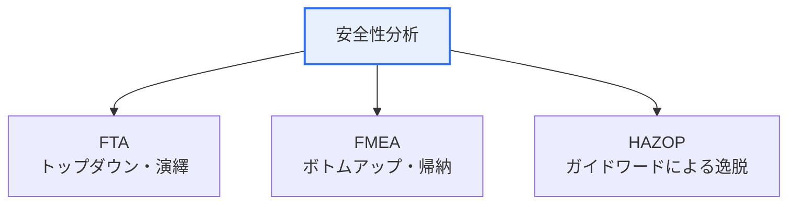

# ソフトウェア安全性分析(Software Safety Analysis)

## 1. 概要

### A. 定義および必要性
> ソフトウェアに内在する**潜在的危険(Hazard)を事前に識別・分析して事故を予防**する活動であり、自動運転・医療機器・航空・原子力発電など、誤りがそのまま人命・財産の被害につながるセーフティクリティカル(Safety-Critical)システムにおいて不可欠である。

ソフトウェア安全性分析が重要になった根本的な背景は、ソフトウェアが今や画面上の情報処理を越えて**物理世界を直接制御**しているという点にある。自動車のブレーキ、人工呼吸器、航空機制御ソフトウェアの欠陥は、画面上のエラーではなく即座に事故と人命被害となる。したがって、欠陥を作り込んだ後にテストで見つけるという事後的アプローチだけでは不十分であり、設計初期から「何が誤りうるか」を体系的に予測・除去する予防的分析が必要である。分析技法はアプローチの方向によって、結果から原因をさかのぼって探る**トップダウン(演繹)**と、原因から結果を追っていく**ボトムアップ(帰納)**に分けられる。

### B. 安全性とセキュリティの融合
近年、自動運転・IoT のように物理制御とネットワーク接続が結びついたことで、誤動作(Safety)とハッキング(Security)がともに事故を引き起こすようになった。そのため、安全性分析とセキュリティ分析を統合的に実施する傾向が強まっている。

## 2. 分析技法の概観

### A. FTA(Fault Tree Analysis)
> 頂上事象(Top Event、懸念される事故)から出発し、その原因を**論理ゲート(AND・OR)でトップダウンに展開**する演繹的分析である。「この事故が起こるためには、どのような下位原因がどのように組み合わさる必要があるか」を木構造で追跡する。

FTA の強みは、複数の原因が複合的に絡み合って事故を引き起こす経路を明確に示し、各原因の発生確率を入力すれば事故確率を定量的に算出できる点にある。一つの特定の事故(Top Event)に集中して分析する。

### B. FMEA(Failure Mode and Effects Analysis)
> システムを構成する各要素の**故障モード(Failure Mode)を漏れなく列挙し、その影響を評価**する帰納的分析である。各故障の深刻度・発生度・検出度を掛け合わせた**リスク優先度(RPN)**によって対応順序を決める。

FMEA は部品一つひとつがどのように故障しうるか、そしてそれがシステムにどのような影響を与えるかを体系的に点検するため、予防中心のボトムアップアプローチである。RPN が高い故障から優先的に対応する。

### C. HAZOP(Hazard and Operability Analysis)
> 設計意図に**ガイドワード(No・More・Less・Reverse など)を当てはめ**、正常から外れた逸脱(Deviation)とそれによる危険を導出する定性分析である。「流量がなければ(No Flow)、多ければ(More Flow)何が起こるか」を多分野の専門家がワークショップ形式で洗い出す。

HAZOP は元来化学プロセスから始まったが、ソフトウェア・システム運用の危険分析にも用いられる。運用性(Operability)まで併せて点検することが特徴である。

## 3. 技法の比較

| 区分 | FTA | FMEA | HAZOP |
|---|---|---|---|
| **方向** | トップダウン(演繹) | ボトムアップ(帰納) | 逸脱分析 |
| **出発点** | 事故(Top Event) | 構成要素の故障 | 設計意図 |
| **中核ツール** | 論理ゲート・確率 | RPN 優先度 | ガイドワード |
| **強み** | 事故経路・確率 | 要素別の予防 | 運用逸脱の発掘 |

## 4. 考慮事項および示唆

1. **技法を相互補完的に併用**する。FTA で特定事故の経路を、FMEA で要素別の故障を、HAZOP で運用上の逸脱を分析すれば、異なる角度から危険を包括的に洗い出すことができる。
2. **安全規格と連携**する。自動車の ISO 26262、産業全般の IEC 61508 などの機能安全規格はこうした分析技法の適用を要求しており、開発初期から統合すべきである。
3. **開発初期での適用が核心**である。危険は設計段階で発見・除去するほどコストが小さく効果が大きいため、要求・設計段階から安全性分析を実施する。

---

> **一言まとめ**: ソフトウェア安全性分析はセーフティクリティカルシステムの危険を事前に予防するものであり、*FTA(トップダウンの事故経路)・FMEA(ボトムアップの要素故障・RPN)・HAZOP(ガイドワードによる逸脱)* を相互補完的に活用し、機能安全規格と連携して設計初期から適用する。
