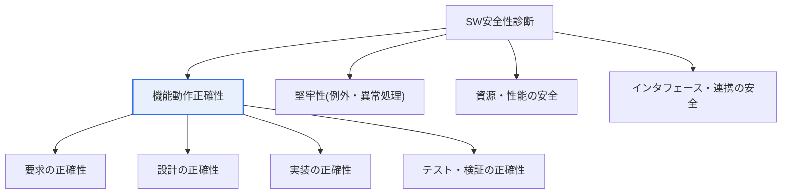
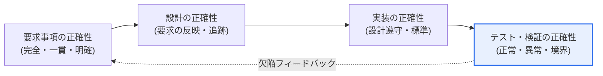

# ソフトウェア安全性診断 — 機能動作正確性診断

## 1. 概要

### A. 概念
> **ソフトウェア安全性診断**とは、「ソフトウェア安全診断ガイド」に基づき、SW が**想定された状況と異常な状況の両方において安全に動作するかを体系的に診断**する活動である。そのうち**機能動作正確性診断**は、SW が要求された機能を正確に遂行するか、そして例外・境界状況においても意図しない動作なく安全に処理するかを検証する中核項目である。

機能動作正確性診断が重要である理由は、「**SW が産業・安全に深く関与しており、誤動作がそのまま物理的な事故につながる**」という点にある。ソフトウェアが自動車・医療・発電・鉄道・交通といったセーフティクリティカル(safety-critical)領域で広く用いられるにつれ、SW が正常な状況だけでなく例外的・異常な入力に対しても正確かつ安全に動作するかを確認することが不可欠となった。機能が要求どおり正確に遂行されなければ(誤動作・意図しない動作・無応答)、その結果は画面上のエラーにとどまらず、ブレーキの失敗・投薬量の誤り・設備の暴走といった人命・財産の被害に直結しうる。

ここで「機能動作正確性」が二方向の要求を併せ持つことを理解する必要がある。一つは**意図した機能が要求どおりに遂行されるか(should-do、正常機能の正確性)**であり、もう一つは**意図しない動作が発生しないか(should-not-do、安全特性の保証)**である。安全性の観点では後者が特に重要である。正常な入力でうまく動作しても、異常な入力・境界条件・故障状況で予期しない危険な動作が現れれば、安全は崩れる。そのため診断は、正常シナリオだけでなく例外・境界・エラー状況を意図的に含めて設計される。

安全診断ガイドはこれを予防するため、SW の安全性を複数の診断項目に分けて点検しており、機能動作正確性はその中核軸である。診断は、要求事項が明確かつ完全であるか、設計が要求を正確に反映しているか、実装が設計どおりに動作するか、そしてテストが正常・異常・境界条件まで十分に検証したかを**段階的**に確認する。すなわち要求→設計→実装→テストの各段階で正確性を確認し、前段階の欠陥が後段階へ伝播して最終的に事故へと発展することを防ぐ。

### B. 必要性
SW が社会全体に普及し誤動作の波及範囲が拡大したことで、テスト段階でのみ品質を確認する事後的アプローチでは安全を保証することが難しくなった。欠陥が要求・設計段階ですでに生み出されていると、後段階で発見しても修正コストは数十倍に膨らみ、見落としのリスクも高い。したがって、開発の全過程で正確性を体系的に診断・確保する「予防的安全」アプローチが必要である。

## 2. 全体構造 — 安全性診断項目における機能動作正確性

機能動作正確性診断の位置付けを理解するには、まず安全性診断が複数の観点の集合であるという全体構造を見る必要がある。次の構造図は、安全性診断が機能動作正確性を中心に、堅牢性・資源・インタフェースなどの隣接観点とともに一つの体系を成していることを示している。

**機能動作正確性**はこの体系の中心であり、「要求された機能が各開発段階で歪みなく正確に伝達・実装・検証されているか」を見る。**堅牢性**の観点は誤った入力・故障状況における防御的処理を、**資源・性能の安全**はメモリ・タイミング予算の遵守を、**インタフェースの安全**はモジュール間・外部システム間の連携の正確性を扱う。これらの観点は互いに重なり合い、補完し合う。たとえば機能が正確であっても例外入力に対する防御がなければ安全は崩れるため、機能動作正確性診断は自然と堅牢性診断と連動して実施される。

このような構造が必要なのは、安全性が単一のテストだけでは証明されない「全過程の産物」だからである。要求が曖昧であれば、どれほど多くテストを行っても何が正しい動作なのかという判定基準自体が揺らぐ。したがって診断はテスト結果だけを見るのではなく、それ以前の段階の正確性と段階間の結び付き(トレーサビリティ)を併せて見る。

## 3. 機能動作正確性診断の段階別手順

各開発段階で正確性がどのように確認され、次の段階へつながっていくかを以下の手順図に示す。核心は、各段階が独立に検査されるのではなく、**トレーサビリティ(traceability)**によって前後が連結されている点にある。

**要求事項の正確性**段階は、あらゆる正確性の出発点である。要求事項が不完全(欠落)・非一貫(矛盾)・曖昧であれば、その上に築かれた設計・実装・テストはすべて揺らぐ。この段階では、安全要求が漏れなく識別されているか、各要求が検証可能な形で記述されているか、相反する要求がないかを検討する。たとえば「危険な状況においてシステムは安全状態へ遷移する」という要求は、どのような状況が危険なのか、安全状態とは何か、遷移時間の制約はどれほどかまで明確でなければ診断基準とはならない。

**設計の正確性**段階は、要求が設計に正確に反映されているか、設計が要求を超過あるいは欠落していないかを見る。ここではトレーサビリティマトリクスが中核的な手段である。各要求がどの設計要素によって実現されるのか、逆に各設計要素がどの要求に由来するのかを双方向にマッピングし、根拠のない設計(要求のない機能)や未実現の要求(設計のない要求)を見つけ出す。安全要求が特定のアーキテクチャ(冗長化・監視・安全状態)によってどのように実現されるかも、この段階で確認する。

**実装の正確性**段階は、コードが設計どおりに実装されているか、そしてコーディング規約を遵守しているかを検査する。静的解析によって規約違反や潜在欠陥(ヌル参照・境界超過・未初期化・デッドコード)を自動検出し、コードレビューによって設計意図との一致を確認する。セーフティクリティカルなコードでは、危険な言語機能を制限するコーディング標準(例:MISRA C)を併せて適用し、未定義動作や曖昧な構文を根本から遮断する。

**テスト・検証の正確性**段階は、実際の実行によって動作を確認する。このとき正常な入力だけでなく、**異常な入力・境界値・エラー状況**を必ず含める。境界値分析・同値分割によって入力空間を体系的に分割し、故障注入によって例外経路を刺激し、カバレッジ(命令・分岐・MC/DC)によって検証の十分性を定量化する。テスト結果で発見された欠陥はフィードバックされ、要求・設計の欠陥にまでさかのぼって是正される。

| 段階 | 主な活動 | 成果物・根拠 |
|---|---|---|
| **要求事項の正確性** | 完全性・一貫性・曖昧性の点検、安全要求の識別 | 要求レビュー結果、安全要求リスト |
| **設計の正確性** | 要求の設計への反映・トレーサビリティの確認 | トレーサビリティマトリクス |
| **実装の正確性** | 設計遵守・コーディング標準・静的解析 | 静的解析レポート、レビュー記録 |
| **テスト・検証の正確性** | 正常・異常・境界テスト、カバレッジ | テストケース・カバレッジレポート |

## 4. 主な診断技法 — 比較と実務上の含意

診断技法は単独で完結するものではなく、互いの限界を補う形で組み合わされる。以下では代表的な技法の原理と限界を比較する。

**要求事項レビュー(レビュー・インスペクション)**は、実行前の段階で欠陥を捉える最も安価な方法である。人が要求の完全性・一貫性・検証可能性を点検し、形式的インスペクション(チェックリスト・役割分担)を用いれば再現性が高まる。ただしレビューは人の判断に依存するため、仕様が膨大になると見落としが生じるという限界がある。

**静的解析**は、コードを実行せずに欠陥や規約違反を自動検出する。ヌル参照・境界超過・未初期化といった欠陥を広範囲かつ早期に捉えられることが長所である。反面、実行コンテキストを完全には把握できないため誤検知(false positive)が発生し、実際の実行時のタイミング・環境依存の問題は捉えられない。

**動的テスト**は、実際の実行によって動作を確認する。正常・異常・境界条件のケースを作成して実行し、カバレッジを測定する。実際の動作を直接観察できるという強みがあるが、入力空間が広いと「実行されなかった経路」が残るという根本的な限界がある。そのため静的解析で「全経路の性質」を補い、カバレッジで「どれだけ実行したか」を定量化する。

**トレーサビリティ分析**は、要求-設計-実装-テストを双方向にマッピングし、どの要求が検証されていないか、どのコードに根拠がないかを明らかにする。これは個々の技法が見落とす「段階間の欠落」を捉える、安全性診断特有の手段である。

これらの技法の組み合わせ原理は、「ある技法の死角を別の技法が覆う」という点にある。レビュー(人・意味)+静的解析(自動・全経路)+動的テスト(実際の動作)+トレーサビリティ(段階の連結)を併用してこそ、正確性診断は実効性を持つ。

ここでカバレッジ指標は、「どれだけ検証したか」を定量化する共通の尺度として用いられる。命令カバレッジは最低基準であり、分岐・条件カバレッジ、そして安全度水準の高いコードには MC/DC まで要求される。ただし、カバレッジは「十分性の下限」を示すにすぎず、正確性を保証するものではない点に留意すべきである。100% のカバレッジであっても、そもそも誤った期待値で判定していれば欠陥は通過してしまう。そのため、カバレッジの数値とともに期待結果の妥当性(オラクル問題)とシナリオの代表性を併せて検討することが、診断の成熟度を分ける。

| 技法 | 強み | 限界 | 補完 |
|---|---|---|---|
| **要求事項レビュー** | 早期・低コスト | 人への依存・見落とし | チェックリスト・インスペクション |
| **静的解析** | 広範囲・全経路 | 誤検知・環境非反映 | 動的テストで確認 |
| **動的テスト** | 実際の動作を観察 | 未実行経路の残存 | カバレッジ・静的解析 |
| **トレーサビリティ分析** | 段階間の欠落検出 | 管理負担 | ツールによる自動化 |

### 診断結果の判定と手戻りループ

診断は欠陥を見つけることで終わるわけではない。発見された欠陥は、根本の段階までさかのぼって是正されなければならない。たとえばテスト段階で境界値エラーが繰り返し発生するなら、その原因が実装上のミスなのか、設計が境界処理を欠落させたのか、そもそも要求が境界動作を規定していなかったのかを判別する必要がある。原因が要求段階にあれば、コードだけを直しても再発する。したがって手順図の「欠陥フィードバック」経路のように、診断結果は要求・設計にまで立ち返る閉ループとして扱われる。

この手戻りループの効率は、結局のところトレーサビリティの品質にかかっている。要求-設計-実装-テストが正確にマッピングされていれば、一つの欠陥がどの段階に由来し、他のどの成果物に影響を与えるかを迅速に把握できる。逆にトレーサビリティが不十分であれば、同じ欠陥が複数の箇所で再発し、修正が新たな欠陥を招く悪循環に陥る。安全性診断が「一度のテスト」ではなく「持続する体系」でなければならない理由はここにある。

## 5. 深化 — 機能安全規格との連携と実務適用

機能動作正確性診断は、ドメイン別の**機能安全規格**と連携することで実効性を持つ。自動車分野の ISO 26262 はリスクに応じて ASIL(A〜D)等級を付与し、等級が高いほど強力な検証(例:上位等級での MC/DC カバレッジ、形式検証の推奨)を要求する。産業全般の IEC 61508 は SIL(1〜4)で安全度水準を定義し、各水準に見合った技法を推奨・要求する。医療機器(IEC 62304)は SW 安全クラス(A〜C)に応じて要求・設計・検証の厳格度を変える。これらの規格は「何を、どれだけ正確に検証したか」についての証拠を要求するため、機能動作正確性診断はそのまま安全認証の根拠資料を生成する過程となる。

具体例として、セーフティクリティカルな開発組織はコミットごとに静的解析と単体テストを自動実行し、カバレッジが目標(例:上位等級で MC/DC 100%)に達しなければマージを阻止するゲートを設ける。また、要求管理ツールとテスト管理ツールを連携させてトレーサビリティを自動更新することで、要求が変わった際に影響を受ける設計・テストを即座に特定する。こうすれば大規模 SW においても手作業による診断の限界を越え、変更のたびに正確性を継続的に再確認できる。

別の例として、医療機器 SW(IEC 62304 クラス C)では、輸液ポンプの流量制御ロジックについて、正常な処方だけでなくセンサ異常・瞬時停電・通信遅延といった異常状況を故障注入によってテストし、その結果が「安全な停止状態への遷移」要求を満たしているかをトレーサビリティによって確認する。このように機能動作正確性診断は、ドメインごとに「何が危険な動作か」を具体化し、その危険を回避する要求が実際に実装・検証されたかを最後まで追跡する形で適用される。

最新動向としては三つが注目される。第一に、**静的解析・形式検証の高度化**であり、数学的手法によって特定のエラー(実行時例外・整数オーバーフロー)が存在しないことを証明するアプローチが、セーフティクリティカル領域で拡大している。第二に、**開発パイプライン内での継続的検証**であり、診断が独立した段階ではなく CI に組み込まれて常時実施される。第三に、**AI ベース SW の正確性診断**の問題であり、学習ベースのコンポーネントは仕様がデータとして暗黙化されるため、従来の要求-トレーサビリティ診断をそのまま適用することが難しく、データ品質・分布・シナリオカバレッジの観点に立った新たな診断基準が求められる。これは機能動作正確性診断の対象と方法が拡張されつつあることを示唆している。

## 6. 考慮事項および示唆

1. **開発全過程における正確性の確保が核心である。** 安全性はテストだけでは保証されず、要求・設計・実装の各段階で正確性を確認してこそ、欠陥が後段階へ伝播するのを防げる。特に要求段階の曖昧性の除去は、以降のすべての診断の判定基準を左右するため、最優先で投資すべきである。
2. **トレーサビリティを診断の背骨とする。** 要求-設計-実装-テストの双方向マッピングをツールで維持し、未検証の要求と根拠のないコードを明らかにしなければならない。変更の多い大規模 SW において、トレーサビリティは影響分析と回帰診断の基盤となる。
3. **機能安全規格と連携して実効性を確保する。** ISO 26262・IEC 61508・IEC 62304 などのドメイン規格の等級別要求(カバレッジ・検証手順)と連携して診断計画を立ててこそ、認証の根拠を自然に生成し、手戻りを減らすことができる。[[software-safety-analysis]]
4. **静的・動的・レビュー・トレーサビリティを組み合わせて死角をなくす。** いかなる単一技法も完全ではないため、早期・低コストのレビュー、全経路の静的解析、実際の動作を見る動的テスト、段階を連結するトレーサビリティを相互補完的に結合する。
5. **自動化・継続的診断と AI 時代の新たな基準に備える。** 大規模 SW では手作業による診断に限界があるため、CI に診断を組み込んで常時実施し、学習ベースのコンポーネントにはデータ・シナリオカバレッジのような新たな正確性判定基準を整備すべきである。

## 参考資料
- ISO 26262 Road vehicles — Functional safety, https://www.iso.org/standard/68383.html
- IEC 61508 Functional safety of E/E/PE safety-related systems, https://www.iec.ch/functional-safety
- IEC 62304 Medical device software — Software life cycle processes, https://www.iso.org/standard/38421.html

---

> **一言まとめ**: SW 安全性診断における機能動作正確性診断は、*要求→設計→実装→テストの各段階の正確性をトレーサビリティに基づいて検証* する予防的活動であり、正常だけでなく異常・境界条件を含めて「行うべき動作」と「行ってはならない動作」を併せて確認し、ISO 26262・IEC 61508 などの機能安全規格と連携して安全認証の根拠を生成する。
