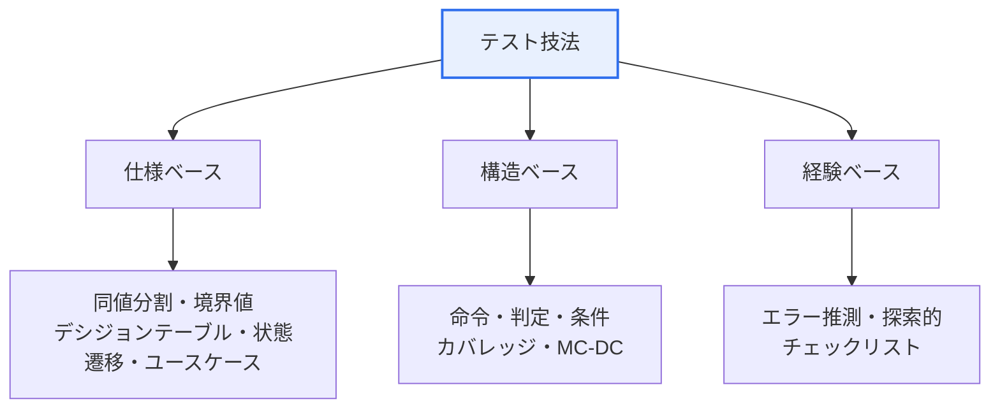

# ソフトウェアテスト(Software Testing)

## 1. 概要

### A. 定義
> ソフトウェアに潜在する**欠陥を発見**し、要求事項を満たしているかを確認・検証して品質を確保する活動。エラーの予防と信頼性の向上を目的とする。

テストに対するよくある誤解は、「欠陥がないことを証明する作業」だというものである。しかしソフトウェアは入力の組み合わせが事実上無限であるためすべてのケースを確認することはできず、したがってテストにできるのは**欠陥の存在を明らかにすること**だけである。この認識から出発してこそ、「限られた資源で欠陥を最も効率的に見つける」戦略的活動としてのテストが成立する。テストは検証(Verification、正しく作ったか)と妥当性確認(Validation、正しいものを作ったか)を包含し、品質を事後的に検査するにとどまらず、**初期段階から欠陥を予防**する方向へと発展してきた。

### B. 必要性
欠陥は発見が遅れるほど修正コストが指数関数的に増大する。要求・設計段階のエラーが運用段階で発見されると数十倍のコストがかかりうる、というのが長年の経験則である。したがってテストは単なる検査ではなく、**欠陥を早期に・低コストで取り除く品質確保の手段**であり、以下の原則はこの目標を達成するための実践指針である。

## 2. ソフトウェアテストの原則 (A)

テストの 7 原則は、互いに結び付いた一つの論理である。「完全なテストは不可能」であるからリスクに応じて選択しなければならず(状況依存)、欠陥は「少数のモジュールに集中」するのでそこに資源を集中させ、そうして作ったケースも繰り返せば効力を失うため(殺虫剤のパラドックス)継続的に更新しなければならない。次の表は各原則とその実践的な含意である。

| 原則 | 内容および含意 |
|---|---|
| **欠陥の存在を示す** | 欠陥の存在は明らかにできるが、不在は証明できない → テストの目的は欠陥の発見 |
| **完全なテストは不可能** | すべての入力・経路の組み合わせは不可能 → リスクベースで選択 |
| **早期テスト(Early Testing)** | 開発初期からテスト → 欠陥修正コストの削減 |
| **欠陥の偏在(Pareto)** | 少数のモジュールに欠陥が集中 → 資源を優先配分 |
| **殺虫剤のパラドックス** | 同じテストを繰り返すと新たな欠陥を見つけられない → ケースを更新 |
| **状況依存** | ドメイン・リスクに応じてテストを変える |
| **「バグゼロ」の落とし穴** | 欠陥がなくても要求を満たさなければ品質は悪い |

特に「バグゼロの落とし穴(欠陥不在の誤謬)」は、技術的にバグがなくてもユーザが望むものを作れなければ意味がないことを指摘するものであり、テストがコード検証を越えて**要求事項の妥当性確認**まで含むべきことを気付かせてくれる。

## 3. ブラックボックス vs ホワイトボックステスト (B)

二つのアプローチは「何を根拠にケースを作るか」によって分かれる。**ブラックボックス**は内部構造を知らないまま仕様だけを見て入力と出力の整合性を検証するため、ユーザ・要求の観点の欠陥はよく捉えるが、実行されないコード(デッドコード)や内部経路の欠落は把握しにくい。**ホワイトボックス**はコードの内部構造を見てすべての分岐・経路が実行されるかを検証するため論理欠陥に強いが、仕様にありながら実装から漏れた機能はそもそもコードに存在しないため発見できない。この相互補完性ゆえに、両者を併用しなければならない。

| 区分 | ブラックボックス | ホワイトボックス |
|---|---|---|
| **観点** | 仕様ベース(内部構造を知らない) | 内部構造・ロジックベース |
| **目的** | 機能・要求事項の充足確認 | コードカバレッジ・経路の検証 |
| **技法** | 同値分割、境界値、デシジョンテーブル、状態遷移 | 命令・判定・条件カバレッジ |
| **実施主体** | 主に QA・ユーザの観点 | 開発者の観点 |
| **限界** | 内部経路・デッドコードの見落とし | 仕様上の欠落機能を発見できない |

たとえば「1〜100 の入力を許可」という仕様に対し、ブラックボックスの**境界値分析**は 0・1・100・101 を重点的に検証して off-by-one エラーを狙う。欠陥は境界で頻繁に発生するという経験則を活用したものである。

## 4. テスト技法 (C)

テストケースの導出技法は、根拠によって三つに分かれる。仕様ベースは何をすべきかから、構造ベースはコードがどう書かれているかから、経験ベースはテスト担当者の直観からケースを導き出す。三者は互いの死角を埋め合う。

**仕様ベース(ブラックボックス)**は要求・仕様からケースを導出するもので、入力を代表値のグループにまとめる同値分割、境界に集中する境界値分析、条件の組み合わせを表に整理するデシジョンテーブルが代表的である。**構造ベース(ホワイトボックス)**はコード構造をどれだけ実行したかをカバレッジで測定するが、すべての命令を実行する命令カバレッジよりも分岐・条件を併せて見る判定/条件カバレッジ、さらにセーフティクリティカルシステムに要求される **MC-DC** のほうが厳格である。**経験ベース**には、テスト担当者が欠陥のありそうな箇所を推測するエラー推測と、事前の計画なしに学習しながら探索する探索的テストがある。

| 技法 | 説明 |
|---|---|
| **仕様ベース**(ブラックボックス) | 要求・仕様から導出(同値分割・境界値・デシジョンテーブル・状態遷移) |
| **構造ベース**(ホワイトボックス) | コード構造のカバレッジ(命令・判定・条件・MC-DC) |
| **経験ベース** | テスト担当者の経験・直観(エラー推測、探索的テスト) |

## 5. 考慮事項および示唆
技術士の観点から見て、効果的なテストの核心は**技法の組み合わせとリスクベースの優先順位付け**である。仕様・構造・経験の技法を併用してこそ各死角が埋まりカバレッジが最大化され、資源は欠陥の偏在(Pareto)が見られる領域やリスクの高い領域に優先的に配分する。開発方式の変化も反映しなければならない。CI/CD 環境では回帰欠陥を迅速に捉えるために**テスト自動化**が不可欠であり、テストを先に書いて設計を導く **TDD**、コード変更のたびに自動検証するパイプラインが標準となった。近年は AI ベースのテストケース生成・ビジュアルリグレッションテストなどへと拡張されているが、基本は依然として「**初期から、リスク中心に、複数の技法を組み合わせて**」欠陥を早期に取り除くという原則にある。

---

> **一言まとめ**: ソフトウェアテストとは、*欠陥の存在しか証明できないという 7 原則* の上に立ち、*ブラックボックス(仕様)・ホワイトボックス(構造)* という相互補完的な観点から *仕様・構造・経験ベース* の技法をリスク中心に組み合わせ、欠陥を早期に発見・予防する活動である。
