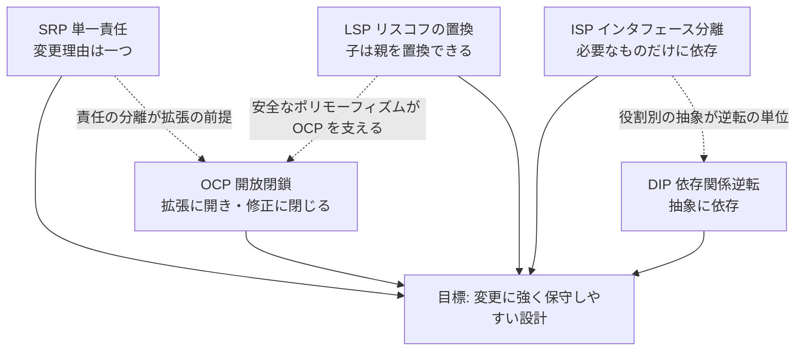
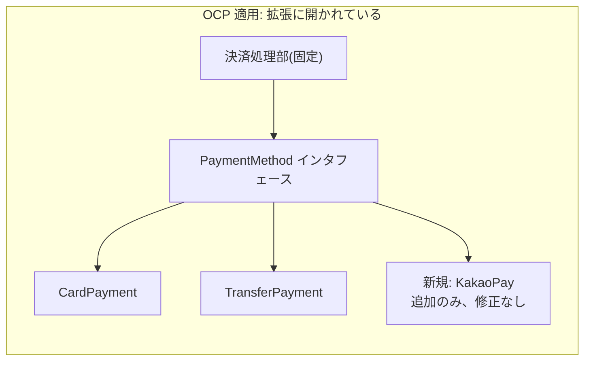
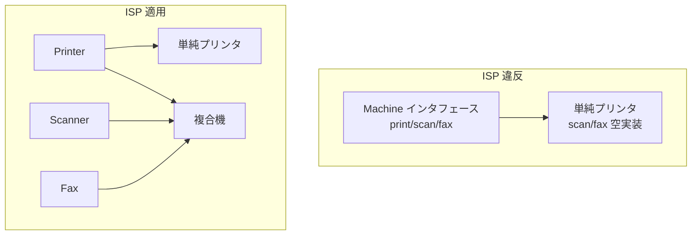
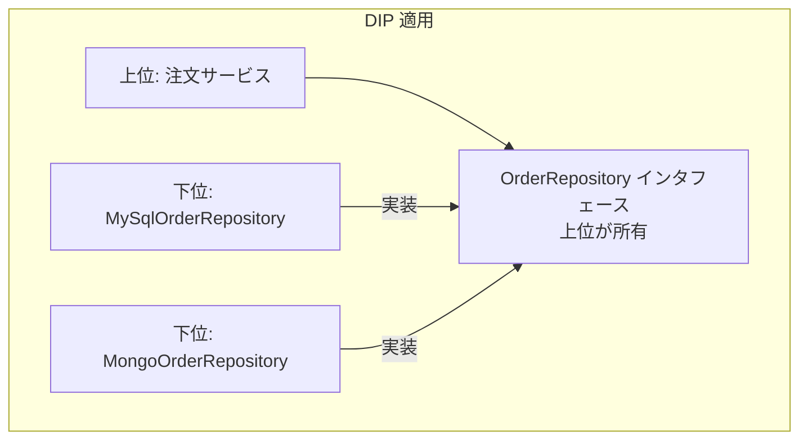

# SOLID オブジェクト指向設計原則(SOLID Principles)

## 1. 概要

### A. 定義
> **SOLID**とは、ロバート・C・マーティン(Robert C. Martin, Uncle Bob)が整理・命名した**オブジェクト指向設計(OOD)の 5 大原則** — 単一責任(SRP)・開放閉鎖(OCP)・リスコフの置換(LSP)・インタフェース分離(ISP)・依存関係逆転(DIP) — を指す頭字語であり、**変更に強く(柔軟で)、理解・拡張・再利用が容易な(保守性の高い)ソフトウェア構造**を作るための指針である。

SOLID を貫くただ一つの目標は、「**変更コストの最小化**」である。ソフトウェアは要求が変わるたびに修正されるが、結合度が高く凝集度が低い構造では、一箇所を直すと予期しない複数の箇所が同時に壊れる。SOLID はこうした「変更の波及(ripple effect)」を抑えるために、責任を細かく分け(SRP)、拡張には開きつつ修正には閉じ(OCP)、ポリモーフィズムを安全に保証し(LSP)、不要な依存を断ち(ISP)、具象ではなく抽象に依存させる(DIP)ことで、**依存関係の方向と大きさを制御**する五つの処方を提示する。

注意すべきは、SOLID はマーティンが「発明」したものではなく、1990 年代後半に彼が複数の先行研究を**収集・再整理し、一つの覚えやすい体系として命名**したものだという事実である。たとえば LSP はバーバラ・リスコフ(Barbara Liskov)が 1987 年に提示した置換の概念であり、OCP はバートランド・メイヤー(Bertrand Meyer)が 1988 年の著書で言及した概念である。したがって SOLID は、個々の原則の独創性よりも「**併せて適用されたときに相乗効果を生む設計感覚の束**」として理解すべきである。

### B. 登場背景および必要性
オブジェクト指向言語(C++、Java など)が普及し、継承やポリモーフィズムといった強力な技法を使えるようになったが、逆説的に、誤って使えば手続き型よりも複雑で脆弱な構造が生まれた。継承を濫用して親子クラスが強く絡み合ったり、一つの巨大なクラスがあらゆる責任を抱え込む「**ゴッドクラス(God Class)**」が珍しくなかった。マーティンは、このように腐敗しやすい設計の兆候を**硬直性(Rigidity、小さな変更が連鎖的な修正を招く)**、**脆弱性(Fragility、直すと無関係な箇所が壊れる)**、**移植困難性(Immobility、再利用しようとしても付随する依存が多く切り離せない)**、**粘着性(Viscosity、正しい方法よりも場当たり的な方法のほうが容易)**として規定し、これを予防する設計規範として SOLID を提示した。

必要性はソフトウェアのライフサイクルコスト構造から生じる。一般にソフトウェア総コストの 60〜80% は開発後の**保守段階**で発生し、その大部分は「コードを理解し安全に修正する」ことに費やされる。SOLID はまさにこの理解・修正コストを構造的に引き下げる投資である。特にアジャイル・DevOps 環境で短いサイクルで機能を追加・変更し、マイクロサービスへと細かく分割する今日では、各構成要素が独立して変更・デプロイ可能でなければならないため、SOLID の結合度制御の原理はコードレベルを越えてアーキテクチャレベルにまで拡張して適用される。

## 2. SOLID 5 大原則の全体構造

五つの原則は独立に並ぶというよりも、「**責任を分け(SRP) → その境界を拡張可能に開き(OCP) → ポリモーフィックな置換を安全に保証し(LSP) → インタフェースを細かく分割し(ISP) → 依存方向を抽象へと逆転する(DIP)**」という一つの流れとして結び付いている。以下の全体構造図は、5 原則が共通の目標(変更に強い設計)へと収束する関係を示している。

原則間には相互依存がある。OCP(修正なしの拡張)を実現するには新機能をポリモーフィズムによって差し込めなければならないが、そのポリモーフィズムが誤作動しないためには LSP(子が親を完全に置換できる)が守られていなければならない。また DIP(抽象への依存)を適切に行うには、その抽象が肥大化しないよう ISP(インタフェースを役割別に分離)が先行していなければならない。したがって SOLID は「五つの規則」ではなく、「**互いを支え合う一つの設計原理**」として体得することが重要である。

次の表は 5 原則を一覧に整理したものであるが、各原則の「なぜ」は続く節で文章として説明する。

| 原則 | 中核命題 | 制御対象 | 代表的な技法 |
|---|---|---|---|
| **SRP** 単一責任 | クラスが変更される理由は一つでなければならない | 凝集度(責任の分離) | 責任別のクラス分割、関心の分離 |
| **OCP** 開放閉鎖 | 拡張に対して開かれ、修正に対して閉じていなければならない | 拡張ポイントの安定性 | 抽象化・ポリモーフィズム・Strategy パターン |
| **LSP** リスコフの置換 | 子の型で親の型を置き換えてもプログラムは正常に動作しなければならない | 継承の安全性 | 契約(事前・事後条件)の遵守 |
| **ISP** インタフェース分離 | クライアントは使用しないメソッドに依存してはならない | インタフェースの結合度 | 役割別のインタフェース分割 |
| **DIP** 依存関係逆転 | 上位・下位のいずれも抽象に依存しなければならない | 依存の方向 | インタフェース・DI(依存性注入) |

## 3. 各原則の原理と適用

### A. SRP — 単一責任の原則(Single Responsibility Principle)
SRP は「**一つのクラスは一つの責任のみを持ち、クラスが変更されるべき理由はただ一つでなければならない**」という原則である。ここでいう「責任」とは、マーティンの精緻な定義では「**変更を要求するアクター(actor、利害関係者グループ)**」を意味する。すなわち、同じ利害関係者の要求によって一緒に変わるべきコードは一箇所に集め、異なる理由で変わるコードは切り離せということである。凝集度(cohesion)を高め、変更の波及を局所化することが目的である。

典型的な違反は、一つの `Employee` クラスが給与計算(経理部の管轄)、勤務時間レポート(人事部の管轄)、DB 保存(DBA の管轄)をすべて抱えている場合である。経理部の規定が変わって給与ロジックを修正したところ、レポート機能まで壊れてしまうという事故が起こる。三つのアクターが一つのコードを共有しているためである。SRP を適用すると、`PayCalculator`、`HourReporter`、`EmployeeRepository` に責任を分離し、経理部の変更が人事部の機能に影響しないよう隔離する。

実務において SRP は、クラスだけでなく関数・モジュール・マイクロサービスの境界設定の基準となる。ただし、細かく分割しすぎるとクラス数が爆発的に増え、協調関係が複雑になって、かえって理解しにくくなるという逆効果がある。したがって「変更の軸(誰が、なぜこのコードを変えるのか)」を基準に分割しつつ、一緒に変わるものは一緒に置くというバランスが必要である。実際に、大規模決済システムで「精算ルール」と「通知送信」を一つのサービスに入れていたところ、通知チャネル(SMS→カカオトーク)を追加するたびに精算コードまで再デプロイ・再検証しなければならないコストが累積したため、二つのサービスに分離した事例は、SRP をアーキテクチャレベルで適用した代表例である。

### B. OCP — 開放閉鎖の原則(Open-Closed Principle)
OCP は「**ソフトウェアの構成要素(クラス・モジュール・関数)は、拡張に対して開かれ、修正に対して閉じていなければならない**」という原則である。新しい要求が生じたとき、既存の検証済みコードを書き換えるのではなく、**新しいコードを追加**する方法で対応できなければならないという意味である。すでにテストを通過し運用中のコードに手を触れないため、回帰(regression)のリスクが減り、変更が局所化される。

中核的な実現手段は**抽象化とポリモーフィズム**である。変化が予想される箇所をインタフェース(抽象)として抽出しておき、具象実装を差し替えられる構造を作る。たとえば決済手段がカードのみのコードに口座振替を追加する場合、`if(type=="card") ... else if(type=="transfer") ...` のように分岐文を増やし続けると、決済手段が増えるたびに中核ロジックを修正しなければならない(OCP 違反)。代わりに `PaymentMethod` インタフェースを定義し、`CardPayment`、`TransferPayment` を実装クラスとして置けば、新しい手段(簡易決済)を追加するときは新しいクラスを作るだけでよく、既存の決済処理部には手を加えない。実際に PG(決済代行)連携モジュールは、この構造によって数十の決済チャネルを無停止で拡張している。

ただし、「あらゆる箇所をあらかじめ拡張可能に」しようとする過度な一般化は、YAGNI(You Aren't Gonna Need It)原則に反し不要な複雑さを生む。OCP は「**変更が実際に頻繁に起こる軸を特定し、その軸にのみ拡張ポイントを設けよ**」という実用的判断とともに適用されるべきである。Strategy・Template Method・Decorator といった GoF パターンが、OCP を実装する代表的なツールである。

### C. LSP — リスコフの置換原則(Liskov Substitution Principle)
LSP は「**サブタイプ(子の型)は常にその基本型(親の型)と置換可能でなければならず、置換してもプログラムの正しさが損なわれてはならない**」という原則である。継承は単なるコード再利用の手段ではなく、「**is-a 関係において振る舞いの契約(contract)まで保存**」しなければならないことを要求する。子は親の事前条件を強化したり事後条件を弱化したりしてはならず、親が守っていた不変条件(invariant)に違反してもならない。

最も有名な反例が「**正方形-長方形問題**」である。数学的には正方形は長方形であるため `Square extends Rectangle` は自然に見えるが、`setWidth`/`setHeight` を独立に呼び出すクライアントの観点では、正方形は二つの値が常に等しくなければならないという制約のために親の振る舞い契約を破る。`rect.setWidth(5); rect.setHeight(4); assert(area==20)` というコードは、正方形のインスタンスでは失敗する。すなわち子が親を置換できないため LSP 違反であり、これは継承の使い方を誤っているというシグナルである(コンポジションなど別の関係で再設計すべきである)。

LSP が実務上重要な理由は、それが **OCP とポリモーフィズムの安全弁**だからである。OCP のためにインタフェースに複数の実装クラスを差し込むが、ある実装クラスが親の契約を破る(例:`throw new UnsupportedOperationException()` で特定のメソッドを拒否する)と、そのポリモーフィズムを利用する上位コードはその実装クラスだけを例外的に特別扱いしなければならなくなる。これはそのまま OCP の崩壊につながる。実際にコレクションフレームワークで「読み取り専用リスト」が `add()` を例外で遮断する設計は、LSP を微妙に違反する事例としてしばしば議論され、このような場合はそもそもインタフェースを分離(ISP)するほうが望ましいという点で、原則間の連携が見えてくる。

### D. ISP — インタフェース分離の原則(Interface Segregation Principle)
ISP は「**クライアントは、自身が使用しないメソッドへの依存を強いられてはならない**」という原則であり、大きく汎用的なインタフェースよりも、**役割別に小さく分けられたインタフェース**を複数持つほうが良いと考える。肥大化したインタフェース(fat interface)に依存すると、実際には使っていないメソッドが変わってもクライアントが再コンパイル・再デプロイされたり、実装クラスが不要なメソッドまで無理に実装(空メソッドや例外送出)しなければならないという問題が生じる。

典型的な違反は、`Machine` という一つのインタフェースに `print()`、`scan()`、`fax()` をすべて入れる場合である。複合機(多機能プリンタ)は三つのメソッドをすべて実装できるが、印刷しかできない単純なプリンタは `scan()`、`fax()` を空実装や例外で埋めなければならない。これは前述の LSP にまで違反するリスクを生む。ISP を適用すると、`Printer`、`Scanner`、`Fax` にインタフェースを分離し、各機器は自身がサポートする役割だけを実装(implements)する。クライアントも必要な役割インタフェースにのみ依存するため、結合が最小化される。

ISP はマイクロサービスの時代に、API 設計原則としても拡張される。一つの巨大な共通 API がすべての利用者に同じ契約を強いると、特定の利用者のためのフィールドを一つ追加するだけで全利用者に影響が及ぶ。これを緩和するために利用者別の専用 API を提供する **BFF(Backend For Frontend)** パターンが登場したが、これは ISP の精神をアーキテクチャとして実装したものとみなせる。

### E. DIP — 依存関係逆転の原則(Dependency Inversion Principle)
DIP は二つの命題で構成される。①「**上位モジュールは下位モジュールに依存してはならず、両者とも抽象(abstraction)に依存しなければならない**。」②「**抽象は詳細に依存してはならず、詳細が抽象に依存しなければならない**。」従来、上位のポリシー(ビジネスロジック)が下位の詳細技術(DB、外部 API)を直接呼び出すと、下位の技術が変わった際に上位のポリシーまで揺らいでしまう。DIP はこの依存の矢印を**反転(逆転)**させ、上位・下位のいずれもが上位の定義したインタフェース(抽象)を参照するようにする。

たとえば注文サービス(上位)が MySQL ドライバ(下位)を直接呼び出していれば、DB を PostgreSQL や NoSQL に変えるときに注文ロジックを修正しなければならない。DIP を適用すると、注文サービスが所有する `OrderRepository` インタフェースを定義し、`MySqlOrderRepository` にそれを実装(implements)させる。これで依存方向は「DB 実装 → インタフェース ← 注文サービス」となり、下位が上位の抽象に合わせる形になる。DB を交換しても新しい実装クラスを作るだけでよく、中核のポリシーは不変である。

DIP を実際に機能させるメカニズムが、**依存性注入(DI, Dependency Injection)**と **IoC(制御の反転)コンテナ**である。オブジェクトは自身の依存先を直接 `new` で生成せず、外部(Spring コンテナなど)が実装クラスを注入する。Spring、.NET Core、NestJS など現代のフレームワークが DI を標準として採用したことで、DIP は事実上の標準的実践となった。DIP はまた、ロバート・マーティンの**クリーンアーキテクチャ(Clean Architecture)**における「依存性のルール(内側の円は外側を知らない)」の理論的基盤ともなっている。

## 4. 原則間の関係とよくある誤解(比較)

SOLID を個別の規則として暗記するだけでは、実務で衝突が起こる。たとえば SRP を極端に推し進めるとクラスが過度に細分化され、ISP・DIP を満たすためのインタフェースが爆発的に増え、協調構造が複雑になってかえって理解しにくくなる。逆に OCP のためにあらゆる箇所に抽象化を仕込むと、YAGNI 違反で不要な複雑さが生まれる。したがって SOLID は「**絶対的な規則**」ではなく、「**変更コストを下げるためのトレードオフ判断の言語**」として扱うべきである。

原則間には階層関係も存在する。LSP は OCP の前提(安全なポリモーフィズムなしには拡張が誤作動する)であり、ISP は DIP の単位(適切に分割された役割インタフェースがあってこそ依存関係の逆転がすっきりする)を提供する。SRP は他のすべての原則の出発点であり、責任が入り混じった状態ではいかなる原則も適切に適用されない。次の表は、各原則に違反した場合の症状とよくある誤解を対比したものである。

| 原則 | 違反時の症状 | よくある誤解 |
|---|---|---|
| SRP | 一箇所の修正が無関係な機能を壊す | 「1 クラス = 1 メソッド」と誤解(実際は変更理由が基準) |
| OCP | 機能追加のたびに中核コードの分岐文が増える | あらゆるものを事前に抽象化(過剰設計) |
| LSP | 特定の子クラスだけを例外処理する分岐が現れる | 「継承 = コード再利用」と誤解(振る舞いの契約が核心) |
| ISP | 空メソッド・未サポート例外が増える | インタフェースをとにかく大きくする(汎用性の錯覚) |
| DIP | DB・外部技術の交換時に中核ロジックを修正 | DI フレームワークを使えば DIP を達成したと誤解 |

特に注意すべき誤解は、「DI フレームワーク(Spring など)を使えば DIP を守ったことになる」という錯覚である。インタフェースなしで具象クラスをそのまま注入すれば、依存方向は依然として上位→下位であるため DIP 違反である。DIP の本質はツールではなく、「**抽象を誰が所有し、依存の方向がどこを向いているか**」にある。

## 5. 深化 — クリーンアーキテクチャ・現代の開発と SOLID の拡張

SOLID は当初クラス設計の原則として提示されたが、今日では**アーキテクチャ原則へと昇格**している。ロバート・マーティンの『Clean Architecture(2017)』は SOLID をコンポーネント・アーキテクチャのレベルへと引き上げ、「エンティティ→ユースケース→インタフェースアダプタ→フレームワーク」という同心円構造において、**依存性が常に内側(上位のポリシー)を向くよう**強制する。この「依存性のルール」こそが DIP の大規模な適用であり、各層の境界にインタフェースを置くことは OCP と DIP の結合である。ヘキサゴナルアーキテクチャ(ポート&アダプタ)やオニオンアーキテクチャも同じ精神を共有している。

マイクロサービス(MSA)においても、SOLID はサービス分割の指針となる。一つのサービスが単一のビジネスケイパビリティ(business capability)だけを持つよう分割することは SRP のサービス版であり、サービス間通信を明確に定義された契約(API・イベント)で抽象化し、内部実装の変更が利用者に漏れないようにすることは OCP・DIP の適用である。サービスごとのデータベース、イベント駆動通信、利用者別の専用 API(BFP/BFF)といった MSA の実践は、SOLID 原理の分散システム的な再解釈とみなすことができる。

一方、関数型プログラミングや最新言語の普及は、SOLID の相対化を促した。純粋関数・不変性を中心とする関数型スタイルでは継承がほとんどないため LSP の比重が低下し、高階関数が OCP・DIP をより軽量に達成する。また AI コーディングツールがコードを大量生成する時代には、「人が読んで安全に修正できる構造」の価値がむしろ高まり、SOLID がコードレビュー・リファクタリング・アーキテクチャ審査の共通言語として持つ重要性は維持される。情報管理技術士の観点では、SOLID を単独の暗記対象としてではなく、GoF デザインパターン・クリーンアーキテクチャ・MSA・DevSecOps と**連携させて論述**できてこそ、高得点の答案となる。

## 6. 考慮事項および示唆

- **適用戦略(段階的導入)**: SOLID は新規開発に全面適用するよりも、リファクタリングと組み合わせて「変更が頻繁なホットスポット(hotspot)」から段階的に適用するほうが効果的である。コードスメル(硬直性・脆弱性)の検出 → 原則違反の診断 → テストの確保 → 小単位の改善という順序で、レガシーシステムの変更コストを段階的に引き下げる。

- **トレードオフ(単純性 vs 柔軟性)**: SOLID は将来の変更に備えた柔軟性を得る代償として、クラス・インタフェース数の増加と間接性(indirection)という複雑さのコストを払う。変更がほとんどない単純なモジュールにまで機械的に適用すると KISS・YAGNI に違反するため、「変更の可能性が実際に高いか」を基準に適用の強度を調整すべきである。

- **検証・測定との連携**: SOLID の遵守状況は定性的判断にとどまりやすいため、結合度(afferent/efferent coupling)・循環的複雑度・凝集度などの定量指標と静的解析ツール(SonarQube など)、アーキテクチャ適合性テスト(ArchUnit)で補完し、継続的に監視することが望ましい。

- **組織・プロセスの観点**: SRP の「アクター」は組織構造と連動する。コンウェイの法則(Conway's Law)が示唆するようにシステムの境界はチームの境界に似るため、SOLID に基づくモジュール分割は、チーム編成・オーナーシップの定義と併せて設計してこそ実効性がある。

- **展望(アーキテクチャ原則としての持続)**: 関数型・AI コーディングの普及により個々の原則の適用形態は変化するが、「結合度を下げ、変更を局所化する」という SOLID の本質は、クリーンアーキテクチャ・MSA・プラットフォームエンジニアリングへと受け継がれ、有効であり続ける。技術士は SOLID をコードレベルの規則ではなく、**保守性・拡張性を確保する設計ガバナンスの語彙**として幅広く活用できなければならない。

## 参考資料
- Robert C. Martin, "Design Principles and Design Patterns" (2000): https://web.archive.org/web/20150906155800/http://www.objectmentor.com/resources/articles/Principles_and_Patterns.pdf
- Robert C. Martin, 『Clean Architecture』, Prentice Hall, 2017: https://www.oreilly.com/library/view/clean-architecture-a/9780134494272/
- Barbara Liskov, "Data Abstraction and Hierarchy" (OOPSLA 1987) — LSP の原典: https://dl.acm.org/doi/10.1145/62139.62141
- Wikipedia, "SOLID": https://en.wikipedia.org/wiki/SOLID

---
> **一言まとめ**: SOLID(SRP・OCP・LSP・ISP・DIP)は、責任を分け、依存の方向と大きさを抽象によって制御することで「変更に強い設計」を実現するオブジェクト指向の 5 原則であり、今日ではクリーンアーキテクチャ・MSA にまで拡張される、保守性確保のための共通言語である。
