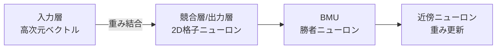

# SOM(Self Organizing Map、自己組織化マップ)

## 1. 概要

### A. 定義
> Kohonen(1982)が提案した**教師なし学習ニューラルネットワーク**であり、高次元の入力データを**低次元(主に2D)の格子へ位相(topology)を保存しながら写像**し、クラスタリング・可視化を行う手法である。

SOMの核心的な発想は、人間の大脳皮質の働き方に由来する。脳において類似した感覚刺激が隣接するニューロン領域で処理されるように、SOMも**類似した入力が出力格子上の近いニューロンに対応する**よう自ら組織化する。その結果、高次元データの複雑な近傍関係が、2次元マップ上に人が目で確認できる形で展開される。この「位相保存」こそが、SOMを単なるクラスタリングと区別する決定的な特徴である。

### B. 特徴
SOMは正解ラベルなしにデータの内部構造を学習する教師なし方式であり、ニューロン同士が入力をめぐって競争し勝者を選ぶ**競合学習**によって動作する。特に勝者だけを更新するのではなく、**勝者の近傍まで併せて**更新する点が、隣接ニューロンに類似した値を持たせ、位相保存を実現している。

| 特徴 | 内容 |
|---|---|
| 教師なし学習 | 正解ラベルなしでデータ構造を学習 |
| 位相保存 | 入力空間の隣接関係を出力格子上に維持 |
| 競合学習 | ニューロン間の競争で勝者(BMU)を選定 |
| 次元削減・可視化 | 高次元を2D格子へクラスタリング・可視化 |

## 2. SOMの構成要素

SOMは、隠れ層が何層も重なる一般的なニューラルネットワークとは異なり、**入力層と競合層(出力層)のわずか2層**からなる単純な構造である。入力層は高次元の入力ベクトルを受け取り、競合層は2D格子状に配置されたニューロンで構成され、**各ニューロンは入力と同じ次元の重み(参照)ベクトル**を1つずつ持つ。入力が与えられると、すべてのニューロンの重みベクトルとの距離を比較して最も近いニューロンを勝者、すなわち**BMU(Best Matching Unit)**として選び、BMUとその近傍ニューロンの重みを入力側へ引き寄せる。このとき、近傍をどの程度一緒に引き寄せるかは、距離に応じて減衰する**近傍関数(主にガウス関数)**が決定する。

| 構成要素 | 内容 |
|---|---|
| 入力層 | 高次元の入力ベクトル |
| 競合層(出力層) | 2D格子ニューロン、各ニューロンは重みベクトルを保有 |
| 重みベクトル | 入力と比較される参照ベクトル |
| BMU(Best Matching Unit) | 入力に最も類似した勝者ニューロン |
| 近傍関数 | BMU周辺のニューロンを併せて更新(ガウス関数) |

## 3. 学習手順

学習の核心は、**「勝者を選び、勝者とその近傍を入力側へ少しずつ移動させることを繰り返す」**ことである。重要なのは、学習が進むにつれて学習率と近傍半径を**徐々に縮小**する点である。序盤では広い近傍を大きく動かしてマップ全体の大枠を形成し(大域的整列)、終盤では狭い近傍を微調整して細部の構造を整える(局所的微調整)。この段階的な収縮が、安定した収束と位相保存を同時に可能にする。

| 順序 | 内容 |
|---|---|
| 1 | 入力ベクトルを提示 |
| 2 | 全ニューロンとの距離を比較 → 最小距離のニューロンをBMUに選定 |
| 3 | BMUと近傍の重みを入力方向へ更新 |
| 4 | 学習率・近傍半径を縮小しながら反復 |

## 4. SOMと教師あり学習ニューラルネットワークの違い

SOMとMLP(多層パーセプトロン)などの一般的な教師あり学習ニューラルネットワークは、目的そのものが異なる。MLPは正解を与えて**誤差を逆伝播**させ分類・予測を学習するのに対し、SOMは正解なしに**競合学習(勝者総取り)**でデータの構造を把握し、クラスタリング・可視化を行う。誤差逆伝播がない点、位相を保存した2Dマップを出力する点が根本的な違いである。

| 区分 | SOM | MLPなど教師あり学習 |
|---|---|---|
| 学習方式 | 教師なし | 主に教師あり |
| 学習規則 | 競合学習(勝者総取り) | 誤差逆伝播 |
| 目的 | クラスタリング・次元削減・可視化 | 分類・予測 |
| 出力 | 位相保存2Dマップ | クラス・連続値 |
| 構造 | 入力-競合層(2層) | 多層の隠れ層 |

## 5. 考慮事項および示唆

SOMの実務的価値は、**結果を人間が解釈できる**点にある。例えば顧客を購買パターンで細分化する場合、K-meansはクラスタ番号しか与えないが、SOMは類似した顧客群をマップ上の隣接領域に配置し、**クラスタ間の関係(隣接性)**まで示す。そのため、顧客セグメンテーション・信用リスクの可視化・異常検知・パターン分析に有用である。ただし、格子サイズ・学習率・近傍半径などのハイパーパラメータに結果が敏感であるためチューニングが必要であり、大規模・超高次元データでは学習コストと解釈の限界がある。技術士の観点からは、SOMを予測モデルの代替ではなく、モデリングに先立ってデータ構造を理解し、視覚的にコミュニケーションするための**探索的分析・説明ツール**として位置づけるのが適切である。

---

> **一言まとめ**: SOMは*競合学習に基づく教師なしニューラルネットワーク*として高次元データを位相を保存しながら2D格子へ写像(クラスタリング・可視化)し、勝者(BMU)と近傍を併せて更新し学習率・半径を縮小して収束させる点で、誤差逆伝播型の教師あり学習ニューラルネットワークとは目的・学習規則が異なる。
