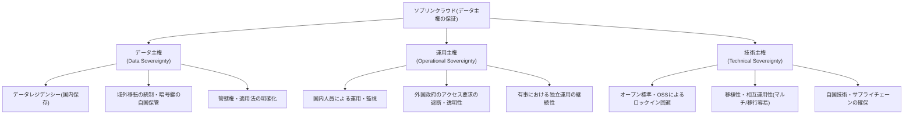
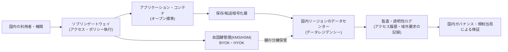

# ソブリンクラウド(Sovereign Cloud)

## 1. 概要

### A. 定義

> **ソブリンクラウド(Sovereign Cloud)**とは、特定の国家・地域の**法・規制・管轄権(jurisdiction)の中でデータの保存・処理・運用・統制権が完結**するよう設計されたクラウドであり、データ主権(Data Sovereignty)を技術・運用・法の三つの層で保証するクラウドの構築・利用モデルである。

ソブリンクラウドは、単に「国内のデータセンターにデータを置くこと」以上の意味を持つ。物理的な所在地(データレジデンシー、data residency)だけでなく、**誰がデータにアクセスでき、どの国の法律がそのデータに及び、障害・紛争時に誰が最終的な統制権を持つのか**までを併せて扱う概念である。すなわち、データが国内にあっても外国事業者本社の法律(例:米国 CLOUD Act)に基づいて提出要求を受けうるのであれば、真の主権が確保されたとは言い難い。ソブリンクラウドはこの「管轄権の衝突」問題に正面から取り組むという点で、情報管理技術士試験らしいテーマである。

したがってソブリンクラウドは、保存場所という単一の軸ではなく、**データ主権・運用主権・技術主権**という三つの軸が同時に満たされて初めて成立する。これは特定の製品名ではなく、規制遵守のためのアーキテクチャ・ガバナンス設計原則に近い。

### B. 登場背景と必要性

第一に、**越境データ移動と管轄権の衝突**である。グローバルなハイパースケーラ(AWS・Azure・GCP)の普及により、データが物理的にどこにあっても外国法の域外適用を受けうるようになった。代表的には米国 CLOUD Act(2018)が、米国企業が保有・管理するデータについて、その保存場所が海外であっても米国政府への提出を要求できるとしており、EU を中心にデータ主権への懸念が急速に高まった。

第二に、**EU の規制強化と判例の変化**である。GDPR に加え、2020 年の Schrems II 判決によって EU-米国間のプライバシーシールドが無効化されたことで、個人データの域外移転は非常に難しくなった。これを受けて EU は、GAIA-X、EUCS(EU Cloud Certification Scheme)などを通じて欧州独自の信頼できるクラウドエコシステムを推進するようになった。

第三に、**公共・金融・国防などセンシティブな領域のクラウド移行**である。政府・公共機関や金融機関がクラウドへ移行するにつれ、国家の中核データが外資系事業者に依存(vendor lock-in)するリスクや、有事にサービスの統制権を失うリスクが浮き彫りになった。韓国も CSAP(クラウドセキュリティ認証)、ネットワーク分離・国内リージョン要求などによって同様の流れを示している。

第四に、**地政学的リスクとサプライチェーンの安定性**である。国家間の対立・制裁の状況下で特定国の事業者のサービスが停止されたりアクセスが遮断されたりするリスクが現実のものとなり、「有事でも自国が独立して運用・統制できるクラウド」への需要が高まった。

## 2. データ主権の 3 階層構造

ソブリンクラウドが保証しようとする「主権」は、一つの統制ではなく、性格の異なる三つの統制が重なり合った構造として理解すべきである。次の概念図は、三つの主権軸とその下にある具体的な統制要素を示している。

**データ主権(Data Sovereignty)**とは、データが生成された国の法・規制に従い、物理的な保存場所が国内にあり、域外移転が統制されていることを意味する。核心は暗号化と**鍵管理(BYOK/HYOK, Bring/Hold Your Own Key)**であり、データが外国リージョンやバックアップに複製されても、復号鍵を自国の管轄内に置けば事実上の統制権を維持できる。データレジデンシーだけでは不十分で、アクセス制御と暗号鍵の主権が組み合わされなければならない理由はここにある。

**運用主権(Operational Sovereignty)**とは、クラウドを誰が運用・監視し、外部(特に外国政府・本社)がデータにアクセスできるかに関する統制である。国内国籍の人員による運用、外国政府からのデータ提出要求に対する拒否・透明性レポート、そして供給停止の状況でもサービスを自国が独立して継続できる持続性が含まれる。物理的な所在地が国内であっても、リモート管理者が外国から root 権限でアクセスするのであれば、運用主権は損なわれる。

**技術主権(Technical Sovereignty)**とは、特定の事業者への依存を避け、オープン標準・オープンソース・コンテナベースの移植性を確保して、いつでも別の環境へ移行できる自律性を意味する。Kubernetes・OpenStack などのオープン技術を採用することは、有事に事業者を交換できる選択肢を残し、交渉力と回復力を同時に高める。

## 3. 参照アーキテクチャと中核的な統制要素

ソブリンクラウドは、一般的なクラウドの上に主権保証のための統制層を重ねる形で設計される。次のアーキテクチャは、データの流れと各地点における主権統制を示している。

第一に、**データレジデンシーと国内リージョン**である。原本とバックアップ、ログ、メタデータまでを国内管轄のデータセンターに置き、DR(災害復旧)サイトも国内に構成する。このとき、CDN キャッシュやテレメトリデータが意図せず海外へ流出しないよう、データフローの全区間を点検しなければならない。

第二に、**暗号化と鍵の主権**である。保存・転送の両区間を暗号化したうえで、鍵を事業者ではなく利用機関が保管する(HYOK)か、少なくとも自国の KMS/HSM で管理する(BYOK)。事業者がデータを物理的に保有していても鍵がなければ復号できないため、外国政府からの提出要求があっても実質的な露出を防ぐ最後の防衛線となる。

第三に、**アクセス制御と特権アクセス管理**である。ゼロトラストの原則に従って運用者・管理者のアクセスを最小権限で統制し、外国に所在する人員の特権アクセスを遮断・監視する。すべての管理行為は改ざん不可能なログとして残す。

第四に、**透明性と監査可能性**である。誰がいつどのデータにアクセスしたか、外国政府からのアクセス要求があったかを記録・報告し、規制当局が検証できるようにする。これは運用主権を事後的に証明する手段である。

第五に、**オープン技術に基づく移植性**である。コンテナ・IaC・オープン API によってワークロードをカプセル化し、特定事業者への依存を下げ、有事の移行コストを削減する。

## 4. 構築類型の比較

ソブリンクラウドは一つの形態ではなく、主権の水準とコスト・機能のバランスに応じて複数のモデルで実装される。各類型は、「どれほど強く主権を保証するか」と「グローバルクラウドのイノベーション・拡張性をどれほど享受するか」の間でトレードオフの関係にある。

| 構築類型 | 概念 | 主権水準 | トレードオフ |
|---|---|---|---|
| 国内リージョン活用 | グローバル事業者の国内リージョンにデータを保存 | 低〜中 | 利便性・機能は高いが本社の管轄権リスクが残る |
| パートナー運用型 | グローバル技術 + 国内の信頼できるパートナーが運用・監視 | 中〜高 | 運用主権は強化、技術は依然として外国依存 |
| 専用・隔離型 | 物理的・論理的に分離された専用ソブリンゾーンを構成 | 高 | コスト・構築負担が大きく、機能更新が遅れうる |
| 国産独立型 | 自国技術・OSS で独立して構築・運用 | 非常に高 | 完全な自律だが規模・最新機能の確保が困難 |

国内リージョン活用は導入が容易で最新機能をそのまま享受できるが、事業者本社が外国法の適用を受けていれば CLOUD Act のような域外要求にさらされうるため、真の主権とは言い難い。パートナー運用型は、グローバル技術を使いつつ国内の信頼できるパートナーが運用・監視を担うことで運用主権を大きく引き上げる折衷案であり、EU でしばしば採用されている。専用・隔離型はソブリン専用ゾーンを物理的に分離するため主権水準は高いが、コストと機能更新の遅延という代償を払う。国産独立型は完全な自律性をもたらすが、ハイパースケーラ並みの規模や最新の AI インフラに自力で追い付くことは難しいという現実的な限界がある。したがって実務では、データの機微度に応じてワークロードを分類し、類型を組み合わせるアプローチが一般的である。

## 5. 事例と国内外の動向

欧州では **GAIA-X** が代表的である。ドイツ・フランス主導で始まったこのイニシアティブは、特定のクラウドを新たに作るのではなく、複数の事業者が相互運用性・移植性・透明性という共通ルール(ポリシー・技術標準)を守るようにする**連合型(federated)の信頼フレームワーク**を志向している。また EU は、EUCS というクラウドセキュリティ認証体系に主権要件を含めるか否かをめぐって議論を続けてきたが、これは主権強化と市場開放の間の緊張を示している。フランスは「Cloud de Confiance(信頼クラウド)」政策によって、グローバル技術をライセンスして自国企業が運用するパートナー運用型モデル(例:Bleu、S3ns)を推進した。

韓国は公共部門について **CSAP(クラウドセキュリティ認証)**と等級制(上・中・下)を設け、機微なシステムほど国内リージョン・物理的なネットワーク分離など厳格な要件を求めており、これはデータ主権の概念と軌を一にする。近年はグローバル事業者も韓国国内でソブリン特化サービスやパートナー運用モデルを提示しており、「国内保存」を越えて「運用・鍵の主権」にまで議論が拡大する傾向にある。ただし、詳細な認証要件や政策は継続的に改正されるため、特定の等級要件を断定するよりも、最新の告示を確認して適用するのが安全である。

## 6. 考慮事項および示唆

第一に、**主権とイノベーション・コストのトレードオフを戦略的に設計**すべきである。すべてのデータを最高水準で隔離するとコストと機能の遅延が大きくなるため、データの機微度・規制等級に応じてワークロードを分類(ティアリング)し、機微データは専用・独立型に、一般データは国内リージョン型に配置するハイブリッド戦略が現実的である。

第二に、**データの所在地ではなく統制権を中心にアプローチ**すべきである。「国内保存」だけでは管轄権リスクが残るため、暗号鍵の主権(HYOK)とアクセスの透明性を組み合わせ、事業者や外国政府でさえ実質的にデータを閲覧できない構造を目標とすべきである。鍵管理の主権こそが、ソブリンクラウドの中核的な差別化要素である。

第三に、**ロックインの回避と出口戦略(exit strategy)を事前に設計**すべきである。オープン標準・コンテナ・IaC によって移植性を確保し、契約段階でデータ返還・移行支援・サービス終了時の継続性に関する条項を明記して、有事に統制権を失わないようにする。

第四に、**ガバナンス・監査・法的準拠の常時点検**が必要である。GDPR・個人情報保護法・CSAP などの規制や判例(Schrems II など)は変化し続けるため、データリネージ・域外移転・アクセス履歴を追跡するガバナンス体系を整え、定期的に準拠性を再検証しなければならない。

第五に、**デジタル主権を国家競争力・回復力の観点から俯瞰**すべきである。ソブリンクラウドは単なる規制遵守を越え、地政学的リスクの下でも中核サービスを自国が継続・統制できるようにする国家のデジタルレジリエンスの基盤であり、国産クラウド・AI インフラの育成政策と連携して長期的に推進されるべきである。

## 参考資料
- GAIA-X European Association for Data and Cloud: https://gaia-x.eu/
- ENISA, European Cybersecurity Certification Scheme for Cloud Services (EUCS): https://www.enisa.europa.eu/
- 韓国インターネット振興院(KISA)クラウドセキュリティ認証制度(CSAP): https://isms.kisa.or.kr/

---

> **一言まとめ**: ソブリンクラウドは、データの保存場所を越えて**データ・運用・技術の主権**を併せて保証するクラウドモデルであり、国内リージョン・暗号鍵の主権(HYOK/BYOK)・アクセスの透明性・オープン標準を組み合わせることで、外国の管轄権とロックインのリスクから自国の統制権とデジタルレジリエンスを守ることを目指す。
