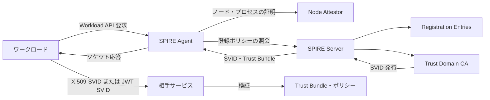
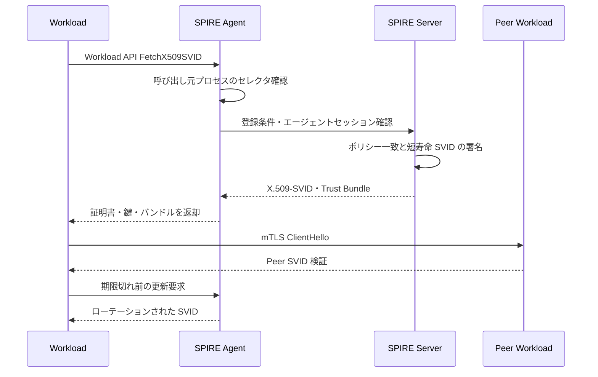

# SPIFFE/SPIRE に基づくワークロードアイデンティティとシークレットレスなサービス認証

## 1. 概要

> **定義**: SPIFFE(Secure Production Identity Framework for Everyone)とは、分散環境のソフトウェアワークロードにプラットフォームに依存しないアイデンティティを付与し、そのアイデンティティを検証可能な文書として表現し、ワークロードがアイデンティティを取得するための標準 API を定義するオープン標準である。

従来のサービス認証は、アプリケーションの設定ファイル、環境変数、シークレットストアに長期の API キーや証明書を格納する方式から出発した。しかしマイクロサービスとコンテナが増加すると、サービス数、デプロイ頻度、ネットワーク境界がともに増え、どのプロセスがどの資格で通信しているのかを人が管理することは難しくなる。サーバの IP アドレスや名前空間だけで許可の可否を判断すると、再配置・オートスケーリング・マルチクラウドの状況下でアイデンティティの意味が揺らぐ。

ワークロードアイデンティティとは、人のアカウントではなく、実行中のアプリケーション、ジョブ、エージェント、バッチプロセスのアイデンティティである。同じコンテナイメージが開発・検証・本番でそれぞれ異なる権限を持たなければならないため、イメージそのものはアイデンティティではなく、実行場所とデプロイの文脈を併せて検証する必要がある。SPIFFE はこのアイデンティティを論理的な URI 形式で標準化し、SVID(SPIFFE Verifiable Identity Document)として提示する。

SPIRE(SPIFFE Runtime Environment)は、SPIFFE 標準の代表的な実装である。SPIRE サーバはトラストドメインのポリシーと登録情報を管理し、SPIRE エージェントはノード上でワークロードを証明(アテステーション)したうえで、当該ワークロードに SVID を渡す。アプリケーションは長期のシークレットを直接保管せず、Workload API を通じて短寿命のアイデンティティ情報を取得する。

このテーマの核心は、証明書を発行するツールをもう一つ導入することにあるのではない。アイデンティティ発行の根拠となるワークロードアテステーション(attestation)、アイデンティティと権限ポリシーの分離、自動更新と失効、トラストドメイン間のフェデレーションを運用体制として確立することにある。したがって技術士の答案では、構成要素だけでなく、既存の PKI・サービスメッシュ・ゼロトラストとの境界および導入段階まで説明しなければならない。

## 2. 登場背景と解決する問題

### 2.1 長期資格情報の構造的限界

長期キーは発行時点では便利だが、漏えい時の被害期間が長い。キーを格納したイメージが外部にコピーされたり、ログ・ダンプに露出したりすると、アプリケーションが停止されない限り攻撃者は使い続けることができる。キーのローテーション周期を短くすると運用者がデプロイや障害に対応しきれず、ローテーションを遅らせるとリスクが蓄積する。

IP 許可リストは、所在地をアイデンティティと取り違える。オートスケーリングでアドレスが変わったり、プロキシ・NAT を経由したりすると、呼び出し主体とアドレスの対応が不明確になる。ネットワークがすでに侵害された後では、内部アドレスを持つ攻撃者が正常なサービスのように見えることもある。

サービスアカウント名だけで権限をマッピングする方式も不十分である。同じ名前が別のクラスタで再利用されたり、デプロイパイプラインが誤った対象にトークンを注入したりする可能性があるからである。アイデンティティは名前だけでなく、トラストドメイン、実行ファイル・コンテナの測定値、名前空間、サービスアカウント、ノードのアテステーション結果をポリシーとして結合しなければならない。

### 2.2 SPIFFE の三つの標準要素

SPIFFE は、第一にアイデンティティの名前空間である SPIFFE ID、第二にその ID を運ぶ SVID、第三にワークロードが SVID を取得・検証するための Workload API で構成される。この三要素を分離することで、アプリケーションはクラウドごとのメタデータや CA の実装詳細への依存を減らせる。

SPIFFE ID は `spiffe://trust-domain/workload-identifier` 形式の URI である。たとえば `spiffe://prod.example.com/ns/payment/sa/ledger` は、本番トラストドメイン内の決済名前空間・サービスアカウントの組み合わせを表現できる。実際のパス設計は組織の責任境界と権限境界を反映すべきであり、単に既存の DNS 名をコピーするだけで終わらせてはならない。

SVID は、SPIFFE ID を暗号学的に検証可能な文書に格納したものである。X.509-SVID は証明書と秘密鍵を用いて mTLS を構成するのに適しており、JWT-SVID はトークン交換や HTTP ベースの呼び出しのように証明書ハンドシェイクが適さない場合に使用できる。トラストバンドルは、相手のアイデンティティを検証するために必要なトラストアンカーの集合である。

Workload API は、ワークロードが自身の SVID とトラストバンドルを取得するための経路である。一般的な実装ではノード内のローカルソケットとして公開されるため、ネットワーク上に長期トークンを送信しない。API を呼び出すプロセスの OS・コンテナ属性はエージェントが別の方法で確認し、アプリケーションは発行者や寿命管理の責任から解放される。

## 3. 全体アーキテクチャと動作原理

上記の構造において、SPIRE サーバは中央の信頼点であるが、すべてのアプリケーショントラフィックを中継するわけではない。発行とポリシー配布を担うコントロールプレーンと、実際のサービス呼び出しを担うデータプレーンを分離しているため、データプレーンの遅延を抑えつつ、アイデンティティの寿命とポリシーを中央で統制できる。

SPIRE エージェントは、サーバとワークロードの間のローカルな仲介者である。エージェントはワークロードごとに同じ SVID を配るのではなく、要求元プロセスが登録条件と一致するかを確認し、当該アイデンティティに合った文書を渡す。したがって、エージェントのソケット権限とノードの隔離が、全体のセキュリティ境界の重要な一部となる。

SPIRE サーバは、登録エントリ、ノードアテステーションの結果、ワークロードアテステーションの結果を組み合わせる。登録エントリとは、どのセレクタの組み合わせがどの SPIFFE ID を受け取れるかを表すポリシーデータである。たとえば Kubernetes の名前空間とサービスアカウントの組み合わせ、クラウドインスタンスのタグ、コンテナイメージの識別子を条件とすることができる。

CA は SVID に署名し、トラストバンドルを配布する。運用組織は SPIFFE 用 CA を既存の企業 PKI から完全に分離することも、外部 CA・HSM・証明書管理体系と連携させることもできる。いずれのモデルであっても、ルート鍵の保護、中間 CA の交換、トラストバンドルの更新、緊急失効の手順を明示しなければならない。

### 3.1 ノードアテステーションとワークロードアテステーション

ノードアテステーションは、エージェントがどのコンピュータや仮想ノード上で実行されているかをサーバに証明する段階である。クラウドインスタンスのドキュメント、マシン識別子、ジョイントークン、TPM などの手段を使用でき、手段の信頼度は脅威モデルと運用環境によって異なる。

ワークロードアテステーションは、実際のプロセスがどのような実行文脈にあるかを確認する段階である。Kubernetes では名前空間・サービスアカウント・Pod ラベルを使用でき、VM 環境ではプロセスのユーザ・実行パス・親プロセス・インスタンスタグなどを組み合わせることができる。一種類のセレクタだけを信頼すると、設定ミスやラベル偽装の影響が大きくなる。

アテステーションは、認証(authentication)と認可(authorization)を同時に解決するものではない。アテステーションは「この実行主体がどの登録条件に合致するか」を確認して ID を発行する過程である。実際に決済サービスが元帳サービスの特定 API を呼び出せるかどうかについては、mTLS のピア ID、サービスポリシー、アプリケーションの権限チェックを併せて適用しなければならない。

### 3.2 SVID の発行と更新のフロー

ワークロードが初めて API を呼び出すと、エージェントは呼び出し元のプロセス特性を読み取り、登録エントリと比較する。一致するエントリがなければ SVID は発行しない。この失敗は単なるネットワークエラーとは区別して扱い、登録ポリシーの欠落・ノードアテステーションの失敗・トラストバンドルの不一致をそれぞれ観測できるようにすべきである。

発行された SVID は、長期資格情報よりも短い寿命を持つよう設計する。短い寿命は盗まれた文書の再利用可能時間を短縮するが、更新の遅延・時刻のずれ・エージェント障害に敏感になる。したがってワークロードは期限切れの直前ではなく十分な余裕を持って更新し、一時的なサーバ障害に対しては制限付きのリトライと、最後の有効な文書を安全に使用するポリシーを適用すべきである。

X.509-SVID の秘密鍵は、可能であればエージェントが生成し、ワークロードに必要な範囲でのみ公開する。ファイルシステムに平文で長く残さず、メモリや保護されたソケットを活用すれば、窃取されうる攻撃面を縮小できる。ただし、プロセスメモリやノード管理者権限を完全に保護することは、別途 OS・ランタイムのセキュリティの問題である。

JWT-SVID は、発行者、対象、有効期限など検証可能なクレームを持つ。トークンの audience を呼び出し先ごとに制限すれば、別のサービスでトークンが再利用されるリスクを減らせる。JWT は受け渡しが容易である反面、伝送経路と再送防止、署名鍵・JWKS の更新、トークンのログマスキングを別途設計しなければならない。

### 3.3 トラストドメインとフェデレーション

トラストドメインは SPIFFE ID の最初のパス要素であり、一つの組織・環境・セキュリティ境界の中で ID の一意性と発行権限を管理する単位である。開発・ステージング・本番を同じドメインに入れると便利ではあるが、誤った登録が本番の ID にまで侵食しうるため、通常は境界を分離するほうが安全である。

マルチクラウドや企業合併の環境では、異なるトラストドメインのサービス同士が通信する必要がある。この場合、双方が相手ドメインの trust bundle を信頼するようフェデレーションを構成し、許可する ID パスと目的を明示する。単にすべてのルート CA を相互に信頼すると、フェデレーションが事実上単一の巨大な権限に変わってしまうため、フェデレーションの範囲は最小化すべきである。

フェデレーションでは、暗号学的な信頼と業務上の権限を分離しなければならない。A ドメインが発行した SVID を B が検証できるという事実だけで、B のあらゆるリソースにアクセスできてはならない。サービスごとの allowlist、audience、呼び出し目的、データ分類、契約された API 範囲を追加で確認すべきである。

## 4. 主要構成要素と運用責任

### 4.1 SPIRE Server

サーバは登録エントリとトラストドメインを管理し、SVID の発行を行う。サーバのデータストアには ID と登録ポリシーの関係が格納されているため、アクセス制御とバックアップの暗号化が必要である。サーバが侵害されると攻撃者が任意のワークロードにアイデンティティを発行できてしまうため、サーバホストと CA 鍵に対する保護水準を最も高く設定する。

高可用性構成では、サーバインスタンス間の状態ストアの一貫性とリーダー選出を検討する。サーバを複数置くだけで可用性が確保されるわけではなく、トラストバンドル・登録ポリシー・CA 鍵の復旧順序が実際の障害対応手順に含まれていなければならない。復旧後に過去に発行した SVID を引き続き信頼するのか、緊急にトラストバンドルを交換するのかも決定しておく必要がある。

### 4.2 SPIRE Agent

エージェントはノードごとに配置され、ローカルの Workload API を提供する。Kubernetes では DaemonSet のようにノード単位でデプロイし、ソケットを Pod にマウントする際には、任意の Pod が他の Pod のアイデンティティを要求できないよう、ファイルシステム権限とランタイムの隔離を確認する。

エージェントはサーバとの通信においても自身を証明しなければならない。エージェントが乗っ取られると当該ノードのワークロードアイデンティティが悪用されうるため、エージェントプロセスの権限を最小化し、ホストのログ・ファイル・ソケットへのアクセスを監視する。ノードの再イメージ化とエージェントのジョイントークンの失効も、標準運用手順として定めておく。

### 4.3 Workload API の利用者

アプリケーションは、SPIFFE SDK またはサービスメッシュ・プロキシを通じて SVID を利用する。SDK を直接使用すればアプリケーションがピア検証と証明書ローテーションをきめ細かく制御できるが、言語ごとの実装差と運用の複雑さが増す。プロキシを利用すればレガシーアプリケーションを修正せずに mTLS を適用できるが、プロキシとアプリケーションの間に新たな信頼境界が生じる。

利用者は SVID の主体 ID だけを信じるのではなく、相手サービスが提供する API とデータに対する認可を確認しなければならない。たとえば `spiffe://prod.example.com/ns/billing/sa/ledger` という ID は呼び出し元の出所を説明するが、すべての元帳アカウントに対する業務権限を意味するわけではない。

## 5. 認証方式と関連技術の比較

比較の基準は「何が証明書を発行するか」ではなく、「アイデンティティがどのような根拠で結び付けられ、どのようにローテーションされ、呼び出し時にどのようなポリシーで制限されるか」である。同じ mTLS であっても、長期証明書を手作業で配布する方式と、SPIFFE で短寿命の証明書を自動発行する方式とでは、運用リスクが大きく異なる。

| 区分 | 長期 API キー | 手動 PKI 証明書 | SPIFFE/SPIRE | クラウド Workload Identity |
|---|---|---|---|---|
| アイデンティティの根拠 | 保存されたシークレット | 発行・配布手順 | ノード・ワークロードのアテステーション | クラウドの実行文脈 |
| 寿命管理 | ローテーション漏れのリスク | 自動化の水準により異なる | 短寿命・自動ローテーション | トークン・ロールポリシー中心 |
| 相互運用性 | API ごとに異なる | X.509 ベース | 標準 ID・SVID・API | クラウド依存の可能性 |
| サービス間 mTLS | 別途実装 | 可能 | 標準適用に適する | サービスごとの連携が必要 |
| 代表的なリスク | キーの漏えい・再利用 | 秘密鍵の配布・失効 | エージェント・登録の設定ミス | 権限ロールの過剰付与 |

API キーはアプリケーションが直接扱いやすい反面、キーの存在そのものが管理すべきシークレットの数となる。シークレットストアを使用しても、アプリケーションの起動時に長期シークレットを取り出した瞬間に露出面が生まれる。SPIFFE はこれを完全になくすわけではないが、実行文脈が確認されたときにのみ短寿命の情報を取得するよう変える。

企業 PKI は、デバイス・ユーザ・外部システムの証明書にすでに投資されていることが多い。SPIFFE が PKI を置き換えるというよりも、サービスワークロードの動的な寿命と自動ローテーションに適した発行レイヤを提供すると見るのが合理的である。企業ルートの保護ポリシー、監査、Certificate Transparency の要求を SPIFFE の運用と結び付ける必要がある。

クラウドプロバイダのワークロードアイデンティティは、当該クラウドのリソースやマネージドサービスへのアクセスに強みがある。一方、複数のクラウドとオンプレミスにまたがるサービス間 mTLS、サービスメッシュ、組織間のドメインフェデレーションが必要な場合は、SPIFFE とクラウドトークンを併用するハイブリッド設計が有利である。どちらか一方を全面的に選ぶよりも、データプレーンと管理プレーンの要件を分離して考える。

サービスメッシュと SPIFFE は競合関係にはない。メッシュがトラフィックの暗号化・リトライ・可観測性・ポリシー執行を担い、SPIFFE/SPIRE がワークロードの標準アイデンティティを提供するという組み合わせが可能である。ただし、メッシュが使用する証明書発行者と、アプリケーションが直接使用する Workload API のトラストドメインが食い違わないよう、責任境界を文書化しておく必要がある。

## 6. 構築手順と統制項目

第一段階は、資産と通信フローを一覧化することである。サービス名を集めるだけにとどまらず、呼び出し元、呼び出し先、データ分類、呼び出し方向、許可メソッド、デプロイ環境、運用責任者を関連付ける。この一覧があって初めて、登録エントリと認可ポリシーを最小権限で作成できる。

第二に、トラストドメインと ID の命名規則を定める。環境・組織・サービス・インスタンスのどの要素をパスに含めるか、再デプロイ時に ID が維持されるか、権限ポリシーが ID パスに過度に依存していないかを検討する。名前を頻繁に変えると運用が不安定になり、過度に包括的な名前は権限の集中を招く。

第三に、アテステーション手段を選択し、登録エントリを最小単位で作成する。`namespace=payment` だけを条件とする代わりに、サービスアカウント、イメージの出所、ノード属性、デプロイ環境を組み合わせることができる。ただし条件を付けすぎると正常なローリングアップデートが失敗しうるため、変更の影響とロールバックを併せて試験する。

第四に、非本番環境で SVID の発行とローテーションを検証する。正常な発行だけでなく、未登録の Pod、偽装ラベル、エージェント停止、サーバ遅延、トラストバンドル不一致、時刻のずれを試験する。テストでは接続成功率だけを見るのではなく、失敗が正しい理由で、かつ安全なデフォルト拒否として観測されるかを確認する。

第五に、限定されたサービスのペアに mTLS を適用する。まず機微データが流れる呼び出しやラテラルムーブメントのリスクが大きい経路を選び、証明書の寿命・CPU オーバーヘッド・ハンドシェイク遅延・ローテーション失敗率を測定する。性能問題は、安易に認証を無効化するのではなく、接続の再利用、セッション設定、プロキシ容量、ポリシーキャッシュを調整して解決する。

第六に、認可ポリシーをピア ID と業務属性に結び付ける。ネットワークレベルで mTLS が成功した後でも、API ゲートウェイやサービスコードでメソッド・リソース・データ等級を検査しなければならない。ポリシー変更は、コードレビューと承認、テスト、段階的デプロイ、監査ログを経るようにする。

第七に、運用指標とインシデント対応を整備する。SVID の発行・更新成功率、期限切れが迫ったワークロード、アテステーション失敗、登録不一致、trust bundle の変更、エージェントの接続状態をダッシュボード化する。ID の悪用が疑われる場合は、関連する登録エントリとトラストドメインを隔離し、新しいバンドルの発行とサービス再起動の順序を定めておく。

## 7. 適用事例

### 7.1 EC サイトのマイクロサービス

注文サービスが決済サービスと在庫サービスを呼び出す EC プラットフォームを想定する。注文 Pod が再利用可能な長期の決済 API キーを保持していると、Pod が乗っ取られた場合に注文処理の範囲を超えて決済 API 全体を呼び出せてしまう。SPIFFE ID を `order` と `payment` のサービスごとに分離すれば、相手サービスは期待するピア ID ではない要求を拒否できる。

決済サービスにおける mTLS の許可は、認証の最初の条件である。その次に決済 API は、注文 ID、金額、冪等キー、顧客の同意といった業務ルールを検査する。すなわち SVID は「どのサービスから来たか」を証明し、アプリケーションの権限は「何ができるか」を決定する。

デプロイ時に注文サービスが新しいイメージに置き換わっても、同一のサービスアカウントと登録条件を維持していれば、アイデンティティのローテーションは接続を中断することなく行える。逆に、デバッグ用 Pod が本番のサービスアカウントを再利用すると同じ ID を受け取ってしまうという問題が生じるため、サービスアカウントの発行・RBAC・イメージ承認・SPIRE 登録を一つの変更フローとしてまとめる必要がある。

### 7.2 マルチクラウドのデータプラットフォーム

クラウド A の収集サービスがクラウド B の分析サービスへデータを渡す場合、双方のプライベートネットワーク接続だけでは呼び出し元のアイデンティティを十分に説明できない。各クラウドの SPIFFE トラストドメインを分離し、特定のデータパイプライン ID だけをフェデレーションすれば、ネットワークが開いていても、許可されていないサービスは mTLS の検証を通過できない。

データ分類が個人情報であれば、アイデンティティのフェデレーションだけで転送を許可してはならない。データセットの等級、目的の制限、保存期間、転送地域、処理への同意状態をデータポリシーに含め、SVID と監査ログを併せて保存する。こうすることで、技術的な認証と個人情報保護の責任を結び付けることができる。

### 7.3 レガシーシステムの段階的移行

レガシーアプリケーションを一度に SPIFFE SDK 対応へ修正することが難しい場合は、前段のプロキシやサービスメッシュが Workload API から SVID を受け取り、mTLS を担当するようにできる。初期段階ではレガシーの内部通信を維持し、外部境界でピア認証を適用したうえで、重要な経路からアプリケーションレベルの認可を追加していく。

プロキシ方式は迅速な適用に有利であるが、プロキシがアプリケーションに代わってすべての権限を持つようにしてはならない。プロキシの設定ファイルとソケットへのアクセス権限を管理し、アプリケーションに渡される元のピアアイデンティティを偽造できないよう、ヘッダ・メタデータの信頼境界を検証する。

## 8. 深化: ゼロトラストおよびソフトウェアサプライチェーンとの連携

NIST のゼロトラストの観点では、ネットワーク上の位置だけで信頼せず、セッションごとにリソースへのアクセスを評価しなければならない。SPIFFE/SPIRE はこの原則のうち、ワークロードのアイデンティティを継続的に確認する基盤を提供するが、ユーザ認証・デバイス状態・データポリシー・セッションのリスク評価を代替するものではない。したがって、ユーザ・デバイス・ワークロードのアイデンティティを結合するポリシーエンジンが必要となる。

マイクロセグメンテーションはネットワーク境界を小さくする技術であり、SPIFFE は境界の内外でサービス主体を識別する技術である。IP・ポートベースのルールが「どこから来たか」を判断するのに対し、SVID ベースのルールは「どの検証済みワークロードか」を判断する。両者を併用すれば、ファイアウォールによる粗い遮断とアプリケーションレベルのきめ細かな許可を組み合わせることができる。

ソフトウェアサプライチェーンにおいては、イメージ署名とランタイムのアイデンティティを結び付けることができる。承認済みのイメージ・ビルドパイプライン・デプロイ環境をアテステーション条件に含めれば、同じサービスアカウント文字列を持つ未承認イメージが本番の SVID を受け取れないようにできる。ただし、イメージダイジェストだけでランタイムプロセスのすべての振る舞いを保証することはできないため、実行後の観測と振る舞いベースの検知を併用する。

コンテナオーケストレータのラベルやサービスアカウントは便利であるが、管理 API が侵害されると誤った値が発行の根拠となりうる。高リスクのリソースについては、ノードアテステーション、イメージ検証、アドミッションポリシー、ランタイムの隔離を多重の統制として設計する。一つの属性が改ざんされても機微な ID が発行されないようにすることが核心である。

近年のワークロードアイデンティティ連携は、OIDC とトークン交換にも拡張されている。JWT-SVID を外部リソースの短寿命トークンと交換する際には、issuer、audience、expiration、署名鍵の取得先アドレスを厳格に検証し、外部システムが X.509-SVID を直接サポートしているかを確認しなければならない。標準の名称が同じであっても、実装ごとに許容されるクレームや信頼手順が異なる場合がある。

CNCF は SPIFFE と SPIRE をクラウドネイティブエコシステムのプロジェクトとして管理しており、SPIRE は SPIFFE 標準を実装してノード・ワークロードのアテステーションと SVID の発行を行う。したがって導入時には、製品の機能リストよりも、標準 API の互換性、運用者の能力、障害対応、バージョンアップグレードの経路を評価することが望ましい。

## 9. 考慮事項および示唆

### 9.1 信頼のルートと運用の分離

CA のルート鍵と SPIRE サーバの管理権限を、アプリケーション運用者にすべて与えてはならない。発行ポリシーの変更、CA 鍵の使用、登録エントリの作成、デプロイ承認で役割を分け、高リスクの変更には二重承認を適用する。信頼のルートが毀損された場合に全サービスへ再発行できる緊急手順についても、定期的に訓練する。

### 9.2 デフォルト拒否と例外管理

未登録のワークロードは SVID を受け取れず、許可されていないピアは mTLS の後でも認可段階で拒否されなければならない。障害回避用の allow-all ルールを本番に残しておくと、初期の利便性が恒久的なセキュリティホールとなる。例外には、有効期限、所有者、影響範囲、撤回条件を付与する。

### 9.3 可用性と性能

短寿命の SVID はセキュリティを高めるが、発行・更新を担うコントロールプレーンの障害の影響を受ける。エージェントのキャッシュ、サーバの冗長化、トラストバンドルの事前配布、合理的なリトライ、時刻同期を設計しつつ、期限切れの資格情報を無期限に許容してはならない。mTLS のオーバーヘッドは実際のトラフィックパターンで測定し、接続の再利用やハードウェアアクセラレーションを検討する。

### 9.4 監査と個人情報

SVID はサービスのアイデンティティを詳細に表現するため、呼び出しログと結合すると運用行為の追跡可能性が高まる。反面、Pod・ジョブ・ユーザのフローを過度に結び付けると、個人情報や内部情報となりうる。ログの保存期間、アクセス権限、ID のマスキング、目的外利用の制限をセキュリティ観測の設計に含める。

### 9.5 組織と責任

プラットフォームチームが SPIRE を導入し、アプリケーションチームは何のポリシーも知らなくてよいというモデルは失敗しやすい。プラットフォームチームは発行・アテステーション・エージェントの共通機能を提供し、アプリケーションチームはサービス呼び出しの契約と業務権限を所有し、セキュリティチームは標準・監査・インシデント対応を統制すべきである。

### 9.6 段階的導入

すべてのサービスに即座に強制するよりも、資産の一覧化、単一トラストドメインでの実験、非中核サービスへの mTLS 適用、機微な経路への強制、マルチドメインのフェデレーションという順序で拡大する。段階ごとに発行成功率、ポリシー拒否率、障害復旧時間、例外の数、未登録通信量を測定すれば、次の段階へ進む根拠を確保できる。

### 9.7 技術士の観点からの連携

SPIFFE/SPIRE は、PKI、ゼロトラスト、サービスメッシュ、シークレット管理、ソフトウェアサプライチェーンセキュリティ、API 認可を結び付ける基盤技術である。答案では製品名を列挙するよりも、識別・アテステーション・発行・伝達・検証・認可・監査・失効というライフサイクルを描くべきである。最終目標は証明書の自動化そのものではなく、動的な環境においても検証可能なアイデンティティによって最小権限を継続的に執行することである。

## 参考資料

- SPIFFE, “SPIFFE Concepts”: https://spiffe.io/docs/latest/spiffe-about/spiffe-concepts/
- SPIFFE, “Secure Production Identity Framework for Everyone”: https://spiffe.io/docs/latest/spiffe-specs/spiffe/
- SPIFFE, “SPIFFE Workload API”: https://spiffe.io/docs/latest/spiffe-specs/spiffe_workload_api/
- SPIFFE, “SPIRE Concepts”: https://spiffe.io/docs/latest/spire-about/spire-concepts/
- SPIFFE, “Working with SVIDs”: https://spiffe.io/docs/latest/deploying/svids/
- Cloud Native Computing Foundation, “SPIFFE”: https://www.cncf.io/projects/spiffe/
- Cloud Native Computing Foundation, “SPIRE”: https://www.cncf.io/projects/spire/
- NIST, “Zero Trust Architecture, SP 800-207”: https://csrc.nist.gov/pubs/sp/800/207/final

---

> **一言まとめ**: SPIFFE/SPIRE は、ワークロードを実行文脈によって証明して短寿命の SVID を自動発行し、それをゼロトラスト・mTLS・最小権限ポリシーのための標準的なアイデンティティ基盤とする体系である。
