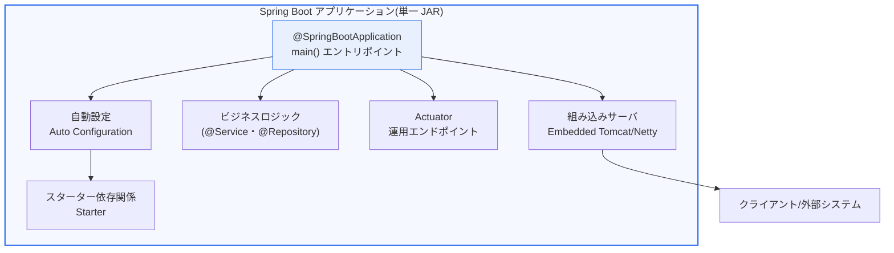
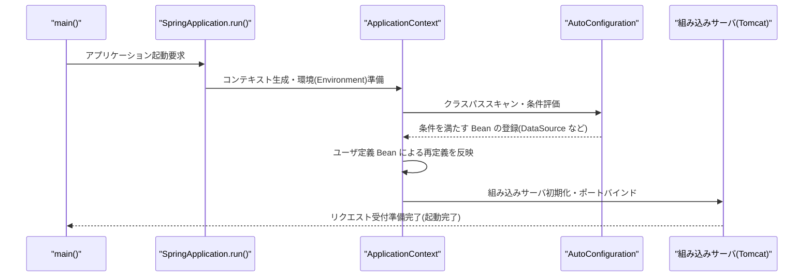

# Spring Boot(スプリングブート)

## 1. 概要

### A. 定義
> **Spring Boot(スプリングブート)**とは、Java ベースの Spring Framework の複雑な設定を自動化し、**最小限の設定だけで単独実行可能な(stand-alone)プロダクションレベルのアプリケーションを迅速に開発・デプロイ**できるよう支援する、オピニオネイテッド(Opinionated)なフレームワークである。

Spring Boot の中核的な価値は、「**設定地獄(configuration hell)から開発者を解放**」することにある。従来の Spring(Spring Framework)は依存性注入(DI)・アスペクト指向(AOP)・トランザクション管理などの強力な機能を提供するが、実際に一つの Web アプリケーションを起動するまでには、`web.xml`、`applicationContext.xml`、`dispatcher-servlet.xml` といった大量の XML 設定、ライブラリのバージョン整合性の調整、サーブレットコンテナのインストール・デプロイ作業を開発者が逐一こなさなければならなかった。この参入障壁のため、「動作する最初の画面」を見るまでに数時間から一日かかることも珍しくなかった。

Spring Boot はこれを「**設定より規約(Convention over Configuration)**」と「**合理的なデフォルト値(sensible defaults)**」という哲学によって解決する。大多数のプロジェクトが共通して必要とする設定をフレームワークがあらかじめ推論して自動構成(Auto Configuration)し、機能単位でライブラリを束ねたスターター(Starter)を提供し、サーブレットコンテナ(Tomcat)をアプリケーションの中に組み込む(embed)ことで、別途サーバをインストールしなくても実行可能な単一の成果物にする。その結果、開発者は設定に費やしていた時間を実際のビジネスロジックに集中させることができ、アイデアを数分で動作するサービスとして実装できる。

この生産性のおかげで、Spring Boot は Java の Web・マイクロサービス開発における事実上の標準(de facto standard)となった。韓国の公共・金融分野の標準フレームワーク(電子政府標準フレームワーク)も Spring ベースであり、最近のバージョンは Spring Boot を採用しているため、技術士の観点からも SW 工学・アーキテクチャ設計の中核ツールとして扱うべきである。

### B. 登場背景および必要性
Spring Boot の登場は、二つの流れが噛み合った結果である。第一に、**Spring 自体の設定の複雑さの蓄積**である。Spring はバージョンを重ねるにつれアノテーションベースの設定(`@Configuration`、`@Component`)へと進化したが、依然としてどの Bean をどの条件で登録するか、どのライブラリのバージョンを組み合わせれば衝突しないかを開発者が判断しなければならなかった。プロジェクトごとに繰り返されるこの「ボイラープレート設定」が、生産性のボトルネックであった。

第二に、**マイクロサービス・クラウドネイティブ時代の要求**である。2010 年代半ば以降、アプリケーションは一つの巨大な WAR として WAS にデプロイされる方式から、小さく独立してデプロイ・スケール可能なサービス単位へと分化した。このパラダイムにおいては、「サーバにあらかじめインストールされたコンテナにアプリケーションを載せる」従来型のデプロイよりも、「アプリケーションが自身の実行環境を自ら内包する」方式のほうがはるかに有利である。Spring Boot の組み込みサーバ・単一 JAR 実行モデルはこの要求に的確に合致し、Docker イメージ化や Kubernetes へのデプロイにも自然につながった。

## 2. アーキテクチャと中核構成要素

Spring Boot は、Spring Framework の上に薄いが強力な自動化レイヤを載せた構造である。全体構造を大局的に見ると次のとおりである。

### A. 自動設定(Auto Configuration)
自動設定は Spring Boot の心臓部である。`@SpringBootApplication` に含まれる `@EnableAutoConfiguration` が動作すると、Boot は**クラスパスにどのライブラリが存在するか**を根拠に、必要な Bean を条件付きで登録する。たとえばクラスパスに `H2` と `spring-jdbc` があればインメモリのデータソースを自動構成し、`spring-webmvc` があれば `DispatcherServlet` を登録する。

この条件付き登録の基盤となるのが、`@ConditionalOnClass`、`@ConditionalOnMissingBean` といった条件アノテーションである。「特定のクラスが存在する場合のみ」「ユーザが独自に定義した Bean が存在しない場合のみ」デフォルトの Bean を登録する方式であるため、開発者は望めばいつでも独自の設定で上書きできる。すなわち自動設定は強制ではなく、「合理的なデフォルト値を提供しつつ再定義を許容する」開かれた構造である。

原理を理解することが実務で重要なのは、問題診断のためである。自動設定は便利である分、「なぜこの Bean が登録されたのか、なぜ自分の設定が無視されるのか」が不透明になりうる。このとき `--debug` オプションで出力される自動設定レポート(Condition Evaluation Report)を見れば、どの条件がマッチ・非マッチしたかを追跡でき、「規約の便利さ」と「内部の理解」のバランスをとる実務的な鍵となる。

### B. スターター依存関係(Starter Dependencies)
スターターとは、特定の機能を実装するために必要なライブラリ群を一つの依存関係としてカプセル化したものである。たとえば `spring-boot-starter-web` を追加すると、Spring MVC、組み込み Tomcat、Jackson(JSON シリアライズ)、バリデーションなどが互いに互換性のあるバージョンで一括して取り込まれる。開発者は個々のライブラリのバージョンを調整する「依存関係地獄(dependency hell)」から解放される。

バージョン整合性の根拠は、親 POM である `spring-boot-dependencies` の BOM(Bill of Materials)である。Spring Boot チームがともに検証したライブラリバージョンの集合を一箇所で管理しているため、スターターを使えば個々のバージョンを明記しなくても検証済みの組み合わせが適用される。これにより、ライブラリ間の非互換に起因する実行時エラー(例:Jackson のバージョン衝突によるデシリアライズ失敗)を事前に大きく減らせる。

主なスターターを整理すると以下のとおりであるが、表はあくまで要約の補助にすぎず、実際の選択は「どの通信・ストレージ技術を使うか」というアーキテクチャ上の判断から導かれる。

| スターター | 含まれる機能 |
|---|---|
| `spring-boot-starter-web` | REST/MVC、組み込み Tomcat、JSON |
| `spring-boot-starter-webflux` | リアクティブ Web、組み込み Netty |
| `spring-boot-starter-data-jpa` | JPA/Hibernate、トランザクション |
| `spring-boot-starter-security` | 認証・認可(Spring Security) |
| `spring-boot-starter-actuator` | 状態・メトリクスなどの運用エンドポイント |

### C. 組み込みサーバ(Embedded Server)と単一成果物
従来の Java Web のデプロイは、WAR ファイルを別途インストールされた WAS(例:Tomcat、WebLogic)に載せる方式であった。Spring Boot は逆に、Tomcat(または Jetty・Undertow、リアクティブスタックでは Netty)をアプリケーションの依存関係として組み込む。その結果、`java -jar app.jar` の一行でサーバが起動し、「実行環境をアプリケーション自身が内包する」形となる。

この方式の実務的な含意は、デプロイ・運用の単純化である。サーバごとにコンテナのバージョンを合わせてチューニングする作業がなくなり、「ビルドされた成果物がどこでも同じように動作する」ため、開発-テスト-本番環境間の不一致(works on my machine 問題)が減少する。特に Docker イメージに JAR 一つを入れるだけで済むため、コンテナ・Kubernetes ベースのデプロイとの相性が良い。

ビルド成果物は実行可能な JAR(fat/uber JAR)構造であり、アプリケーションクラスとすべての依存ライブラリを一つにまとめる。近年は、レイヤード JAR(Layered JAR)によって依存関係とアプリケーションコードを分離し、コードだけが変わった場合に Docker イメージのレイヤキャッシュを再利用して、イメージのビルド・デプロイ時間を短縮する手法が広く用いられている。

### D. Actuator と運用支援
Actuator は、実行中のアプリケーションの状態を外部に公開する運用支援モジュールである。`/actuator/health` でヘルスチェックを、`/actuator/metrics` で指標を、`/actuator/info` でメタ情報を提供し、Micrometer を介して Prometheus などの監視システムと連携する。

運用の観点で Actuator が重要なのは、オブザーバビリティ(Observability)の最小限の入口をフレームワークが標準で提供している点である。Kubernetes の Liveness/Readiness プローブを `/actuator/health/liveness`・`/readiness` に接続すれば、コンテナオーケストレータが異常なインスタンスを自動的に再起動・隔離できる。ただし状態エンドポイントは内部情報を公開するため、本番環境では公開範囲を最小化し、Spring Security でアクセスを制御しなければならない。

### E. ブートストラップ手順
自動設定が実際に動作する流れを、プロセスの観点から詳細に見ると次のとおりである。

## 3. 比較 — Spring vs Spring Boot、そして WAR vs 組み込みサーバ

Spring Boot を「新しいフレームワーク」と誤解しやすいが、正確には Spring Framework をより使いやすくする上位レイヤである。両者の違いは機能の有無ではなく、**設定責任の所在**に由来する。Spring は柔軟性のために設定の決定を開発者に委ねるのに対し、Spring Boot は大多数が同意するデフォルトの決定をフレームワークが代わりに下す。

| 区分 | Spring Framework | Spring Boot |
|---|---|---|
| 設定 | 開発者が直接記述(XML/Java Config) | 自動設定 + 再定義 |
| 依存関係 | 個別のバージョン管理 | スターター・BOM による検証済みの束 |
| サーバ | 外部 WAS のインストール・デプロイ(WAR) | 組み込みサーバ・単一 JAR |
| 初期起動 | 相対的に時間がかかる | 数分以内に実行 |

この違いの実務的な含意は明確である。Spring だけでも同じアプリケーションを作ることはできるが、初期設定と保守のコストが大きい。逆に Spring Boot は規約を強制する代わりに、きめ細かな制御の一部を抽象化の背後に隠す。したがって、「特殊なレガシー統合や極端なカスタマイズ」が必要な場合でない限り、今日の新規 Java プロジェクトは Spring Boot を標準の選択肢とする。

実際の例として、あるスタートアップが REST API バックエンドを Spring Boot で構築すると、プロジェクト作成(start.spring.io)から最初のエンドポイントの応答まで通常 10 分前後で到達する。一方、素の Spring で同じ作業をすると、サーブレット・ディスパッチャ・ビューリゾルバ・データソースの設定だけでも数百行の XML/設定コードが必要になる。この初期速度の差が、MVP(実用最小限の製品)の検証サイクルを左右する。

## 4. 深化 — クラウドネイティブの動向と最新の変化

Spring Boot はクラウドネイティブの要求に合わせて急速に進化している。ただし詳細なバージョンやリリース時期は変動が大きいため、技術士の答案では確定的な数値よりも方向性を中心に論述するのが安全である。

第一に、**Java 標準名前空間の移行**である。Spring Boot 3.x 系は、Java(EE)の `javax.*` 名前空間を `jakarta.*` に移行した Jakarta EE 9+ ベースへと移り、実行には最新の LTS 版 Java(一般に Java 17 以上)を要求する。これは、レガシーの移行時にライブラリ互換性の点検が必要であることを意味する。

第二に、**ネイティブイメージ(GraalVM Native Image)のサポート**である。AOT(Ahead-Of-Time)コンパイルによってアプリケーションをネイティブバイナリ化し、起動時間を数百ミリ秒の水準に短縮し、メモリ使用量を大幅に削減する。これはサーバレス(FaaS)や大規模スケールアウト環境において、コールドスタートの遅延とリソースコストを下げるのに有利である。ただし、リフレクションや動的プロキシを多用するコードではヒント(hint)設定が必要となり、移行の難度がある。

第三に、**仮想スレッド(Virtual Thread)とリアクティブの共存**である。最新 Java の仮想スレッドを活用すれば、従来の命令型(ブロッキング)のコードスタイルを維持しつつ高い並行性を得られるため、必ずしもリアクティブ(WebFlux)へ移行しなくてもスループットを改善する選択肢が広がった。アーキテクチャ選択において「ブロッキング vs ノンブロッキング」という二分法が緩和される流れである。

第四に、**オブザーバビリティ標準の統合**である。Micrometer・Micrometer Tracing を通じてメトリクス・トレースを OpenTelemetry などの標準形式で出力し、分散トレーシングと統合監視をフレームワークレベルでサポートする方向へと強化されている。

## 5. 考慮事項および示唆(技術士の観点)

1. **自動設定の利便性と内部理解のバランス。** 自動設定は生産性を最大化するが、原理を知らずに使うと障害時の原因追跡が難しくなる。条件評価レポートや `spring-boot-starter-actuator` を活用して「何がなぜ構成されたのか」を常時観測可能にし、チームとしての学習を並行して進めるべきである。

2. **マイクロサービス・クラウドネイティブの基盤技術としての位置付け。** 単独実行・組み込みサーバという特性は、コンテナ・MSA・サーバレスと整合的である。Spring Cloud(サービスディスカバリ・設定サーバ・ゲートウェイ)と組み合わせて分散システムを構成しつつ、サービス境界・データ整合性(Saga パターンなど)といった分散設計上の難題も併せて考慮しなければならない。

3. **標準化・ガバナンスのツールとしての価値。** 繰り返しの設定の排除と規約の強制は、チーム全体のコードの一貫性とオンボーディングの速度を高める。公共・金融分野の標準フレームワークとの連携や、社内共通スターター(社内標準ライブラリをスターターとしてカプセル化)を通じて、組織レベルのアーキテクチャガバナンスの手段として活用できる。

4. **セキュリティ・運用リスクの管理。** 組み込みサーバや依存関係の自動取り込みは便利だが、脆弱なライブラリ(例:過去の Log4Shell 型の事例)が fat JAR に一緒に含まれてしまう可能性がある。SBOM(ソフトウェア部品表)の管理、依存関係の脆弱性スキャン、Actuator エンドポイントのアクセス制御を DevSecOps パイプラインに組み込むべきである。

5. **性能・コスト最適化戦略。** JVM ベースの起動遅延とメモリ使用量は、大規模スケールアウトやサーバレスにおいてコストに直結する。ネイティブイメージ、レイヤード JAR、仮想スレッドなどの最新手法をワークロードの特性に合わせて選択的に適用し、コールドスタートとリソース効率を併せて管理すべきである。

## 参考資料
- Spring Boot Reference Documentation — https://docs.spring.io/spring-boot/docs/current/reference/html/
- Spring Boot Project — https://spring.io/projects/spring-boot

---

> **一言まとめ**: Spring Boot は、*自動設定・スターター・組み込みサーバにより、最小限の設定で単独実行可能なプロダクションレベルのアプリケーションを迅速に開発・デプロイ* するフレームワークであり、「設定より規約」の哲学で生産性を高めて Java の Web・マイクロサービス開発の事実上の標準となり、ネイティブイメージ・仮想スレッド・オブザーバビリティの強化によってクラウドネイティブ時代に進化し続けている。
