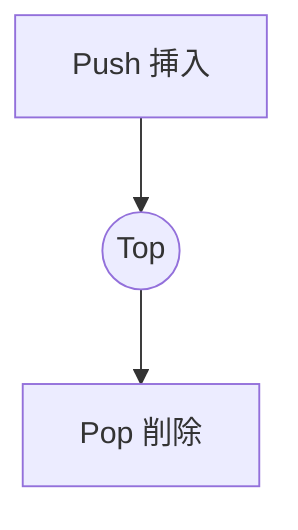

# 線形データ構造: スタック・キュー・リスト

## 1. 概要

### A. 定義
> データを**一列(線形・1 次元)に並べて**格納し、要素が前後の要素と 1:1 でのみ隣接するデータ構造であり、入出力の規則によって**スタック(LIFO)・キュー(FIFO)・リスト(任意アクセス)**に分けられる。

線形データ構造は、木・グラフのような非線形構造とは異なり、要素間の関係が「前-次」という単純な順序のみで定義される。一見単純に見えるが、**どこで入出力を許可するか**によって、まったく異なる性質と用途が生まれる。スタック・キューはアクセス地点を意図的に制限(両端または一端)して特定の処理順序を強制し、リストは制限なく任意位置へのアクセスを許可する。

### B. 登場背景および必要性
プログラムは、データを「**どのような順序で入れ、取り出すか**」によってアルゴリズムの正確性・効率が分かれる。たとえば関数呼び出しは最後に呼び出された関数が先に終わらなければならないため LIFO が、プリンタの待ち行列は先に要求されたジョブが先に処理されなければならないため FIFO が自然である。すなわちデータ構造の選択は、問題の**アクセスパターンに合わせて演算コストを最小化**するための設計上の決定である。選択を誤れば、O(1) で済む演算が O(n) になる。

## 2. スタック(Stack)

スタックは、**一方の端(Top)でのみ**挿入・削除が行われる **LIFO(Last In First Out)**構造である。皿を積み重ねて上から取り出すのと同じで、最後に入れたデータが最初に出てくる。この性質は「元に戻す」操作が必要な場面で強力である。代表的には、**関数呼び出しスタック**が呼び出し→復帰の入れ子関係をそのまま表現し、エディタの **undo**、数式の括弧チェック・後置記法の計算、グラフの **DFS(深さ優先探索)**がスタックで実装される。push・pop・peek はいずれも Top にしか触れないため O(1) である。

| 項目 | 内容 |
|---|---|
| 原理 | **LIFO** — Top でのみ入出力 |
| 演算 | push(挿入)・pop(削除)・peek(参照)、すべて O(1) |
| 活用 | 関数呼び出しスタック、undo、数式計算、DFS |

## 3. キュー(Queue)

キューは、**後方(rear)で挿入し前方(front)で削除**する **FIFO(First In First Out)**構造であり、行列に並ぶのと同じである。先に入ったデータが先に処理されるため、**公平な順序の保証**が必要な場面で用いられる。OS のジョブスケジューリング、データの生産・消費の速度差を吸収する**バッファ(buffer)**、グラフの **BFS(幅優先探索)**が代表例である。単純な配列でキューを実装すると、dequeue の後に front が後ろへずれ続けて領域が無駄になるため、前後をつないで再利用する**循環キュー(Circular Queue)**を用いる。両端のいずれでも入出力が可能な**デック(Deque)**や、優先度に従って取り出す**優先度付きキュー**はキューの変形である。

| 項目 | 内容 |
|---|---|
| 原理 | **FIFO** — rear で挿入・front で削除 |
| 演算 | enqueue(挿入)・dequeue(削除) |
| 変形 | 循環キュー、デック(Deque)、優先度付きキュー |
| 活用 | ジョブスケジューリング、バッファ、BFS |

## 4. リスト(List)

リストは、アクセス位置に制限を設けず、**任意位置の挿入・削除・参照**が可能な汎用の線形構造である。実装方式によって性質が大きく異なり、この違いが実務上の選択の核心となる。**配列リスト**は要素を連続したメモリに置くためインデックスによる O(1) の即時アクセスが可能だが、途中への挿入・削除の際には後続の要素をすべてずらす必要があるため O(n) である。**連結リスト**は各ノードが次のノードのアドレス(ポインタ)を指すため、ポインタを付け替えるだけで挿入・削除が O(1) で行えるが、特定の要素を探すには先頭から順にたどる必要があるためアクセスは O(n) である。すなわち「**参照が中心なら配列、挿入・削除が中心なら連結リスト**」が原則である。連結リストは単方向・双方向・循環に分けられる。

| 実装 | アクセス | 挿入/削除 | 特徴 |
|---|---|---|---|
| 配列リスト | O(1) | O(n) | 連続メモリ、キャッシュ効率 |
| 連結リスト | O(n) | O(1) | ポインタ連結、動的サイズ |

## 5. 比較および示唆

三つの構造の違いは、結局のところ「**アクセスをどれだけ制限するか**」に由来する。スタック・キューはアクセス地点を制限することで処理順序(LIFO/FIFO)を保証する代わりに任意アクセスを放棄しており、リストはその逆である。

| 区分 | スタック | キュー | リスト |
|---|---|---|---|
| 入出力 | LIFO | FIFO | 任意 |
| アクセス | Top のみ | Front/Rear | 順次/インデックス |
| 代表的な用途 | DFS・undo | BFS・バッファ | 汎用の順序管理 |

- **選択基準**: 求められる処理順序・アクセスパターンに合わせて選択し、リストについては配列 vs 連結の**トレードオフ(アクセス O(1) vs 挿入/削除 O(1))**を検討する。
- **拡張の観点**: スタック・キュー・リストはそれ自体でも使われるが、木・グラフ・ハッシュなど**非線形・複合データ構造を構成する基本ブロック**でもある。たとえば木の走査は内部的にスタック/キューを使用する。

---

> **一言まとめ**: スタックは *Top でのみ入出力する LIFO*、キューは *rear で挿入・front で削除する FIFO*、リストは *任意位置でのアクセス・挿入・削除* が可能な線形データ構造であり、アクセス制限の程度と配列・連結のトレードオフを考慮し、処理順序・アクセスパターンに合わせて選択する。
