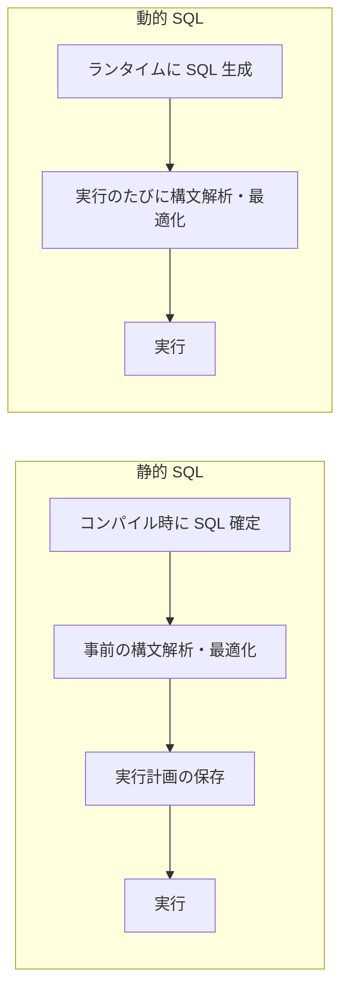

# 静的 SQL(Static SQL) vs 動的 SQL(Dynamic SQL)

## 1. 概要

### A. 定義
> **静的 SQL**とは、プログラム作成(コンパイル)時点で SQL 文の構造が確定し、あらかじめ構文解析・最適化される方式であり、**動的 SQL**とは、実行(ランタイム)時点でプログラムが文字列として SQL を組み立て、その都度実行する方式である。

### B. 区別する理由
両者を分ける根本的な軸は**「SQL がいつ確定するか」**であり、この時点の違いが、性能・柔軟性・セキュリティという三つの相反する結果を生む。SQL があらかじめ確定していれば、DB は実行計画を一度作成して再利用できるため高速であるが、検索条件が状況に応じて変わる画面には対応しにくい。逆にランタイムに文を生成すれば、どのような条件の組み合わせにも対応できるが、毎回構文解析が必要なため遅くなり、外部入力が SQL 文に混入して **SQL インジェクション**のリスクが生じる。したがって、どちらを用いるかは、このトレードオフを状況に応じて比較衡量する問題である。

## 2. 処理時点の比較

静的 SQL はコンパイル段階で文が固定されるため、構文解析・最適化・実行計画の策定を**一度だけ**実施し、その計画を保存しておいて以降の実行で再利用する。一方、動的 SQL は文が実行直前になって初めて確定するため、原則として**実行のたびに構文解析・最適化の過程を改めて経る。** この「1 回の事前処理」と「毎回の再処理」の違いこそが、両方式の性能差の根源である。

## 3. 比較

| 区分 | 静的 SQL | 動的 SQL |
|---|---|---|
| SQL の確定時点 | コンパイル(作成)時 | 実行(ランタイム)時 |
| 構文解析/最適化 | 1 回事前に実施 | 実行のたびに実施 |
| 性能 | 高速(実行計画の再利用) | 相対的に低速 |
| 柔軟性 | 低い(固定構造) | 高い(条件に応じて変更) |
| セキュリティ | 安全(構造固定・バインド) | SQL インジェクションのリスク |
| 代表的な活用 | 定型的な反復クエリ(バッチ・トランザクション) | 可変検索・管理ツール |

性能差が生じる理由をもう少し掘り下げると、DB が SQL を実行する前に行う**ハードパース(構文解析 + 最適な実行計画の探索)**が相当なコストを占めるためである。静的 SQL はこのコストを最初の 1 回だけ支払うが、毎回異なる文字列を生成する動的 SQL は計画を再利用できず、繰り返しハードパースを引き起こす。柔軟性はその正反対である。たとえば検索画面で、ユーザが名前・期間・地域のうち入力した条件だけを WHERE 句に付加しなければならない場合、条件の組み合わせが数十通りになるため静的 SQL ですべてを事前に記述することは難しく、動的 SQL でその都度組み立てるほうが自然である。

## 4. SQL インジェクションへの対策(動的 SQL)

動的 SQL の最大のリスクは SQL インジェクションである。たとえばログインクエリを `"SELECT * FROM users WHERE id='" + 入力 + "'"` のように文字列連結で作成すると、攻撃者が入力欄に `' OR '1'='1` を入れて WHERE 条件を常に真にし、認証を回避できてしまう。根本原因は**ユーザ入力(データ)が SQL 文法(コード)の一部として解釈される**ことにあるため、防御の核心は、入力をコードではなく純粋なデータとして扱わせることである。

| 対策 | 内容 | 原理 |
|---|---|---|
| **バインド変数** | Prepared Statement・パラメータバインディング | 文の構造を先に固定し、値だけを後から注入 → 入力がコードとして解釈されない |
| **入力検証** | ホワイトリスト・型・長さの検証 | 許可された形式のみ通過 |
| **最小権限** | DB アカウント権限の最小化 | 侵害時の被害範囲を縮小 |
| **エラー処理** | 詳細なエラーメッセージの露出を遮断 | DB 構造情報の漏えい防止 |

最も確実な防御は**バインド変数(Prepared Statement)**である。`WHERE id = ?` のようにプレースホルダで文の構造を先にコンパイルし、値だけをパラメータとして渡せば、入力に何が入ってきても文法ではなくデータとしてのみ処理されるため、インジェクションは根本から遮断される。さらにバインド変数は値だけが変わり文の構造は同一であるため、DB が**実行計画をキャッシュして再利用**でき、動的 SQL の性能上の弱点までも相当程度緩和するという一石二鳥の効果がある。

## 5. 考慮事項および示唆
- **動的 SQL は必ずバインド変数とともに**: 文字列連結方式を避け、パラメータバインディングを強制すれば、インジェクション対策と実行計画キャッシュの再利用を同時に達成できる。
- **混合設計**: 性能が重要な定型的反復クエリ(トランザクション・バッチ)は静的に、条件が可変の検索・レポートは動的に、と分けて適用するのが現実的である。
- **フレームワークの活用**: MyBatis・JPA のような ORM/永続化フレームワークは内部的にバインディングを使用するため、これを正しく使えば動的クエリの柔軟性と安全性を両立できる。ただし、フレームワークにおいても文字列置換(例:`${}`)方式はインジェクションにさらされるため注意が必要である。

---

> **一言まとめ**: 静的 SQL は *コンパイル時に確定・事前最適化されるため高速かつ安全* であり、動的 SQL は *ランタイムに組み立てるため柔軟だが毎回構文解析するため遅く、インジェクションに脆弱* である。バインド変数(Prepared Statement)を用いればインジェクションを根本から遮断し、実行計画の再利用によって性能まで補うことができる。
